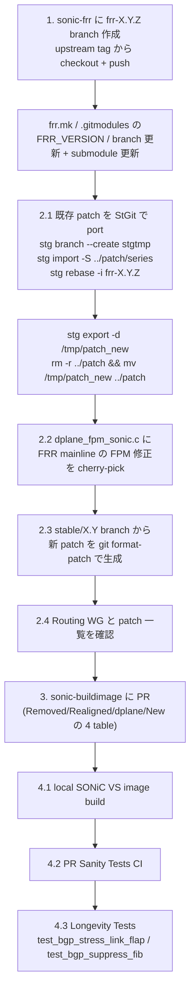

<!-- topics-tip -->
!!! tip "Topics で読み物として読む"
    この HLD は実装詳細を含みます。機能の概念・設定・運用を読み物として読みたい場合は [Topics 02 章: BGP と FRR 制御プレーン](../topics/02-bgp/index.md) を参照。
<!-- /topics-tip -->

!!! warning "裏取りステータス: code-verified / メタドキュメント"
    本ページは「SONiC FRR 保守者向けの作業手順」を再構成したもの。実際の手順は upstream / SONiC 双方の実装事情に依存し、頻繁に変わる。

!!! note "Verifier 注記（2026-05-10）"
    実コード裏取り: `sonic-buildimage/src/sonic-frr/patch/`（**単数形**）に `series` ファイルと `0001-SONiC-ONLY-*` 等の patch を確認。適用は **quilt ではなく StGit（`stg import -S ../patch/series`）** で行う。`sonic-frr` は submodule pin で FRR upstream に SONiC 向け patch を適用するビルド構造であり、HLD の手順と整合する。

# SONiC における FRR upgrade の手順とパッチ管理

## 概要

本 [HLD](../reference/glossary.md#term-hld) は [SONiC](../reference/glossary.md#term-sonic) における [FRR](../reference/glossary.md#term-frr) upgrade の実作業 runbook で、**FRR 10.3 → 10.4.1** への upgrade（Alibaba が実施）を具体例として手順を時系列で記録したもの[^1]。upgrade は 4 つの局面で構成される:

1. **Branch 管理** — `sonic-frr` リポジトリに新 FRR tag ベースの branch を作る
2. **Patch 適用** — 既存 patch を port、`dplane_fpm_sonic.c` を sync、stable branch から新 patch を追加
3. **PR 準備** — `sonic-buildimage` への submodule pin 更新 PR と、レビュー用の summary table 整備
4. **Building / Testing** — local [VS](../reference/glossary.md#term-vs) build → PR sanity test → longevity test

upgrade 全体を通じて **Routing Working Group との密な調整** が強く推奨される[^1]。

## upgrade フロー（HLD ベース）



## 1. Branch（`sonic-frr`）

新しい FRR tag（例: `frr-10.4.1`）を base に `sonic-frr` リポジトリへ branch を作る[^1]。push 権限が無ければ release manager に依頼する。

```bash
git clone https://github.com/sonic-net/sonic-frr
cd sonic-frr
git remote add upstream https://github.com/FRRouting/frr
git fetch upstream --no-tags refs/tags/frr-10.4.1:refs/tags/frr-10.4.1
git checkout -b frr-10.4.1 tags/frr-10.4.1
git push origin refs/heads/frr-10.4.1   # branch と tag が同名のため明示的に refs/heads/
```

続いて `sonic-buildimage` 側でバージョンを上げる[^1]:

- `rules/frr.mk`: `FRR_VERSION` / `FRR_BRANCH` / `FRR_TAG` を `10.3` / `frr-10.3` から `10.4.1` / `frr-10.4.1` へ
- `.gitmodules`: `src/sonic-frr/frr` submodule の `branch` を `frr-10.4.1` へ
- `src/sonic-frr/frr` submodule を新 release commit に更新して commit

## 2. Patch と変更

!!! note "patch 管理は StGit + `patch/`（単数形）"
    SONiC 固有 patch は `src/sonic-frr/patch/`（**単数**）に置かれ、`patch/series` ファイルの順序で **[StGit](https://stacked-git.github.io/)（`stg`）** により適用される。**quilt ではない**。`series` 先頭にはこの patch series が適用される base commit が記される。

### 2.1 既存 patch の port（10.3 → 10.4.1）

StGit の patch 名 truncate を無効化し、一時 branch で port する[^1]:

```bash
cd sonic-buildimage/src/sonic-frr/frr
git checkout frr-10.3
git config stgit.namelength 0
stg branch --create stgtmp
stg import -S ../patch/series          # 既存 patch を import
stg rebase -i frr-10.4.1               # editor で port する patch 一覧を編集
```

rebase editor では、**新 FRR に既に取り込まれた patch を `keep` → `delete`** に変更して除外する。conflict は都度解決し `stg add --update` → `stg refresh` → `stg goto <最後の patch>` を繰り返す。完了後 export して patch フォルダを差し替える:

```bash
stg export -d /tmp/patch_new
rm -r ../patch
mv /tmp/patch_new ../patch
# clean な frr-10.4.1 で再適用できるか検証
git checkout frr-10.4.1
git reset --hard origin/frr-10.4.1
stg import -S ../patch/series
```

### 2.2 `dplane_fpm_sonic.c` の sync

patch とは別に、FRR mainline の `dplane_fpm_nl.c` の 10.3 → 10.4.1 差分を確認し、必要な [FPM](../reference/glossary.md#term-fpm) 修正を `dplane_fpm_sonic.c` に反映する（commit message に copyright を明記）[^1]。各 commit の取り込み状況は **Table 3**（PR description に再掲）で管理する。SONiC では一部 commit が「NOT applicable」「既に別 PR で merged」「本 PR で commit」に分類される。

### 2.3 `stable/10.4` からの新 patch 追加

FRR の `stable/10.4` branch に merge 済みの commit のみ（安定性確保のため）を patch 化して追加する[^1]:

```bash
cd sonic-buildimage/src/sonic-frr/frr
git pr checkout [PR number]            # 元 PR を checkout
git checkout frr-10.4.1
stg import -S ../patch/series
git cherry-pick [first SHA]~..[last SHA]
git format-patch -k [first SHA]~..[last SHA] --stdout > 00NN-Title-of-PR.patch
mv *.patch ../patch/
# patch/series に新 patch 名を追記し、clean branch で再適用検証
```

### 2.4 Routing WG との確認

必要な patch が漏れていないか **Routing Working Group** と同期する[^1]。

### patch の分類（命名規約）

realigned / new patch は lifecycle で分類される[^1]:

| 種別 | 命名 | 意味 |
|-----|------|------|
| **Lasting** | `SONiC-ONLY-` prefix を付与 | logic / 実装差により SONiC に恒久的に残す patch |
| **Temporary (Temp)** | 元の名前のまま | upstream で解決され次第 将来の upgrade で除去される patch |

## 3. Pull Request

upgrade は `sonic-buildimage` への PR merge で完了する。FRR 10.4.1 の実装は [sonic-buildimage#24330](https://github.com/sonic-net/sonic-buildimage/pull/24330)[^1]。PR description には reviewer が変更を素早く把握できるよう **4 つの summary table** を含める[^1]:

| Table | 内容 |
|-------|------|
| **Table 1** Removed Patches | 新 FRR で取り込まれ削除した patch と対応 FRR commit/PR |
| **Table 2** Realigned Patches | 残った patch（Temp / Lasting）と理由 |
| **Table 3** `dplane_fpm_sonic.c` Changes | FPM commit の SONiC 取り込み状況 |
| **Table 4** New Patches Added | `stable/10.4` から追加した patch（Temp / Lasting）と理由 |

commit 分割に厳密な規則は無いが、task ごとに意味のある単位（例: patch port / version 更新 / FPM 変更 / 新 patch 追加）で分けることが推奨される[^1]。過去の FRR upgrade PR（[#15965](https://github.com/sonic-net/sonic-buildimage/pull/15965) / [#10691](https://github.com/sonic-net/sonic-buildimage/pull/10691) / [#11502](https://github.com/sonic-net/sonic-buildimage/pull/11502) / [#10947](https://github.com/sonic-net/sonic-buildimage/pull/10947)）も参考になる。

## 4. Building と Testing

- **4.1 Building**: PR を開く前に local で SONiC VS（Virtual Switch）image を build し、build error が無いことを確認[^1]。
- **4.2 PR Sanity Tests**: PR 提出後に CI が自動実行。全 test pass が **merge の必須要件**[^1]。
- **4.3 Longevity Tests**: 上記に加え、以下の長時間テストを実行する[^1]:
    - `bgp/test_bgp_stress_link_flap.py` — `--completeness_level=thorough`（`test_type` は `dut`/`fanout`/`neighbor`/`all` で parametrize、thorough で各 type 120 時間 = 5 日）。リソース都合で local では `[dut]` のみ実行が通例。
    - `bgp/test_bgp_suppress_fib.py` — `--completeness_level=thorough`。

!!! note "テスト基盤の制約（HLD 記載）"
    HLD 時点では上記 2 テストを回す Azure pipeline が未整備で、Microsoft チームに手動実行を依頼する状況。専用テスト基盤の予算・割当は HLD のスコープ外で TSC / board での議論事項とされている[^1]。

## トラブルシューティング

- 新版 FRR で起動しない → StGit patch 適用順（`series`）、`vtysh` config 互換性、`config db` 由来 template との差分
- [BGP](../reference/glossary.md#term-bgp) routes がインストールされない → `fpmsyncd` の [zebra](../reference/glossary.md#term-zebra) route 解釈、新版 FRR の FPM 出力フォーマット差分（`dplane_fpm_sonic.c` 同期漏れの可能性）
- patch が当たらない → clean な `frr-X.Y.Z` branch で `stg import -S ../patch/series` を試し、conflict 箇所を特定

### コマンド例

FRR バージョンとデーモン状態を確認する。

```bash
docker exec bgp vtysh -c 'show version'
docker exec bgp supervisorctl status
docker exec bgp dpkg -l | grep -i frr
```

## 制限事項

- FRR のメジャーバージョン跨ぎでは [vtysh](../reference/glossary.md#term-vtysh) コマンド体系・config 互換性が崩れる事があり、手順書のバージョンに固定して実施する必要がある。
- 本ページは FRR 10.3 → 10.4.1 を例にした HLD runbook であり、対象バージョンやテスト基盤の状況は master の進行に伴い変化する点に注意。

## 引用元

[^1]: `sonic-net/SONiC` `doc/frr_maintainer/sonic-frr_upgrade_process.md` @ `49bab5b5ff0e924f1ea52b3d9db0dfa4191a7c06`

<!-- concerns hint:
- src/sonic-frr/patch/ (単数) ディレクトリ構造と StGit (series) 適用機構の現行実装確認
- sonic-buildimage submodule pin の現行 frr version 確認
- bgpcfgd / fpmsyncd / frrcfgd の FRR version 互換ロジックの現行実装確認
- graceful restart timer / warm-restart との連動の現行値確認
- BMP / SRv6 / VRF / unnumbered 関連 patch の upstream 化進捗確認
- 文書自体（HLD）の改訂日・現行 master FRR version との乖離リスク確認
-->

<!-- glossary-links-injected: a6dd26e9a980 -->
