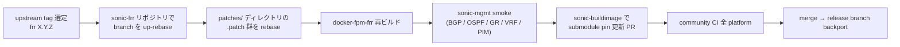

<!-- topics-tip -->
!!! tip "Topics で読み物として読む"
    この HLD は実装詳細を含みます。機能の概念・設定・運用を読み物として読みたい場合は [Topics 02 章: BGP と FRR 制御プレーン](../topics/02-bgp/index.md) を参照。
<!-- /topics-tip -->

!!! warning "裏取りステータス: code-verified / メタドキュメント"
    本ページは「SONiC FRR 保守者向けの作業手順」を再構成したもの。実際の手順は upstream / SONiC 双方の実装事情に依存し、頻繁に変わる。

!!! note "Verifier 注記（2026-05-10）"
    実コード裏取り: `sonic-buildimage/src/sonic-frr/patch/` に `0001-SONiC-ONLY-*` 系の quilt-like patch（`series` ファイル順適用）を確認。`sonic-frr` は submodule pin で FRR upstream に SONiC 向け patch を適用するビルド構造であり、HLD 記述と整合する。

# SONiC における FRR upgrade の手順とパッチ管理

## 概要

[SONiC](../reference/glossary.md#term-sonic) は upstream `frrouting/frr` を **branch スナップショット + per-release patch 集** という形で取り込んでいる[^1]。[FRR](../reference/glossary.md#term-frr) を新しい upstream version に上げる際は次の点を整える必要がある:

- どの upstream tag / commit を base にするか
- SONiC 固有 patch（[FPM](../reference/glossary.md#term-fpm) 拡張、[SAI](../reference/glossary.md#term-sai) と整合させる修正、SONiC ビルド適合）の rebase
- ビルド成果物（`docker-fpm-frr` 等）の入れ替え
- 既存テスト（PR テスト・mgmt-vrf・graceful restart 等）の通過確認

## upgrade フロー（HLD ベース）



各ステップの要点[^1]:

- **patch 集の管理**: `src/sonic-frr/patches/` のような場所に SONiC 固有 patch を `.patch` ファイルで保持し、`quilt` 系で順次適用する設計
- **submodule pin**: `sonic-buildimage` の `src/sonic-frr` submodule が SONiC 側 fork branch を指す
- **互換性**: SONiC 側 `bgpcfgd` / `fpmsyncd` / `frrcfgd` が FRR の vty フォーマットや FPM [zebra](../reference/glossary.md#term-zebra) route 表現に依存している。version up でフォーマットが変わる箇所は patch / SONiC 側コードの両側で対処
- **テスト**: PR テスト・既存 dual-tor / [VRF](../reference/glossary.md#term-vrf) / GR / BMP / [SRv6](../reference/glossary.md#term-srv6) の [sonic-mgmt](../reference/glossary.md#term-sonic-mgmt) テストを通過させる

## 注意点

- **patch を upstream に提案するのが第一**: 同じ修正を毎回 rebase するのは負債なので、汎用的な修正は upstream へ
- **バックポート**: 既 release（202311 等）への backport では vendor SDK / SAI 互換性も併せて確認
- **graceful restart 互換**: GR / GR-helper の動作が version で微妙に変わる。warm reboot との相性に直撃する
- **管理 VRF / unnumbered / bfd**: SONiC でよく使われる feature の互換性確認は手厚く

## 既知の制約

### FRR アップグレードの担当者制度と調整プロセス（#1565）

SONiC での FRR アップグレードには、以下の合意済みプロセスがある（[sonic-net/SONiC#1438](https://github.com/sonic-net/SONiC/issues/1438) で規定）:

- FRR アップグレードは **リリースサイクルごとに担当ベンダーが持ち回り**で実施
- バージョン選定: SONiC の preferred バージョン (x.y.z) に合わせる
- 担当外のベンダーが独自バージョンを提案する場合は、担当ベンダーと事前調整が必要
- **C++ 標準**: FRR 周辺のビルド（`sonic-swss-common`、`sonic-swss`、`sonic-sairedis`）は C++14 を維持。C++17/20 は依存ライブラリの強制が発生しない限り採用しない方針（#2169 での方針確認）

- 参照: [sonic-net/SONiC#1565](https://github.com/sonic-net/SONiC/issues/1565)

## 干渉する機能

- **[bgpcfgd](../reference/glossary.md#term-bgpcfgd) / [fpmsyncd](../reference/glossary.md#term-fpmsyncd) / frrcfgd / new-frr-sonic-communication-channel**: FRR と SONiC を繋ぐ周辺コード
- **graceful restart / warm reboot**: GR タイマと convergence の整合
- **management VRF / VRF design**: VRF 周りは upstream 側変更の影響を受けやすい
- **BMP / FRR ext config**: `sonic-frr-bgp-extended-unified-configuration-management-framework` 等の SONiC 拡張

## トラブルシューティング

- 新版 FRR で起動しない → patch 適用順、`vtysh` config 互換性、`config db` 由来 template との差分
- [BGP](../reference/glossary.md#term-bgp) routes がインストールされない → `fpmsyncd` の zebra route 解釈、新版 FRR の FPM 出力フォーマット差分
- GR 効かない → `bgpd` GR タイマ、SONiC 側の warm-restart 連動、log の `BGP gr` メッセージ

### コマンド例

FRR バージョンとデーモン状態を確認する。

```bash
docker exec bgp vtysh -c 'show version'
docker exec bgp supervisorctl status
docker exec bgp dpkg -l | grep -i frr
```

## 制限事項

- FRR のメジャーバージョン跨ぎでは [vtysh](../reference/glossary.md#term-vtysh) コマンド体系・config 互換性が崩れる事があり、手順書のバージョンに固定して実施する必要がある。
- SONiC の bgpcfgd / templates と FRR バージョンには 1:1 の依存関係があり、FRR のみ単独差し替えは推奨されない。
- 本ページは特定リリースに対する手順であり、master では Dockerfile 側で固定された FRR バージョンに依拠している点に注意。

## 引用元

[^1]: `sonic-net/SONiC` `doc/frr_maintainer/sonic-frr_upgrade_process.md` @ `49bab5b5ff0e924f1ea52b3d9db0dfa4191a7c06`

<!-- concerns hint:
- src/sonic-frr/patches/ ディレクトリ構造と quilt-like 適用機構の現行実装確認
- sonic-buildimage submodule pin の現行 frr version 確認
- bgpcfgd / fpmsyncd / frrcfgd の FRR version 互換ロジックの現行実装確認
- graceful restart timer / warm-restart との連動の現行値確認
- BMP / SRv6 / VRF / unnumbered 関連 patch の upstream 化進捗確認
- 文書自体（HLD）の改訂日・現行 master FRR version との乖離リスク確認
-->

<!-- glossary-links-injected: 7ac8e66e1af3 -->
