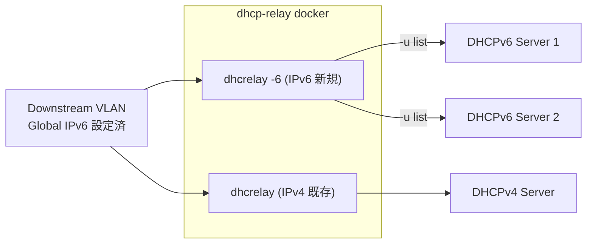

<!-- topics-tip -->
!!! tip "Topics で読み物として読む"
    この HLD は実装詳細を含みます。機能の概念・設定・運用を読み物として読みたい場合は [Topics 16 章: NAT / DHCP / DNS](../topics/16-nat-dhcp-dns/index.md) を参照。
<!-- /topics-tip -->

!!! success "裏取りステータス: Code-verified"
    `sonic-buildimage/dockers/docker-dhcp-relay/docker-dhcp-relay.supervisord.conf.j2` L58 と `dhcp-relay.programs.j2` L7/L27 で `DHCP_RELAY[vlan_name]['dhcpv6_servers']` 条件で v6 用エントリを生成、`dhcpv6-relay.agents.j2` L3-4 で `dhcpv6_servers` ループによる `dhcrelay -6` 形式の上流サーバ展開を確認。`cli-plugin-tests/test_config_dhcp_relay.py` / `test_show_dhcp_relay.py` で `dhcpv6_servers` キーを使ったテスト構成を確認（verified at: 2026-05-09）。

# DHCPv6 リレー（dhcp-relay docker 内の dhcrelay -6 プロセス）

## 概要

[SONiC](../reference/glossary.md#term-sonic) の DHCPv4 リレーは `dhcp-relay` docker 内の `isc-dhcp` ベースの `dhcrelay` プロセスで実装されている。本 [HLD](../reference/glossary.md#term-hld) は **同じ `dhcp-relay` docker に IPv6 用の `dhcrelay -6` を並走させる** 形で DHCPv6 リレー機能を追加する設計を定義する[^1]。

主な機能要件[^1]:

- 下流（[VLAN](../reference/glossary.md#term-vlan) 側）から上流への DHCPv6 パケットの中継。
- `dhcp-relay` コンテナ内に **IPv4 とは別プロセス** として動かす。
- 上流の **複数の unicast / multicast 宛先** へのリレーをサポート。

## 動作仕様

### 構成と前提

- 下流（downstream）は VLAN インターフェース。**Global IPv6 アドレスがその interface に設定されていること** が前提[^1]。
- DHCPv6 のリレー機能を有効にすると、**[CoPP](../reference/glossary.md#term-copp) マネージャから DHCPv6 trap を有効化** する。逆に無効化したら trap も外す。両者は連動する[^1]。
- `dhcp-relay` コンテナの依存は IPv4 と同じく **`isc-dhcp`** プロジェクト。`dhcrelay` バイナリの `-6` オプションを使う[^1]。

### CONFIG_DB スキーマ

`VLAN` テーブルに `dhcpv6_servers` フィールドが追加される[^1]:

```json
{
  "VLAN": {
    "Vlan1000": {
      "dhcp_servers":   ["192.0.0.1", "192.0.0.2"],
      "dhcpv6_servers": ["21da:d3:0:2f3b::7", "21da:d3:0:2f3b::6"],
      "vlanid": "1000"
    }
  }
}
```

`dhcp_servers`（v4）と `dhcpv6_servers`（v6）が **同じ VLAN エントリ内に並ぶ**。両方を同時に持っても良い。

### 起動コマンド

`dhcp-relay` コンテナ内で v6 用デーモンが個別に上がる[^1]:

```bash
/usr/sbin/dhcrelay -6 -d \
    --name-alias-map-file /tmp/port-name-alias-map.txt \
    -l Vlan1000 \
    -u 21da:d3:0:2f3b::7%Ethernet28 \
    -u 21da:d3:0:2f3b::6%Ethernet28
```

引数の意味[^1]:

| 引数 | 意味 |
|------|------|
| `-6` | DHCPv6 モード |
| `-d` | foreground / debug |
| `--name-alias-map-file` | port name エイリアスマップファイル |
| `-l Vlan1000` | downstream interface（lower）|
| `-u <addr>%<iface>` | upstream の unicast / multicast 宛先（複数指定可）|

複数の `-u` を指定することで **複数の DHCPv6 サーバへ同時にリレー** できる[^1]。

### 並列プロセス構成



IPv4 と IPv6 は **同一コンテナ内の別プロセス**。両方有効でも片方のみでも構成可能[^1]。

### DHCP Monitor

既存の DHCP Monitor が **DHCPv6 対応に拡張** される[^1]。具体的な拡張点（監視するメッセージタイプの増加、メトリクス命名の方針など）は HLD には詳細記述がない。

### 初期化フロー

HLD には init フロー図（`init.svg`）が貼られているが文章での詳細はない。一般的な依存関係として、[CONFIG_DB](../reference/glossary.md#term-config_db) の VLAN にエントリが入った段階で `dhcp-relay` コンテナが起動 / 再起動して `dhcrelay -6` プロセスを立てる、という流れになる。

<!-- evidence:
source: sonic-net/SONiC/doc/DHCPv6_Relay/DHCPv6_Relay_HLD.md#L62-L82 (sha: 49bab5b5ff0e924f1ea52b3d9db0dfa4191a7c06)
excerpt: |
  - DHCPv6 trap should be enabled through the COPP manager when the DHCP relay feature is enabled and vice versa.
  - Downstream network is the VLAN interface with the relay configuration. Global IPv6 address is required to be configured on that interface.
  "dhcpv6_servers": [ "21da:d3:0:2f3b::7", "21da:d3:0:2f3b::6" ]
reasoning: CoPP 連動・global IPv6 必須・CONFIG_DB スキーマの根拠。
-->

<!-- evidence-rendered:start -->
??? note "📋 検証エビデンス: sonic-net/SONiC/doc/DHCPv6_Relay/DHCPv6_Relay_HLD.md#L62-L82 (sha: 49bab5b5ff0e924f1ea52b3d9db0dfa4191a7c06)"

    **出典**:

    `sonic-net/SONiC/doc/DHCPv6_Relay/DHCPv6_Relay_HLD.md#L62-L82 (sha: 49bab5b5ff0e924f1ea52b3d9db0dfa4191a7c06)`

    **抜粋**:

    ```text
    - DHCPv6 trap should be enabled through the COPP manager when the DHCP relay feature is enabled and vice versa.
    - Downstream network is the VLAN interface with the relay configuration. Global IPv6 address is required to be configured on that interface.
    "dhcpv6_servers": [ "21da:d3:0:2f3b::7", "21da:d3:0:2f3b::6" ]
    ```

    **判断根拠**: CoPP 連動・global IPv6 必須・CONFIG_DB スキーマの根拠。

<!-- evidence-rendered:end -->

## 設定

### 関連する CONFIG_DB

| Table | Key | フィールド | 用途 |
|-------|-----|-----------|------|
| `VLAN` | `<Vlan name>` | `dhcpv6_servers` | リレー先の DHCPv6 サーバアドレス（list）|
| `VLAN` | `<Vlan name>` | `dhcp_servers` | 既存の DHCPv4 リレー先（list、v4/v6 共存可）|

### 関連する CLI

既存の `config vlan dhcp_relay` コマンドが **IPv4 / IPv6 共通** に拡張される[^1]:

| Command | 用途 |
|---------|------|
| `config vlan dhcp_relay add <vlan_id> <ip>` | リレー先サーバを追加（v4/v6 自動判別）|
| `config vlan dhcp_relay del <vlan_id> <ip>` | 同 削除 |
| `show vlan brief` | VLAN 一覧（`DHCP Helper Address` カラムに v4/v6 サーバが混在表示）|

### 設定例

```bash
admin@sonic:~$ sudo config vlan dhcp_relay add 1000 21da:d3:0:2f3b::7
Added DHCP relay destination address 21da:d3:0:2f3b::7 to Vlan1000
Restarting DHCP relay service...
```

`show vlan brief` の出力例[^1]:

```text
+---------+----------------------+------------+----------+-----------------------+----------+
| VLAN ID | IP Address           | Ports      | Tagging  | DHCP Helper Address   | ProxyARP |
+=========+======================+============+==========+=======================+==========+
|    1000 | 21da:d3:0:2f3b::6/96 | Ethernet28 | untagged | 21da:d3:0:2f3b::6     | disabled |
|         |                      |            |          | 21da:d3:0:2f3b::7     |          |
+---------+----------------------+------------+----------+-----------------------+----------+
```

CLI 操作後は `Restarting DHCP relay service...` と表示され、コンテナごと再起動して新構成で `dhcrelay -6` が立ち上がる[^1]。

## 制限事項

- **VLAN インターフェースに global IPv6 アドレスが必須**。link-local だけでは relay は起動しない[^1]。
- リレー先サーバ追加 / 削除のたびに **DHCP relay service を再起動** する設計。短時間ではあるがリレー断が発生する[^1]。
- HLD は `isc-dhcp` 由来の `dhcrelay -6` に依存。同 OSS の v6 機能の制約（option ハンドリング、`-u` の宛先数上限など）を引き継ぐ。HLD では明示されていない。
- `dhcrelay -6 -u <addr>%<iface>` の zone-id 表記が必要なため、**upstream interface 名がコンテナ内で参照可能** であることが前提。

## 干渉する機能

- **CoPP マネージャ**: DHCPv6 trap の有効化と相互連動する。CoPP 側で trap を別途無効化していると DHCPv6 メッセージが CPU に上がらず、リレー機能だけ有効でも実際に中継できない[^1]。
- **既存 DHCPv4 リレー**: 同一 `dhcp-relay` docker に並走する別プロセス。`config vlan dhcp_relay add/del` の引数 IP のアドレス族で自動判別される設計[^1]。
- **DHCP Monitor**: 既存 monitor の v6 拡張。監視 / メトリクスの一貫性確保のため、運用上は v4/v6 同時に enable する想定[^1]。
- **`docker-dhcp-relay` の supervisord**: VLAN 構成に応じて `-6 -l <vlan> -u <addr>%<iface>` を組み立てる Jinja テンプレート（実装詳細は本 HLD で言及されていない）が必要になる。
- **VLAN の Global IPv6 アドレス管理**: `config interface ip add` 等で適切に設定されていないと relay が立ち上がらない[^1]。

## トラブルシューティング

- `dhcrelay -6` が立ち上がらない: VLAN に global IPv6 が設定されているか確認。link-local のみだと不可[^1]。
- DHCPv6 が一切来ない: CoPP 側の DHCPv6 trap が有効か確認。HLD の連動仕様どおりに動いていない場合、relay enable とは別に trap を確認する必要[^1]。
- リレー先追加で短時間断: `Restarting DHCP relay service...` が出る挙動どおり。コンテナ再起動分のダウンタイムが発生[^1]。
- `show vlan brief` の `DHCP Helper Address` に v6 が出ない: CLI または `show` 側が当該機能未対応の可能性。実装確認は裏取り課題。

### コマンド例

DHCPv6 relay の設定と統計を確認する。

```bash
docker exec dhcp_relay ps -ef | grep dhcrelay
show ipv6 dhcp-relay
show ipv6 dhcp-relay counters
```

## 関連 reference

- [CLI: config dhcp-relay](../reference/cli/config-dhcp-relay.md)
- [Runbook: dhcp-relay](../reference/runbooks/dhcp-relay.md)
- [Topics: NAT / DHCP / DNS](../topics/16-nat-dhcp-dns/index.md)

## 引用元

[^1]: `sonic-net/SONiC` `doc/DHCPv6_Relay/DHCPv6_Relay_HLD.md` @ `49bab5b5ff0e924f1ea52b3d9db0dfa4191a7c06`

<!-- topics-back-ref -->
## 関連 Topics

- [Topics: NAT / DHCP Relay / Time-DNS Services](../topics/16-nat-dhcp-dns/index.md)

<!-- /topics-back-ref -->

## 参考リンク

本ページに関連する参照ドキュメント:

- [`config vlan dhcp_relay add` CLI リファレンス](../reference/cli/config-vlan.md)
- [`config vlan dhcp_relay del` CLI リファレンス](../reference/cli/config-vlan.md)
- [`show vlan brief` CLI リファレンス](../reference/cli/show-vlan.md)
- [`config vlan` CLI リファレンス](../reference/cli/config-vlan.md)
- [`show vlan` CLI リファレンス](../reference/cli/show-vlan.md)

<!-- augmented-links: v1 -->

<!-- glossary-links-injected: 8ba32e5aa69d -->
