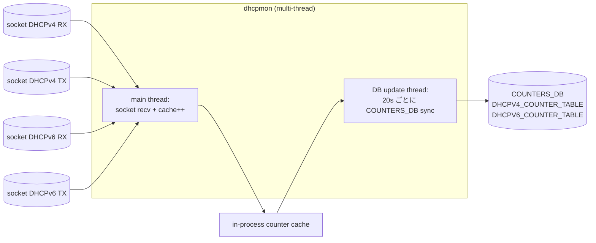

<!-- topics-tip -->
!!! tip "Topics で読み物として読む"
    この HLD は実装詳細を含みます。機能の概念・設定・運用を読み物として読みたい場合は [Topics 16 章: NAT / DHCP / DNS](../topics/16-nat-dhcp-dns/index.md) を参照。
<!-- /topics-tip -->

!!! success "裏取りステータス: Code-verified"
    `sonic-buildimage/src/dhcpmon/` で dhcpmon 実装を確認。`sonic-buildimage/dockers/docker-dhcp-relay/cli/show/plugins/show_dhcp_relay.py` で `show dhcp_relay ipv4/ipv6 counter` CLI、`cli/clear/plugins/clear_dhcp_relay.py` で sonic-clear、`cli-plugin-tests/test_show_dhcpmon_counters.py` / `test_clear_dhcp_relay.py` で UT を確認（verified 2026-05-09）。`sonic-dhcp-relay/dhcp4relay` / `dhcp6relay` で relay daemon 本体を確認。

# DHCP Relay per-interface counter（`dhcpmon` マルチスレッド + COUNTERS_DB 永続化）

## 概要

旧設計の DHCPv4 counter は `dhcpmon` のプロセスメモリ内で **[VLAN](../reference/glossary.md#term-vlan)/[PortChannel](../reference/glossary.md#term-portchannel) 粒度のみ** を持ち、ユーザは syslog からしか可視化できなかった。DHCPv6 は `dhcp6relay` プロセスに counter ロジックが同居し、relay 機能と相互影響していた[^1]。

本 [HLD](../reference/glossary.md#term-hld) は[^1]:

- DHCPv4 / DHCPv6 ともに **物理 / [LAG](../reference/glossary.md#term-lag) / VLAN** 粒度の TX/RX counter を持つ
- counter を **`COUNTERS_DB`** に永続化（プロセスメモリだけでは不可視）
- DHCPv6 counter を `dhcp6relay` から **`dhcpmon`** に移動し、relay と分離
- `show` / `sonic-clear` CLI を提供

を達成する設計。

## 動作仕様

### 役割分担



socket は BPF program (`tcpdump -dd`) でフィルタしている[^1]:

| socket | フィルタ |
|--------|---------|
| DHCPv4 RX | `inbound and udp and (port 67 or port 68)` |
| DHCPv4 TX | `outbound and udp and (port 67 or port 68)` |
| DHCPv6 RX | `inbound and ip6 and (udp port 547 or udp port 546)` |
| DHCPv6 TX | `outbound and ip6 and (udp port 547 or udp port 546)` |

### Context interface map

`dhcpmon` 起動引数（`-id Vlan1000 -iu PortChannel1 -iu Ethernet42`）から **downlink/uplink を context interface** として登録し、配下の VLAN member / LAG member を context interface へマップする[^1]:

```text
{
  "Vlan1000": "Vlan1000",   "Ethernet1": "Vlan1000",  "Ethernet2": "Vlan1000",  "Ethernet3": "Vlan1000",   # downlink
  "PortChannel1": "PortChannel1", "Ethernet40": "PortChannel1", "Ethernet41": "PortChannel1",            # uplink
  "Ethernet42": "Ethernet42"                                                                            # uplink
}
```

socket interface（パケットが入ってきた物理 IF）と context interface の両方で counter をインクリメント[^1]。

### DHCPv4 counter 増分条件

`Option 53`（packet type）+ `Destination IP`（IP header）+ `Gateway IP`（DHCPv4 header）の 3 フィールドで判定[^1]:

| 方向 | RX 条件 | TX 条件 |
|------|---------|---------|
| Client → Server | downlink IF かつ dst-ip = bcast または gateway-ip かつ DHCP gateway = 0 | uplink IF かつ DHCP gateway = device gateway |
| Server → Client | uplink IF かつ dst-ip = device gateway かつ DHCP gateway = device gateway | downlink IF かつ DHCP gateway = device gateway |

### DHCPv6 counter

`Message-type` で 13 種 + `Unknown` / `Malformed`。送受信方向は spec 準拠。`pcapplusplus` で DHCPv6 ヘッダ解析[^1]。

カウント除外条件:
- physical / context IF が無効
- 構造異常（option 長/形式不正） → `Malformed`
- IPv6 ext header 末尾が UDP でない、Option ID > 147 → `Malformed`
- Hop limit >= 8（RFC8415）→ ignore
- Dual-ToR で **standby IF** から来た packet
- Link Address 不一致（Option 9 と Relay-forw の関係）

### Dual-ToR 特殊ルール[^1]

- standby IF からの packet は **drop**（counter 加算せず）
- DHCPv4 のゲートウェイは Vlan IP ではなく **Loopback IP**
- DHCPv6 は server へ **Loopback** から送出、Vlan LLA を含む `Option 18` 付与

### Persist (DB update thread)

20 秒間隔で全 cache を `COUNTERS_DB` の `DHCPV4_COUNTER_TABLE` / `DHCPV6_COUNTER_TABLE` に sync[^1]。

### Clear

`sonic-clear` CLI 実行時:
1. CLI が `COUNTERS_DB` を直接 zero clear
2. dhcpmon プロセスへ signal 送信
3. main thread 内で `COUNTERS_DB → cache` の同期取り込み（クリアの取り込み）

### Counter Reset 契機

| 契機 | 挙動 |
|------|------|
| dhcp_relay container 再起動 | `start.sh` で全 counter clear |
| dhcpmon プロセス再起動 | downlink/uplink + VLAN_MEMBER / PORTCHANNEL_MEMBER の関連 IF entry を 0 で初期化 |
| VLAN add/del | container 再起動が必要（vlan del は CLI 自動再起動） |
| VLAN/LAG member 変更 | 期待: entry add (=0) / del 連動。**現状未サポート、将来対応**[^1] |

### COUNTERS_DB スキーマ

```text
DHCPV4_COUNTER_TABLE|Vlan1000           RX={"Discover":1,...}    TX={"Offer":2,...}
DHCPV4_COUNTER_TABLE|Vlan1000:Ethernet4 RX={...}                 TX={...}
DHCPV6_COUNTER_TABLE|Vlan1000           RX={"Solicit":1,...}     TX={"Advertise":2,...}
```

uplink IF キーには **VLAN プレフィックス** (`Vlan1000:Ethernet4`) を付け、複数 VLAN で uplink IF が共有される構成を区別する[^1]。

## 関連 CLI

```bash
show dhcp_relay ipv4 counter [--dir TX|RX] [--type <type>] <vlan>
show dhcp_relay ipv6 counters [--dir TX|RX] [--type <type>] <vlan>
sonic-clear dhcp_relay ipv4 counter [--dir TX|RX] [--type <type>] [<vlan>]
sonic-clear dhcp_relay ipv6 counters [--dir TX|RX] [--type <type>] [<vlan>]
```

`show` には `--dir` または `--type` のいずれかが必要[^1]。

## 制限事項

- VLAN/LAG member 変更時の counter entry 動的追加・削除は将来対応[^1]
- VLAN add/del は container 再起動を要する（vlan del は CLI 自動再起動）
- counter は 20 秒間隔で `COUNTERS_DB` に flush。直近 20 秒分はメモリのみ
- DHCPv6 Option ID > 147 は Malformed 扱い（IANA 予約準拠）

## 干渉する機能

- **dhcp_relay container**: 起動・再起動で counter リセット
- **Dual-ToR**: standby IF drop、Loopback ベース送受信、Option 18 (Vlan LLA)
- **VLAN_MEMBER / PORTCHANNEL_MEMBER**: 初期化対象 IF の決定根拠

## 関連 reference

- [CLI: config dhcp-relay](../reference/cli/config-dhcp-relay.md)
- [HLD: dhcp-relay-for-ipv6](dhcp-relay-for-ipv6-hld.md)
- [Runbook: dhcp-relay](../reference/runbooks/dhcp-relay.md)
- [Topics: NAT / DHCP / DNS](../topics/16-nat-dhcp-dns/index.md)

## 確認コマンド

- `show dhcp_relay ipv4 counter --dir RX <vlan>` / `--dir TX <vlan>` — VLAN 単位の per-message-type 統計
- `show dhcp_relay ipv6 counters --type Solicit <vlan>` — DHCPv6 メッセージ種別での絞り込み
- `sonic-db-cli COUNTERS_DB hgetall "DHCPV4_COUNTER_TABLE:Vlan1000"` — DB 直読みで生 counter を確認
- `sonic-clear dhcp_relay ipv4 counter <vlan>` で 0 化 → 再現テスト

### コマンド例

DHCP relay の interface 別カウンタを確認する。

```bash
show dhcp_relay ipv4 counter
show dhcp_relay ipv6 counters
redis-cli -n 6 keys 'DHCPV4_COUNTER_TABLE|*'
redis-cli -n 6 keys 'DHCPV6_COUNTER_TABLE|*'
```

## 引用元

[^1]: [sonic-net/SONiC doc/dhcp_relay/DHCP-per-interface-counter.md @ 49bab5b](https://github.com/sonic-net/SONiC/blob/49bab5b5ff0e924f1ea52b3d9db0dfa4191a7c06/doc/dhcp_relay/DHCP-per-interface-counter.md)

<!-- topics-back-ref -->
## 関連 Topics

- [Topics: NAT / DHCP Relay / Time-DNS Services](../topics/16-nat-dhcp-dns/index.md)

<!-- /topics-back-ref -->

<!-- glossary-links-injected: 8f3f485ba900 -->
