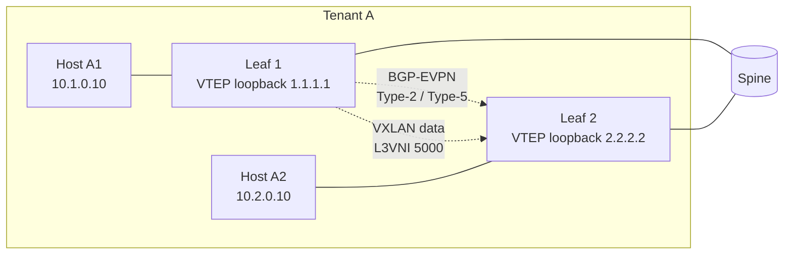

# EVPN VXLAN 概念（Route Type 2/3/5 / L2VNI / L3VNI / IRB）

このページは [EVPN VXLAN HLD（概要ハブ）](evpn-vxlan-hld.md) の派生ページで、**control plane の概念・用語・deployment モデル** に絞って整理する。内部実装は [evpn-vxlan-hld-internals.md](evpn-vxlan-hld-internals.md)、CLI 設定・運用は [evpn-vxlan-hld-operations.md](evpn-vxlan-hld-operations.md) を参照。

## 1. control plane / data plane の分業

EVPN VXLAN は **control plane と data plane を明確に分離** する[^1]。

- **control plane**: BGP の **MP-BGP EVPN address-family** (`l2vpn evpn`) が MAC / IP / IP prefix の到達情報を VTEP 間で広告する。SONiC は FRR の `bgpd` を採用
- **data plane**: VXLAN encap/decap で L2 over L3 のトンネルを張る。各 VTEP が loopback IP を SIP とし、対向 VTEP の loopback を DIP とする UDP/4789 のカプセル化

HLD では「FRR を control plane と仮定するが、本設計に準拠する任意の BGP-EVPN 実装で代替可能」と明記[^1]。

## 2. 想定 deployment

HLD の Target use cases[^1]:

- **IP Fabric Leaf-Spine** のリーフノード
- 従来型 Access / Aggregator / Core トポロジの集約 / コアノード
- マルチテナント環境
- IP WAN 越しの VLAN 拡張
- L2 / L3 ハンドオフを使うデータセンタ間接続 (DCI)

## 3. EVPN Route Type の使い分け

EVPN は複数の route type を定義するが、SONiC HLD が主に扱うのは **Type-2 / Type-3 / Type-5** の 3 種類。

| Type | 名称 | 広告対象 | 主用途 | L2/L3 VNI |
|------|------|----------|--------|-----------|
| 2 | MAC/IP Advertisement | host MAC（任意で IP） | L2 stretch、host-route 配布、ARP/ND suppression | L2VNI（任意で L3VNI 併記）|
| 3 | Inclusive Multicast Ethernet Tag | VTEP の所属 VNI | BUM ingress replication 用 VTEP 通知（IMET）| L2VNI |
| 5 | IP Prefix Route | IP prefix（subnet）| L3 ルーティング、外部 prefix の流通 | L3VNI |

### 3.1 Type-2 (MAC/IP Advertisement)

ローカル VTEP が学習した host MAC（必要なら IP も）を BGP-EVPN で広告する。受信側 VTEP は:

- remote MAC を Linux FDB → `VXLAN_FDB_TABLE` 経由で `fdborch` に渡し、`SAI_FDB_ENTRY` を programmatic に install
- MAC-IP の binding を **ARP / ND suppression** のローカルキャッシュとして使い、broadcast を抑制[^1]

### 3.2 Type-3 (IMET)

VLAN-VNI mapping が programming されたタイミングで `zebra` が trigger し、`bgpd` が **「私はこの VNI を持っている」** を周辺 VTEP に通知する。受信側は **ingress replication list** に remote VTEP を追加し、BUM (broadcast / unknown unicast / multicast) を ingress 複製する[^1]。

multicast underlay は HLD のスコープ外。ingress replication 一択。

### 3.3 Type-5 (IP Prefix)

VRF に属する **IP prefix を L3VNI 経由で広告** する。受信側 VTEP は:

- prefix を該当 VRF のルーティングテーブルに install
- next-hop に **remote VTEP IP + L3VNI + router MAC** を埋め、`VRF_ROUTE_TABLE` の `vni_label` / `router_mac` フィールドに記録[^1]
- データプレーンでは inner DA を remote router MAC に書き換え、L3VNI でカプセル化して remote VTEP に送る

## 4. L2VNI と L3VNI の作り分け

| 区分 | 紐づけ対象 | 主に運ぶ traffic |
|------|------------|-----------------|
| **L2VNI** | VLAN ↔ VNI | 同一 subnet 内の L2 forwarding（Type-2 / Type-3）|
| **L3VNI** | VRF ↔ VNI | VRF 内の inter-subnet routing（Type-5、Symmetric IRB の中継 VNI）|

CONFIG_DB では:

- L2VNI: `VXLAN_TUNNEL_MAP|<vtep>|<map>` の `vlan` / `vni` フィールド
- L3VNI: `VRF|<vrf>` の `vni` フィールド

両方とも **同一 `VXLAN_TUNNEL`（SIP only）の上に共存** する。FRR / SONiC は per-VTEP に共通の VTEP loopback を 1 つだけ持つ前提[^1]。

## 5. Symmetric IRB と Asymmetric IRB

EVPN の inter-subnet routing には 2 モデルがある。SONiC HLD は **両方サポート** を謳う[^1]が、実運用では Symmetric IRB が標準。

### 5.1 Asymmetric IRB

- ingress VTEP が **ルーティング → bridging** の順で処理し、最終 subnet の VLAN に直接 bridge して送る
- forward path と return path で routing が走る VTEP が **異なる** ため "asymmetric"
- ingress VTEP に全 subnet の VLAN を持たせる必要があり、スケールしない

### 5.2 Symmetric IRB（推奨）

- ingress VTEP: local subnet → **IP-VRF（L3VNI）** に route
- egress VTEP: L3VNI → 宛先 subnet の VLAN に route
- 両 VTEP が routing を行うので "symmetric"。ingress VTEP は **directly attached subnet のみ** 持てばよい
- L3VNI が VRF 内の中継 VNI として機能する。Type-5 は L3VNI 経由で配送される

### 5.3 Anycast Gateway

- 全 VTEP が **同じ MAC / IP を VLAN interface に持たせる**（anycast gateway MAC）
- host から見た default gateway は最寄りの VTEP が常に応答する → VM mobility 時もデフォルトゲートウェイが変わらない

## 6. ARP / ND Suppression

Type-2 が remote MAC-IP binding を local に持ってくるため、local host からの ARP / ND request を **VTEP 自身が代理応答** できる。これにより:

- broadcast ARP / ND を VXLAN tunnel に flood する必要がない
- 大規模 EVPN fabric の BUM traffic を削減

設定単位は VLAN ごと（`config neigh-suppress vlan <vlan-id> on`）[^1]。

!!! warning "ARP/ND suppression 実装の未完"
    HLD は ARP/ND suppression を機能要件に含めるが、実装は long-open issue（[sonic-swss #2181](https://github.com/sonic-net/sonic-swss/issues/2181)）として残っている。詳細は [概要ハブの「実装との乖離」セクション](evpn-vxlan-hld.md) を参照。

## 7. 想定 fabric 構成

最も標準的な構成は **Symmetric IRB + Anycast Gateway + Type-5 で外部 prefix 流通**。

- 各 Leaf が同 VRF (例: `Vrf-A`) に異なる subnet を持つ
- 同 VRF に L3VNI 5000 を bind
- L1 と L2 は anycast gateway MAC を共有し、host から見た gateway は常に「最寄りの leaf」

## 8. 次に読む

- 内部実装（FRR → APPL_DB → orchagent → SAI のフロー、Orch クラス相関）: [evpn-vxlan-hld-internals.md](evpn-vxlan-hld-internals.md)
- CLI 設定 / 運用 / トラブルシュート: [evpn-vxlan-hld-operations.md](evpn-vxlan-hld-operations.md)
- multihoming（ESI / DF election）: [evpn-vxlan-multihoming.md](evpn-vxlan-multihoming.md)
- Topics 読み物: [VXLAN/EVPN 概念](../topics/03-vxlan-evpn/concept.md)

## 引用元

[^1]: `sonic-net/SONiC` `doc/vxlan/EVPN/EVPN_VXLAN_HLD.md` @ `49bab5b5ff0e924f1ea52b3d9db0dfa4191a7c06`

<!-- topics-back-ref -->
## 関連 Topics

- [Topics: VXLAN / EVPN / VNET オーバーレイ](../topics/03-vxlan-evpn/index.md)

<!-- /topics-back-ref -->
