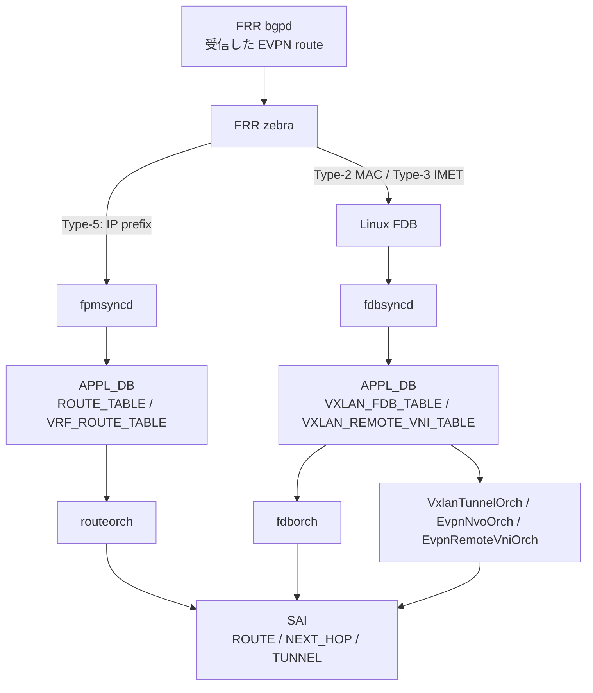

# EVPN VXLAN 内部実装（FRR → fpmsyncd → APPL_DB → orchagent → SAI）

このページは [EVPN VXLAN HLD（概要ハブ）](evpn-vxlan-hld.md) の派生ページで、**control plane → data plane の内部フロー** に絞って整理する。概念は [evpn-vxlan-hld-concepts.md](evpn-vxlan-hld-concepts.md)、CLI 設定 / 運用は [evpn-vxlan-hld-operations.md](evpn-vxlan-hld-operations.md) を参照。

!!! success "裏取りステータス: code-verified（2026-05-26）"
    `sonic-swss/orchagent/vxlanorch.h:541` `class EvpnNvoOrch`、`vxlanorch.cpp:1678/1733/1795` `gDirectory.get<EvpnNvoOrch*>()`、`routeorch.cpp:3048/3068` で Type-5 install 経路の EvpnNvoOrch 連携、`fdborch.cpp:847` で Type-2 経由 MAC 学習通知、`sonic-swss/cfgmgr/vxlanmgr.cpp:189/239` で `VXLAN_EVPN_NVO` テーブル名、`sonic-buildimage/src/sonic-yang-models/yang-models/sonic-vxlan.yang:106` `container VXLAN_EVPN_NVO` を確認。

## 1. 全体フロー（Type-2 / Type-3 / Type-5 共通）

BGP-EVPN のメッセージは FRR `bgpd` で受信され、種別ごとに異なる経路で SONiC の orchagent → SAI に下りる[^1]。

## 2. control plane: FRR bgpd / zebra

- **bgpd**: `address-family l2vpn evpn` で EVPN session を張り、Route Type 2 / 3 / 5 を送受信。SONiC 側では `dockers/docker-fpm-frr/frr/bgpd/bgpd.main.conf.j2` テンプレートで生成
- **zebra**: bgpd から渡された route を Linux RIB / FDB に install する責務。Type-5 は kernel routing table へ、Type-2 / Type-3 は kernel bridge FDB / vni device 経由で配信
- **fpmsyncd** (FPM channel 経由): zebra からの IP route 通知を受け取り、`APPL_DB` の `ROUTE_TABLE` / `VRF_ROUTE_TABLE` に書き込む。VXLAN next-hop のときは `vni_label` / `router_mac` フィールドが付与される
- **fdbsyncd** (SwSS 側で追加された process): Linux bridge FDB を netlink subscribe し、Vxlan interface 経由で学習された MAC を `APPL_DB` の `VXLAN_FDB_TABLE` / `VXLAN_REMOTE_VNI_TABLE` に書き込む[^1]

## 3. data plane: orchagent クラス相関

EVPN VXLAN は単一の orch ではなく **複数の Orch2 派生クラスが協調** する。実装上の中心は `vxlanorch.{h,cpp}`。

| クラス | ヘッダ / cpp 位置 | 役割 |
|--------|-------------------|------|
| `VxlanTunnelOrch` | `vxlanorch.h:268` | `VXLAN_TUNNEL` を読んで VTEP loopback の SAI tunnel object を作る |
| `VxlanTunnelMapOrch` | `vxlanorch.h:414` | `VXLAN_TUNNEL_MAP` の L2VNI ↔ VLAN を SAI tunnel map entry に登録 |
| `VxlanVrfMapOrch` | `vxlanorch.h:462` | L3VNI ↔ VRF を SAI tunnel map entry に登録 |
| `EvpnNvoOrch` | `vxlanorch.h:541` | `VXLAN_EVPN_NVO` を読んで EVPN NVO instance を保持し、dynamic tunnel 生成のアンカーとする |
| `EvpnRemoteVnip2pOrch` | `vxlanorch.h:499` | IMET (Type-3) 受信時に **per-VTEP の P2P dynamic tunnel** を生成（SAI が P2P tunnel peer mode サポート時）|
| `EvpnRemoteVnip2mpOrch` | `vxlanorch.h:512` | IMET 受信時に **既存 P2MP tunnel** に L2MC group member を追加（P2P peer mode 非対応時）|
| `fdborch` | `fdborch.cpp:847` | `VXLAN_FDB_TABLE` 経由で remote MAC を SAI FDB entry に install |
| `routeorch` | `routeorch.cpp:3048/3068` | Type-5 route を SAI route + next-hop（tunnel encap）に install |

!!! note "P2P vs P2MP の選択は SAI capability で決まる"
    SAI の `SAI_TUNNEL_ATTR_PEER_MODE` enum query で `SAI_TUNNEL_PEER_MODE_P2P` がサポートされていれば `EvpnRemoteVnip2pOrch` 側、なければ `EvpnRemoteVnip2mpOrch` 側が使われる[^1]。スキーマは同一で、外部から見た config の書き方は変わらない。

## 4. CONFIG_DB → APPL_DB → STATE_DB の流れ

### 4.1 CONFIG_DB（人/yang 経由で設定）

| テーブル | 役割 | HLD 記載との差 |
|----------|------|----------------|
| `VXLAN_TUNNEL\|<vtep>` | source IP (`src_ip`) のみ持つ VTEP loopback トンネル | 一致 |
| `VXLAN_TUNNEL_MAP\|<vtep>\|<map>` | L2VNI: `vni` / `vlan` フィールド | 一致 |
| `VXLAN_EVPN_NVO\|<nvo>` | `source_vtep` で `VXLAN_TUNNEL` を指す | HLD は `EVPN_NVO` と略記しているが **実装名は `VXLAN_EVPN_NVO`** |
| `VRF\|<vrf>` | `vni` フィールドで L3VNI を bind | 一致（既存 table の拡張）|
| `VLAN\|Vlan<id>` | L2VNI と紐づく VLAN | 一致 |

### 4.2 APPL_DB（orchagent が読む）

| テーブル | producer | consumer |
|----------|----------|----------|
| `VXLAN_TUNNEL_TABLE` | `vxlanmgr` | `VxlanTunnelOrch` |
| `VXLAN_TUNNEL_MAP_TABLE` | `vxlanmgr` | `VxlanTunnelMapOrch` |
| `VXLAN_EVPN_NVO_TABLE` | `vxlanmgr` | `EvpnNvoOrch` |
| `VXLAN_REMOTE_VNI_TABLE` | `fdbsyncd` (IMET 受信時) | `EvpnRemoteVnip2p/p2mpOrch` |
| `VXLAN_FDB_TABLE` | `fdbsyncd` (Type-2 MAC 受信時) | `fdborch` |
| `ROUTE_TABLE` / per-VRF | `fpmsyncd` (Type-5 受信時) | `routeorch` |

### 4.3 STATE_DB（運用可視化）

- `STATE_VXLAN_TUNNEL_TABLE`: 静的 / 動的の全 tunnel を列挙。`tunnel source` フィールドで `EVPN` / `CLI` を区別、`operstatus` で dataplane 状態を反映[^1]

## 5. VRF / Tenant 隔離の実装

Symmetric IRB + Type-5 のテナント隔離は **L3VNI ↔ VRF の 1:1 bind** で実現する。

1. 管理者が `VRF|Vrf-Red` に `vni = 5000` を設定（CONFIG_DB）
2. `vrfmgr` がこれを `APPL_DB:VRF_TABLE` にコピー
3. `vrforch` が SAI VR (virtual router) を作成し、L3VNI 5000 を bind
4. FRR 側でも対応する VRF に L3VNI を bind（`vtysh` の `vni 5000`）
5. EVPN Type-5 route 受信 → `fpmsyncd` が `ROUTE_TABLE:Vrf-Red:<prefix>` に書く（`vni_label=5000`, `router_mac=<remote anycast MAC>`, nexthop=remote VTEP IP）
6. `routeorch` (`routeorch.cpp:3048/3068`) が `EvpnNvoOrch` から VTEP / NVO 情報を取り、SAI next-hop に tunnel encap を埋めて install

各 tenant は **VRF + L3VNI** の組で完全分離される。同 prefix が異なる VRF に存在しても route table が別 SAI VR に書かれるため衝突しない。

## 6. P2P / P2MP tunnel の dynamic 生成

Type-3 (IMET) 受信時に remote VTEP の `source_vtep_ip` を含む `VXLAN_REMOTE_VNI_TABLE` entry が `fdbsyncd` 経由で積まれ、対応する Orch が以下を行う[^1]:

- **P2P モード**: 動的 tunnel を新規生成（命名規則: `EVPN_<remote-ip>`）。SAI tunnel object + bridge port を作り、VLAN member として attach
- **P2MP モード**: 既存 P2MP tunnel に対する L2MC group member を追加。flood control type は `SAI_VLAN_FLOOD_CONTROL_TYPE_COMBINED`

dynamic tunnel は **refcount 0 で自動削除**。IMET / MAC / Type-5 のいずれかが残っていれば保持される。

## 7. 実装上の主な乖離点（再掲）

詳細は [概要ハブの「実装との乖離」セクション](evpn-vxlan-hld.md) を参照。本ページの範囲では:

- HLD の `EVPN_NVO` は実装上 `VXLAN_EVPN_NVO`
- HLD で複数 orch に分散とされる中身は **`vxlanorch.{h,cpp}` 1 ファイルに集約** された複数の Orch2 派生クラス
- ARP/ND suppression は HLD には記載があるが実装は未完（[sonic-swss #2181](https://github.com/sonic-net/sonic-swss/issues/2181)）

## 8. 次に読む

- 概念 / Route Type / IRB: [evpn-vxlan-hld-concepts.md](evpn-vxlan-hld-concepts.md)
- CLI 設定 / vtysh / トラブルシュート: [evpn-vxlan-hld-operations.md](evpn-vxlan-hld-operations.md)
- 関連 HLD: [overlay ECMP with BFD monitoring](overlay-ecmp-with-bfd-monitoring.md), [fpmsyncd nexthop group enhancement](fpmsyncd-nexthop-group-enhancement-high-level-design-document.md)

## 引用元

[^1]: `sonic-net/SONiC` `doc/vxlan/EVPN/EVPN_VXLAN_HLD.md` @ `49bab5b5ff0e924f1ea52b3d9db0dfa4191a7c06`

<!-- topics-back-ref -->
## 関連 Topics

- [Topics: VXLAN / EVPN / VNET オーバーレイ — 内部実装](../topics/03-vxlan-evpn/internals.md)

<!-- /topics-back-ref -->
