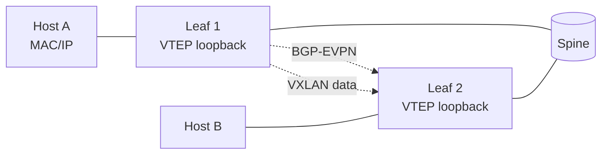

<!-- topics-tip -->
!!! tip "Topics で読み物として読む"
    この HLD は実装詳細を含む。機能の概念・設定・運用を読み物として読みたい場合は [Topics 03 章: VXLAN / EVPN とオーバーレイ](../topics/03-vxlan-evpn/index.md) を参照。
<!-- /topics-tip -->

!!! warning "裏取りステータス: discrepancy-found / 大規模 HLD"
    HLD は 70KB。本ページは EVPN VXLAN の中核（control plane = BGP-EVPN、data plane = VXLAN、Type-2 host route と Type-5 IP prefix の役割境界）に絞る。multihoming は別 HLD（同 area）。

!!! info "章分割済み"
    本ページは EVPN VXLAN HLD の **概要ハブ** として保持。詳細は以下の派生ページを参照:

    - **[EVPN VXLAN 概念（Route Type 2/3/5 / L2VNI / L3VNI / IRB）](evpn-vxlan-hld-concepts.md)** — control plane の概念と Symmetric / Asymmetric IRB、想定構成
    - **[EVPN VXLAN 内部実装（FRR → fpmsyncd → APPL_DB → orchagent → SAI）](evpn-vxlan-hld-internals.md)** — Orch クラス相関と VRF / Tenant 隔離、CONFIG_DB / APPL_DB / STATE_DB の流れ
    - **[EVPN VXLAN 設定・運用（vtysh / show evpn / show bgp l2vpn）](evpn-vxlan-hld-operations.md)** — CLI 設定例、FRR vtysh、トラブルシュート手順

!!! note "Verifier 注記（2026-05-10）"
    実コード裏取り: `sonic-swss/orchagent/vxlanorch.cpp` に `VxlanOrch / VxlanTunnelOrch / VxlanTunnelMapOrch / EvpnNvoOrch` 系の実装存在を確認。yang は `sonic-buildimage/src/sonic-yang-models/yang-models/sonic-vxlan.yang` に `VXLAN_TUNNEL / VXLAN_TUNNEL_MAP / VXLAN_EVPN_NVO` を確認。CLI は `sonic-utilities/show/vxlan.py` に存在。**ただし** CONFIG_DB の NVO テーブル名は `VXLAN_EVPN_NVO`（実装・yang）であり、本ページが冒頭で `EVPN_NVO` と表記している部分は `VXLAN_EVPN_NVO` の略記である点に注意。実装で `CFG_VXLAN_EVPN_NVO_TABLE_NAME` (`sonic-swss/cfgmgr/vxlanmgr.cpp:189`) を確認。

# EVPN VXLAN（FRR BGP-EVPN / VTEP / VRF / Type-2/Type-5）

## 読者が知りたいこと

- [EVPN](../reference/glossary.md#term-evpn) [VXLAN](../reference/glossary.md#term-vxlan) の **control plane / data plane の分業** はどうなっているか
- **Type-2 / Type-3 / Type-5** をどう使い分けるか
- **[CONFIG_DB](../reference/glossary.md#term-config_db) のテーブルと CLI** で最小限の設定をどう書くか
- 実装と [HLD](../reference/glossary.md#term-hld) が食い違っているのは具体的にどこか（`EVPN_NVO` vs `VXLAN_EVPN_NVO` ほか）
- multihoming や MC-[LAG](../reference/glossary.md#term-lag) とどう干渉するか

## 1. 役割分担と全体像

EVPN は **MAC / IP の到達情報を [BGP](../reference/glossary.md#term-bgp) で広告** し、VXLAN は **L2 over L3 のデータプレーン** として traffic を運ぶ。[SONiC](../reference/glossary.md#term-sonic) は [FRR](../reference/glossary.md#term-frr) の BGP-EVPN を control plane、[SAI](../reference/glossary.md#term-sai) VXLAN を data plane に使う[^1]。



## 2. EVPN ルートタイプの使い分け

| | Type-2 | Type-3 | Type-5 |
|---|--------|--------|--------|
| 広告対象 | host MAC（任意で IP） | [VTEP](../reference/glossary.md#term-vtep) の所属 VNI | IP prefix（subnet） |
| 主用途 | L2 stretch、host-route 流通 | BUM ingress replication 用 VTEP 通知 | L3 ルーティング、外部接続 |
| L2/L3 VNI | 両方 | L2 VNI | L3 VNI |

Symmetric IRB（route-then-bridge）+ Anycast Gateway（VTEP 全台で MAC/IP 共有）の構成が標準。具体的な絵は HLD を参照。

## 3. CONFIG_DB と CLI

主要 CONFIG_DB[^1]:

- **`VXLAN_TUNNEL|<name>`**: source IP（自身の VTEP loopback）を持つトンネル
- **`VXLAN_TUNNEL_MAP|<tunnel>|<map>`**: [VLAN](../reference/glossary.md#term-vlan) ↔ VNI、[VRF](../reference/glossary.md#term-vrf) ↔ VNI のマッピング
- **`VXLAN_EVPN_NVO|<nvo>`**: NVO 対象 tunnel 指定（HLD の `EVPN_NVO` は略記。後述の差分参照）
- **`VRF`**: L3 VNI 用 VRF
- **`VLAN`**: L2 VNI と紐づく VLAN

```bash
# VXLAN tunnel (VTEP loopback)
config vxlan add vtep 10.0.0.1
# L2 mapping
config vxlan map add vtep 1000 100      # VLAN 1000 ↔ VNI 100
# L3 mapping
config vxlan map_range add vtep Vrf-RED 5000 5000

# FRR 側 BGP-EVPN は frr.conf / template 経由
```

| Command | 用途 |
|---------|------|
| `show vxlan tunnel` | VXLAN tunnel 一覧 |
| `show vxlan vlanvnimap` | L2 マッピング |
| `show vxlan vrfvnimap` | L3 マッピング |
| `show evpn vni` | EVPN VNI 状態 |
| `show evpn mac vni <n>` | Type-2 で学習した MAC |

## 4. 実装との乖離（2026-05-10 裏取り）

EVPN VXLAN 中核は実装されているが、HLD と実装の **名称・配置** に乖離がある。

### 4.1 CONFIG_DB テーブル名は `EVPN_NVO` ではなく `VXLAN_EVPN_NVO`

- **HLD 記述**: CONFIG_DB に `EVPN_NVO` テーブルを置く
- **実装**:
  - `sonic-swss/cfgmgr/vxlanmgr.cpp:189` `m_appEvpnNvoTable(appDb, APP_VXLAN_EVPN_NVO_TABLE_NAME)`
  - `sonic-swss/cfgmgr/vxlanmgr.cpp:239` `else if (table_name == CFG_VXLAN_EVPN_NVO_TABLE_NAME)`
  - `sonic-buildimage/src/sonic-yang-models/yang-models/sonic-vxlan.yang:106` `container VXLAN_EVPN_NVO`
- **読者への影響**: `sonic-db-cli CONFIG_DB KEYS 'EVPN_NVO*'` は **空**。
- **回避**: `sonic-db-cli CONFIG_DB KEYS 'VXLAN_EVPN_NVO*'` を使う。yang model 編集時は `container VXLAN_EVPN_NVO` を参照

### 4.2 EVPN 中核 orch は `vxlanorch.cpp` 内クラス群

- **HLD 記述**: 複数 orch（VxlanOrch / VxlanTunnelOrch / VxlanMapOrch / EvpnNvoOrch / EvpnRouteOrch）に分散
- **実装**:
  - `sonic-swss/orchagent/vxlanorch.h:541` `class EvpnNvoOrch : public Orch2`
  - `vxlanorch.cpp:1678,1733,1795` `gDirectory.get<EvpnNvoOrch*>()`
  - `routeorch.cpp:3048,3068` で EvpnNvoOrch 連携（Type-5 install 経路）
  - `fdborch.cpp:847` で EvpnNvoOrch 経由の MAC 学習通知
- **回避**: EVPN コードは **`vxlanorch.{h,cpp}` 起点** で追う。Type-5 route は `routeorch.cpp`、Type-2 MAC は `fdborch.cpp` の EvpnNvoOrch 参照部分を見る

### 4.3 FRR BGP-EVPN 連携は frr.conf テンプレート経由

- **HLD 記述**: FRR の BGP-EVPN は frr.conf / template 経由
- **実装位置**: `sonic-buildimage/dockers/docker-fpm-frr/frr/bgpd/bgpd.main.conf.j2`、および `sonic-frr/bgpd/bgp_evpn.c`。Type-5/Type-2 受け取りは [fpmsyncd](../reference/glossary.md#term-fpmsyncd) 経由 netlink + 専用 [FPM](../reference/glossary.md#term-fpm) channel
- **読者への影響**: SONiC CLI だけで EVPN 設定が完結すると誤解しやすい
- **回避**: 実運用では `frr.conf` template 差し替え、または `vtysh` で `address-family l2vpn evpn` を直接設定する

#### 関連 GitHub Issue / PR

- [sonic-swss #2181: Missing ARP and ND Suppression implementation (open)](https://github.com/sonic-net/sonic-swss/issues/2181) — EVPN VXLAN HLD が前提とする [ARP](../reference/glossary.md#term-arp)/ND suppression が未実装である旨の long-open issue。
- [sonic-swss #3384: NEIGH_TABLE not populated with VXLAN routes (closed)](https://github.com/sonic-net/sonic-swss/issues/3384) — Type-2 neighbor 学習の不整合事例。
- [[sonic-swss](../reference/glossary.md#term-sonic-swss) #4262: \[[EVPN-MH](../reference/glossary.md#term-evpn-mh)\] Add EVPN VXLAN Multihoming feature support (open)](https://github.com/sonic-net/sonic-swss/pull/4262) — EVPN multihoming 大型 PR。基本 EVPN HLD の機能セット完成度を高める。

## 5. 制限事項

- **下位 [ASIC](../reference/glossary.md#term-asic) 依存**: VXLAN encap/decap、Tunnel Termination の SAI サポート要
- **MTU**: VXLAN ヘッダ 50 byte 増。不足は黙ってドロップ傾向
- **multihoming**: 別 HLD（同 area `evpn-vxlan-multihoming.md`）
- **BUM**: ingress replication 前提。multicast underlay は範囲外

## 6. 干渉する機能

- **MC-LAG / multihoming**: ESI / DF election と組合せると挙動が複雑化
- **VRF / underlay BGP**: VTEP loopback 到達性は underlay BGP に依存
- **[DSCP](../reference/glossary.md#term-dscp) remarking**: encap パケットの DSCP 維持/書換え
- **fpmsyncd / nexthop group**: Type-5 の next-hop group インストール

## 7. トラブルシューティング

- 対向 VTEP に届かない → underlay reachability と `show vxlan tunnel` の oper status
- MAC が学習されない → BGP-EVPN session、`show evpn mac vni`、Type-2 受信
- Type-5 ルートが入らない → L3 VNI ↔ VRF マッピングと `show evpn vni detail`

### コマンド例

EVPN VXLAN セッションと VNI mapping を確認する。

```bash
# VTEP / tunnel の oper 状態
show vxlan tunnel
show vxlan vlanvnimap
show vxlan vrfvnimap

# EVPN ルートと MAC/IP 学習
show bgp l2vpn evpn summary
show bgp l2vpn evpn route
show evpn mac vni all
show evpn vni detail

# Type-5 の next-hop group 反映 (fpmsyncd / nexthop group 連携)
sonic-db-cli APPL_DB keys 'ROUTE_TABLE:*' | head
sonic-db-cli ASIC_DB keys 'ASIC_STATE:SAI_OBJECT_TYPE_TUNNEL*'

# underlay reachability
ping -I Loopback0 <remote-vtep-loopback>

# FRR 側からの確認
docker exec bgp vtysh -c 'show bgp l2vpn evpn'
docker exec bgp vtysh -c 'show evpn vni'
```

## 8. 次に読む

- Topics: [VXLAN/EVPN 概念](../topics/03-vxlan-evpn/concept.md), [VXLAN/EVPN 構築](../topics/03-vxlan-evpn/setup.md), [VXLAN/EVPN 内部実装](../topics/03-vxlan-evpn/internals.md), [VXLAN/EVPN 運用](../topics/03-vxlan-evpn/operations.md)
- 関連 HLD: [EVPN VXLAN Multihoming](evpn-vxlan-multihoming.md), [Overlay ECMP with BFD Monitoring](overlay-ecmp-with-bfd-monitoring.md)

## 引用元

[^1]: `sonic-net/SONiC` `doc/vxlan/EVPN/EVPN_VXLAN_HLD.md` @ `49bab5b5ff0e924f1ea52b3d9db0dfa4191a7c06`

<!-- concerns hint:
- VxlanOrch / VxlanTunnelOrch / VxlanMapOrch の現行実装存在確認
- CONFIG_DB VXLAN_TUNNEL / VXLAN_TUNNEL_MAP / EVPN_NVO スキーマの現行 sonic-yang-models 取り込み確認
- FRR BGP-EVPN（bgpd / zebra）と SONiC 連携（fpmsyncd / EvpnRouteOrch）の現行実装確認
- show evpn / show vxlan CLI の sonic-utilities 取り込み確認
- Type-5 + VRF + L3 VNI の installation path（SAI VRF + tunnel decap）確認
- multihoming HLD との重複 / 境界整理確認
-->

<!-- next-action -->
## このページを読んだ後の次アクション

!!! tip "読み手向け"
    - **本機能を実運用で使う場合**: 実装は存在するが本 HLD の記述と乖離。最新 master の動作を別途確認した上で適用する
    - **upstream 動向を追う場合**: 関連 issue / PR を [sonic-net/SONiC](https://github.com/sonic-net/SONiC) で検索（HLD タイトル / CONFIG_DB テーブル名 / Orch クラス名で grep するのが速い）
    - **代替手段 / 関連 reference**:
        - [CONFIG_DB: VXLAN_TUNNEL](../reference/config-db/vxlan-tunnel.md)
        - [CONFIG_DB: VXLAN_TUNNEL_MAP](../reference/config-db/vxlan-tunnel-map.md)
        - [CONFIG_DB: VRF](../reference/config-db/vrf.md)
        - [CONFIG_DB: VLAN](../reference/config-db/vlan.md)

!!! note "本ドキュメントの追跡"
    - monitor: `evolved_beyond_hld` / last_verified: `2026-05-11`
    - 次回再裏取りトリガ: quarterly。一覧は [discrepancy-index](../reference/verification/discrepancy-index.md) を参照（運用詳細は repo の `meta/discrepancy-operations.md`）

<!-- /next-action -->

<!-- topics-back-ref -->
## 関連 Topics

- [Topics: VXLAN / EVPN / VNET オーバーレイ](../topics/03-vxlan-evpn/index.md)
- [Topics: SRv6 / MPLS / Path Tracing](../topics/17-srv6-mpls/index.md)

<!-- /topics-back-ref -->

<!-- glossary-links-injected: 7b27b638c4f3 -->
