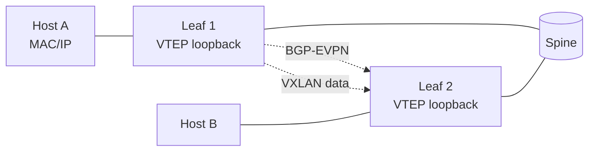

!!! warning "裏取りステータス: discrepancy-found / 大規模 HLD"
    HLD は 70KB。本ページは EVPN VXLAN の中核（control plane = BGP-EVPN、data plane = VXLAN、Type-2 host route と Type-5 IP prefix の役割境界）に絞る。multihoming は別 HLD（同 area）。

!!! note "Verifier 注記（2026-05-10）"
    実コード裏取り: `sonic-swss/orchagent/vxlanorch.cpp` に `VxlanOrch / VxlanTunnelOrch / VxlanTunnelMapOrch / EvpnNvoOrch` 系の実装存在を確認。yang は `sonic-buildimage/src/sonic-yang-models/yang-models/sonic-vxlan.yang` に `VXLAN_TUNNEL / VXLAN_TUNNEL_MAP / VXLAN_EVPN_NVO` を確認。CLI は `sonic-utilities/show/vxlan.py` に存在。**ただし** CONFIG_DB の NVO テーブル名は `VXLAN_EVPN_NVO`（実装・yang）であり、本ページが冒頭で `EVPN_NVO` と表記している部分は `VXLAN_EVPN_NVO` の略記である点に注意。実装で `CFG_VXLAN_EVPN_NVO_TABLE_NAME` (`sonic-swss/cfgmgr/vxlanmgr.cpp:189`) を確認。

# EVPN VXLAN（FRR BGP-EVPN / VTEP / VRF / Type-2/Type-5）

## 概要

EVPN は **MAC / IP の到達情報を BGP で広告** し、VXLAN は **L2 over L3 のデータプレーン** として trafic を運ぶ。SONiC は FRR の BGP-EVPN を control plane に、SAI VXLAN を data plane に使ってこの組合せを実現する[^1]。

代表的なタイプ:

- **Type-2 (MAC/IP advertisement)**: ホスト MAC（必要なら IP も）を VTEP で広告。Layer-2 VNI / Layer-3 VNI に対応
- **Type-3 (Inclusive Multicast)**: VTEP の所属 VNI を通知（BUM 用 ingress replication）
- **Type-5 (IP Prefix)**: VRF 内の IP prefix を VTEP 越しに広告

## 構成



主要 CONFIG_DB 要素[^1]:

- **`VXLAN_TUNNEL|<name>`**: source IP（自身の VTEP loopback）を持つトンネル
- **`VXLAN_TUNNEL_MAP|<tunnel>|<map>`**: VLAN ↔ VNI、VRF ↔ VNI のマッピング
- **`EVPN_NVO`**: NVO（Network Virtualization Overlay）対象 tunnel 指定
- **`VRF`**: L3 VNI を扱うときの VRF
- **`VLAN`**: L2 VNI と紐づく VLAN

### Type-2 / Type-5 の使い分け

| | Type-2 | Type-5 |
|---|--------|--------|
| 広告対象 | host MAC（任意で IP） | IP prefix（subnet） |
| 主用途 | L2 stretch、host-route 流通 | L3 ルーティング、外部接続 |
| L2/L3 VNI | 両方 | L3 VNI |

### Anycast / Symmetric IRB

Anycast Gateway を VTEP 全台で共有（共通 MAC/IP）し、Symmetric IRB（route-then-bridge）で leaf 間 VRF を貫く構成が標準的。具体的な仕組みは HLD の図を参照。

## 設定例

```bash
# VXLAN tunnel (VTEP loopback)
config vxlan add vtep 10.0.0.1
# L2 mapping
config vxlan map add vtep 1000 100      # VLAN 1000 ↔ VNI 100
# L3 mapping
config vxlan map_range add vtep Vrf-RED 5000 5000

# FRR 側 BGP-EVPN は frr.conf / templates 経由
```

## 関連 CLI

| Command | 用途 |
|---------|------|
| `show vxlan tunnel` | VXLAN tunnel 一覧 |
| `show vxlan vlanvnimap` | L2 マッピング |
| `show vxlan vrfvnimap` | L3 マッピング |
| `show evpn vni` | EVPN VNI 状態 |
| `show evpn mac vni <n>` | Type-2 で学習した MAC |

## 制限事項

- **下位 ASIC 機能依存**: VXLAN encap/decap、Tunnel Termination の SAI 機能サポート要
- **MTU**: VXLAN ヘッダ 50 byte 増。MTU 不足は黙ってドロップする傾向
- **EVPN multihoming**: 別 HLD（同 area の `evpn-vxlan-multihoming.md`）で扱う
- **BUM**: ingress replication 前提。multicast underlay は範囲外/オプション

## 干渉する機能

- **MC-LAG / multihoming**: ESI / DF election と組合せると挙動が複雑化
- **VRF / underlay BGP**: VTEP loopback 到達性は underlay BGP に依存
- **DSCP remarking for tunnel traffic**: encapsulated パケットの DSCP 維持・書換え
- **fpmsyncd / nexthop group**: EVPN Type-5 の next-hop group インストール

## トラブルシューティング

- 対向 VTEP に届かない → underlay reachability、`show vxlan tunnel` の oper status
- MAC が学習されない → BGP-EVPN session、`show evpn mac vni`、Type-2 受信
- Type-5 ルートが入らない → L3 VNI ↔ VRF マッピング、`show evpn vni detail`

## 実装との乖離

2026-05-10 時点の現行 master を裏取り。EVPN VXLAN 中核機能は実装されているが、本ページの HLD ベース記述と実装名称・配置に次の乖離がある。

### 1. CONFIG_DB テーブル名は `EVPN_NVO` ではなく `VXLAN_EVPN_NVO`

- **HLD 記述**: CONFIG_DB に `EVPN_NVO` テーブルを置く。
- **実装位置**:
  - `sonic-swss/cfgmgr/vxlanmgr.cpp:189` `m_appEvpnNvoTable(appDb, APP_VXLAN_EVPN_NVO_TABLE_NAME)`
  - `sonic-swss/cfgmgr/vxlanmgr.cpp:239` `else if (table_name == CFG_VXLAN_EVPN_NVO_TABLE_NAME)`
  - `sonic-buildimage/src/sonic-yang-models/yang-models/sonic-vxlan.yang:106` `container VXLAN_EVPN_NVO { ... list VXLAN_EVPN_NVO_LIST { ... } }`
- **差分の中身**: 実装上のフルネームは `VXLAN_EVPN_NVO`。`schema.h` の `CFG_VXLAN_EVPN_NVO_TABLE_NAME` / `APP_VXLAN_EVPN_NVO_TABLE_NAME` 定数で参照される。HLD の `EVPN_NVO` 表記は省略形であり、実 CONFIG_DB キーや yang コンテナ名としては誤り。
- **読者への影響**: `sonic-db-cli CONFIG_DB KEYS 'EVPN_NVO*'` は何も返さない。`VXLAN_EVPN_NVO|<nvo_name>` がキー実体。
- **回避策**:
  - CONFIG_DB アクセス: `sonic-db-cli CONFIG_DB KEYS 'VXLAN_EVPN_NVO*'` と `sonic-db-cli CONFIG_DB HGETALL 'VXLAN_EVPN_NVO|<name>'` を使う。
  - yang model 編集時は `sonic-vxlan.yang` の `container VXLAN_EVPN_NVO` を参照。

### 2. EVPN 中核 orch は `vxlanorch.cpp` 内クラス群

- **HLD 記述**: VxlanOrch / VxlanTunnelOrch / VxlanMapOrch / EvpnNvoOrch / EvpnRouteOrch 等を分散実装。
- **実装位置**:
  - `sonic-swss/orchagent/vxlanorch.h:541` `class EvpnNvoOrch : public Orch2`
  - `sonic-swss/orchagent/vxlanorch.cpp:1678,1733,1795` で `gDirectory.get<EvpnNvoOrch*>()` を多用
  - `sonic-swss/orchagent/routeorch.cpp:3048,3068` で EvpnNvoOrch 連携（Type-5 route のインストール経路）
  - `sonic-swss/orchagent/fdborch.cpp:847` で EvpnNvoOrch 経由の MAC 学習通知
- **差分の中身**: HLD で別 orch のように描かれる EvpnNvoOrch は `vxlanorch.h` / `.cpp` の中の 1 クラスで、tunnel / map と密結合している。route と FDB 側は `gDirectory` 経由で参照。
- **読者への影響**: HLD 図に従って「EvpnNvoOrch のソースファイル」を探すと迷う。
- **回避策**: EVPN コードは `sonic-swss/orchagent/vxlanorch.{h,cpp}` を起点に追う。Type-5 route の install は `routeorch.cpp` の EvpnNvoOrch 参照部分、Type-2 MAC は `fdborch.cpp` の参照部分を見る。

### 3. FRR 側 BGP-EVPN 連携は frr.conf テンプレート経由

- **HLD 記述**: FRR の BGP-EVPN は frr.conf / template 経由。
- **実装位置**: `sonic-buildimage/dockers/docker-fpm-frr/frr/bgpd/bgpd.main.conf.j2` および `sonic-frr/bgpd/bgp_evpn.c` などにある。Type-5 / Type-2 の SONiC 側受け取りは `fpmsyncd` 経由 netlink + 専用 FPM channel。
- **差分の中身**: 設定 CLI として SONiC 側で `show evpn vni` 等は提供されるが、BGP-EVPN の主要構成は frr.conf を直接編集するか template `j2` に手を入れる運用。CONFIG_DB の `BGP_NEIGHBOR` だけでは EVPN AF を有効化できないケースがある。
- **読者への影響**: SONiC CLI だけで EVPN 設定が完結すると誤解する。
- **回避策**: 実運用では `frr.conf` テンプレート差し替えか、`vtysh` で `address-family l2vpn evpn` を直接設定する。SONiC 側 CONFIG_DB は VXLAN tunnel / map のみで、EVPN AF の neighbor 設定は frr 側に置く。

### 結論

実装は概ね HLD の意図に沿うが、テーブル名（`VXLAN_EVPN_NVO`）と orch のファイル配置（`vxlanorch.h` に集約）が大きなポイント。本ページ前段の `EVPN_NVO` 表記は実装名 `VXLAN_EVPN_NVO` の略記として読むこと。

## 引用元

[^1]: `sonic-net/SONiC` `doc/vxlan/EVPN/EVPN_VXLAN_HLD.md` @ `49bab5b5ff0e924f1ea52b3d9db0dfa4191a7c06`

<!-- concerns hint:
- VxlanOrch / VxlanTunnelOrch / VxlanMapOrch の現行実装存在確認
- CONFIG_DB VXLAN_TUNNEL / VXLAN_TUNNEL_MAP / EVPN_NVO スキーマの現行 sonic-yang-models 取り込み確認
- FRR BGP-EVPN（bgpd / zebra）と SONiC 連携（fpmsyncd / EvpnRouteOrch）の現行実装確認
- show evpn / show vxlan CLI の sonic-utilities 取り込み確認
- Type-5 + VRF + L3 VNI の installation path（SAI VRF + tunnel decap）確認
- multihoming HLD との重複 / 境界整理確認
-->
