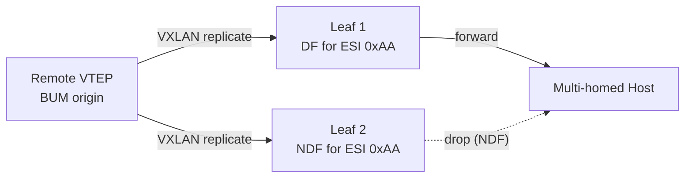
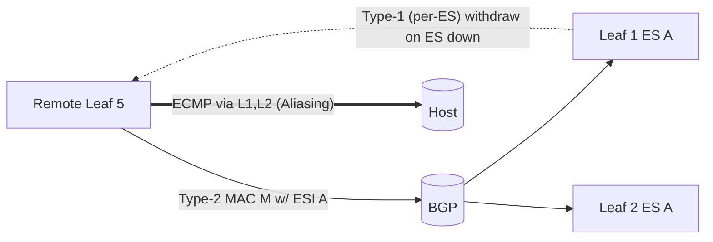

!!! warning "裏取りステータス: discrepancy-found"
    本ページは HLD の概念整理に特化。**SONiC コミュニティ master では EVPN-MH は未実装** であり、CLI 例も現状動かない。詳細は [概要ハブ](evpn-vxlan-multihoming.md) と [operations ページ](evpn-vxlan-multihoming-operations.md) を参照。

# EVPN VXLAN Multihoming 概念

本ページは [EVPN VXLAN Multihoming（概要ハブ）](evpn-vxlan-multihoming.md) の派生で、**RFC 7432 / RFC 8365 / RFC 8584 + preference-based DF draft が [SONiC](../reference/glossary.md#term-sonic) の [EVPN-MH](../reference/glossary.md#term-evpn-mh) 設計でどう写像されるか** を概念レベルで整理する[^1]。実装内部は [internals](evpn-vxlan-multihoming-internals.md)、CLI / 運用は [operations](evpn-vxlan-multihoming-operations.md) を参照。

## 1. なぜ EVPN-MH が必要か

dual-attached host を SONiC 上で all-active 冗長させる既存手段は **[MCLAG](../reference/glossary.md#term-mclag)（ICCPd ベース）** だが、以下の制約がある[^1]。

- 専用の peer-link / ICCPd セッション維持が必要
- 3 leaf 以上への multi-attach をスケールしづらい
- L3 underlay は [EVPN](../reference/glossary.md#term-evpn) [VXLAN](../reference/glossary.md#term-vxlan) なのに、L2 冗長だけ別プロトコル（ICCPd）になる

EVPN-MH は **[BGP](../reference/glossary.md#term-bgp)-EVPN だけで L2 冗長を解決** することで、上記をすべて EVPN underlay 上に統合する。MCLAG とは **相互排他**（同一 box 上で併用不可）。

## 2. Ethernet Segment と ESI

**Ethernet Segment (ES)**: 複数 [VTEP](../reference/glossary.md#term-vtep) が共有する論理 link（実体は同じ host を指す複数 VTEP の [LAG](../reference/glossary.md#term-lag)）。**ESI（Ethernet Segment Identifier、10 byte）** で一意化する[^1]。

SONiC 設計が対応する ESI Type は 2 つ:

| Type | 生成方法 | 設定例 |
|------|----------|--------|
| **Type-0** Operator configured | 運用者が 10 byte ESI を直接指定 | `config interface evpn-esi add PortChannel1 00:00:00:00:00:00:00:0a:00:01` |
| **Type-3** MAC-based | LAG system-mac (6B) + [PortChannel](../reference/glossary.md#term-portchannel) 番号 (3B) + Type 0x03 (1B) から自動生成 | `config interface evpn-esi add PortChannel1 auto-system-mac` |

**Single-Active / Single-Flow-Active / Port-Active は非対応**。本 [HLD](../reference/glossary.md#term-hld) は **All-Active のみ** をサポート目標とする[^1]。

参加 VTEP 全てで **同じ ESI 値**（Type-3 の場合は同じ system-mac + PortChannel 番号）を設定する必要がある。

## 3. EVPN ルート種別と役割

EVPN-MH に関係する BGP-EVPN ルート種別:

| Route Type | 名称 | 役割 |
|------------|------|------|
| **Type-1 (AD per-ES)** | Auto-Discovery per Ethernet Segment | ES の到達性を広告。mass-withdraw（ES 障害時の高速収束）と Aliasing に使用 |
| **Type-1 (AD per-EVI)** | Auto-Discovery per EVI | ES と特定 VNI/EVI の紐付け広告。`disable-ead-evi-{rx,tx}` で個別 disable 可 |
| **Type-2 (MAC/IP)** | MAC/IP Advertisement | 通常の MAC/[ARP](../reference/glossary.md#term-arp) 広告。MH 経由で学習した MAC は **ESI フィールドを非ゼロ** で運ぶ |
| **Type-4 (ES Route)** | Ethernet Segment Route | 同一 ES 上の peer VTEP を発見し、**DF election** の入力とする |

remote leaf は Type-1 で得た複数 VTEP next-hop を [ECMP](../reference/glossary.md#term-ecmp) として束ね、Type-2 の MAC を **L2 NHG（[Next Hop Group](../reference/glossary.md#term-next-hop-group)）** に紐付ける。これにより MAC が片方の leaf からしか広告されていなくても全 ES peer に load-balance される（= **Aliasing**）[^1]。

## 4. Designated Forwarder election

複数 leaf が同じ ES に attach している状態で remote から BUM が届くと、何もしないと multihomed host に重複して届く。これを防ぐため、ES ごとに **DF（Designated Forwarder）** を 1 つだけ選び、DF だけが BUM を local ES に転送する。

SONiC が採用するアルゴリズムは **preference-based DF election**（RFC 8584 Algo 2 + `draft-ietf-bess-evpn-pref-df`）[^1]:

- 各 VTEP は ES ごとに `df_pref`（1–65535、default 32767）を BGP-EVPN ES extended community で広告
- **最大 preference の VTEP が DF**、同値なら **lowest Originator-IP**
- DF election timer は **3 秒固定**（RFC 7432 準拠、設定不可）
- アルゴリズム不一致のフォールバック（modulo ベース）は **非対応**。peer 側も Algo 2 サポート必須

DF/NDF の状態は `EVPN_DF_TABLE` 経由で [SAI](../reference/glossary.md#term-sai) bridge port 属性 `SAI_BRIDGE_PORT_ATTR_TUNNEL_TERM_BUM_TX_DROP` に反映される。

## 5. Local-bias と Split-horizon

BUM が **local 接続の MH host から発生** した場合の挙動は **Local-bias**（RFC 8365）に従う[^1]:

1. ingress VTEP は local 全 access（MH / SH 両方）に flood し、かつ remote VTEP にも replicate
2. remote VTEP は origin VTEP IP を見て、**同じ ES に attach している local port には流さない**

この「origin VTEP に基づく出口フィルタ」が **Split-horizon filtering**。SAI の **Isolation group** オブジェクトを再利用して実装する（MCLAG と同じ仕組み）。Tunnel bridge port が複数 isolation group を持てるように拡張される。

**重要**: Local-bias / Split-horizon は **DF/NDF より優先**。つまり NDF であっても自身が origin であれば自身の ES には forward する[^1]。

## 6. Aliasing と Fast Convergence

- **Aliasing**: Type-2 の MAC が片方の VTEP からしか広告されていなくても、Type-1（AD per-ES）で得た同 ES の全 VTEP に load-balance する
- **Fast Convergence**: ES link 障害時に Type-1 を **mass-withdraw** することで、個々の MAC 撤回を待たずに L2 NHG を即更新できる。RFC 7432 の高速収束機構[^1]

## 7. Proxy advertisement of Type-2 routes

`draft-rbickhart-evpn-ip-mac-proxy-adv` に基づく拡張[^1]。

- local 学習した VTEP は Type-2 を **Proxy=0** で広告
- 同 ES の peer VTEP は受信した Type-2 を **Proxy=1** として再広告
- origin VTEP が落ちて Type-2 を撤回しても、proxy 広告のおかげで MAC が即座に flush されず、`mac_holdtime`（default 1080 秒）の間は保持される
- hold time 内に再学習されれば proxy フラグが落ち、なければ flush

これにより、leaf reboot / spine 切断などの一時障害で MAC flap が発生しない。ARP/ND についても同様の機構が `neigh_holdtime`（default 1080 秒）で動く。

## 8. Static Anycast Gateway (SAG)

EVPN-MH では、MCLAG のような SVI MAC sync は **行わない**。代わりに **SAG（Static Anycast Gateway）が all-active L3 gateway の唯一の手段** となる[^1]。全 VTEP に同一の SVI IP / MAC を静的に設定し、host から見た gateway を anycast 化する。

[VRRP](../reference/glossary.md#term-vrrp) over EVPN-MH は **非対応**（SAG を使え、と HLD が明示）。

## 9. ARP/ND suppression

MH 環境でも ARP/ND suppression は機能する。ただし以下の特殊ルールがある[^1]:

- remote VTEP の ARP/ND は通常通り local 代理応答
- **同 ES の peer VTEP が学習した ARP/ND** が sync で local install された場合、local access port からの ARP/ND 要求には **応答しない**（host 自身に answer させる）

これは MH peer 間で sync された ARP/ND が「remote 由来」ではなく「local 由来扱い」になるためで、誤って leaf が host を肩代わりしないようにするための制約。

## 10. MCLAG との相互排他

設計上 **MCLAG と EVPN-MH は同一 box で併用不可**[^1]:

- EVPN-MH 設定（`EVPN_MH_GLOBAL` または ESI 付き interface）が存在する状態で `config mclag add ...` は reject される
- 逆に MCLAG ドメインが存在する状態で `config evpn-mh ...` は reject される
- 既存 deploy から EVPN-MH へ移行する場合は MCLAG を全撤去してから ESI を投入する手順になる

これは、Split-horizon filtering / DF election の挙動が両者で重複し、SAI Isolation group の管理主体が決まらないため。

## 11. 制限事項のまとめ

- All-Active のみ（Single-Active / Port-Active / Single-Flow-Active は scope 外）
- DF election は **preference-based のみ**（modulo / HRW フォールバック非対応）
- Asymmetric IRB は非対応（Symmetric IRB のみ）
- MH interface は **switchport 限定**（router-port / routed sub-interface 不可）
- VRRP over EVPN-MH 非対応（SAG 必須）
- DF election timer 3 秒固定

## 12. 引用元

[^1]: `sonic-net/SONiC` `doc/vxlan/EVPN/EVPN_VxLAN_Multihoming.md` @ `49bab5b5ff0e924f1ea52b3d9db0dfa4191a7c06`

## 実装との乖離

`monitor: not_implemented` — 未実装 — HLD 提案がコードベース master に取り込まれていない、または主要パスが欠落している。 本ページは split-child のため、差分の主要根拠 / 影響 / 回避策は親ページ [EVPN VXLAN Multihoming 概念 親ページ](evpn-vxlan-multihoming.md) の同セクション（`## 実装との乖離` または `!!! diff` ブロック）を参照のこと。

<!-- next-action -->
## このページを読んだ後の次アクション

!!! tip "読み手向け"
    - **DB スキーマ / Orch / SAI / シーケンス**: [evpn-vxlan-multihoming-internals.md](evpn-vxlan-multihoming-internals.md)
    - **CLI / show コマンド / トラブルシュート / 差分**: [evpn-vxlan-multihoming-operations.md](evpn-vxlan-multihoming-operations.md)
    - **代替（MC-LAG）**: [mclag-enhancements](../switching/mclag-enhancements.md)
    - **基本 EVPN VXLAN**: [evpn-vxlan-hld](evpn-vxlan-hld.md)

!!! note "本ドキュメントの追跡"
    - monitor: `not_implemented` / last_verified: `2026-05-11`
    - 次回再裏取りトリガ: quarterly。一覧は [discrepancy-index](../reference/verification/discrepancy-index.md) を参照
<!-- /next-action -->

<!-- glossary-links-injected: bf2a928e089a -->
