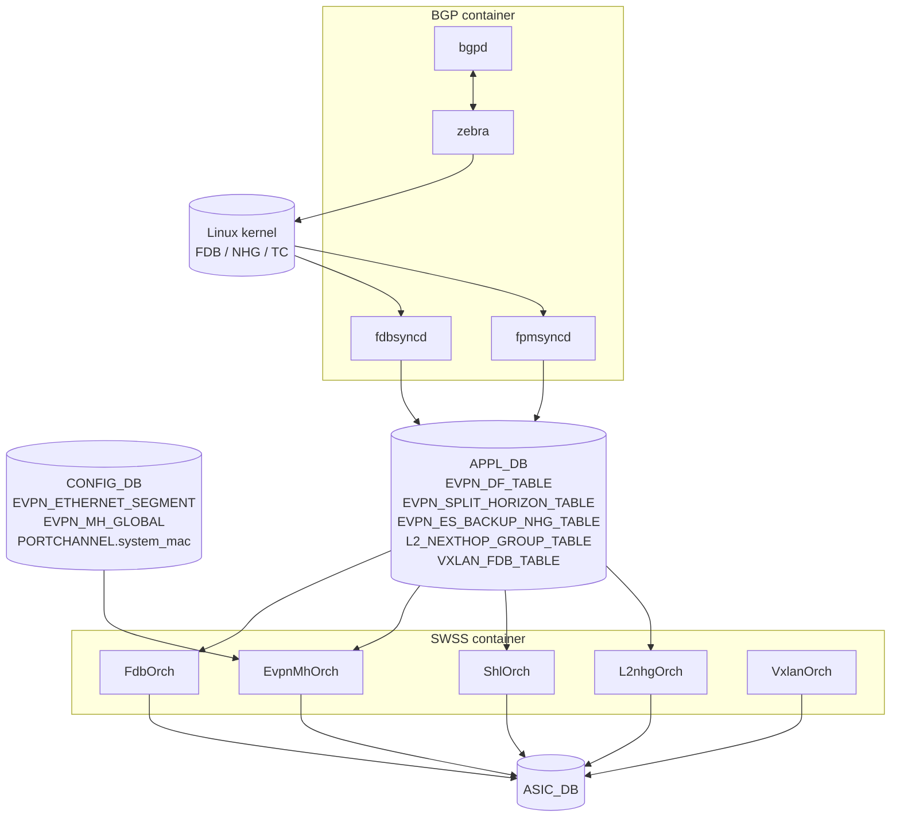
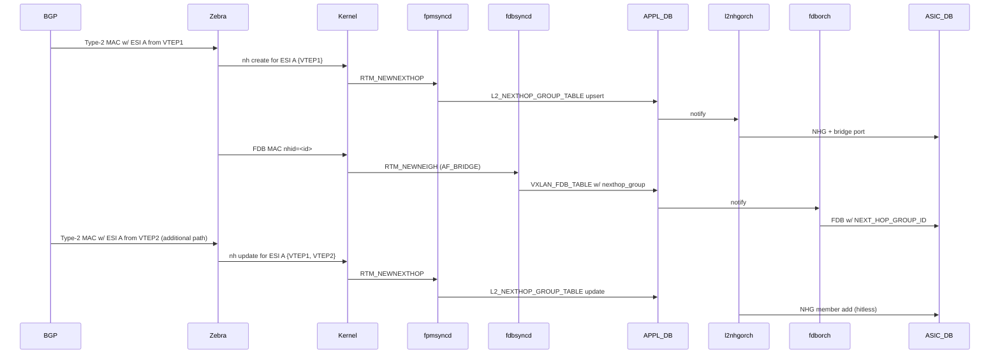

!!! warning "裏取りステータス: discrepancy-found"
    本ページに登場する **`EvpnMhOrch` / `L2nhgOrch` / `ShlOrch` / `EVPN_ETHERNET_SEGMENT` / `L2_NEXTHOP_GROUP_TABLE` / `EVPN_DF_TABLE` / `EVPN_SPLIT_HORIZON_TABLE` / `SAI_BRIDGE_PORT_TYPE_BRIDGE_PORT_NEXT_HOP_GROUP` などはいずれも HLD 提案レベルで、現行 SONiC master には未取り込み**。本ページは「もし HLD 通りに実装されたらこうなる」を再構成したもの。

# EVPN VXLAN Multihoming 実装内部

本ページは [EVPN VXLAN Multihoming（概要ハブ）](evpn-vxlan-multihoming.md) の派生で、[HLD](../reference/glossary.md#term-hld) §3 を中心に **DB スキーマ・Orch・[SAI](../reference/glossary.md#term-sai)・netlink シーケンス** を整理する[^1]。概念は [concepts](evpn-vxlan-multihoming-concepts.md)、CLI / 運用は [operations](evpn-vxlan-multihoming-operations.md) を参照。

## 1. 全体アーキテクチャ



新規 / 変更コンポーネント:

- **EvpnMhOrch**（新規）: `EVPN_MH_GLOBAL` / `EVPN_ETHERNET_SEGMENT` / `EVPN_DF_TABLE` を購読。SAI switch / bridge port 属性を設定
- **L2nhgOrch**（新規）: `L2_NEXTHOP_GROUP_TABLE` を購読。SAI L2 NHG（bridge port タイプ）と member を作成
- **ShlOrch**（新規）: `EVPN_SPLIT_HORIZON_TABLE` を購読。SAI Isolation group member を tunnel bridge port に紐付け
- **Zebra**（拡張）: `DPLANE_OP_BR_PORT_UPDATE` を経由して DF / split-horizon / backup NHG を [fpmsyncd](../reference/glossary.md#term-fpmsyncd) に渡す
- **Fpmsyncd**（拡張）: `BR_PORT_UPDATE` netlink を APP_DB の 3 テーブル（DF / SHL / Backup NHG）に書く
- **Fdbsyncd**（拡張）: kernel の L2 NHG netlink (`RTM_NEWNEXTHOP` fdb scope) と [FDB](../reference/glossary.md#term-fdb) の `nhid` / `ifname` フィールドを APP_DB に反映
- **FdbOrch**（拡張）: VXLAN_FDB_TABLE 新フィールド (`ifname` / `nexthop_group` / `type=dynamic_control_learn`) を処理、local ES link down で backup NHG へ切替
- **VxlanOrch**（軽微）: L2 NHG ごとに dst IP の refcnt 管理

## 2. CONFIG_DB スキーマ

### 2.1 EVPN_ETHERNET_SEGMENT（新規）

```
key = EVPN_ETHERNET_SEGMENT|<ifname>
;-- fields ----
esi     = "AUTO" | <10 byte colon-separated ESI>
            ; Type-3 なら "AUTO" 固定。Type-0 なら 10 byte ESI
type    = "TYPE_0_OPERATOR_CONFIGURED" | "TYPE_3_MAC_BASED"
ifname  = <interface name>     ; key と同じ値
df_pref = 1..65535             ; default 32767
```

openconfig-evpn yang からの写像で、`esi_type` / `esi` のセマンティクスを揃えている[^1]。

### 2.2 EVPN_MH_GLOBAL（新規）

```
key = EVPN_MH_GLOBAL|default
;-- fields ----
startup_delay  = 0..3600   ; sec, default 300, 0=disabled
mac_holdtime   = 0..86400  ; sec, default 1080
neigh_holdtime = 0..86400  ; sec, default 1080
```

`startup_delay` は [SONiC](../reference/glossary.md#term-sonic) 起動直後に MH ES を一時的に hold する時間（peer 検出前に DF を決めないため）。`mac_holdtime` / `neigh_holdtime` は Proxy advertisement の保持時間（[concepts](evpn-vxlan-multihoming-concepts.md) の Proxy advertisement 節）。

### 2.3 PORTCHANNEL 拡張

既存 PORTCHANNEL テーブルに `system_mac`（6 byte MAC）フィールドを追加。Type-3 ESI 自動生成の入力。TeamMgr が LAG_TABLE / kernel / [STATE_DB](../reference/glossary.md#term-state_db) に伝播。

## 3. APP_DB スキーマ

### 3.1 EVPN_SPLIT_HORIZON_TABLE

```
key = EVPN_SPLIT_HORIZON_TABLE:Vlan<vid>:<ifname>
vteps = <comma-separated VTEP IPs>
```

Producer: fpmsyncd / Consumer: ShlOrch。指定 MH access interface 向けに **filter すべき source [VTEP](../reference/glossary.md#term-vtep) のリスト**。

### 3.2 EVPN_DF_TABLE

```
key = EVPN_DF_TABLE:Vlan<vid>:<ifname>
df = True
```

**local が DF のときだけ** entry が存在する。entry が無ければ NDF として扱われ、SAI bridge port `SAI_BRIDGE_PORT_ATTR_TUNNEL_TERM_BUM_TX_DROP=true` が立つ。

### 3.3 EVPN_ES_BACKUP_NHG_TABLE

```
key = EVPN_ES_BACKUP_NHG_TABLE:<ifname>
nexthop_group = <l2-nhg-id>
```

local ES link down 時に MAC を退避させる L2 NHG（remote ES peer VTEP 群）。SAI `SAI_BRIDGE_PORT_ATTR_BRIDGE_PORT_PROTECTION_NEXT_HOP_GROUP_ID` に紐付ける。

### 3.4 L2_NEXTHOP_GROUP_TABLE（新規）

```
key = L2_NEXTHOP_GROUP_TABLE:<nhid>
remote_vtep   = <IPv4 / IPv6>           ; single-path entry
nexthop_group = <comma-sep child nhid>  ; multi-path (group of single-path)
```

kernel の `ip nexthop` テーブルと 1:1 対応。group は member の nhid を `,` 区切りで持つ recursive 形式。

### 3.5 VXLAN_FDB_TABLE 拡張

既存 VXLAN_FDB_TABLE に以下のフィールドが追加:

```
nexthop_group = <l2-nhg-id>          ; remote_vtep の代わり（MH の MAC）
ifname        = <local ifname>       ; local ESI と一致する MAC を peer から学習した場合
type          = "dynamic" | "static" | "dynamic_control_learn"
                                       ; controlPlane と dataPlane の両方で学んだ場合に新 type
```

## 4. SAI オブジェクト

### 4.1 L2 ECMP bridge port

remote MH MAC を [ECMP](../reference/glossary.md#term-ecmp) するため、**bridge port が next-hop group を指す** 新タイプが導入される[^1]:

```c
SAI_BRIDGE_PORT_TYPE_BRIDGE_PORT_NEXT_HOP_GROUP
SAI_BRIDGE_PORT_ATTR_BRIDGE_PORT_NEXT_HOP_GROUP_ID
SAI_NEXT_HOP_GROUP_TYPE_BRIDGE_PORT
SAI_NEXT_HOP_TYPE_BRIDGE_PORT          /* member */
SAI_NEXT_HOP_ATTR_TUNNEL_ID            /* member は tunnel に紐付く */
```

Bridge port next-hop group は **MAC を書き換えない** 点が L3 NHG と異なる（L2 switching 用）。

### 4.2 BUM / NDF フィルタ属性

```c
SAI_BRIDGE_PORT_ATTR_TUNNEL_TERM_BUM_TX_DROP  /* NDF: tunnel terminate 後の BUM を drop */
SAI_BRIDGE_PORT_ATTR_RX_DROP                  /* Single-active 全 RX drop (本 HLD scope 外) */
SAI_BRIDGE_PORT_ATTR_TX_DROP                  /* Single-active 全 TX drop (本 HLD scope 外) */
```

NDF の bridge port には `TUNNEL_TERM_BUM_TX_DROP=true` を設定する。**これによる drop は `SAI_PORT_STAT_IF_OUT_DISCARDS` にカウントしない** ことを SAI 実装に要求。

### 4.3 Protection nexthop group

```c
SAI_BRIDGE_PORT_ATTR_BRIDGE_PORT_PROTECTION_NEXT_HOP_GROUP_ID
SAI_BRIDGE_PORT_ATTR_BRIDGE_PORT_SET_SWITCHOVER
```

local [LAG](../reference/glossary.md#term-lag) port 障害時、`SET_SWITCHOVER` を立てるだけで SAI が hardware で **MAC の forward 先を local LAG → remote VTEP NHG に切替** する。FDB 再書き込み不要で transient drop を最小化（[SAI PR 2084](https://github.com/opencomputeproject/SAI/pull/2084)）[^1]。

### 4.4 Isolation group（既存 SAI を流用）

[MCLAG](../reference/glossary.md#term-mclag) で使われている Isolation group をそのまま使う。[EVPN-MH](../reference/glossary.md#term-evpn-mh) 拡張点:

- **Tunnel bridge port にも isolation group を attach** できる（MCLAG では port のみだった）
- **複数 tunnel bridge port がそれぞれ isolation group を持つ**（MH peer ごとに 1 group）
- member には MH access interface bridge port を入れる → origin VTEP 経由で来た BUM は member に出ない

## 5. シーケンス: Remote MH MAC 学習



NHG の更新は **hitless** を要求。single-path から multi-path への遷移も hitless でなければならない。

## 6. シーケンス: MAC aging（origin VTEP）

ProxyAd 含むフルシーケンス[^1]:

1. **Vtep-1 で local 学習**: HW MAC + STATE_FDB_TABLE (dynamic) + kernel NUD_REACHABLE。[FRR](../reference/glossary.md#term-frr) が Type-2 Proxy=0 で広告
2. **Vtep-4 が受信**: kernel NUD_NOARP + VXLAN_FDB_TABLE type=controlPlane, ifname=PortChannel1。Fdborch が `SAI_FDB_ENTRY_TYPE_STATIC + ALLOW_MAC_MOVE=true` で program。FRR が Type-2 Proxy=1 で再広告
3. **Vtep-1 が Proxy 受信**: kernel NUD_NOARP + NFEA_ACTIVITY_NOTIFY。FDB cache を Local+Remote に
4. **Vtep-1 で aging**: STATE_FDB_TABLE = controlPlane（Local flag 落とし）→ SAI を static + ALLOW_MAC_MOVE に。Fdbsyncd が kernel から FDB を消す（または activity bit reset）→ FRR が Type-2 withdraw
5. **Vtep-4 が withdraw 受信**: kernel IN_TIMER + hold-timer 開始 → [fdbsyncd](../reference/glossary.md#term-fdbsyncd) が VXLAN_FDB_TABLE を ageing=enabled, type=none に → Fdborch が SAI dynamic に戻す
6. **トラフィック有り** なら learn event で local MAC として再 install。**無し** ならホールド満了で消滅

## 7. Linux kernel 要件

- **kernel v6.1**: L2 NHG（`ip nexthop` group with fdb scope）。SONiC が現在使うバージョン
- **kernel v6.3–6.6**: split-horizon / non-DF フィルタ（TC ルール + bridge enhancement）。**SONiC への backport が必要**
- **kernel v6.6**: bridge port backup nexthop（ES link down 時の slow-path 退避）
- **iproute2 patch**: 上記対応版

slow-path（CPU 受信パケット）の split-horizon / DF フィルタが上記 kernel patch に依存する点が、SONiC 採用時のリスク要因。

## 8. SAI オブジェクト構成例（remote leaf）

remote VTEP5 が host H2（ESI-1, via Vtep-1/Vtep-4）への MAC を持つ場合[^1]:

```
tnl_oid_1 .. tnl_oid_4         : tunnels to VTEP1..VTEP4
nh_bridgeport_oid_1 .. _4      : bridge port (TUNNEL) for each
nh_grp_bridgeport_oid_1        : L2 NHG for ESI-1, members = {_1, _4}
bridgeport_oid_h2              : bridge port (NEXT_HOP_GROUP) -> nh_grp_bridgeport_oid_1
mac_h2 (FDB)                   : -> bridgeport_oid_h2
```

local leaf VTEP1（同 ESI のメンバ）では:

```
nh_bridgeport_oid6             : bridge port (LOCAL) PortChannel1
nh_grp_bridgeport_oid_1        : backup L2 NHG = {nh_bridgeport_oid_4}  (= remote peer VTEP4)
nh_grp_protection_oid_1        : protection group = {primary nh_bridgeport_oid6, backup nh_grp_bridgeport_oid_1}
bridgeport_oid_h6              : bridge port (LOCAL) -> nh_grp_protection_oid_1
mac_h2                         : -> bridgeport_oid_h6
```

これにより PortChannel1 down で `SET_SWITCHOVER=true` を立てるだけで MAC が remote VTEP4 経由に切り替わる。

## 9. Warm Boot

現状 **WB は scope 外**[^1]。理由:

- FRR が [EVPN](../reference/glossary.md#term-evpn) address-family の [BGP](../reference/glossary.md#term-bgp) [Graceful Restart](../reference/glossary.md#term-graceful-restart) を未サポート
- L3 NHID の WB 再構成機構自体が未整備

将来対応時は ESI ↔ L2 NHID マッピングを [APPL_DB](../reference/glossary.md#term-appl_db) に保存して [zebra](../reference/glossary.md#term-zebra) へ戻す reconcile 機構が必要。

## 10. 引用元

[^1]: `sonic-net/SONiC` `doc/vxlan/EVPN/EVPN_VxLAN_Multihoming.md` @ `49bab5b5ff0e924f1ea52b3d9db0dfa4191a7c06`

<!-- next-action -->
## このページを読んだ後の次アクション

!!! tip "読み手向け"
    - **概念に戻る**: [evpn-vxlan-multihoming-concepts.md](evpn-vxlan-multihoming-concepts.md)
    - **CLI / show / トラブルシュート / 差分**: [evpn-vxlan-multihoming-operations.md](evpn-vxlan-multihoming-operations.md)
    - **基本 EVPN VXLAN orch**: [evpn-vxlan-hld](evpn-vxlan-hld.md)
    - **MCLAG の isolation group 実装（比較）**: [mclag-enhancements-internals](../switching/mclag-enhancements-internals.md)

!!! note "本ドキュメントの追跡"
    - monitor: `not_implemented` / last_verified: `2026-05-11`
    - 次回再裏取りトリガ: quarterly + sonic-swss #4262 merge。一覧は [discrepancy-index](../reference/verification/discrepancy-index.md) を参照
<!-- /next-action -->

<!-- glossary-links-injected: ccf2e34b6fa6 -->
