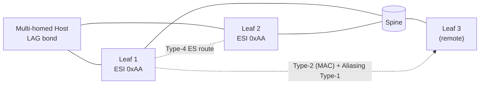

<!-- topics-tip -->
!!! tip "Topics で読み物として読む"
    本機能の概念は [Topics 03 章: VXLAN / EVPN とオーバーレイ](../topics/03-vxlan-evpn/index.md) を参照。
<!-- /topics-tip -->

!!! warning "裏取りステータス: discrepancy-found / 大規模 HLD 分割"
    HLD は 80KB（1650 行）。本ページは **概要ハブ** とし、詳細は 3 派生ページへ分割した。**EVPN MH は HLD 提案段階で、現行 master では機能利用不可**（詳細は本ページ末尾の差分節）。

# EVPN VXLAN Multihoming（概要ハブ）

## 1. 本ページの位置づけ

[EVPN](../reference/glossary.md#term-evpn) Multihoming（[EVPN-MH](../reference/glossary.md#term-evpn-mh)）は、**MC-[LAG](../reference/glossary.md#term-lag) / vPC を使わず、[BGP](../reference/glossary.md#term-bgp)-EVPN だけで host を複数 leaf にマルチホーム接続する** RFC 7432 / RFC 8365 / RFC 8584 + `draft-ietf-bess-evpn-pref-df` の仕組み[^1]。[SONiC](../reference/glossary.md#term-sonic) は [FRR](../reference/glossary.md#term-frr) の EVPN-MH（Type-1 EAD / Type-4 ES route / preference-based DF）と [SAI](../reference/glossary.md#term-sai) レイヤ（L2 [ECMP](../reference/glossary.md#term-ecmp) bridge port / isolation group / protection nexthop）を組合せる設計になっている。

[HLD](../reference/glossary.md#term-hld) はボリュームが大きいため、目的別に 3 派生ページへ分割した。

| ページ | 目的 | 主な内容 |
|--------|------|----------|
| [evpn-vxlan-multihoming-concepts.md](evpn-vxlan-multihoming-concepts.md) | **概念** | ESI（Type-0/Type-3）、Type-1 EAD、Type-4 ES route、DF election、Aliasing、Split-horizon、Local-bias、Proxy advertisement、SAG、MC-LAG との相互排他 |
| [evpn-vxlan-multihoming-internals.md](evpn-vxlan-multihoming-internals.md) | **実装** | [CONFIG_DB](../reference/glossary.md#term-config_db) / APP_DB スキーマ、EvpnMhOrch / L2nhgOrch / ShlOrch、Fpmsyncd / Fdbsyncd 拡張、SAI L2 NHG bridge port / protection NHG、MAC handling シーケンス |
| [evpn-vxlan-multihoming-operations.md](evpn-vxlan-multihoming-operations.md) | **運用** | `config interface evpn-esi` / `config evpn-mh` CLI、`show vxlan ethernet-segment` / `show evpn es*` / `show bgp l2vpn evpn es*`、REST API、デバッグ手順、トラブルシュート |

## 2. 全体像（俯瞰）

主要な構成要素[^1]:

- **Ethernet Segment (ES)**: 複数 leaf が共有する論理 link。**ESI**（10 byte）で一意化。Type-0（運用者設定）/ Type-3（system-mac + [PortChannel](../reference/glossary.md#term-portchannel) 番号から自動生成）
- **Type-1 (Auto-Discovery)**: ES の到達性と aliasing 用 next-hop を広告（per-ES / per-EVI）
- **Type-4 (ES Route)**: 同一 ES のメンバ leaf を相互発見し、**DF election** を行う
- **Split-horizon (Local-bias)**: ingress leaf が自身の ES に向けた BUM を origin [VTEP](../reference/glossary.md#term-vtep) の Isolation group で抑止
- **DF election**: ES メンバ間で BUM forwarder を 1 つに選出（preference-based / Algo 2 を採用）

## 3. ステータス（discrepancy 概要）

2026-05 時点の現行 master を grep した範囲では、**`EVPN_ETHERNET_SEGMENT` テーブル / `EvpnMhOrch` / `L2nhgOrch` / `ShlOrch` / `config interface evpn-esi` CLI / `sonic-evpn-mh.yang` のいずれも見つからない**。HLD は提案段階で、関連 PR は以下が open のまま。

- [sonic-swss #4262](https://github.com/sonic-net/sonic-swss/pull/4262): EVPN [VXLAN](../reference/glossary.md#term-vxlan) Multihoming feature support（本体）
- [sonic-swss #4206](https://github.com/sonic-net/sonic-swss/pull/4206): EVPN MH protocol field
- [sonic-swss #4039](https://github.com/sonic-net/sonic-swss/pull/4039): Fdbsyncd changes for EVPN MH

dual-attached host を現行 master で扱う場合は **MC-LAG**（[MC-LAG enhancements](../switching/mclag-enhancements.md)）を選択する。詳細な差分・回避策は派生 [operations ページの差分節](evpn-vxlan-multihoming-operations.md) を参照。

## 実装との乖離

`monitor: not_implemented` — 2026-05 時点の現行 master では EVPN-MH 機能全体が未実装。`EVPN_ETHERNET_SEGMENT` テーブル・`EvpnMhOrch`・`L2nhgOrch`・`ShlOrch`・`config interface evpn-esi` CLI・`sonic-evpn-mh.yang` のいずれも確認できない。HLD は提案段階であり、関連 PR（[sonic-swss](../reference/glossary.md#term-sonic-swss) #4262 / #4206 / #4039）は open のまま。dual-attached host が必要な場合は **MC-LAG**（`mclag-enhancements.md`）を選択すること。

## 4. 引用元

[^1]: `sonic-net/SONiC` `doc/vxlan/EVPN/EVPN_VxLAN_Multihoming.md` @ `49bab5b5ff0e924f1ea52b3d9db0dfa4191a7c06`

<!-- next-action -->
## このページを読んだ後の次アクション

!!! tip "読み手向け"
    - **概念から知りたい**: [evpn-vxlan-multihoming-concepts.md](evpn-vxlan-multihoming-concepts.md)
    - **実装内部を追いたい**: [evpn-vxlan-multihoming-internals.md](evpn-vxlan-multihoming-internals.md)
    - **CLI / 運用 / 差分**: [evpn-vxlan-multihoming-operations.md](evpn-vxlan-multihoming-operations.md)
    - **dual-attach の代替**: [MC-LAG enhancements](../switching/mclag-enhancements.md)
    - **基本の EVPN VXLAN**: [evpn-vxlan-hld.md](evpn-vxlan-hld.md)

!!! note "本ドキュメントの追跡"
    - monitor: `not_implemented` / last_verified: `2026-05-11`
    - 次回再裏取りトリガ: quarterly + 上記 sonic-swss PR の merge イベント。一覧は [discrepancy-index](../reference/verification/discrepancy-index.md) を参照
<!-- /next-action -->

<!-- glossary-links-injected: 1fe559aeba2e -->
