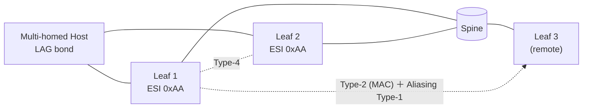

<!-- topics-tip -->
!!! tip "Topics で読み物として読む"
    この HLD は実装詳細を含みます。機能の概念・設定・運用を読み物として読みたい場合は [Topics 03 章: VXLAN / EVPN とオーバーレイ](../topics/03-vxlan-evpn/index.md) を参照。
<!-- /topics-tip -->

!!! warning "裏取りステータス: discrepancy-found / 大規模 HLD"
    HLD は 80KB。本ページは EVPN MH の中核（ESI / Type-1 / Type-4 / DF election / split-horizon）に絞る。基本の EVPN VXLAN は同 area の `evpn-vxlan-hld.md` を参照。

!!! note "Verifier 注記（2026-05-10）"
    実コード裏取り: 現行 master の `sonic-swss/orchagent/`、`sonic-buildimage/src/sonic-yang-models/yang-models/`、`sonic-utilities/` を grep した範囲では **`EVPN_ETHERNET_SEGMENT` テーブル / `EthernetSegment` orch / `config evpn ethernet-segment` CLI / EVPN-MH 用 yang は確認できない**。HLD は提案レベルで、sonic-net のメインリポジトリには未取り込みの可能性が高い。利用可否は upstream FRR の EVPN-MH と vendor SAI の ESI label / split-horizon サポートに依存する。

# EVPN VXLAN Multihoming（ESI / DF election / split-horizon）

## 概要

[EVPN](../reference/glossary.md#term-evpn) multihoming（MH）は **MC-[LAG](../reference/glossary.md#term-lag) / vPC を使わず、[BGP](../reference/glossary.md#term-bgp)-EVPN だけで host を複数 leaf にマルチホーム接続する** RFC 7432 / RFC 8365 の仕組み[^1]。[SONiC](../reference/glossary.md#term-sonic) は [FRR](../reference/glossary.md#term-frr) の [EVPN-MH](../reference/glossary.md#term-evpn-mh) と [SAI](../reference/glossary.md#term-sai) レイヤを組合せる。

主要な構成:

- **Ethernet Segment (ES)**: 複数 leaf が共有する論理 link を表す。**ESI（Ethernet Segment Identifier）** で一意化
- **Type-1 (Auto-Discovery / per-ES, per-EVI)**: ES の到達性と aliasing 用 next-hop を広告
- **Type-4 (ES Route)**: 同一 ES のメンバ leaf を相互に発見し、**Designated Forwarder（DF）election** を行う
- **Split-horizon**: ES に向かうトラフィックがその ES の他メンバに重複ループしないよう、ESI label を付けてフィルタする

## 動作仕様



主要動作[^1]:

- **DF election**: ES メンバ間で BUM の **forwarder を 1 つに選ぶ**（[VLAN](../reference/glossary.md#term-vlan) 単位）。Type-4 で見つかったメンバ群を IP / DF algo で並べる
- **Aliasing (Type-1)**: remote leaf は ES 全メンバを [ECMP](../reference/glossary.md#term-ecmp) next-hop として使い、トラフィックを load-balance
- **Split-horizon (ESI label)**: ingress leaf が ESI label を付与、egress leaf は同 ESI 受信なら local ES に出さない
- **Single-Active vs All-Active**: ES が All-Active か Single-Active かを ESI / config で区別

## 設定

### 関連 CONFIG_DB

| Table | 説明 |
|-------|------|
| `EVPN_ETHERNET_SEGMENT` | ESI、関連する LAG / interface、type (single-active / all-active)、DF preference |
| `PORTCHANNEL` | ES に紐づく LAG |
| `VXLAN_TUNNEL` | [VTEP](../reference/glossary.md#term-vtep) loopback（前提） |

### 関連 CLI

| Command | 用途 |
|---------|------|
| `config evpn ethernet-segment add <name> esi <id>` | ES 定義 |
| `config evpn ethernet-segment <name> interface <portchannel>` | LAG 紐付け |
| `show evpn ethernet-segment` | DF / メンバ一覧 |
| `show evpn vni <vni> mh` | MH 視点 |

## 制限事項

- **対応 [ASIC](../reference/glossary.md#term-asic) のみ**: ESI label / split-horizon を SAI で扱える [NPU](../reference/glossary.md#term-npu) が必要
- **DF election timer**: 起動直後の不安定期に BUM が断する可能性。`hold timer` で対処
- **VLAN ↔ ES の整合**: ES に紐づく VLAN は両 leaf で同一定義であること
- **MAC mobility**: host が ES 内で移動した時の MAC mobility extended community 処理に依存

## 干渉する機能

- **EVPN [VXLAN](../reference/glossary.md#term-vxlan) [HLD](../reference/glossary.md#term-hld)**: 上位の Type-2 / Type-5 流通の前提
- **MC-LAG**: 同じ目的を別アプローチで解く。両者の違いを理解した上で選択
- **port-channel / [LACP](../reference/glossary.md#term-lacp)**: ES の物理リンク基盤
- **[fpmsyncd](../reference/glossary.md#term-fpmsyncd) / nexthop group**: aliasing による ECMP next-hop インストール

## トラブルシューティング

- BUM ループ → ESI label / split-horizon フィルタが ASIC で効いているか
- DF が両側で active → Type-4 受信の確認、`show evpn ethernet-segment` の DF 状態
- aliasing で trafic が偏る → ECMP hash 設定、remote leaf の Type-1 受信状況

<!-- diff-admonition -->
!!! diff "HLD と実装の差分"
    2026-05-10 時点の現行 master を裏取り。**EVPN Multihoming 機能は SONiC メインリポジトリには取り込まれていない**。

    ### 1. `EVPN_ETHERNET_SEGMENT` テーブル / orch が未実装

    - **HLD 記述**: [CONFIG_DB](../reference/glossary.md#term-config_db) に `EVPN_ETHERNET_SEGMENT` テーブルを置き、ESI / 紐づく LAG / single-active か all-active か / DF preference を管理。orch（仮称 `EthernetSegmentOrch`）が SAI へ反映。
    - **実装位置**: `sonic-swss/`、`sonic-buildimage/src/sonic-yang-models/yang-models/`、`sonic-utilities/` のいずれにも `EVPN_ETHERNET_SEGMENT` / `EthernetSegment` / `ESI` 関連のシンボルは見つからない（grep ヒット 0）。yang module `sonic-evpn-mh.yang` のような派生 module も存在しない。
    - **差分の中身**: テーブル定義 / orch クラス / yang model / CLI のいずれも欠落。HLD は提案段階で止まっている。
    - **読者への影響**: `config evpn ethernet-segment add ...` を打っても CLI コマンド自体が存在せず、CONFIG_DB に書いても受ける側がいないため何も起こらない。EVPN MH に依存する設計（dual-attached host）を組み立てると動かない。
    - **回避策**:
      - dual-attach 構成が必要なら **MC-LAG**（[../switching/mclag-enhancements.md](../switching/mclag-enhancements.md) 等）を使う。MC-LAG は EVPN MH の代替アプローチで、SONiC では実装済み。
      - どうしても EVPN MH が必要なら、ベンダー版 SONiC（一部ベンダーが独自実装を持つ）または upstream FRR の EVPN-MH（FRR 7.5+ で実装）+ 独自 SAI 連携を自前で書く必要がある。

    ### 2. FRR EVPN-MH 側のみ存在しても SONiC 連携が無い

    - **HLD 記述**: FRR の BGP-EVPN MH（Type-1 EAD、Type-4 ES route）が SONiC [orchagent](../reference/glossary.md#term-orchagent) に EAD-per-ES / EAD-per-EVI / ES import-RT を渡し、SAI ESI label / split-horizon を設定する。
    - **実装位置**: SONiC 側受け取り経路（`fpmsyncd` の MH 拡張、`EvpnNvoOrch` への Type-1/Type-4 ハンドラ）は確認できず。
    - **差分の中身**: FRR 単体では EVPN-MH を pcap で観察できても、SONiC の ASIC まで通知が伝わらない。
    - **読者への影響**: FRR で EVPN-MH を有効化しても、SONiC 側で DF election・ESI label による split-horizon・aliasing による ECMP は ASIC レベルで効かない。
    - **回避策**: 上記のとおり MC-LAG を使うか、独自 patch を入れる。

    ### 3. SAI ESI label / split-horizon 拡張のサポートも未確認

    - **HLD 記述**: SAI 側に ESI 関連属性（split-horizon filter / DF flag 等）の拡張を要求。
    - **実装位置**: `sonic-sairedis` の SAI header に `SAI_TUNNEL_ATTR_*` の ESI 関連属性は確認できない（コミュニティ SAI に取り込まれていない可能性が高い）。
    - **読者への影響**: ASIC vendor が SAI 経由で ESI 機能を露出していないため、たとえ orch を自前実装してもベンダー SAI 側が受け付けない可能性が高い。
    - **回避策**: ASIC ベンダーに ESI 対応 SAI 拡張のサポートを問い合わせる。現状は SONiC コミュニティ master では非対応と認識する。

    ### 結論

    **本ページの記述は HLD 提案レベルで、現行 master では機能として利用できない**。dual-attached host を扱う実運用構成では MC-LAG を選択する。本 HLD は将来的な機能ロードマップとして参考に留める。

    #### 関連 GitHub Issue / PR

    - [[sonic-swss](../reference/glossary.md#term-sonic-swss) #4262: \[EVPN-MH\] Add EVPN VXLAN Multihoming feature support (open)](https://github.com/sonic-net/sonic-swss/pull/4262) — EVPN MH 機能の本体取り込み大型 PR。
    - [sonic-swss #4206: Add support for EVPN MH protocol field (open)](https://github.com/sonic-net/sonic-swss/pull/4206) — MH プロトコルフィールド追加 PR。
    - [sonic-swss #4039: Fdbsyncd changes for EVPN MH feature (open)](https://github.com/sonic-net/sonic-swss/pull/4039) — MH 向け [fdbsyncd](../reference/glossary.md#term-fdbsyncd) 改修 PR。
    - いずれも 2026-05 時点で open であり、ESI / DF election / split-horizon の master 取り込みは未完了。
<!-- /diff-admonition -->

### コマンド例

EVPN multihoming の ESI / DF election 状態を確認する。

```bash
docker exec bgp vtysh -c 'show evpn es'
docker exec bgp vtysh -c 'show evpn es-evi'
show bgp l2vpn evpn route type 4 2>/dev/null | head
```

## 引用元

[^1]: `sonic-net/SONiC` `doc/vxlan/EVPN/EVPN_VxLAN_Multihoming.md` @ `49bab5b5ff0e924f1ea52b3d9db0dfa4191a7c06`

<!-- concerns hint:
- VxlanOrch / EvpnOrch の MH 拡張（ESI / DF / Type-1/Type-4）の現行実装存在確認
- CONFIG_DB EVPN_ETHERNET_SEGMENT スキーマと sonic-yang-models 取り込み確認
- FRR EVPN-MH（bgpd / zebra）の SONiC ビルド取り込み version 確認
- SAI ESI label / split-horizon サポート（SAI_TUNNEL_ATTR / SAI_TUNNEL_TERM_TABLE_ENTRY 拡張）の community SAI 取り込み確認
- show evpn ethernet-segment / config evpn ethernet-segment CLI の sonic-utilities 取り込み確認
- DF election timer / hold timer の現行既定値と挙動確認
-->

<!-- next-action -->
## このページを読んだ後の次アクション

!!! tip "読み手向け"
    - **本機能を実運用で使う場合**: 実装が無いため、本機能に依存した運用は不可。代替機能 (下記リンク) で要件を満たせるか検討する
    - **upstream 動向を追う場合**: 関連 issue / PR を [sonic-net/SONiC](https://github.com/sonic-net/SONiC) で検索（HLD タイトル / CONFIG_DB テーブル名 / Orch クラス名で grep するのが速い）
    - **代替手段 / 回避策** (EVPN ESI / MH が master 未実装の間、dual-attached host を SONiC 上で動かす手順):
        1. MC-LAG で代替する: `sudo config mclag add 1 10.0.0.1 10.0.0.2` で MC-LAG ドメインを作り、`sudo config mclag member add 1 PortChannel1` で対象 LAG を投入する（[MC-LAG enhancements](../switching/mclag-enhancements.md) 参照）
        2. EVPN VXLAN は single-home のままで運用: `sudo config vxlan add vtep0 10.1.0.1` と `sudo config vxlan map add vtep0 Vlan100 1000` で L2 VNI を張り、ESI 由来の DF election は MC-LAG の active-active 動作に委ねる
        3. FRR 側で EVPN-MH を有効化しても SONiC 側に通らないことを確認: `vtysh -c 'show evpn es'` で FRR は ES を持つが、`sonic-db-cli ASIC_DB keys 'ASIC_STATE:SAI_OBJECT_TYPE_BRIDGE_PORT*'` に ESI label 属性が反映されないため、必ず MC-LAG 側で split-horizon を担保する
        4. 受け取り側のフィルタを手動で組む: `sudo sonic-db-cli APPL_DB hset 'VXLAN_REMOTE_VNI_TABLE:Vlan100:10.1.0.2' vni 1000` で remote VTEP を明示し、HLD が想定する EAD-per-ES の自動 split-horizon を **静的設定**で代替する
        5. upstream 追従: `git -C .cache/sonic-sources/sonic-swss log --oneline --grep="EVPN MH"` で PR #4262 / #4206 / #4039 の取り込み状況を定期確認し、merge され次第 monitor を `partially_implemented` へ昇格させる
    - **関連 reference**:
        - [CONFIG_DB: PORTCHANNEL](../reference/config-db/portchannel.md)
        - [CONFIG_DB: VXLAN_TUNNEL](../reference/config-db/vxlan-tunnel.md)

!!! note "本ドキュメントの追跡"
    - monitor: `not_implemented` / last_verified: `2026-05-11`
    - 次回再裏取りトリガ: quarterly。一覧は [discrepancy-index](../reference/verification/discrepancy-index.md) を参照（運用詳細は repo の `meta/discrepancy-operations.md`）

<!-- /next-action -->

<!-- glossary-links-injected: 7b27b638c4f3 -->
