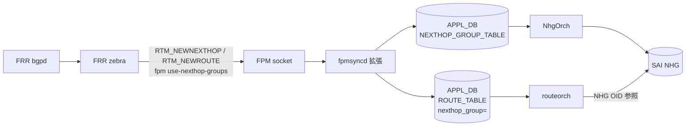

!!! warning "裏取りステータス: HLD-only"
    `fpmsyncd` の `RTM_NEWNEXTHOP` ハンドラ、`NEXTHOP_GROUP_TABLE` の APPL_DB スキーマ、`NhgOrch` の multipath 拡張、`fpm use-nexthop-groups` の有効化フローは現行 master 未裏取り。

# fpmsyncd NextHop Group 拡張（dplane_fpm_nl / NEXTHOP_GROUP_TABLE）

## 概要

FRR `zebra` は dplane_fpm_nl プラグインで Linux kernel の **NextHop Group (NHG) netlink** メッセージ（`RTM_NEWNEXTHOP` / `RTM_DELNEXTHOP`）を FPM へ流せる。本拡張はそれを `fpmsyncd` で受け、`APPL_DB.NEXTHOP_GROUP_TABLE` に NHG エンティティとして書き、`ROUTE_TABLE` 側は **`nexthop_group` フィールドで NHG を参照** する形に変える[^1]。

狙いは BGP PIC（Prefix-Independent Convergence）と recursive route 対応。多数 prefix が同一 NH 集合を共有する SP/DC のスケール条件下で、route 1 件あたりの payload を縮小し、`orchagent`・SAI への流量を減らす。

本機能は **デフォルト無効**。`DEVICE_METADATA.localhost.fpm_use_nexthop_groups = "enabled"` で起動時に切り替える設計[^1]。

## 動作仕様

### High Level



### 切り替え前後の APPL_DB の差分

旧（NHG 拡張なし）:

```
ROUTE_TABLE:10.1.1.4/32
  nexthop = "10.0.0.1,10.0.0.3"
  ifname  = "Ethernet0,Ethernet4"
  weight  = "1,1"
```

新（NHG 拡張あり）:

```
NEXTHOP_GROUP_TABLE:<id>
  nexthop = "10.0.0.1,10.0.0.3"
  ifname  = "Ethernet0,Ethernet4"
  weight  = "1,1"
ROUTE_TABLE:10.1.1.4/32
  nexthop_group = "<id>"
```

### NhgOrch の拡張

既存 NhgOrch は CONFIG_DB / APPL_DB の手動 NHG 用だったが、本拡張で `APPL_DB.NEXTHOP_GROUP_TABLE` の動的更新（FRR 由来）を受け、member の add/del を SAI NHG member の差分更新で実施する[^1]。

### 有効化条件

- `DEVICE_METADATA.localhost.fpm_use_nexthop_groups = enabled` を CONFIG_DB に書く
- bgpd / zebra 起動時に `fpm use-nexthop-groups` を vty に流す（FRR 設定テンプレート側で生成）
- `dplane_fpm_nl` プラグインが必須（202305 以降は default）

ランタイム切替は **未対応**。再起動が必要[^1]。

### Warm boot / Fast boot

HLD では「現状の warm reboot ロジックで NHG エントリの restore は明示対応していない、open issue」と書かれている[^1]。`NEXTHOP_GROUP_TABLE` の永続化と再注入が要 follow-up。

### libnl 依存

NHG 用 attribute (`RTA_NH_ID`, `RTM_NEWNEXTHOP` family) は新しめの libnl が必要。HLD は upstream libnl への patch 取り込み状況を open item として挙げる[^1]。

<!-- evidence:
source: sonic-net/SONiC/doc/pic/hld_fpmsyncd.md#L46-L106 (sha: 49bab5b5ff0e924f1ea52b3d9db0dfa4191a7c06)
excerpt: |
  Scope of this change is to extend `fpmsyncd` to handle `RTM_NEWNEXTHOP` and `RTM_DELNEXTHOP` messages from FPM.
  This change is backward compatible. ... this feature is disabled by default.
  ... (1) config zebra to use `dplane_fpm_nl` instead of `fpm` module
  (2) set `fpm use-nexthop-groups` option (this is disabled by default and enabled via `CONFIG_DB`)
reasoning: 拡張のスコープ・既存互換性・有効化スイッチの根拠。
-->

## 設定

### CONFIG_DB

```
DEVICE_METADATA|localhost:
  fpm_use_nexthop_groups = enabled | disabled   # default disabled
```

### CLI

HLD 内で専用 `config` CLI の言及は無い（CONFIG_DB 直接編集または config_db.json 経由）。

## 制限事項

- ランタイム切替不可（要 BGP container 再起動）[^1]
- NHG 経路と既存の Fine-Grained NHG / Ordered NHG との共存は HLD で「open item」[^1]
- `nexthop_compat_mode` kernel option（NHG ルートを通常 RT_NEWROUTE にも展開する）の扱いは open item
- warm boot 復元未対応

## 干渉する機能

- **Fine-Grained ECMP / Ordered NHG**: 同じ ROUTE_TABLE / NHG パスを使う。同時利用時の優先関係は HLD で確定していない
- **routeorch / NhgOrch**: `nexthop_group` 参照型 ROUTE_TABLE エントリの解決ロジックを共有
- **BGP PIC / Recursive routes**: 本拡張が前提条件

## トラブルシューティング

- 有効化しても `NEXTHOP_GROUP_TABLE` が空 → zebra 設定で `fpm use-nexthop-groups` が出ているか `vtysh -c 'show running'` 確認
- libnl のバージョン違い → `RTM_NEWNEXTHOP` 受信が無い場合に発生

## 引用元

[^1]: `sonic-net/SONiC` `doc/pic/hld_fpmsyncd.md` @ `49bab5b5ff0e924f1ea52b3d9db0dfa4191a7c06`

<!-- concerns hint:
- fpmsyncd の RTM_NEWNEXTHOP / RTM_DELNEXTHOP ハンドラ実装存在確認
- NhgOrch multipath 拡張の現行 master 取り込み確認
- DEVICE_METADATA.fpm_use_nexthop_groups の YANG 取り込み確認
- libnl バージョン依存の sonic-buildimage 側での解決確認
- warm/fast boot での NEXTHOP_GROUP_TABLE 復元の実装状況確認
- Fine-Grained / Ordered NHG との共存時の優先順位の実装挙動確認
-->
