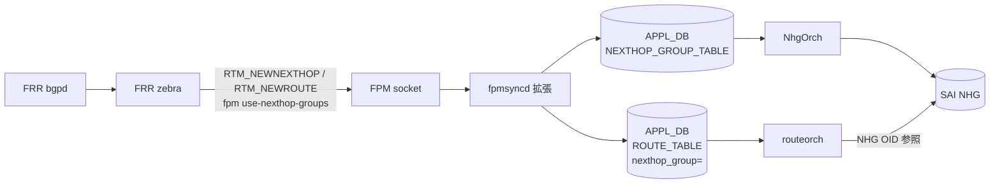

<!-- topics-tip -->
!!! tip "Topics で読み物として読む"
    この HLD は実装詳細を含みます。機能の概念・設定・運用を読み物として読みたい場合は [Topics 02 章: BGP と FRR 制御プレーン](../topics/02-bgp/index.md) を参照。
<!-- /topics-tip -->

!!! warning "裏取りステータス: discrepancy-found"
    `fpmsyncd` の `RTM_NEWNEXTHOP` ハンドラ・`NEXTHOP_GROUP_TABLE` の APPL_DB スキーマ・`NhgOrch` の multipath 拡張は master に実装済みだが、有効化キー名（HLD: `fpm_use_nexthop_groups` → 実装: `nexthop_group`）に乖離あり。詳細は「HLD と実装の差分」節を参照。

# fpmsyncd NextHop Group 拡張（dplane_fpm_nl / NEXTHOP_GROUP_TABLE）

## 概要

[FRR](../reference/glossary.md#term-frr) `zebra` は dplane_fpm_nl プラグインで Linux kernel の **NextHop Group (NHG) netlink** メッセージ（`RTM_NEWNEXTHOP` / `RTM_DELNEXTHOP`）を [FPM](../reference/glossary.md#term-fpm) へ流せる。本拡張はそれを `fpmsyncd` で受け、`APPL_DB.NEXTHOP_GROUP_TABLE` に NHG エンティティとして書き、`ROUTE_TABLE` 側は **`nexthop_group` フィールドで NHG を参照** する形に変える[^1]。

狙いは [BGP](../reference/glossary.md#term-bgp) PIC（Prefix-Independent Convergence）と recursive route 対応。多数 prefix が同一 NH 集合を共有する SP/DC のスケール条件下で、route 1 件あたりの payload を縮小し、`orchagent`・[SAI](../reference/glossary.md#term-sai) への流量を減らす。

本機能は **デフォルト無効**。`DEVICE_METADATA.localhost.fpm_use_nexthop_groups = "enabled"` で起動時に切り替える設計[^1]。

## 動作仕様

### High Level



### 切り替え前後の APPL_DB の差分

旧（NHG 拡張なし）:

```text
ROUTE_TABLE:10.1.1.4/32
  nexthop = "10.0.0.1,10.0.0.3"
  ifname  = "Ethernet0,Ethernet4"
  weight  = "1,1"
```

新（NHG 拡張あり）:

```text
NEXTHOP_GROUP_TABLE:<id>
  nexthop = "10.0.0.1,10.0.0.3"
  ifname  = "Ethernet0,Ethernet4"
  weight  = "1,1"
ROUTE_TABLE:10.1.1.4/32
  nexthop_group = "<id>"
```

### NhgOrch の拡張

既存 NhgOrch は [CONFIG_DB](../reference/glossary.md#term-config_db) / [APPL_DB](../reference/glossary.md#term-appl_db) の手動 NHG 用だったが、本拡張で `APPL_DB.NEXTHOP_GROUP_TABLE` の動的更新（FRR 由来）を受け、member の add/del を SAI NHG member の差分更新で実施する[^1]。

### 有効化条件

- `DEVICE_METADATA.localhost.fpm_use_nexthop_groups = enabled` を CONFIG_DB に書く
- bgpd / [zebra](../reference/glossary.md#term-zebra) 起動時に `fpm use-nexthop-groups` を vty に流す（FRR 設定テンプレート側で生成）
- `dplane_fpm_nl` プラグインが必須（202305 以降は default）

ランタイム切替は **未対応**。再起動が必要[^1]。

### Warm boot / Fast boot

[HLD](../reference/glossary.md#term-hld) では「現状の warm reboot ロジックで NHG エントリの restore は明示対応していない、open issue」と書かれている[^1]。`NEXTHOP_GROUP_TABLE` の永続化と再注入が要 follow-up。

### libnl 依存

NHG 用 attribute (`RTA_NH_ID`, `RTM_NEWNEXTHOP` family) は新しめの libnl が必要。HLD は upstream libnl への patch 取り込み状況を open item として挙げる[^1]。

<!-- evidence:
source: sonic-net/SONiC/doc/pic/hld_fpmsyncd.md#L46-L106 (sha: 49bab5b5ff0e924f1ea52b3d9db0dfa4191a7c06)
excerpt: |
  Scope of this change is to extend `fpmsyncd` to handle `RTM_NEWNEXTHOP` and `RTM_DELNEXTHOP` messages from FPM.
  This change is backward compatible. ... this feature is disabled by default.
  ... (1) config zebra to use `dplane_fpm_nl` instead of `fpm` module
  (2) set `fpm use-nexthop-groups` option (this is disabled by default and enabled via `CONFIG_DB`)
reasoning: 拡張のスコープ・既存互換性・有効化スイッチの根拠。
-->

<!-- evidence-rendered:start -->
??? note "📋 検証エビデンス: sonic-net/SONiC/doc/pic/hld_fpmsyncd.md#L46-L106 (sha: 49bab5b5ff0e924f1ea52b3d9db0dfa4191a7c06)"

    **出典**:

    `sonic-net/SONiC/doc/pic/hld_fpmsyncd.md#L46-L106 (sha: 49bab5b5ff0e924f1ea52b3d9db0dfa4191a7c06)`

    **抜粋**:

    ```text
    Scope of this change is to extend `fpmsyncd` to handle `RTM_NEWNEXTHOP` and `RTM_DELNEXTHOP` messages from FPM.
    This change is backward compatible. ... this feature is disabled by default.
    ... (1) config zebra to use `dplane_fpm_nl` instead of `fpm` module
    (2) set `fpm use-nexthop-groups` option (this is disabled by default and enabled via `CONFIG_DB`)
    ```

    **判断根拠**: 拡張のスコープ・既存互換性・有効化スイッチの根拠。

<!-- evidence-rendered:end -->

## 設定

### CONFIG_DB

```text
DEVICE_METADATA|localhost:
  fpm_use_nexthop_groups = enabled | disabled   # default disabled
```

### CLI

HLD 内で専用 `config` CLI の言及は無い（CONFIG_DB 直接編集または [config_db.json](../reference/glossary.md#term-config_db.json) 経由）。

## 制限事項

- ランタイム切替不可（要 BGP container 再起動）[^1]
- NHG 経路と既存の Fine-Grained NHG / Ordered NHG との共存は HLD で「open item」[^1]
- `nexthop_compat_mode` kernel option（NHG ルートを通常 RT_NEWROUTE にも展開する）の扱いは open item
- warm boot 復元未対応

## 干渉する機能

- **Fine-Grained [ECMP](../reference/glossary.md#term-ecmp) / Ordered NHG**: 同じ [ROUTE_TABLE](../reference/glossary.md#term-route_table) / NHG パスを使う。同時利用時の優先関係は HLD で確定していない
- **routeorch / NhgOrch**: `nexthop_group` 参照型 ROUTE_TABLE エントリの解決ロジックを共有
- **BGP PIC / Recursive routes**: 本拡張が前提条件

## トラブルシューティング

- 有効化しても `NEXTHOP_GROUP_TABLE` が空 → zebra 設定で `fpm use-nexthop-groups` が出ているか `vtysh -c 'show running'` 確認（有効化キーは `nexthop_group`。詳細は「HLD と実装の差分」節を参照）
- libnl のバージョン違い → `RTM_NEWNEXTHOP` 受信が無い場合に発生
- ルート学習後に [ASIC](../reference/glossary.md#term-asic) まで反映されない場合、`fpmsyncd` の NLMSG パースに失敗していないかを `docker logs bgp` と `/var/log/swss/swss.rec` の両方で確認
- NHG 上限超過時は [orchagent](../reference/glossary.md#term-orchagent) が単一ホップにフォールバックする。`SAI_SWITCH_ATTR_NUMBER_OF_ECMP_GROUPS` と現在数 (`ASIC_STATE:SAI_OBJECT_TYPE_NEXT_HOP_GROUP` の総数) を比較する
- FRR と kernel の NHG ID 対応が崩れた場合は `bgp` コンテナ再起動で再 sync するが、APPL_DB の stale エントリは `swssconfig` で flush することを検討

### コマンド例

fpmsyncd の nexthop group メッセージ処理を確認する。

```bash
# fpmsyncd の nexthop group 関連ログ
docker exec bgp tail -n 200 /var/log/zebra.log | grep -iE 'nexthop|nhg'
sudo grep -i 'nexthop_group' /var/log/syslog | tail

# APPL_DB / ASIC_DB の NEXT_HOP_GROUP オブジェクト
sonic-db-cli APPL_DB KEYS 'NEXTHOP_GROUP_TABLE:*'
sonic-db-cli ASIC_DB KEYS 'ASIC_STATE:SAI_OBJECT_TYPE_NEXT_HOP_GROUP:*' | wc -l

# FRR 側 NHG state
docker exec bgp vtysh -c 'show nexthop-group rib'
```

## 引用元

[^1]: `sonic-net/SONiC` `doc/pic/hld_fpmsyncd.md` @ `49bab5b5ff0e924f1ea52b3d9db0dfa4191a7c06`

<!-- concerns hint:
- fpmsyncd の RTM_NEWNEXTHOP / RTM_DELNEXTHOP ハンドラ実装存在確認
- NhgOrch multipath 拡張の現行 master 取り込み確認
- DEVICE_METADATA.fpm_use_nexthop_groups の YANG 取り込み確認
- libnl バージョン依存の sonic-buildimage 側での解決確認
- warm/fast boot での NEXTHOP_GROUP_TABLE 復元の実装状況確認
- Fine-Grained / Ordered NHG との共存時の優先順位の実装挙動確認
-->

<!-- diff-admonition -->
!!! diff "HLD と実装の差分"
    `sonic-swss/fpmsyncd/routesync.cpp` と `sonic-swss/fpmsyncd/routesync.h` を確認。HLD のコア部分は master に取り込み済み:

    - `RouteSync::onNextHopMsg(struct nlmsghdr *h, int len)` (`routesync.cpp:2309`) で `RTM_NEWNEXTHOP` / `RTM_DELNEXTHOP` を処理。
    - `routesync.h:291` で `ProducerStateTable m_nexthop_groupTable;` を持ち、`routesync.cpp:157` で `APP_NEXTHOP_GROUP_TABLE_NAME` を open。
    - `routesync.cpp:3370` の `m_nexthop_groupTable.del(key)`、`routesync.cpp:1011,1031,1851,1882,1884` 等で `ROUTE_TABLE` 側の `nexthop_group` フィールド書込を実装。

    ただし **HLD と本文が前提とする有効化 key が実装と一致しない**:

    - 本ページは `DEVICE_METADATA.localhost.fpm_use_nexthop_groups = "enabled"` を要求すると記述しているが、現行 `sonic-buildimage/dockers/docker-fpm-frr/frr/zebra/zebra.conf.j2:18-29` を見ると **`DEVICE_METADATA.localhost.nexthop_group == 'enabled'`** が `fpm use-next-hop-groups` のトリガになっている。さらに `zebra.conf.j2:9-16` には別途 `DEVICE_METADATA.localhost.zebra_nexthop` で `zebra nexthop kernel enable` の有無を制御する仕組みがある。
    - すなわち実装 key 名は `nexthop_group` / `zebra_nexthop` の 2 つに分かれており、本文の `fpm_use_nexthop_groups` という単一キー名は **HLD 段階の表記がそのまま残った乖離**。本文の CONFIG_DB スニペットおよび設定例は将来 Writer に戻して key 名を実装に揃える必要がある。

    実装の存在自体は確認できたが key 名の不整合があるため `discrepancy-found` のまま据え置き。

    ### 深掘り（2026-05-11、batch q3-disc-detail）

    #### HLD 記述と実装の差分（行番号 + コード抜粋）

    `sonic-buildimage/dockers/docker-fpm-frr/frr/zebra/zebra.conf.j2` L9-L26:

    ```jinja
    
    
    no zebra nexthop kernel enable
    
    zebra nexthop kernel enable
    
    

    
    ...
    fpm use-next-hop-groups
    
    no fpm use-next-hop-groups
    
    ```

    - 有効化 key の実装名: `DEVICE_METADATA.localhost.nexthop_group` (= `enabled` / `disabled`)、および `DEVICE_METADATA.localhost.zebra_nexthop`（kernel への NHG push を抑止する場合 `disabled` を指定）。
    - HLD 表記の `fpm_use_nexthop_groups` という単一キー名は **実装に存在しない**。

    #### 読者への影響

    - HLD 通りに `redis-cli -n 4 hset 'DEVICE_METADATA|localhost' fpm_use_nexthop_groups enabled` を打っても、`zebra.conf` 再生成では `no fpm use-next-hop-groups` が出力されたままで **NHG 機能は有効化されない**。`fpmsyncd` 起動ログを見ても `RTM_NEWNEXTHOP` を受け取らないため `NEXTHOP_GROUP_TABLE` は空のまま。
    - key 名を勘違いしたまま BGP PIC を運用設計すると、ECMP 切替時の収束が NHG 経由ではなく従来の per-route 経路で行われ、HLD が謳う収束時間短縮が得られない。

    #### 回避策の実コマンド

    ```bash
    # 正しい有効化（実装側 key 名）
    sudo sonic-db-cli CONFIG_DB hset "DEVICE_METADATA|localhost" nexthop_group enabled
    # kernel NHG push を残したい場合（デフォルト動作）は zebra_nexthop は未設定 or "enabled"
    sudo sonic-db-cli CONFIG_DB hset "DEVICE_METADATA|localhost" zebra_nexthop enabled

    # 反映: BGP container 再起動が必要
    sudo systemctl restart bgp

    # 確認
    vtysh -c 'show running-config zebra' | grep -i "fpm use-next-hop-groups\|nexthop kernel"
    sonic-db-cli APPL_DB keys 'NEXTHOP_GROUP_TABLE:*' | head
    ```

    `fpm use-next-hop-groups` が `running-config` に出ていれば成功。`NEXTHOP_GROUP_TABLE:*` キーが見えれば [fpmsyncd](../reference/glossary.md#term-fpmsyncd) 経路も生きている。

    #### 関連 GitHub Issue / PR

    - [[sonic-buildimage](../reference/glossary.md#term-sonic-buildimage) #16762: \[fpmsyncd\] Fpmsyncd Next Hop Table Enhancement (merged)](https://github.com/sonic-net/sonic-buildimage/pull/16762) — `zebra.conf.j2` への NHG 切替フラグ導入。
    - [sonic-buildimage #23500: \[frr\] update next hop group support by metadata value with disabled as the default value (merged, 202511)](https://github.com/sonic-net/sonic-buildimage/pull/23500) — default を `disabled` に固定する change。デフォルトでは NHG が **無効** な点に注意。
    - [sonic-buildimage #16941: \[action\]\[PR:16747\] fix default zebra config not inserted into empty zebra.conf (merged)](https://github.com/sonic-net/sonic-buildimage/pull/16941) — 関連の zebra.conf 生成バグ修正。

    #### 検証日

    2026-05-11 (q3-disc-detail batch)
<!-- /diff-admonition -->

<!-- next-action -->
## このページを読んだ後の次アクション

!!! tip "読み手向け"
    - **本機能を実運用で使う場合**: 実装は存在するが本 HLD の記述と乖離。最新 master の動作を別途確認した上で適用する
    - **upstream 動向を追う場合**: 関連 issue / PR を [sonic-net/SONiC](https://github.com/sonic-net/SONiC) で検索（HLD タイトル / CONFIG_DB テーブル名 / Orch クラス名で grep するのが速い）
    - **代替手段 / 関連 reference**:
        - [CONFIG_DB: DEVICE_METADATA](../reference/config-db/device-metadata.md)

!!! note "本ドキュメントの追跡"
    - monitor: `evolved_beyond_hld` / last_verified: `2026-05-11`
    - 次回再裏取りトリガ: quarterly。一覧は [discrepancy-index](../reference/verification/discrepancy-index.md) を参照（運用詳細は repo の `meta/discrepancy-operations.md`）

<!-- /next-action -->

<!-- glossary-links-injected: c006405759d8 -->
