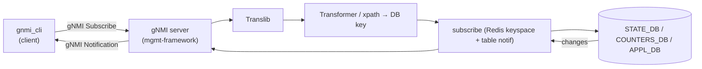

<!-- topics-tip -->
!!! tip "Topics で読み物として読む"
    この HLD は実装詳細を含みます。機能の概念・設定・運用を読み物として読みたい場合は [Topics 10 章: gNMI / OpenConfig / 管理プレーン](../topics/10-gnmi-openconfig/index.md) を参照。
<!-- /topics-tip -->

!!! warning "裏取りステータス: code-verified"
    本 HLD は `area=routing` の backlog だが内容は telemetry 全般に関わる。location は backlog 由来のまま。

!!! note "Verifier 注記（2026-05-10）"
    実コード裏取り: `sonic-gnmi/gnmi_server/client_subscribe.go` に subscribe ハンドラ実装、`multi_request_tcp_conn_test.go` で `ON_CHANGE` モードでの STATE_DB ストリーム動作テストを確認。サーバ実装は HLD の Subscription RPC（ON_CHANGE / SAMPLE / TARGET_DEFINED）モードを実装している。

# gNMI Subscription for YANG Data（ON_CHANGE / SAMPLE / TARGET_DEFINED）

## 概要

[gNMI](../reference/glossary.md#term-gnmi) Subscribe は [YANG](../reference/glossary.md#term-yang) path に紐づくデータを **stream / poll / once** モードでクライアントに push する仕組み[^1]。[SONiC](../reference/glossary.md#term-sonic) は `sonic-mgmt-framework` の Translib + [STATE_DB](../reference/glossary.md#term-state_db) / [COUNTERS_DB](../reference/glossary.md#term-counters_db) / [APPL_DB](../reference/glossary.md#term-appl_db) の表購読を組合せ、openconfig YANG パスでのサブスクリプションを実現する。

サポートする SubscriptionMode（per-path）:

- **ON_CHANGE**: 値が変化したときのみ送る（例: link state、neighbor state）
- **SAMPLE**: 一定間隔で送る（例: counters）
- **TARGET_DEFINED**: server が path 種別から適切なモードを選ぶ

## 動作仕様



主要な仕組み[^1]:

- **Sync 期 → Stream 期**: 最初に現在値の snapshot（sync_response）を送り、以後 update を流す
- **ON_CHANGE が成立する path**: STATE_DB のキー単位（`PORT_TABLE` 等）。[Redis](../reference/glossary.md#term-redis) keyspace notification と組合せ
- **SAMPLE の interval**: subscribe 時に client が指定。下限は server 設定で抑える
- **wildcards**: `interfaces/interface[name=*]/state/oper-status` のように expand してから subscribe
- **TARGET_DEFINED の選択**: counter 系 → SAMPLE、state 系 → ON_CHANGE が一般的

### Heartbeat / suppress-redundant

ON_CHANGE で長時間更新がない時、`heartbeat-interval` で生存通知を出す。`suppress-redundant` で値が変わらない SAMPLE を抑制可能。

## 関連 CLI

| Command | 用途 |
|---------|------|
| `gnmi_cli -a host:port -insecure -client_types gnmi -q '<path>' -qt s -sm o` | ON_CHANGE 購読 |
| `gnmi_cli ... -sm s -i 5` | 5s SAMPLE |

## 制限事項

- **YANG 定義が無い path は購読不可**: openconfig / sonic-* どちらかで定義されていること
- **大量 wildcard 展開**: 全 port の counters wildcard で server 負荷が高くなる
- **ON_CHANGE 対応の限界**: COUNTERS_DB の数値変化は ON_CHANGE 対象として実用的でない（毎 poll 変わる）
- **TLS / 認証**: gNMI は TLS + cert 認証が前提。証明書管理は `gnsi` / `gNOI` 等と統合

## 干渉する機能

- **management framework**: Translib / Transformer の同居機構
- **gNMI Master Arbitration**: 複数クライアントの集中制御で先行ロックを取る [HLD](../reference/glossary.md#term-hld)（management area）
- **dial-in / dial-out telemetry**: dial-out では subscribe をサーバ側起動で行う
- **STATE_DB schema**: ON_CHANGE 効率は STATE_DB スキーマ設計に依存

## トラブルシューティング

- subscription が来ない → path が YANG schema 上 valid か、subscribe mode の対応可否
- update が遅い → SAMPLE interval、Redis keyspace notification 設定（`notify-keyspace-events`）
- TLS エラー → mgmt-framework の cert 設定、`gnmi_cli -insecure` で切り分け

### コマンド例

gNMI subscribe で YANG パスを購読し応答を確認する。

```bash
gnmic -a localhost:8080 --skip-verify -u admin -p YourPaSsWoRd \
  sub --path '/sonic-port:sonic-port/PORT' --mode stream --stream-mode sample --sample-interval 5s 2>&1 | head
show gnmi-server
```

## 引用元

[^1]: `sonic-net/SONiC` `doc/mgmt/gnmi/gNMI_Subscription_for_YangData.md` @ `49bab5b5ff0e924f1ea52b3d9db0dfa4191a7c06`

<!-- concerns hint:
- gnmi server 実装（sonic-gnmi）の現行 master 取り込みと subscribe ハンドラ確認
- Redis keyspace notification (notify-keyspace-events) の有効化と STATE_DB / COUNTERS_DB 連携確認
- ON_CHANGE 対応 path の実装範囲（openconfig 各モジュール）の現行実装確認
- TARGET_DEFINED の選択ロジック（path → mode）が現行実装でどう決まっているか確認
- TLS / cert 認証と gNSI / gNOI 統合の現行実装確認
- gNMI Master Arbitration / dial-out telemetry との実装関係確認
-->

<!-- glossary-links-injected: 8ba32e5aa69d -->
