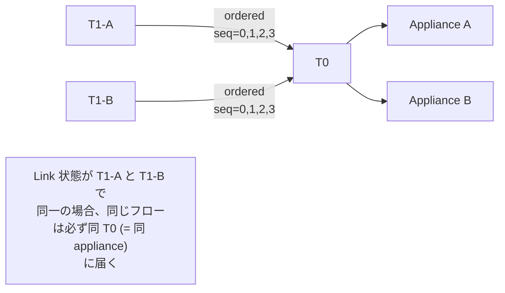
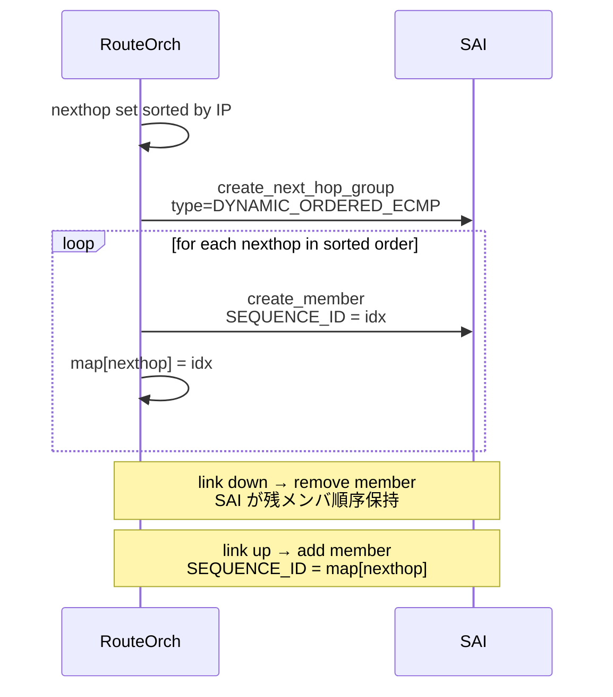

!!! success "裏取りステータス: code-verified"
    `sonic-swss/orchagent/switchorch.cpp` L488-501 で `SAI_NEXT_HOP_GROUP_TYPE_DYNAMIC_ORDERED_ECMP` の capability query と `SWITCH_CAPABILITY_TABLE_ORDERED_ECMP_CAPABLE` (`switchorch.h` L18) の APP_DB 公開を確認。`routeorch.cpp` L499 / L1557 / L1612 と `vnetorch.cpp` L804 / L841 / L2778 で `checkOrderedEcmpEnable()` 経由の nexthop group type 切替を確認。`sonic-swss/tests/test_nhg.py` / `tests/vnet_lib.py` で `SAI_NEXT_HOP_GROUP_MEMBER_ATTR_SEQUENCE_ID` 検証 UT を確認（verified 2026-06-06）。

<!-- evidence:
source: sonic-net/sonic-swss/orchagent/switchorch.cpp#L485-L502
excerpt: |
  if (values.list[i] == SAI_NEXT_HOP_GROUP_TYPE_DYNAMIC_ORDERED_ECMP)
      fvVector.emplace_back(SWITCH_CAPABILITY_TABLE_ORDERED_ECMP_CAPABLE, "true");
  ...
  fvVector.emplace_back(SWITCH_CAPABILITY_TABLE_ORDERED_ECMP_CAPABLE, "false");
reasoning: |
  capability query で SAI が DYNAMIC_ORDERED_ECMP をサポートしているか確認し、
  サポート有無を APP_DB の SWITCH_CAPABILITY_TABLE に書き出す箇所。
  Backward Compatibility 節で言及している「SAI 非対応 ASIC では feature を無効化」の実体。
-->

<!-- evidence-rendered:start -->
??? note "📋 検証エビデンス: sonic-net/sonic-swss/orchagent/switchorch.cpp#L485-L502"

    **出典**:

    `sonic-net/sonic-swss/orchagent/switchorch.cpp#L485-L502`

    **抜粋**:

    ```text
    if (values.list[i] == SAI_NEXT_HOP_GROUP_TYPE_DYNAMIC_ORDERED_ECMP)
        fvVector.emplace_back(SWITCH_CAPABILITY_TABLE_ORDERED_ECMP_CAPABLE, "true");
    ...
    fvVector.emplace_back(SWITCH_CAPABILITY_TABLE_ORDERED_ECMP_CAPABLE, "false");
    ```

    **判断根拠**: capability query で SAI が DYNAMIC_ORDERED_ECMP をサポートしているか確認し、 サポート有無を APP_DB の SWITCH_CAPABILITY_TABLE に書き出す箇所。 Backward Compatibility 節で言及している「SAI 非対応 ASIC では feature を無効化」の実体。

<!-- evidence-rendered:end -->

<!-- evidence:
source: sonic-net/sonic-swss/orchagent/routeorch.cpp#L1555-L1615
excerpt: |
  nhg_attr.value.s32 = m_switchOrch->checkOrderedEcmpEnable()
      ? SAI_NEXT_HOP_GROUP_TYPE_DYNAMIC_ORDERED_ECMP
      : SAI_NEXT_HOP_GROUP_TYPE_ECMP;
reasoning: |
  RouteOrch が nexthop group 作成時に、SwitchOrch の global flag を見て
  DYNAMIC_ORDERED_ECMP / ECMP を切り替える。HLD の "ECMP group 作成時 SAI に
  DYNAMIC_ORDERED_ECMP" の実体。
-->

<!-- evidence-rendered:start -->
??? note "📋 検証エビデンス: sonic-net/sonic-swss/orchagent/routeorch.cpp#L1555-L1615"

    **出典**:

    `sonic-net/sonic-swss/orchagent/routeorch.cpp#L1555-L1615`

    **抜粋**:

    ```text
    nhg_attr.value.s32 = m_switchOrch->checkOrderedEcmpEnable()
        ? SAI_NEXT_HOP_GROUP_TYPE_DYNAMIC_ORDERED_ECMP
        : SAI_NEXT_HOP_GROUP_TYPE_ECMP;
    ```

    **判断根拠**: RouteOrch が nexthop group 作成時に、SwitchOrch の global flag を見て DYNAMIC_ORDERED_ECMP / ECMP を切り替える。HLD の "ECMP group 作成時 SAI に DYNAMIC_ORDERED_ECMP" の実体。

<!-- evidence-rendered:end -->

<!-- evidence:
source: sonic-net/sonic-swss/orchagent/switchorch.h#L18
excerpt: |
  #define SWITCH_CAPABILITY_TABLE_ORDERED_ECMP_CAPABLE "ORDERED_ECMP_CAPABLE"
reasoning: |
  ORDERED_ECMP_CAPABLE field name の定義箇所。APP_DB.SWITCH_TABLE に書き込まれる。
-->

<!-- evidence-rendered:start -->
??? note "📋 検証エビデンス: sonic-net/sonic-swss/orchagent/switchorch.h#L18"

    **出典**:

    `sonic-net/sonic-swss/orchagent/switchorch.h#L18`

    **抜粋**:

    ```text
    #define SWITCH_CAPABILITY_TABLE_ORDERED_ECMP_CAPABLE "ORDERED_ECMP_CAPABLE"
    ```

    **判断根拠**: ORDERED_ECMP_CAPABLE field name の定義箇所。APP_DB.SWITCH_TABLE に書き込まれる。

<!-- evidence-rendered:end -->

# Ordered ECMP（IP ソート順で nexthop に `sequence_id` を付け同一フローを同 ToR/Appliance に固定）

!!! note "URL slug について"
    本ページの URL slug `high-level-design-document` は upstream HLD ファイル名（`ordered_ecmp_next_hop_hld.md` の親リポジトリ内での一般名）に由来する歴史的経緯のもので、内容は **Ordered ECMP** に特化している。slug rename は既存 URL を破壊するため保持している。検索する際は「Ordered ECMP」「ordered-ecmp」で本ページを参照すること。

## 概要

T0 配下に **flow state を持つ appliance**（FW / SLB 等）が居て、可用性のためペア構成（異 T0 配下）になっている。フロー状態が appliance 間で同期されないと **同じフローが別 appliance に行き当たって state miss する** 恐れがある。T1 から T0 への [ECMP](../reference/glossary.md#term-ecmp) 選択を **全 T1 で同一順序** にすれば、フローは常に同じ T0 → 同じ appliance に着く[^1]。

本 [HLD](../reference/glossary.md#term-hld) は [SONiC](../reference/glossary.md#term-sonic) で **Ordered ECMP**（nexthop の順序を保持した ECMP）を実装する設計。Phase 1 では[^1]:

- **nexthop IP アドレスでソート** した順を sequence_id として [SAI](../reference/glossary.md#term-sai) に渡す
- 全 T1 で同じ entropy 計算 + 同じ順序前提なら、同じフローは必ず同 nexthop に landing
- knob で feature 有効化、SAI 非対応 [ASIC](../reference/glossary.md#term-asic) では従来挙動にフォールバック
- **link up/down で nexthop が増減**するときも順序を保つ
- Overlay ECMP 対応

## 動作仕様

### 順序付けの根拠[^1]

1. データセンタの IP 割り当てルール上、**同 podset 内の全 T1 が下流 T0 に対して同じ P2P IP を見る**ことが前提。これにより IP ソート順 = どの T1 でも同じ並び
2. 全 T1 で同一 entropy 計算（ハッシュアルゴリズム / seed）が前提
3. **best effort**: T1 ↔ T0 のリンクが各 T1 で異なる up/down 状態だと、フローは別 T0 へ流れる可能性あり

### ベストエフォート（リンク差）



### `APP_DB` Switch Table 拡張

```text
SWITCH_TABLE:switch
  ecmp_hash_seed = ...
  order_ecmp_group = false    # 既定。true で有効化
```

`switch.json.j2` テンプレートが device role / asic_type で条件付き render する[^1]。

### Orchestration Agent 変更点[^1]

#### `SwitchOrch`

`APP_DB.SWITCH_TABLE.order_ecmp_group` を読み、global flag を立てる。

#### `RouteOrch`

1. nexthop を **IP 昇順** で `Nexthop-Group set` に入れる（既に sorted な std::set）。Phase 2 で sort key 切替 init knob を予定
2. ECMP group 作成時 SAI に **`SAI_NEXT_HOP_GROUP_TYPE_DYNAMIC_ORDERED_ECMP`**
3. メンバ追加時 **`SAI_NEXT_HOP_GROUP_MEMBER_ATTR_SEQUENCE_ID`** を渡す。値 = nexthop の traversal index。`{nexthop: sequence_id}` をローカル map として保持
4. ECMP HW Acceleration（link up/down 対応）での add 時にも同 map から sequence_id を引いて渡す。**remove は何もしない**（SAI 側で残メンバ順序維持の前提）[^1]



#### `OverlayECMPOrch`

同様。**Tunnel Endpoint IP** でソート。SAI 呼び出しは Route 側と同じ。

### Backward Compatibility

`SAI_NEXTHOP_GROUP` 属性 `SAI_NEXT_HOP_GROUP_ATTR_TYPE` の **enum capability query** で `DYNAMIC_ORDERED_ECMP` がサポートされなければ feature を無効化し、従来 unordered ECMP に倒す[^1]。

### Phase 2（未確定）[^1]

- init knob で sort key を IP 以外に変更可能化
- T0 上での warm restart サポート
- [CONFIG_DB](../reference/glossary.md#term-config_db) knob による有効化（reload 必要）
- Nexthop Group OA への移行

## 制限事項

- best effort 性質: link 状態が T1 間で異なれば順序ハッシュの前提が崩れる
- entropy 計算（ハッシュ実装）が **全 T1 で同じ** 前提。ASIC ベンダが揃っていないと崩れる
- IP 割り当て規約が崩れているデータセンタでは順序が揃わない

## 干渉する機能

- **Generic Hash**: `ecmp_hash_seed` を使う。Generic Hash で seed・field を変えると order の前提も影響
- **Overlay ECMP**: 同設計を Tunnel Endpoint IP で適用
- **ECMP HW Acceleration**: link up/down で nexthop 集合が変わる場面で seq 維持

## 参考リンク

- [Topics: VRF / ECMP](../topics/04-vrf-ecmp/index.md)
- [Topic 04 ECMP](../topics/04-vrf-ecmp/ecmp.md)
- [Glossary](../reference/glossary.md)
- [Reference 索引](../reference/index.md)

## 引用元

[^1]: [sonic-net/SONiC doc/ecmp/ordered_ecmp_next_hop_hld.md @ 49bab5b](https://github.com/sonic-net/SONiC/blob/49bab5b5ff0e924f1ea52b3d9db0dfa4191a7c06/doc/ecmp/ordered_ecmp_next_hop_hld.md)

<!-- glossary-links-injected: ec18b66e3507 -->
