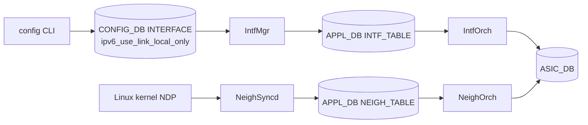

<!-- topics-tip -->
!!! tip "Topics で読み物として読む"
    この HLD は実装詳細を含む。機能の概念・設定・運用を読み物として読みたい場合は [Topics 02 章: BGP と FRR 制御プレーン](../topics/02-bgp/index.md) を参照。
<!-- /topics-tip -->

!!! success "裏取りステータス: code-verified"
    `sonic-swss/cfgmgr/intfmgr.cpp:817` で `ipv6_use_link_local_only` ハンドリング、L926 で APP_DB 伝搬。`sonic-swss/orchagent/nexthopkey.h:27-28` で `NextHopKey` が `(IpAddress, alias)` 構造。`routeorch.cpp:176-190` で /128 IP2ME と `fe80::/10` の両ルートを `addLinkLocalRouteToMe` でプログラム。CLI は `sonic-utilities/show/main.py` で確認 (verified at: 2026-05-09)。

# IPv6 Link-Local アドレス管理（自動生成と use-link-local-only）

## なぜ必要か

IPv6 link-local (`fe80::/64` + EUI-64 ベース interface ID) を [SONiC](../reference/glossary.md#term-sonic) が扱えるようにする拡張。中核ユースケースは **[BGP](../reference/glossary.md#term-bgp) unnumbered**（インタフェース指定で対向 link-local を ND 検出）。IPv4 経路の next-hop に IPv6 link-local を入れる **RFC 5549** もサポート[^1]。

主要要素は 3 つ。

1. **インタフェース単位の `use-link-local-only`**: 手動 IPv6 アドレスが無くても link-local だけで L3 [RIF](../reference/glossary.md#term-rif) を有効化
2. **グローバル一括 enable/disable**: 該当条件を満たす全インタフェースをアクション操作
3. **link-local next-hop [ECMP](../reference/glossary.md#term-ecmp)**: 同じ `fe80::xxxx` でも所属インタフェースが異なれば独立 next-hop として扱えるよう `NeighOrch` の key にインタフェースを含める

## どう動くか

### IPv6 モードの判定

次のいずれかで IPv6 モードが有効化される[^1]：

- グローバル / link-local いずれかの IPv6 アドレスが手動設定
- `use-link-local-only` が enable で Ethernet / [VLAN](../reference/glossary.md#term-vlan) / Port-Channel / Loopback のいずれか

両方無いと IPv6 モード自体が無効。デフォルトは disable（`eth0` / `lo` は例外的に常時有効）。

### 適用条件

`use-link-local-only` を有効化できる対象[^1]:

- L2 ポートではない（Port-Channel / VLAN メンバではない）
- L3 インタフェース（Ethernet / VLAN / Port-Channel / Loopback）

`use-link-local-only` 有効中の Ethernet を Port-Channel/VLAN メンバ化、Port-Channel を VLAN メンバ化する操作は禁止。

### IP2ME と fe80::/10 ルート

`IntfOrch` は link-local 有効時に 2 つを [ASIC](../reference/glossary.md#term-asic) に program[^1]:

- インタフェース link-local への **/128 IP2ME**（CPU パント、同 link-local 複数 IF でも [SAI](../reference/glossary.md#term-sai) 上は 1 つ）
- [VRF](../reference/glossary.md#term-vrf) ごとの **`fe80::/10` サブネットルート**（CPU コピー、個別 prefix 大量積み防止）

### NeighOrch: next-hop key にインタフェース

`NextHopKey` を `(IpAddress, alias)` の組にすることで、同一 link-local が複数 IF から到達する ECMP を表現できる[^1]:

```cpp
struct NextHopKey {
    IpAddress ip_address;
    string    alias;
};
```

```text
sonic# show ipv6 route
S>* 2222::/64 [1/0] via fe80::5054:ff:fe03:6175, Ethernet0
              via fe80::5054:ff:fe03:6175, Ethernet4
              via fe80::5054:ff:fe03:6175, Ethernet8
```

### コンポーネント間フロー



<!-- evidence:
source: sonic-net/SONiC/doc/ipv6/ipv6_link_local.md#L271-L300 (sha: 49bab5b5ff0e924f1ea52b3d9db0dfa4191a7c06)
excerpt: |
  Add the interface parameter to the next hop object key. This allows to add multiple IPv6 link local next hops with same IPv6 address.
reasoning: NeighOrch の next-hop key 拡張が link-local ECMP のキー要件である根拠。
-->

<!-- evidence-rendered:start -->
??? note "📋 検証エビデンス: sonic-net/SONiC/doc/ipv6/ipv6_link_local.md#L271-L300 (sha: 49bab5b5ff0e924f1ea52b3d9db0dfa4191a7c06)"

    **出典**:

    `sonic-net/SONiC/doc/ipv6/ipv6_link_local.md#L271-L300 (sha: 49bab5b5ff0e924f1ea52b3d9db0dfa4191a7c06)`

    **抜粋**:

    ```text
    Add the interface parameter to the next hop object key. This allows to add multiple IPv6 link local next hops with same IPv6 address.
    ```

    **判断根拠**: NeighOrch の next-hop key 拡張が link-local ECMP のキー要件である根拠。

<!-- evidence-rendered:end -->

## 設定

### CONFIG_DB

| Table | Key | フィールド | 説明 |
|-------|-----|-----------|------|
| `INTERFACE` | `<ifname>` | `ipv6_use_link_local_only` | `enable` / `disable`、default `disable` |

APP_DB 側は `INTF_TABLE` に同フィールド伝搬、`NEIGH_TABLE` に `<ifname>:<linklocal-ip>` 形式キーが追加される[^1]。

### CLI

| Command | 用途 |
|---------|------|
| `config interface ipv6 enable use-link-local-only <ifname>`  | 個別有効化 |
| `config interface ipv6 disable use-link-local-only <ifname>` | 個別無効化 |
| `config ipv6 enable link-local`  | 該当全 IF を一括有効化 |
| `config ipv6 disable link-local` | 該当全 IF を一括無効化 |
| `show ipv6 link-local-mode`      | 状態表示 |

[FRR](../reference/glossary.md#term-frr) 側（BGP unnumbered）は新規 CLI なし。既存 `neighbor <ifname> interface remote-as` で動作する[^1]。

### 設定例

```bash
# BGP unnumbered
config interface ipv6 enable use-link-local-only Ethernet0
vtysh -c "
configure terminal
router bgp 65001
 neighbor Ethernet0 interface remote-as external
 address-family ipv4 unicast
  neighbor Ethernet0 activate
"
```

## 制限事項

- ループバックには link-local アドレスは付かない
- link-local 宛/送信元 IPv6 パケットはルーティング不可（trace route 不可、ping は直接接続のみ）[^1]
- グローバル `config ipv6 enable link-local` は VLAN/Port-Channel メンバには適用されない
- 上限は ASIC の L3 RIF / Neighbor 容量に依存（[HLD](../reference/glossary.md#term-hld) で数値未規定）

## 干渉する機能

- **VRF**: 本拡張は元々 VRF 実装で導入されたもの。next-hop key にインタフェースを含める変更を共有[^1]
- **BGP unnumbered (RFC 5549)**: 主要ユースケース
- **Warm reboot**: 手動 link-local は [CONFIG_DB](../reference/glossary.md#term-config_db) から復元、自動生成は kernel が再生成[^1]
- **VLAN/Port-Channel メンバシップ**: `use-link-local-only` 有効中は member 化不可

## トラブルシューティング

- BGP unnumbered で peering 上がらない → `show ipv6 interface <ifname>` で link-local 自動生成確認
- `show ndp` で対向 link-local と MAC 学習確認
- ASIC neighbor → `redis-cli -n 1 keys '*NEIGHBOR*'`
- ECMP に複数 link-local → `NEIGH_TABLE:<ifname>:<ip>` がインタフェースごとに分かれているか

### コマンド例

IPv6 link-local アドレスと BGP unnumbered ピアを確認する。

```bash
show ipv6 interface brief
show ipv6 bgp neighbors 2>/dev/null | head
ip -6 addr show scope link
```

## 関連トピック

- [Topics: BGP](../topics/02-bgp/index.md) — BGP unnumbered の運用文脈
- [Topics: VRF / ECMP](../topics/04-vrf-ecmp/index.md) — next-hop key と link-local ECMP
- [sonic-vrf-support-design-spec-draft](sonic-vrf-support-design-spec-draft.md)

## 引用元

[^1]: `sonic-net/SONiC` `doc/ipv6/ipv6_link_local.md` @ `49bab5b5ff0e924f1ea52b3d9db0dfa4191a7c06`

<!-- glossary-links-injected: ec18b66e3507 -->
