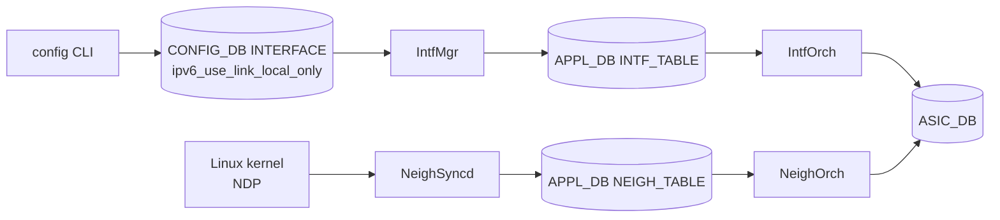

!!! warning "裏取りステータス: HLD-only / 古い HLD"
    HLD は 2021-06 改訂の v0.3 で 4 年以上経過している。`ipv6_use_link_local_only` の CONFIG_DB スキーマと SONiC CLI は当時から実装されていたものだが、現行 master の `IntfMgr` / `IntfOrch` / `NeighOrch` の挙動が記述と一致するか、`fe80::/10` のサブネットルートが現在も IP2ME として使われているかは未確認。

# IPv6 Link-Local アドレス管理（自動生成と use-link-local-only）

## 概要

IPv6 link-local アドレス（`fe80::/64` プレフィクス + EUI-64 由来の interface ID）を SONiC が扱えるようにする拡張。BGP unnumbered（インタフェース指定で対向の link-local を ND で検出）を中核ユースケースとし、IPv4 経路の next-hop に IPv6 link-local を入れる RFC 5549 もサポートする[^1]。

主な要素は次の 3 つ。

1. **インタフェース単位の `use-link-local-only` ノブ**: 手動 IPv6 アドレスが無くても、link-local だけで L3 RIF を有効化する。
2. **グローバルな一括 enable/disable**: 該当条件を満たす全インタフェースに対して一括操作するアクションコマンド。
3. **link-local next-hop ECMP**: 同じ `fe80::xxxx` でも所属インタフェースが異なれば独立した next-hop として扱えるよう、`NeighOrch` の next-hop key にインタフェースを含める。

## 動作仕様

### IPv6 モードの判定

インタフェースの IPv6 モードは、次のいずれかを満たすときに有効化される[^1]。

- グローバル / link-local いずれかの IPv6 アドレスが手動設定されている
- `use-link-local-only` が enable で、Ethernet / VLAN / Port-Channel / Loopback いずれかである

逆に、`use-link-local-only` が disable で手動アドレスもないときは IPv6 モード自体が無効になる。デフォルトは **disable**（OOB の `eth0` と `lo` は例外的に常時有効）。

### 適用条件

`use-link-local-only` を有効化できるのは次の条件を満たすインタフェース[^1]：

- L2 ポート (Port-Channel / VLAN のメンバではない)
- L3 インタフェース（Ethernet / VLAN / Port-Channel / Loopback）

`use-link-local-only` 有効中の Ethernet を Port-Channel/VLAN のメンバにする操作、および Port-Channel を VLAN メンバにする操作は禁止される。

### IP2ME と fe80::/10 ルート

`IntfOrch` は link-local 有効時に次の 2 つを ASIC にプログラムする[^1]：

- インタフェース link-local アドレスへの **/128 IP2ME** ルート（CPU パント用）。同じ link-local が他のインタフェースにも乗るが、SAI 上は 1 つの IP2ME で済む。
- VRF ごとの **`fe80::/10` サブネットルート**（CPU コピー）。個別 link-local プレフィクスを大量に積まずに済ませる最適化。

### NeighOrch: next-hop key にインタフェース

`NextHopKey` を `(IpAddress, alias)` の組にすることで、`fe80::5054:ff:fe03:6175` のような同一 link-local 値が複数インタフェースから到達される ECMP シナリオを表現できる[^1]。

```cpp
struct NextHopKey {
    IpAddress ip_address;
    string    alias;     // incoming interface alias
};
```

```text
sonic# show ipv6 route
S>* 2222::/64 [1/0] via fe80::5054:ff:fe03:6175, Ethernet0
              via fe80::5054:ff:fe03:6175, Ethernet4
              via fe80::5054:ff:fe03:6175, Ethernet8
```

<!-- evidence:
source: sonic-net/SONiC/doc/ipv6/ipv6_link_local.md#L271-L300 (sha: 49bab5b5ff0e924f1ea52b3d9db0dfa4191a7c06)
excerpt: |
  Add the interface parameter to the next hop object key. This allows to add multiple IPv6 link local next hops with same IPv6 address.
reasoning: NeighOrch の next-hop key 拡張が link-local ECMP のキー要件である根拠。
-->

### コンポーネント間フロー



## 設定

### 関連する CONFIG_DB

| Table | Key | フィールド | 説明 |
|-------|-----|-----------|------|
| `INTERFACE` | `<ifname>` | `ipv6_use_link_local_only` | `enable` / `disable`。default `disable` |

`STATE_DB` / `COUNTER_DB` への追加は無い。`APP_DB` 側は `INTF_TABLE` に同じフィールドが伝搬し、`NEIGH_TABLE` には `<ifname>:<linklocal-ip>` 形式のキーが追加される[^1]。

### 関連する CLI

| Command | 用途 |
|---------|------|
| `config interface ipv6 enable use-link-local-only <ifname>`  | インタフェース単位で有効化 |
| `config interface ipv6 disable use-link-local-only <ifname>` | インタフェース単位で無効化 |
| `config ipv6 enable link-local`  | 該当する全インタフェースに対し有効化（アクションコマンド） |
| `config ipv6 disable link-local` | 該当する全インタフェースに対し無効化（アクションコマンド） |
| `show ipv6 link-local-mode`      | モード状態の表示 |

FRR 側（BGP unnumbered など）は新規 CLI なし。既存の `neighbor <ifname> interface remote-as <as>` で動作する[^1]。

### 設定例

```bash
# BGP unnumbered の片側
config interface ipv6 enable use-link-local-only Ethernet0
vtysh -c "
configure terminal
router bgp 65001
 neighbor Ethernet0 interface remote-as external
 address-family ipv4 unicast
  neighbor Ethernet0 activate
 exit-address-family
"
```

## 制限事項

- ループバックには link-local アドレスは付かない（HLD で明記）。
- link-local 宛/送信元の IPv6 パケットはルーティングされない（trace route 等は使えない、ping は直接接続のみ）[^1]。
- グローバル `config ipv6 enable link-local` は VLAN メンバ・Port-Channel メンバには適用されない。
- 上限値は ASIC の L3 RIF / Neighbor テーブル容量に依存（HLD では特定の数値は規定していない）。

## 干渉する機能

- **VRF**: link-local の next-hop key にインタフェースを含める変更は、もともと VRF 実装で導入されたもの。VRF と link-local は同じ拡張を共有する[^1]。
- **BGP unnumbered (RFC 5549)**: 本機能の主要ユースケース。FRR 側の `neighbor <ifname> interface` 構文と組み合わせて使う。
- **Warm reboot**: 手動設定の link-local は CONFIG_DB 経由で復元、自動生成 link-local は kernel が再生成する設計[^1]。
- **VLAN/Port-Channel メンバシップ**: `use-link-local-only` 有効中は member 化できないなど、依存関係に注意。

## トラブルシューティング

- BGP unnumbered で peering が上がらない場合、まず `show ipv6 interface <ifname>` で link-local が auto 生成されているか確認する。
- `show ndp` で対向の link-local とルータ MAC が学習されているか確認。
- ASIC への neighbor プログラム状況は `redis-cli -n 1 keys '*NEIGHBOR*'` で確認する。
- ECMP に複数 link-local next-hop を入れている場合、`NEIGH_TABLE:<ifname>:<ip>` キーがインタフェースごとに分かれていることを確認する。

## 引用元

[^1]: `sonic-net/SONiC` `doc/ipv6/ipv6_link_local.md` @ `49bab5b5ff0e924f1ea52b3d9db0dfa4191a7c06`
