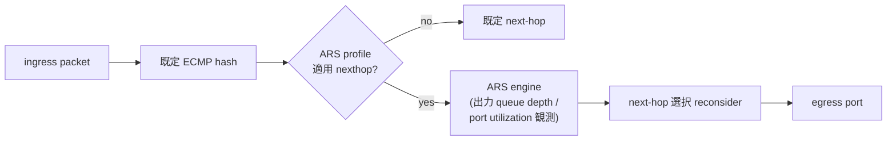

<!-- topics-tip -->
!!! tip "Topics で読み物として読む"
    この HLD は実装詳細を含みます。機能の概念・設定・運用を読み物として読みたい場合は [Topics 04 章: VRF / ECMP / 経路選択](../topics/04-vrf-ecmp/index.md) を参照。
<!-- /topics-tip -->

!!! warning "裏取りステータス: discrepancy-found"
    Local ARS は AI/HPC 向けの adaptive routing 機能。

!!! note "Verifier 注記（2026-05-10）"
    実コード裏取り: 現行 master の `sonic-swss/orchagent/` には **`ArsOrch` 等の ARS 関連 orch 実装は確認できず**、`sonic-yang-models` にも `sonic-ars.yang` / `ARS_PROFILE` 等のスキーマは存在しない。`sonic-utilities` にも `config ars` / `show ars` は未取り込み。SAI 側は `sonic-sairedis/unittest/meta/TestMeta.cpp` に `SAI_OBJECT_TYPE_ARS` / `SAI_ARS_ATTR_*` の参照があり SAI API 自体は community SAI に取り込まれていることが確認できる。**HLD は提案段階で、SONiC SWSS / yang / utilities への取り込みは未完了**。本ページの記述は仕様意図の理解には有用だが、現行 master では機能として利用できない可能性が高い。

# Local ARS（Adaptive Routing & Switching の local 完結版）

## 設計意図

Local ARS は [ECMP](../reference/glossary.md#term-ecmp) の next-hop 選択を **静的ハッシュではなく、出力キューの瞬時負荷や link 利用率に応じて動的に変える** 機能[^1]。AI / HPC 向けに RDMA 通信の hot-spot を抑え、tail latency を低減することを狙う。

「Local」とは、**自スイッチ内の [ASIC](../reference/glossary.md#term-asic) 観測値だけで判断** することを示す。複数ホップ協調の Global ARS は別テーマ。

## 動作仕様



主要な構成要素[^1]:

- **ARS profile**: idle window / sample interval / quantization band / threshold 等のパラメータ束
- **ARS object（[SAI](../reference/glossary.md#term-sai)）**: nexthop group や ECMP に紐づける ASIC 機能 object。SAI 側で `SAI_OBJECT_TYPE_ARS` 系拡張に対応
- **ARS interface**: per-egress-port の有効化と max load
- **flowlet 風挙動**: 同一フローでも idle window 後は別 path に切り替え可（ARS の本質）

### 主な CONFIG_DB

| Table | 説明 |
|-------|------|
| `ARS` | グローバル admin / モード（mode=`PER_FLOWLET_QUALITY` / `PER_PACKET_QUALITY` 等） |
| `ARS_PROFILE` | profile 名 ↔ パラメータ群 |
| `ARS_INTERFACE` | per-port enable / max_load |
| `ARS_NEXTHOP_GROUP_MAP` | nexthop group に profile を紐づけ（[HLD](../reference/glossary.md#term-hld) 表現上） |

### 主な CLI

| Command | 用途 |
|---------|------|
| `config ars enable` | グローバル on |
| `config ars profile add <name> ...` | profile 定義 |
| `config ars interface enable <if>` | port で有効化 |
| `show ars` / `show ars profile` | 状態表示 |

## 制限事項

- **対応 ASIC のみ**: SAI ARS 拡張をサポートする [NPU](../reference/glossary.md#term-npu) でのみ動く
- **Local 観測のみ**: 自スイッチを越えた congestion は見えないため、fabric の global view が必要なケースはカバー外
- **profile チューニング**: idle window / quantization の設定が不適切だと flapping や順序逆転を招く
- **ECMP との組み合わせ**: 既存 ECMP（policy-based hashing 等）と評価順序が衝突しないか注意

## 干渉する機能

- **inner packet hashing in ECMP**: ECMP ハッシュキー設定との組み合わせ
- **policy-based hashing**: フィールド指定ハッシュと ARS の動的選択の競合
- **fine-grained ECMP / weighted ECMP**: 重みづけ next-hop と ARS の relative priority
- **congestion control（[PFC](../reference/glossary.md#term-pfc) / [ECN](../reference/glossary.md#term-ecn)）**: ARS の判断材料となる出力 queue 観測

## トラブルシューティング

- 効果が出ない → `ARS_INTERFACE` の enable、profile 紐づけ、ARS 対応 ASIC かを確認
- 順序逆転 → idle window が小さすぎないか
- カウンタが進まない → `show ars` の active flowlet 数を確認、SAI debug counter で ARS reroute 統計を確認

<!-- diff-admonition -->
!!! diff "HLD と実装の差分"
    2026-05-10 時点の現行 master を裏取り。**Local ARS は HLD 提案のみで SONiC SWSS / utilities / yang への取り込みは未完了**。

    ### 1. `ArsOrch` 等の orch 未実装

    - **HLD 記述**: `ArsOrch`（または `NextHopGroupOrch` 拡張）が `ARS` / `ARS_PROFILE` / `ARS_INTERFACE` テーブルを subscribe して SAI ARS object に反映する。
    - **実装位置**: `sonic-swss/orchagent/` に `arsorch.cpp` / `arsorch.h` 相当ファイル無し（grep ヒット 0）。`nhgorch.cpp` (NhgOrch) にも ARS 連携コードは存在しない。
    - **差分の中身**: orch 層の処理が無いため [CONFIG_DB](../reference/glossary.md#term-config_db) に `ARS|*` を書いても何も起きない。`gDirectory` への ArsOrch 登録も無い。
    - **読者への影響**: 設定しても ASIC への反映経路が存在しないため、ARS は機能しない。
    - **回避策**:
      - **コミュニティ SONiC master では現状利用不可**。
      - ベンダー版 SONiC（NVIDIA NOS の SX 系などが先行実装）または upstream の PR を追跡する。
      - 機能要件として「flowlet 風の動的 ECMP」が必要なら、現状は ASIC ベンダーの platform-specific 設定（sai.profile の vendor extension）か、SONiC 上での hash perturbation（policy-based hashing で hash seed をローテートする）で部分的に代替する。

    ### 2. CONFIG_DB スキーマ / yang module 未取り込み

    - **HLD 記述**: yang module `sonic-ars.yang` を追加し、`ARS` / `ARS_PROFILE` / `ARS_INTERFACE` / `ARS_NEXTHOP_GROUP_MAP` テーブルを定義する。
    - **実装位置**: `sonic-buildimage/src/sonic-yang-models/yang-models/` に `sonic-ars.yang` 無し。`sonic-cfggen` のテンプレート集にも参照無し。
    - **差分の中身**: yang validation が ARS テーブルを受け付けないため、`config_db.json` に `ARS` セクションを書くと `sonic-cfggen` でエラーになる可能性がある（ConfigMgmt の strict 検証時）。
    - **読者への影響**: 設定ファイルとして書く手段が無い。
    - **回避策**: 設定を試したい場合は `sonic-db-cli CONFIG_DB HSET 'ARS|global' admin_mode enabled` のように [Redis](../reference/glossary.md#term-redis) 直書きで yang を迂回する。ただし orch が受けないため効果は無い。

    ### 3. CLI（`config ars` / `show ars`）未取り込み

    - **HLD 記述**: `config ars enable` / `config ars profile add ...` / `show ars` / `show ars profile` を `sonic-utilities` に追加。
    - **実装位置**: `sonic-utilities/config/` および `sonic-utilities/show/` に `ars` モジュール無し（grep ヒット 0）。
    - **差分の中身**: CLI エントリポイントが存在しない。
    - **読者への影響**: 本ページの CLI 例はすべて動かない。
    - **回避策**: 上記同様、コミュニティ master では使えない。

    ### 4. SAI ARS API は community SAI に取り込み済み

    - **実装位置**: `sonic-sairedis/unittest/meta/TestMeta.cpp:1821,1857` で `SAI_OBJECT_TYPE_ARS` / `SAI_OBJECT_TYPE_ARS_PROFILE` の create/get/set/remove 操作を unittest が実施。SAI header 側で型・属性は定義済み。
    - **差分の中身**: SAI 層は ready、SONiC 上位層（orch / yang / CLI）が未取り込みの状態。
    - **読者への影響**: ASIC ベンダーが SAI ARS をサポートしていても SONiC からは触れない。
    - **回避策**: 自前で orch を実装すれば SAI 経由で叩ける（実装労力大）。あるいは ASIC ベンダーが提供する out-of-tree のプラグインを利用する。

    ### 結論

    **Local ARS は SAI 層まで来ているが SONiC 上位層が未着手**。AI / HPC 向けの adaptive routing が必要な場合はベンダー版 SONiC 採用か community 実装の登場を待つ。本ページの記述は仕様理解と将来取り込みに備えた参考資料。

    #### 関連 GitHub Issue / PR

    - [sonic-swss #3597: Local ARS (Adaptive Routing and Switching) (open)](https://github.com/sonic-net/sonic-swss/pull/3597) — 本 HLD の本体取り込み PR。2026-05 時点で open であり master 未取り込み。
<!-- /diff-admonition -->

### コマンド例

Adaptive Routing & Switching (ARS) の有効状態と統計を確認する。

```bash
show ars profile
show ars interfaces
redis-cli -n 4 keys 'ARS*'
```

## 実装との乖離

`monitor: not_implemented` — 未実装 — HLD 提案がコードベース master に取り込まれていない、または主要パスが欠落している。 本ページ末尾近くの `!!! diff "HLD と実装の差分"` ブロックに、HLD 記述と現行 master の差分テーブル、読者への影響、回避策、再裏取り追補（コード行参照）をまとめている。本セクションはその概要見出しであり、詳細はそのブロックを参照のこと。

## 引用元

[^1]: `sonic-net/SONiC` `doc/ARS/Local_ARS_HLD.md` @ `49bab5b5ff0e924f1ea52b3d9db0dfa4191a7c06`

<!-- concerns hint:
- SAI ARS 拡張 API（SAI_OBJECT_TYPE_ARS / SAI_ARS_ATTR_*）の community SAI 取り込み確認
- ARSOrch（または NextHopOrch 拡張）の現行実装存在確認
- CONFIG_DB ARS / ARS_PROFILE / ARS_INTERFACE スキーマの現行 sonic-yang-models 取り込み確認
- config ars / show ars CLI の sonic-utilities 取り込み確認
- 対応 ASIC platform リスト（特に AI cluster 向け NPU）の現行確認
- inner packet hashing / policy-based hashing / fine-grained ECMP との同居挙動確認
-->

<!-- next-action -->
## このページを読んだ後の次アクション

!!! tip "読み手向け"
    - **本機能を実運用で使う場合**: 実装が無いため、本機能に依存した運用は不可。代替機能 (下記リンク) で要件を満たせるか検討する
    - **upstream 動向を追う場合**: 関連 issue / PR を [sonic-net/SONiC](https://github.com/sonic-net/SONiC) で検索（HLD タイトル / CONFIG_DB テーブル名 / Orch クラス名で grep するのが速い）
    - **代替手段 / 関連 reference**: 本ページの frontmatter `related` が空のため、[Reference 索引](../reference/index.md) から関連テーブル / CLI / YANG を辿る

!!! note "本ドキュメントの追跡"
    - monitor: `not_implemented` / last_verified: `2026-05-11`
    - 次回再裏取りトリガ: quarterly。一覧は [discrepancy-index](../reference/verification/discrepancy-index.md) を参照（運用詳細は repo の `meta/discrepancy-operations.md`）

<!-- /next-action -->

<!-- glossary-links-injected: d17c6a828148 -->
