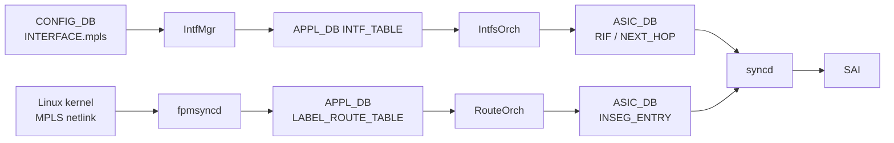

<!-- topics-tip -->
!!! tip "Topics で読み物として読む"
    この HLD は実装詳細を含みます。機能の概念・設定・運用を読み物として読みたい場合は [Topics 04 章: VRF / ECMP / 経路選択](../topics/04-vrf-ecmp/index.md) を参照。
<!-- /topics-tip -->

!!! success "裏取りステータス: code-verified"
    fpmsyncd MPLS: `sonic-swss/fpmsyncd/routesync.cpp` L158 (`APP_LABEL_ROUTE_TABLE_NAME` ProducerStateTable), L2066 (`AF_MPLS`), L2914 (`LWTUNNEL_ENCAP_MPLS`), L2936 (`RTA_NEWDST` = MPLS NH label stack) を確認。

# SONiC の MPLS 基盤

## 読み手が知りたいこと

- [SONiC](../reference/glossary.md#term-sonic) で [MPLS](../reference/glossary.md#term-mpls) が動く範囲はどこまでか（静的 LSP か、LDP / RSVP-TE まで含むのか）
- per-[RIF](../reference/glossary.md#term-rif) で MPLS を on/off する設定はどこに入るか
- ラベル経路は kernel → [APPL_DB](../reference/glossary.md#term-appl_db) → [ASIC](../reference/glossary.md#term-asic) のどの経路で流れるか
- [CRM](../reference/glossary.md#term-crm) や CLI、ASIC リソース監視は何が増えるか

## スコープ（静的 LSP 中心）

SONiC の初期 MPLS 対応は **静的 LSP** を前提に、IPv4/IPv6 routing インフラを MPLS にも拡げる方針[^1]:

1. **per-RIF で MPLS を enable/disable**
2. **Push / Pop / Swap** ラベル操作（implicit-null / explicit-null 対応）
3. **bulk MPLS in-segment entry の [SAI](../reference/glossary.md#term-sai) programming**
4. **CRM** に MPLS 系リソースを統合

LDP / RSVP-TE 等の動的シグナリングと L3VPN / [EVPN](../reference/glossary.md#term-evpn)-MPLS は **scope 外**（Future Requirements）[^1]。

## データフロー



要点[^1]:

- ラベル経路は **kernel → [fpmsyncd](../reference/glossary.md#term-fpmsyncd) → APPL_DB** が基本（[FRR](../reference/glossary.md#term-frr) ldpd / staticd / cRPD 等から流れる）
- IntfMgr は [CONFIG_DB](../reference/glossary.md#term-config_db) の MPLS フラグを APPL_DB へ伝搬
- RouteOrch が `LABEL_ROUTE_TABLE` を読み INSEG_ENTRY 化
- **bulk SAI API** で大量 in-segment エントリを効率的に programming

## スキーマ追加

### CONFIG_DB

```text
INTERFACE|<intf>           mpls = "enable" | "disable"
VLAN_INTERFACE|<intf>      mpls = ...
PORTCHANNEL_INTERFACE|<>   mpls = ...
CRM | Config              <MPLS 関連 threshold>
```

per-RIF で MPLS 許否を切り替える単純フラグ[^1]。

### APPL_DB

既存 `INTF_TABLE` / `ROUTE_TABLE` に加えて新規:

```text
LABEL_ROUTE_TABLE:<incoming_label>
  nexthop  = "<ip1>,<ip2>,..."
  ifname   = "<intf1>,<intf2>,..."
  mpls_pop = "1" | "2" | ...    # POP 段数
  mpls_nh  = "push:<L>"          # 出力時 PUSH ラベル
```

### ASIC_DB / SAI

- `SAI_OBJECT_TYPE_INSEG_ENTRY`（ingress label に対する処理ルール）
- `SAI_OBJECT_TYPE_NEXT_HOP` の MPLS 対応 type
- `SAI_OBJECT_TYPE_ROUTER_INTERFACE` の MPLS 属性

## 内部表現と CRM

`Label` / `LabelStack` クラスで push/pop/swap 操作を抽象化し、`NextHopKey` に MPLS 情報を埋めて NeighOrch / RouteOrch で nexthop 解決時に MPLS 文脈を保つ[^1]。

CRM の追加監視対象[^1]:

- in-segment entry 数
- per-NH MPLS label stack 数

`config crm thresholds ...` で既存閾値設定枠組みに乗る。

## CLI

```bash
config interface mpls add <intf>     # enable
config interface mpls remove <intf>  # disable
show mpls
show mpls route
```

CLI 名称は [HLD](../reference/glossary.md#term-hld) で完全には固定されていない[^1]。

## 設定

### 関連する CONFIG_DB

| Table | Key | フィールド |
|-------|-----|------------|
| `INTERFACE` / `VLAN_INTERFACE` / `PORTCHANNEL_INTERFACE` | `<intf>` | `mpls` (`enable`/`disable`) |
| `CRM` | `Config` | MPLS 系 threshold |

### 設定例

```bash
sudo config interface mpls add Ethernet0
sudo config interface mpls add PortChannel0001

# 静的 LSP（cRPD / staticd / iproute2 経由で kernel に投入）
ip -f mpls route add 100 as 200 via inet 10.0.0.2

show mpls route
```

## 制限事項

- 初期実装は **静的 LSP** が主シナリオ
- **LDP / RSVP-TE / MPLS-VPN は scope 外**
- per-RIF の disable は ASIC 側で MPLS を選択的有効化できる前提（ベンダ SAI 依存）
- HLD は 2021-12 Rev 1.0 で "final"。以降の進化（cRPD MPLS / EVPN-MPLS）は別 HLD
- warm-boot で実 LSP を保持するには MPLS state save 実装が必要

## 干渉する機能

- **FRR / cRPD**: 動的に静的 LSP を流すには `staticd` MPLS 拡張または cRPD LDP 等が必要
- **CRM**: 新規リソース監視
- **EVPN / [VXLAN](../reference/glossary.md#term-vxlan)**: MPLS は別 encapsulation（共存はベンダ依存）
- **fpmsyncd**: kernel MPLS netlink を APPL_DB に橋渡し
- **interface MTU**: MPLS ラベル分 MTU を消費するので隣接と整合

## トラブルシューティング

```bash
# RIF が MPLS enabled か
redis-cli -n 4 HGETALL "INTERFACE|Ethernet0"
sysctl net.mpls.platform_labels

# label route が APPL_DB に届いているか
redis-cli -n 0 KEYS "LABEL_ROUTE_TABLE:*" | head

# SAI レベル
redis-cli -n 1 KEYS "ASIC_STATE:SAI_OBJECT_TYPE_INSEG_ENTRY:*" | head

# CRM
crm show resources mpls
```

## 関連 Topic

- [17 SRv6 / MPLS / concept](../topics/17-srv6-mpls/concept.md)
- [17 SRv6 / MPLS / internals](../topics/17-srv6-mpls/internals.md)
- [04 VRF & ECMP / architecture](../topics/04-vrf-ecmp/architecture.md)

## 引用元

[^1]: `sonic-net/SONiC` `doc/mpls/MPLS_hld.md` @ `49bab5b5ff0e924f1ea52b3d9db0dfa4191a7c06`

<!-- topics-back-ref -->
## 関連 Topics

- [Topics: SRv6 / MPLS / Path Tracing](../topics/17-srv6-mpls/index.md)

<!-- /topics-back-ref -->

<!-- glossary-links-injected: ec18b66e3507 -->
