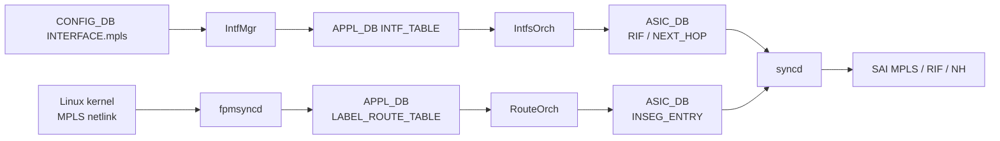

!!! info "裏取りステータス: HLD-only"
    HLD は Rev 1.0 (2021-12)。`fpmsyncd` の MPLS netlink 解釈、`LABEL_ROUTE_TABLE` の APPL_DB スキーマ、`SAI_INSEG_ENTRY` 系 SAI API のベンダ実装、`config interface mpls` CLI の sonic-utilities 取り込みは未確認。

# SONiC の MPLS 基盤（per-RIF MPLS / LABEL_ROUTE_TABLE / 静的 LSP）

## 概要

SONiC の初期 MPLS 対応は **静的 LSP** を前提に「IPv4/IPv6 routing インフラを MPLS にも拡げる」ことを狙う[^1]:

1. **per-RIF で MPLS を enable/disable**（明示的に許可した interface でのみ MPLS を扱う）
2. **Push / Pop / Swap** ラベル操作。implicit-null / explicit-null も対応
3. **bulk MPLS in-segment entry の SAI programming** をサポート
4. CRM（Critical Resource Monitoring）に MPLS 系リソースを統合

LDP / RSVP-TE 等の動的シグナリングは初期 scope 外（**Future Requirements**）[^1]。

## 動作仕様

### スキーマ追加

#### CONFIG_DB

```
INTERFACE|<intf>           mpls = "enable" | "disable"
VLAN_INTERFACE|<intf>      mpls = ...
PORTCHANNEL_INTERFACE|<>   mpls = ...
CRM | Config              <MPLS 関連リソースの threshold>
```

per-RIF で MPLS を許す/禁じる単純なフラグ[^1]。

#### APPL_DB

`INTF_TABLE`（既存）+ `ROUTE_TABLE`（既存）に加え、新規:

```
LABEL_ROUTE_TABLE:<incoming_label>
  nexthop = "<ip1>,<ip2>,..."
  ifname  = "<intf1>,<intf2>,..."
  mpls_pop = "1" | "2" | ...     # POP の段数
  mpls_nh  = "push:<L>"           # 出力時の PUSH ラベル
```

#### ASIC_DB

新規 SAI object:

- `SAI_OBJECT_TYPE_INSEG_ENTRY`（ingress label に対応する処理ルール）
- `SAI_OBJECT_TYPE_NEXT_HOP` の **MPLS 対応** type
- `SAI_OBJECT_TYPE_ROUTER_INTERFACE` の MPLS 関連属性

### コンポーネント間の流れ



要点[^1]:

- ラベル経路は **kernel → fpmsyncd → APPL_DB** が基本ルート（FRR ldpd / staticd / cRPD 等から流れてくる経路）
- IntfMgr は CONFIG_DB の MPLS フラグを APPL_DB に伝搬
- `RouteOrch` が `LABEL_ROUTE_TABLE` を読み INSEG_ENTRY 化
- bulk SAI API で **大量の in-segment エントリを効率良く** programming

### Label / LabelStack 内部表現

`Label` クラス + `LabelStack` 構造で push/pop/swap 操作を表現[^1]。`NextHopKey` に MPLS 情報を埋めて NeighOrch / RouteOrch で next hop 解決時に MPLS 文脈を保つ。

### CRM

MPLS 関連で CRM が監視する追加リソース[^1]:

- in-segment entry 数
- per-NH MPLS label stack 数

`config crm thresholds ...` で閾値を設定する既存の枠組みに乗る。

<!-- evidence:
source: sonic-net/SONiC/doc/mpls/MPLS_hld.md#L97-L102 (sha: 49bab5b5ff0e924f1ea52b3d9db0dfa4191a7c06)
excerpt: |
  Support for MPLS enable/disable per RIF.
  Support for MPLS Push, Pop, and Swap label operations, including MPLS implicit-null and explicit-null behavior.
  Support for bulk MPLS in-segment entry SAI programming.
reasoning: 機能要件 (per-RIF, push/pop/swap, bulk) の根拠。
-->

### CLI

```
config interface mpls add <intf>     # enable
config interface mpls remove <intf>  # disable
show mpls
show mpls route
```

具体的な CLI 名称は HLD で完全には固定されていない。

### 実装外（Future）

- LDP / RSVP-TE 等の **dynamic LSP signaling**[^1]
- MPLS VPN（L3VPN / EVPN-MPLS）は本 HLD の対象外。後続 HLD で扱う

## 設定

### 関連する CONFIG_DB

| Table | Key | フィールド |
|-------|-----|------------|
| `INTERFACE` / `VLAN_INTERFACE` / `PORTCHANNEL_INTERFACE` | `<intf>` | `mpls` (`enable`/`disable`) |
| `CRM` | `Config` | MPLS 系 threshold |

### 関連する CLI

`config interface mpls`、`show mpls`

### 設定例

```bash
sudo config interface mpls add Ethernet0
sudo config interface mpls add PortChannel0001

# kernel route で静的 LSP を仕込む（cRPD / staticd / iproute2）
ip -f mpls route add 100 as 200 via inet 10.0.0.2

show mpls route
```

## 制限事項

- 初期実装は **静的 LSP** が主シナリオ[^1]
- LDP / RSVP-TE / MPLS-VPN は scope 外
- per-RIF の disable は ASIC 側で MPLS 機能を選択的に有効化できる前提（ベンダ SAI 依存）
- HLD は 2021-12 で Rev 1.0 が "final"。以降の進化（cRPD MPLS, EVPN-MPLS）の追加は別 HLD
- warm-boot は HLD で言及。実 LSP の保持は実装側の MPLS state save に依存

## 干渉する機能

- **FRR / cRPD**: 動的に静的 LSP を流すには FRR `staticd` の MPLS 拡張または cRPD の LDP 等が必要
- **CRM**: 新規リソース監視
- **EVPN / VXLAN**: MPLS は別 encapsulation
- **`fpmsyncd`**: kernel の MPLS netlink を APPL_DB に橋渡し
- **interface MTU**: MPLS ラベルスタックぶん MTU を消費するので隣接ノードと整合

## トラブルシューティング

```bash
# RIF が MPLS enabled か
redis-cli -n 4 HGETALL "INTERFACE|Ethernet0"
# kernel
sysctl net.mpls.platform_labels

# label route の APPL_DB 反映
redis-cli -n 0 KEYS "LABEL_ROUTE_TABLE:*" | head

# SAI レベル
redis-cli -n 1 KEYS "ASIC_STATE:SAI_OBJECT_TYPE_INSEG_ENTRY:*" | head

# CRM
crm show resources mpls
```

## 引用元

[^1]: `sonic-net/SONiC` `doc/mpls/MPLS_hld.md` @ `49bab5b5ff0e924f1ea52b3d9db0dfa4191a7c06`
