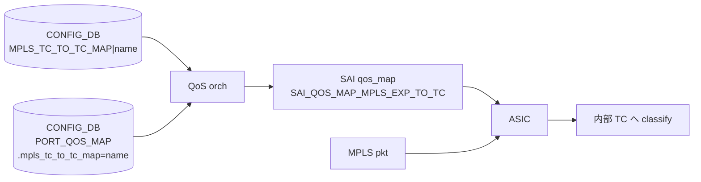

<!-- topics-tip -->
!!! tip "Topics で読み物として読む"
    この HLD は実装詳細を含みます。機能の概念・設定・運用を読み物として読みたい場合は [Topics 08 章: QoS / Buffer / PFC / Watermark](../topics/08-qos-buffer/index.md) を参照。
<!-- /topics-tip -->

!!! note "裏取りステータス: code-verified"
    verifier-batch-18 で確認:

    - `sonic-swss/orchagent/qosorch.cpp:82, 101, 1330` で `CFG_MPLS_TC_TO_TC_MAP_TABLE_NAME` を `m_qos_handler_map` に登録し、`mpls_tc_to_tc_field_name` を PORT_QOS_MAP のフィールド名として参照、`QosOrch::handleMplsTcToTcTable` をハンドラとして紐付け
    - テストは `sonic-swss/tests/test_qos_map.py:45,483` および `tests/mock_tests/qosorch_ut.cpp:439` で `MPLS_TC_TO_TC_MAP` table を直接操作
    - YANG モデル（sonic-port-qos-map）追加状況は sonic-yang-models 側で別途確認のこと

# MPLS TC → TC map（MPLS パケットの QoS classification）

## 概要

[SONiC](../reference/glossary.md#term-sonic) の [QoS](../reference/glossary.md#term-qos) は [DSCP](../reference/glossary.md#term-dscp) / DOT1P / TC の各値間でマップを定義し、[CONFIG_DB](../reference/glossary.md#term-config_db) の `*_TO_*_MAP` テーブルとポート毎の `PORT_QOS_MAP` を介して [SAI](../reference/glossary.md#term-sai) に降ろす設計を取っている。本 [HLD](../reference/glossary.md#term-hld) は **[MPLS](../reference/glossary.md#term-mpls) パケットの TC（Traffic Class、旧称 EXP、RFC 5462）** から内部 TC へのマップを既存 QoS フローに追加する[^1]。

これにより、**MPLS でトンネル化されたトラフィックに対しても通常の QoS 機構が適用** できるようになる。SAI 自体は既に `SAI_QOS_MAP_MPLS_EXP_TO_TC` をサポートしており、本 HLD の作業は **SONiC スタック側の対応（CONFIG_DB スキーマ → [orchagent](../reference/glossary.md#term-orchagent) → CLI）** が中心[^1]。

> 名称について: HLD 0.2 で **「MPLS EXP」を「MPLS TC」に統一**（RFC 5462 準拠）されている[^1]。

## 動作仕様

### 全体像



旧 `DSCP_TO_TC_MAP` と同じパターン[^1]:

1. `MPLS_TC_TO_TC_MAP|<name>` で実マップを定義。
2. `PORT_QOS_MAP|<port>` の `mpls_tc_to_tc_map` フィールドにマップ名を設定して bind。
3. orchagent が SAI の qos_map オブジェクト（`SAI_QOS_MAP_ATTR_TYPE == SAI_QOS_MAP_MPLS_EXP_TO_TC`）に変換して降ろす。

### CONFIG_DB スキーマ

新テーブル `MPLS_TC_TO_TC_MAP`[^1]:

```text
key   = "MPLS_TC_TO_TC_MAP|"<name>
field = mpls_tc_value (1桁以上の数値)
value = tc_value      (1桁以上の数値)
```

スキーマ例[^1]:

```text
127.0.0.1:6379> hgetall "MPLS_TC_TO_TC_MAP|Mpls_tc_to_tc_map1"
 1) "3"   ; mpls tc
 2) "3"   ; tc
 3) "6"
 4) "5"
 5) "7"
 6) "5"
```

つまり `(mpls_tc -> tc)` の写像。MPLS TC は 3 bit なので値域は 0〜7。

### `PORT_QOS_MAP` の拡張

ポート bind は `PORT_QOS_MAP` の **新フィールド `mpls_tc_to_tc_map`** で行う[^1]。値は `MPLS_TC_TO_TC_MAP|<name>` のキー名。既存の `dscp_to_tc_map` フィールドと並列に存在する形。

### orchagent の拡張

`sonic-swss` の QoS orch に **MPLS TC → TC 用ハンドラを追加** する。基本構造は DSCP → TC 用と同じだが、追加バリデーションが入る[^1]:

- **値の数値範囲チェック**: `mpls_tc_value` / `tc_value` が想定範囲内か。
- **重複マッピング禁止**: 同一の `mpls_tc_value` が **複数の `tc_value` にマップされていない** ことを保証。
- **誤設定の error log**: ユーザに気付かせるためのデバッグログを出す。

`PORT_QOS_MAP` 側の新フィールドも QoS orch が扱うよう拡張される[^1]。

### sonic-swss-common

`sonic-swss-common` のスキーマに `CFG_MPLS_TC_TO_TC_MAP_TABLE_NAME` の `#define`（C++ レベル）が追加される[^1]。テーブル名 `MPLS_TC_TO_TC_MAP` を 1 か所で管理するため。

### sonic-utilities

`sonic-utilities` の CLI で **DSCP → TC マップと同等のサポート** を提供する。具体的には `config reload` / `config clear` の対象に新マップが加わる[^1]。

### SAI

SAI は **既に対応済み**（`SAI_QOS_MAP_MPLS_EXP_TO_TC` の qos_map type、および port attribute としての設定経路）。SAI 側の追加実装は不要[^1]。

<!-- evidence:
source: sonic-net/SONiC/doc/qos/mpls_tc_to_tc_map.md#L62-L83 (sha: 49bab5b5ff0e924f1ea52b3d9db0dfa4191a7c06)
excerpt: |
  MPLS_TC_TO_TC_MAP
   SAI mapping - qos_map object with SAI_QOS_MAP_ATTR_TYPE == sai_qos_map_type_t::SAI_QOS_MAP_MPLS_EXP_TO_TC
   key        = "MPLS_TC_TO_TC_MAP|"name
   field    value
   mpls_tc_value = 1*DIGIT
   tc_value      = 1*DIGIT
  In order to allow a user to bind such a map to a port, the existing PORT_QOS_MAP table will be enhanced to allow a new field-value pair, where the field is going to be named mpls_tc_to_tc_map
reasoning: 新テーブルのスキーマと PORT_QOS_MAP への field 追加・SAI 対応 type の根拠。
-->

<!-- evidence-rendered:start -->
??? note "📋 検証エビデンス: sonic-net/SONiC/doc/qos/mpls_tc_to_tc_map.md#L62-L83 (sha: 49bab5b5ff0e924f1ea52b3d9db0dfa4191a7c06)"

    **出典**:

    `sonic-net/SONiC/doc/qos/mpls_tc_to_tc_map.md#L62-L83 (sha: 49bab5b5ff0e924f1ea52b3d9db0dfa4191a7c06)`

    **抜粋**:

    ```text
    MPLS_TC_TO_TC_MAP
     SAI mapping - qos_map object with SAI_QOS_MAP_ATTR_TYPE == sai_qos_map_type_t::SAI_QOS_MAP_MPLS_EXP_TO_TC
     key        = "MPLS_TC_TO_TC_MAP|"name
     field    value
     mpls_tc_value = 1*DIGIT
     tc_value      = 1*DIGIT
    In order to allow a user to bind such a map to a port, the existing PORT_QOS_MAP table will be enhanced to allow a new field-value pair, where the field is going to be named mpls_tc_to_tc_map
    ```

    **判断根拠**: 新テーブルのスキーマと PORT_QOS_MAP への field 追加・SAI 対応 type の根拠。

<!-- evidence-rendered:end -->

## 設定

### 関連する CONFIG_DB

| Table | Key | フィールド | 用途 |
|-------|-----|-----------|------|
| `MPLS_TC_TO_TC_MAP` | `<name>` | `<mpls_tc>` → `<tc>` の hash | MPLS TC → 内部 TC の写像定義 |
| `PORT_QOS_MAP` | `<port>` | `mpls_tc_to_tc_map` | bind するマップ名 |

### 関連する CLI

| Command | 用途 |
|---------|------|
| `config reload` | MPLS_TC_TO_TC_MAP を含む config 全体を流し込む |
| `config clear` | クリア対象に MPLS_TC_TO_TC_MAP も含む |

**MPLS TC マップを直接編集する `config qos` 系のコマンドは存在しない**（後述の制限事項）[^1]。

### 設定例（CONFIG_DB JSON）

```json
{
  "MPLS_TC_TO_TC_MAP": {
    "Mpls_tc_to_tc_map1": {
      "0": "0",
      "1": "1",
      "2": "2",
      "3": "3",
      "4": "4",
      "5": "5",
      "6": "5",
      "7": "5"
    }
  },
  "PORT_QOS_MAP": {
    "Ethernet0": {
      "mpls_tc_to_tc_map": "Mpls_tc_to_tc_map1"
    }
  }
}
```

設定は `config reload` で投入する[^1]。

## 制限事項

HLD で明示されている制限[^1]:

- **CLI でマップを直接編集できない**。`config reload` 経由のみ。
- **per-switch / per-inseg のマップ設定はできない**。あくまで `PORT_QOS_MAP` を介した **port 単位** でのみ bind できる。

加えて HLD 上の留意点:

- **[YANG](../reference/glossary.md#term-yang) model**: HLD 上は CLI / YANG 双方の拡張に言及されているが、**直接の YANG モジュール変更の詳細は本 HLD では未定義**。
- warm boot / fast boot / scalability への影響は **無し** と HLD は明言[^1]。

## 干渉する機能

- **`DSCP_TO_TC_MAP` / `DOT1P_TO_TC_MAP`**: 同じ `PORT_QOS_MAP` 上で並列に bind される他の TC 入力マップ。MPLS パケットでは MPLS TC → TC が、IP/L2 では DSCP/DOT1P → TC が使われるという入力経路の違い。SAI 側で `SAI_QOS_MAP_*_TO_TC` の各 type が独立して扱われる。
- **`PORT_QOS_MAP`**: 既存フィールド（`dscp_to_tc_map`, `tc_to_pg_map` 等）と新フィールド `mpls_tc_to_tc_map` が共存する。orchagent の bind 順序は HLD 上明示なし。
- **MPLS forwarding 機能全般**: 本 HLD は **classification（入口で TC を決める）部分のみ**。MPLS ラベル imposition 時の **TC → MPLS TC のリマーク** は別マップ系統で扱われる（本 HLD のスコープ外）。
- **`config reload` のフロー**: マップ追加 / 変更時にデバイス全体の reload が必要になりうる点が、運用上のコスト[^1]。

## トラブルシューティング

- マップが効かない: `PORT_QOS_MAP|<port>` に `mpls_tc_to_tc_map` フィールドが入っているか確認。`MPLS_TC_TO_TC_MAP|<name>` の存在も併せて確認。
- 値が反映されない: `config reload` を実行したか確認。本 HLD は CLI 直接編集を禁じているため[^1]、再ロード必須。
- orchagent ログにバリデーションエラー: 同じ `mpls_tc_value` が複数の `tc_value` にマップされている、または範囲外の数値を入れている可能性[^1]。
- SAI 側で qos_map 作成失敗: SAI / sairedis 側のサポートは前提だが、ベンダ SAI が `SAI_QOS_MAP_MPLS_EXP_TO_TC` を未実装の場合は降ろせない。`syncd` のログを確認。

### コマンド例

MPLS TC->TC マッピングと QoS 設定を確認する。

```bash
show qos map mpls-tc-to-tc
redis-cli -n 4 keys 'MPLS_TC_TO_TC_MAP*'
show interfaces qos
```

## 引用元

[^1]: `sonic-net/SONiC` `doc/qos/mpls_tc_to_tc_map.md` @ `49bab5b5ff0e924f1ea52b3d9db0dfa4191a7c06`

<!-- topics-back-ref -->
## 関連 Topics

- [Topics: QoS / Buffer / PFC / Watermark](../topics/08-qos-buffer/index.md)
- [Topics: SRv6 / MPLS / Path Tracing](../topics/17-srv6-mpls/index.md)

<!-- /topics-back-ref -->

<!-- glossary-links-injected: 8ba32e5aa69d -->
