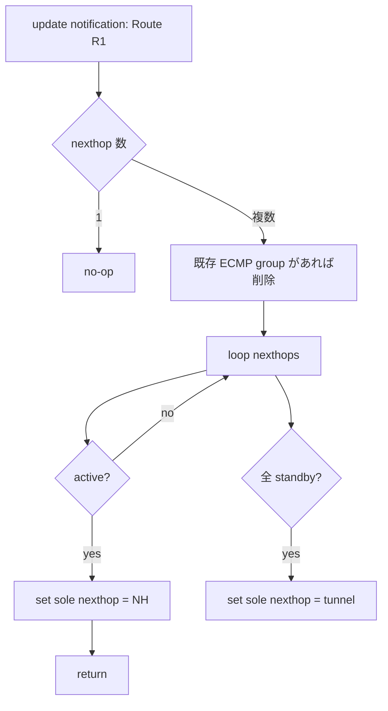
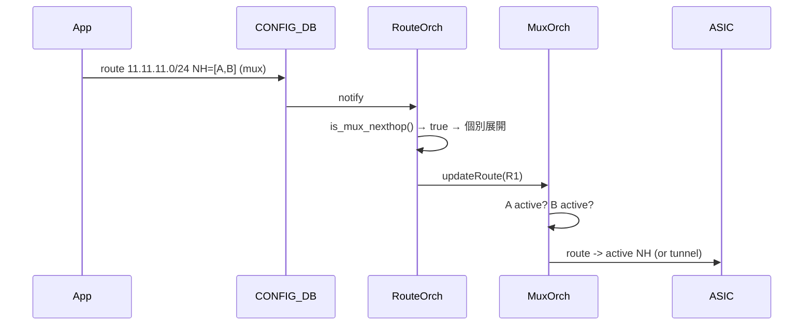

<!-- topics-tip -->
!!! tip "Topics で読み物として読む"
    この HLD は実装詳細を含みます。機能の概念・設定・運用を読み物として読みたい場合は [Topics 04 章: VRF / ECMP / 経路選択](../topics/04-vrf-ecmp/index.md) を参照。
<!-- /topics-tip -->

!!! success "裏取りステータス: code-verified"
    `sonic-swss/orchagent/muxorch.cpp` L1585 `MuxOrch::updateRoute(const IpPrefix &pfx)`、L2058 `MuxOrch::containsNextHop()`、L1824/1926/2019/2045/2050 の `mux_nexthop_tb_` 出入り、L700 `MuxCable::updateRoutes()` / L724 `MuxCable::updateRoutesForNextHop()` から `mux_orch_->updateRoute(rt->prefix)` が駆動される経路を確認 (verified at: 2026-05-09)。

# dual-tor mux 跨ぎの multi-nexthop route ループ回避（`MuxOrch::updateRoute`）

## なぜ必要か

Gemini active-standby サーバ環境では **1 経路に複数の next-hop neighbor** が指定され、それぞれが **異なる Ethernet ポート (= 異なる mux)** に居る場合、片方の port が UT0 で active、もう片方が LT0 で active という非対称が起きる。すなわち **同一 ToR 内で 1 つは active neighbor、もう 1 つは standby neighbor** という構成になる[^1]。

このとき [ECMP](../reference/glossary.md#term-ecmp) の半分が standby 側 nexthop に当たり、**peer ToR の tunnel** に流れ、peer ToR でも ECMP で半分が元 ToR に戻り、無限ループ（実質パケロス）が起きる[^1]。

```text
Neighbor 192.168.0.100 on Ethernet0 (Active on this ToR, Standby on peer)
Neighbor 192.168.0.101 on Ethernet4 (Standby on this ToR, Active on peer)
Route   11.11.11.0/24  nexthops 192.168.0.100, 192.168.0.101
                                ↑                ↑
                                ここで standby を含む ECMP がループ原因
```

## どう動くか

### `updateRoute()` のロジック

`MuxOrch` に `updateRoute(Route R1)` を追加し、route の next-hop が複数ある場合 **active が 1 つでもあればその 1 つに絞る**[^1]:

```c++
UpdateRoute(Route R1) {
  if (R1 has more than 1 nexthops) {
    if (ECMP group exists with nexthops) { remove stale ECMP group; }
    for (NH in nexthops) {
      if (NH is active) {
        set route nexthop to NH;
        return;
      }
    }
    // active 不在
    set route nexthop to tunnel;
  }
}
```

優先順位[^1]:

| 状態 | 動作 |
|------|------|
| nexthop 1 つ | no-op |
| nexthop 複数 + active 1 個以上 | **最初に見つかった active を sole nexthop** |
| nexthop 複数 + 全 standby | **tunnel を sole nexthop**（peer ToR へ encap） |



### `RouteOrch` 側の補強

`updateRoute()` が機能するには `m_nextHops` (Route → NextHop 群キャッシュ) に mux neighbor が **個別展開** されている必要がある。既存実装では group 内 next-hop は個別エントリにならず、state 遷移時にループできない[^1]。

`routeorch.cpp` に `nextHops.is_mux_nexthop()` 判定を追加し、mux neighbor から成る group を解凍する[^1]:

```c++
if (ctx.nhg_index.empty() && nextHops.getSize() == 1 &&
    !nextHops.is_overlay_nexthop() && !nextHops.is_srv6_nexthop() ||
    nextHops.is_mux_nexthop())
{
    for (auto it : nextHops.getNextHops()) {
        if (!it.ip_address.isZero())
            addNextHopRoute(it, r_key);
    }
}
```

`is_mux_nexthop()` は `NextHopGroupKey` のメソッドで、group 内のいずれかが mux neighbor なら true。**「group の neighbor は ALL mux か NONE mux」** という前提で、混在は想定しない[^1]。

### `MuxOrch::containsNextHop()`

mux neighbor 判定のため `MuxOrch` に追加[^1]:

```c++
bool MuxOrch::containsNextHop(NextHopKey nh) {
    return mux_nexthop_tb_.find(nh) != mux_nexthop_tb_.end();
}
```

### 駆動経路



`MuxOrch` は `linkmgrd` 由来の state 変化通知でも **影響を受ける全 route について `updateRoute()` を再評価** する[^1]。

## 設定

[CONFIG_DB](../reference/glossary.md#term-config_db) / CLI / [YANG](../reference/glossary.md#term-yang) **変更なし**。dual-tor の既存設定 (`MUX_CABLE` / `cable_type=active-standby` 等) のまま、[orchagent](../reference/glossary.md#term-orchagent) 内部挙動だけ変わる。

```bash
sonic-db-cli ASIC_DB keys 'ASIC_STATE:SAI_OBJECT_TYPE_ROUTE_ENTRY:*11.11.11.0/24*'
```

## 制限事項

- **ECMP は実質的に無効化**。active が複数あっても **最初の 1 つだけ** を選び、帯域は ECMP の 1/N に縮退[^1]
- **同一 group 内に mux と非 mux の混在は不可**[^1]
- 全 nexthop standby 時は **tunnel route** にフォールバック、peer ToR active 前提
- active fallback は **「最初に見つかった active」** で固定、負荷分散の意味なし
- `m_nextHops` キャッシュ整合性が崩れると古い NH に traffic が流れる risk

## 干渉する機能

- **`MuxOrch`**: `updateRoute()` を新設、neighbor / tunnel と密結合
- **`RouteOrch`**: `is_mux_nexthop()` 判定で個別展開
- **`linkmgrd` 状態通知**: state 遷移ごとに `updateRoute()` を駆動
- **`TunnelOrch`**: 全 standby 時の tunnel nexthop 供給
- **既存 ECMP 経路**: dual-tor mux 環境では実質無効化

## トラブルシューティング

- 経路ループ → [ASIC_DB](../reference/glossary.md#term-asic_db) で nexthop が単一に絞られているか、`MuxOrch` ログで `updateRoute()` 呼び出し確認
- nexthop が **常に tunnel** → `show muxcable status` で active/standby 確認
- nexthop group のまま → `is_mux_nexthop()` が false。`mux_nexthop_tb_` 登録確認
- ECMP したい → 本 [HLD](../reference/glossary.md#term-hld) は **mux nexthop ECMP を許容しない** 設計

### コマンド例

複数 nexthop 経路 (ECMP) の登録と分散を確認する。

```bash
show ip route summary
redis-cli -n 0 keys 'ROUTE_TABLE*' | head
redis-cli -n 1 hgetall 'ASIC_STATE:SAI_OBJECT_TYPE_NEXT_HOP_GROUP*' 2>/dev/null | head
```

## 関連トピック

- [Topics: Dual-ToR](../topics/05-dual-tor/index.md) — active-standby と mux の全体像
- [Topics: VRF / ECMP](../topics/04-vrf-ecmp/index.md) — ECMP と next-hop group の文脈
- [prefix-based-mux-neighbors](prefix-based-mux-neighbors.md)
- [overlay-ecmp-enhancements](overlay-ecmp-enhancements.md)

## 引用元

[^1]: `sonic-net/SONiC` `doc/dualtor/multiple_nexthop_route_hld.md` @ `49bab5b5ff0e924f1ea52b3d9db0dfa4191a7c06`

<!-- concerns hint:
- MuxOrch::updateRoute() の現行 master 実装存在確認 (sonic-swss/orchagent/muxorch.cpp)
- MuxOrch::containsNextHop() と mux_nexthop_tb_ の取り込み確認
- NextHopGroupKey::is_mux_nexthop() の存在と判定ロジック確認
- routeorch.cpp で is_mux_nexthop() ベースに m_nextHops に個別展開する分岐の取り込み確認
- linkmgrd の state 変化が MuxOrch::updateRoute を駆動する経路の確認
-->

<!-- topics-back-ref -->
## 関連 Topics

- [Topics: Dual-ToR と Mux 制御](../topics/05-dual-tor/index.md)

<!-- /topics-back-ref -->

<!-- glossary-links-injected: c099de103a59 -->
