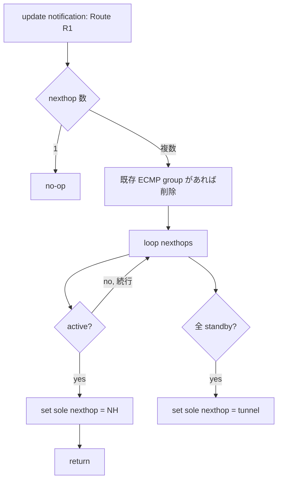
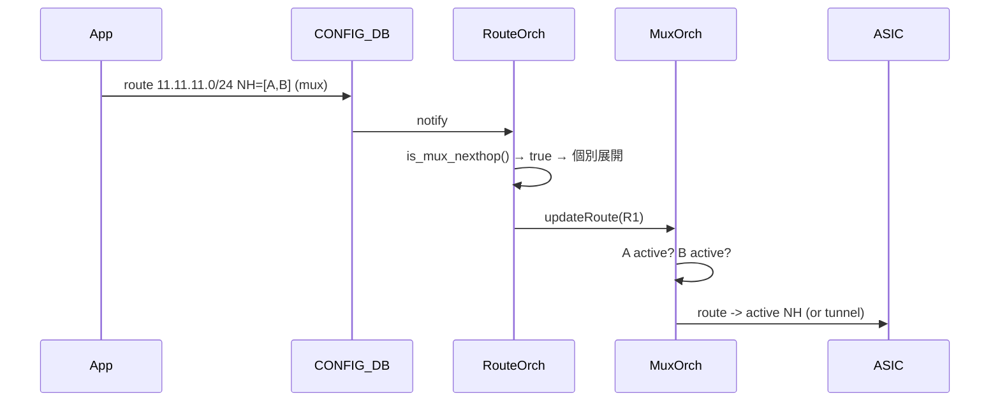

!!! success "裏取りステータス: Code-verified"
    `sonic-swss/orchagent/muxorch.cpp` L1585 `MuxOrch::updateRoute(const IpPrefix &pfx)`、L2058 `MuxOrch::containsNextHop()`、L1824/1926/2019/2045/2050 の `mux_nexthop_tb_` 出入り、L700 `MuxCable::updateRoutes()` / L724 `MuxCable::updateRoutesForNextHop()` から `mux_orch_->updateRoute(rt->prefix)` が駆動される経路を確認 (verified at: 2026-05-09)。

# dual-tor mux 跨ぎの multi-nexthop route ループ回避（`MuxOrch::updateRoute`）

## 概要

Gemini active-standby サーバ環境では、**1 経路に複数の next-hop neighbor** が指定されるシナリオが存在する。それぞれの neighbor が **異なる Ethernet ポート (= 異なる mux)** に居る場合、片方の port が UT0 で active、もう片方が LT0 で active といった状況が起きる。すなわち **同一 ToR 内で 1 つは active neighbor、もう 1 つは standby neighbor** という非対称が発生する[^1]。

このとき ECMP の半分のパケットが standby 側 nexthop に当たり、**peer ToR への tunnel** に流れ、peer ToR で再び ECMP で半分が元 ToR に戻り無限ループ（実質的にはわずかなパケロス）が起きる[^1]。

本 HLD は **MuxOrch に `updateRoute()` を追加** し、route の next-hop が複数あるとき **active が 1 つでもあればその 1 つに絞る** ロジックで ECMP を抑制する。

```text
Neighbor 192.168.0.100 on Ethernet0 (Active on this ToR, Standby on peer)
Neighbor 192.168.0.101 on Ethernet4 (Standby on this ToR, Active on peer)
Route   11.11.11.0/24  nexthops 192.168.0.100, 192.168.0.101
                                ↑                ↑
                                ここで standby を含む ECMP がループ原因
```

## 動作仕様

### `updateRoute()` のロジック

`MuxOrch` に `updateRoute(Route R1)` を追加[^1]:

```c++
UpdateRoute(Route R1) {
  if (R1 has more than 1 nexthops) {
    if (ECMP group exists with nexthops) { remove stale ECMP group; }
    for (NH in nexthops) {
      if (NH is active) {
        set route nexthop to NH;
        return;
      }
    }
    // active 不在
    set route nexthop to tunnel;
  }
}
```

つまり次の優先順位で 1 つだけを ASIC に置く[^1]:

| 状態 | 動作 |
|------|------|
| nexthop が 1 つ | no-op（既存挙動を維持） |
| nexthop 複数 + active が 1 つ以上 | **最初に見つかった active を sole nexthop に設定** |
| nexthop 複数 + 全 standby | **tunnel を sole nexthop に設定**（peer ToR へ encap） |

### ECMP group の事前削除

既存の ECMP next-hop group が ASIC に programming 済みの場合、`updateRoute()` は先に `RouteOrch` に削除を依頼する[^1]:

```c++
if (gRouteOrch->hasNextHopGroup(nextHops)) {
    NextHopGroupKey nhg_key(nextHops);
    gRouteOrch->removeNextHopGroup(nhg_key);
}
```

これで「ECMP のエントリ」を「単一 nexthop のエントリ」へ振り替える。



### `RouteOrch` 側の補強

`updateRoute()` が機能するためには **`m_nextHops` (Route → NextHop 群のキャッシュ)** に mux neighbor が **個別に展開** されている必要がある。既存実装では nexthop group は `m_nextHops` に個別 next-hop として入らず、`updateRoute()` が状態遷移時にループできない[^1]。

`routeorch.cpp` に **`nextHops.is_mux_nexthop()` の判定** を追加して、mux neighbor から成る group を解凍する[^1]:

```c++
if (ctx.nhg_index.empty() && nextHops.getSize() == 1 &&
    !nextHops.is_overlay_nexthop() && !nextHops.is_srv6_nexthop() ||
    nextHops.is_mux_nexthop())
{
    RouteKey r_key = { vrf_id, ipPrefix };
    for (auto it : nextHops.getNextHops()) {
        if (!it.ip_address.isZero())
            addNextHopRoute(it, r_key);
    }
}
```

`is_mux_nexthop()` は `NextHopGroupKey` のメソッドで、**group 内のいずれかの NH が mux neighbor なら true** を返す[^1]。設計上の前提として **「group の neighbor は ALL mux か NONE mux」** とし、混在は想定しない。

### `MuxOrch::containsNextHop()`

mux neighbor かを判定するため、`MuxOrch` に[^1]:

```c++
bool MuxOrch::containsNextHop(NextHopKey nh) {
    return mux_nexthop_tb_.find(nh) != mux_nexthop_tb_.end();
}
```

`is_mux_nexthop()` から呼ばれる。

### シナリオ

#### 経路追加時



#### nexthop neighbor 追加時 / mux 状態遷移時

`MuxOrch` は `linkmgrd` 由来の state 変化通知を受けたとき **影響を受ける route 全部に対して `updateRoute()` を再評価**[^1]。これで active/standby が動的に切り替わるたびに sole nexthop が更新される。

## 設定

### CONFIG_DB / CLI / YANG

本 HLD は **CONFIG_DB / CLI / YANG への変更を伴わない**。dual-tor の既存設定（`MUX_CABLE` / `cable_type=active-standby` 等）と既存の routing 投入に対し、orchagent 内部の挙動を変えるだけ。

### 設定例

特別な操作はない。dual-tor 構成であれば自動的に新ロジックが効く。確認は ASIC_DB:

```bash
# dst=11.11.11.0/24 に対する nexthop が単一かを確認
sonic-db-cli ASIC_DB keys 'ASIC_STATE:SAI_OBJECT_TYPE_ROUTE_ENTRY:*11.11.11.0/24*'
```

## 制限事項

- **ECMP は実質的に無効化** される。`updateRoute()` は active が複数あっても **最初の 1 つだけ** を選ぶため、帯域は ECMP の 1/N に縮退する[^1]
- **同一 nexthop group 内に mux と非 mux の混在は不可**[^1]。混在 group は本 HLD の対象外
- 全 nexthop が standby になった場合は **tunnel route** にフォールバック。peer ToR が active であることに依存
- `updateRoute()` は次回呼び出しまで状態が固定されるため、active fallback の選択は **「最初に見つかった active」** で決まる。負荷分散の意味は持たない
- `m_nextHops` のキャッシュ整合性が崩れると古い NH に traffic が流れる risk

## 干渉する機能

- **`MuxOrch`**: `updateRoute()` を新設。既存の neighbor / tunnel ハンドリングと密結合
- **`RouteOrch`**: `is_mux_nexthop()` 判定で `m_nextHops` に NH を個別展開
- **`linkmgrd` 状態通知**: state 遷移ごとに `updateRoute()` を駆動
- **`TunnelOrch`**: 全 standby 時の tunnel nexthop の供給元
- **既存 ECMP 経路**: dual-tor mux 環境では実質無効化される副作用

## トラブルシューティング

- 同 prefix の経路がループする → ASIC_DB で nexthop が単一に絞られているか確認、`MuxOrch` ログで `updateRoute()` が呼ばれているか確認
- nexthop が **常に tunnel** になる → 当該 mux ports の active/standby 状態を `show muxcable status` で確認
- nexthop group のままになる → `is_mux_nexthop()` 判定が false を返している可能性。`mux_nexthop_tb_` への登録が完了しているか確認
- ECMP したい → 本 HLD は **mux nexthop に対し ECMP を許容しない** 設計のため、根本的に dual-tor 跨ぎ ECMP は不可

## 引用元

[^1]: `sonic-net/SONiC` `doc/dualtor/multiple_nexthop_route_hld.md` @ `49bab5b5ff0e924f1ea52b3d9db0dfa4191a7c06`

<!-- concerns hint:
- MuxOrch::updateRoute() の現行 master 実装存在確認 (sonic-swss/orchagent/muxorch.cpp)
- MuxOrch::containsNextHop() と mux_nexthop_tb_ の取り込み確認
- NextHopGroupKey::is_mux_nexthop() の存在と判定ロジック確認
- routeorch.cpp で is_mux_nexthop() ベースに m_nextHops に個別展開する分岐の取り込み確認
- linkmgrd の state 変化が MuxOrch::updateRoute を駆動する経路の確認
-->
