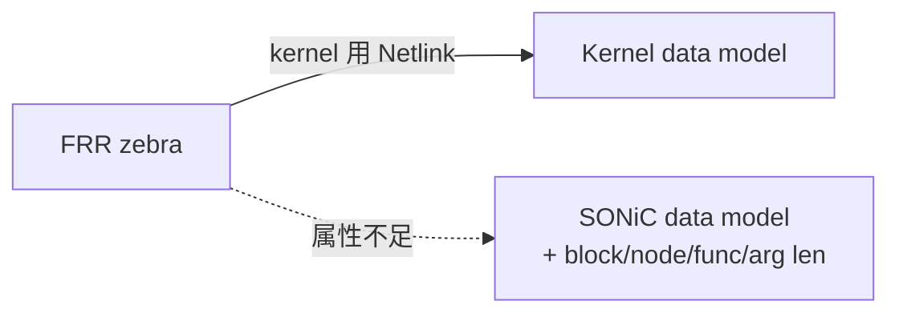
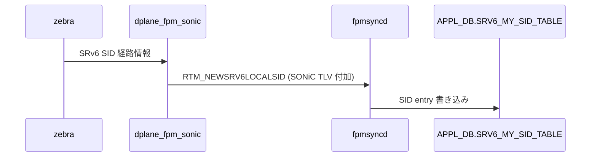

<!-- topics-tip -->
!!! tip "Topics で読み物として読む"
    この HLD は実装詳細を含む。機能の概念・設定・運用を読み物として読みたい場合は [Topics 02 章: BGP と FRR 制御プレーン](../topics/02-bgp/index.md) を参照。
<!-- /topics-tip -->

!!! success "裏取りステータス: code-verified"
    `sonic-buildimage/src/sonic-frr/dplane_fpm_sonic/dplane_fpm_sonic.c` L170/L3467 で `prov_name = "dplane_fpm_sonic"` 登録、`patch/series` L11 で `0012-SONiC-ONLY-build-dplane-fpm-sonic-module.patch` 適用、`dockers/docker-fpm-frr/frr/supervisord/supervisord.conf.j2` L46 で `zebra ... -M dplane_fpm_sonic` 起動、`sonic-swss/fpmsyncd/fpmlink.h` L18 で `RTM_NEWSRV6LOCALSID = 1000`、`fpmlink.cpp` L46 で dispatch を確認 (verified at: 2026-05-09)。

# 新 FRR-SONiC 通信チャネル（`dplane_fpm_sonic` モジュール）

## なぜ必要か

[SONiC](../reference/glossary.md#term-sonic) の routing は **[FRR](../reference/glossary.md#term-frr)** に依存し、`zebra` daemon が経路を計算して内蔵 [FPM](../reference/glossary.md#term-fpm) (Forwarding Plane Manager) モジュール `dplane_fpm_nl` が **[Netlink](../reference/glossary.md#term-netlink) で SONiC に push**、`fpmsyncd` が受けて `APPL_DB` に書く[^1]。

問題は `dplane_fpm_nl` が **kernel への Netlink をそのままコピー** することだ。kernel data model にしか属性が無いので、SONiC 固有属性は表現できない。例えば [SRv6](../reference/glossary.md#term-srv6) SID では SONiC は `block_len` / `node_len` / `func_len` / `arg_len` が要るが、`dplane_fpm_nl` の Netlink にはそれを乗せる枠が無い[^1]。



## どう動くか

### 解決策: `dplane_fpm_sonic`

新モジュール `dplane_fpm_sonic` を SONiC リポで保持・保守する[^1]:

- 当初は `dplane_fpm_nl` の **完全コピー**（後方互換）
- SONiC コミュニティが必要に応じ **SONiC 固有 Netlink TLV** を追加
- FRR upstream の改造を不要にする

配置: `sonic-buildimage/sonic-frr/dplane_fpm_sonic/dplane_fpm_sonic.c`。ビルドは `build-dplane-fpm-sonic-module.patch` が FRR [zebra](../reference/glossary.md#term-zebra) Makefile を改修して `.so` を install する[^1]。

### 起動オプション切替

`supervisor.conf.j2` で zebra の `-M` を `dplane_fpm_nl` → `dplane_fpm_sonic` に置換[^1]:

```jinja2
command=/usr/lib/frr/zebra -A 127.0.0.1 -s 90000000 -M dplane_fpm_sonic -M snmp --asic-offload=notify_on_offload
```

### SRv6 SID 初の利用例

新モジュールでまず SRv6 SID をサポート[^1]:

| メッセージ | 用途 |
|----------|------|
| `RTM_NEWSRV6LOCALSID` | SRv6 SID push |
| `RTM_DELSRV6LOCALSID` | SRv6 SID 削除 |

これらは SONiC 固有属性 (`block_len` / `node_len` / `func_len` / `arg_len`) を **TLV として運ぶ**。`fpmsyncd` 側で type 判定して `onSrv6LocalSidMsg()` callback が `APPL_DB.SRV6_MY_SID_TABLE` に書く[^1]。



参考 PR: `sonic-buildimage#18715`（モジュール + patch + supervisor）、`sonic-swss#3123`（[fpmsyncd](../reference/glossary.md#term-fpmsyncd) 拡張）[^1]。

## 設定

[CONFIG_DB](../reference/glossary.md#term-config_db) / CLI / [YANG](../reference/glossary.md#term-yang) **変更なし**。zebra 起動 option と `fpmsyncd` 挙動が透過的に切り替わるインフラ刷新で、ユーザ操作は不要。

```bash
ps aux | grep zebra | grep -o 'dplane_fpm_[a-z_]*'
# → dplane_fpm_sonic
```

## 制限事項

- 初期 `dplane_fpm_sonic` は `dplane_fpm_nl` のコピーで **拡張がなければ実質メリットなし**[^1]
- SONiC コミュニティが追加 TLV を **継続メンテ** する責務
- FRR upstream の `dplane_fpm_nl` 差分は **手動取り込み** が必要
- TLV フォーマットは SONiC ローカル取り決め、**他 NOS との互換性なし**
- `fpmsyncd` 側でハンドラが無い新メッセージは drop（既存メッセージは後方互換）

## 干渉する機能

- **`zebra` 起動 (`supervisor.conf.j2`)**: `-M` で `dplane_fpm_sonic` 選択
- **`fpmsyncd`**: 受理側ハンドラ
- **`SRV6_MY_SID_TABLE` ([APPL_DB](../reference/glossary.md#term-appl_db))**: SRv6 SID 書き込み先
- **FRR upstream**: 互換維持の責務

## トラブルシューティング

- 経路が SONiC に届かない → `-M dplane_fpm_sonic` が付いているか
- SRv6 SID が APPL_DB に出ない → `fpmsyncd` ログで `RTM_NEWSRV6LOCALSID` 受理確認
- ビルド失敗 → `build-dplane-fpm-sonic-module.patch` が現行 FRR に適合か

### コマンド例

FRR<->SONiC 間 dplane_fpm_nl チャネルと socket を確認する。

```bash
docker exec bgp ss -lntp | grep -E '2620|fpm'
docker logs bgp 2>&1 | grep -i 'dplane_fpm' | tail
docker exec bgp vtysh -c 'show fpm status' 2>/dev/null | head
```

## 関連トピック

- [Topics: SRv6 / MPLS](../topics/17-srv6-mpls/index.md) — SRv6 SID プログラミングの全体像
- [static-configuration-of-srv6-in-sonic-hld](static-configuration-of-srv6-in-sonic-hld.md)
- [fpmsyncd-nexthop-group-enhancement-high-level-design-document](fpmsyncd-nexthop-group-enhancement-high-level-design-document.md)

## 引用元

[^1]: `sonic-net/SONiC` `doc/sonic-fpm-module/frr_sonic_communication_channel.md` @ `49bab5b5ff0e924f1ea52b3d9db0dfa4191a7c06`

<!-- concerns hint:
- sonic-buildimage の sonic-frr/dplane_fpm_sonic/dplane_fpm_sonic.c 取り込み確認 (PR #18715)
- build-dplane-fpm-sonic-module.patch の現行 patch directory 存在確認
- zebra supervisor.conf.j2 の -M dplane_fpm_sonic 切替確認
- sonic-swss/fpmsyncd の onSrv6LocalSidMsg() callback と RTM_NEWSRV6LOCALSID メッセージ受理実装確認 (PR #3123)
- APPL_DB.SRV6_MY_SID_TABLE スキーマ取り込み確認
-->

<!-- glossary-links-injected: 8ba32e5aa69d -->
