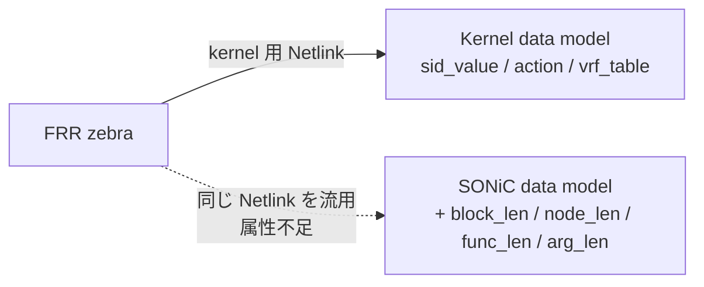
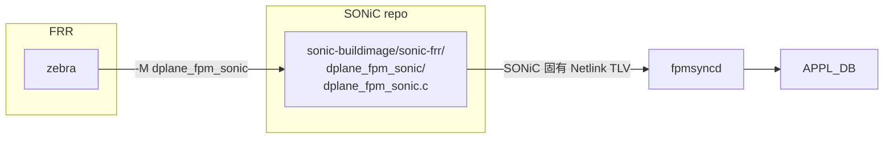
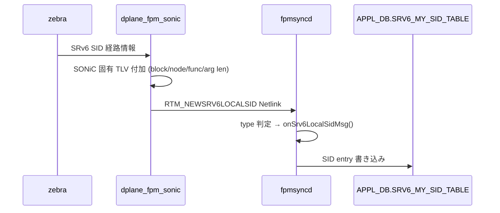

!!! warning "裏取りステータス: HLD-only"
    `dplane_fpm_sonic.c` モジュールの sonic-buildimage/sonic-frr 配下への取り込み、`build-dplane-fpm-sonic-module.patch` の適用、zebra `supervisor.conf.j2` の `-M dplane_fpm_sonic` 切替、`RTM_NEWSRV6LOCALSID` / `RTM_DELSRV6LOCALSID` Netlink message type と `onSrv6LocalSidMsg()` callback の現行 master 実装は実コードでの裏取り未済（参考 PR: sonic-buildimage#18715, sonic-swss#3123）。

# 新 FRR-SONiC 通信チャネル（`dplane_fpm_sonic` モジュール）

## 概要

SONiC の routing は **FRR** に依存し、FRR の `zebra` daemon が経路を計算し、`zebra` 内蔵の **FPM (Forwarding Plane Manager)** モジュール `dplane_fpm_nl` が **Netlink メッセージで SONiC に push** する。SONiC 側は `fpmsyncd` がそれを受け取り Redis (`APPL_DB`) に書く[^1]。

本 HLD は **既存 `dplane_fpm_nl` を SONiC が拡張できないジレンマ** を解消するため、**SONiC 専用の FPM モジュール `dplane_fpm_sonic`** を SONiC 側のリポで保守する設計を導入する[^1]。

## 動作仕様

### 既存設計の問題

`dplane_fpm_nl` は kernel への Netlink を **そのままコピー** して SONiC に流す[^1]。kernel data model に合わせた messages なので、SONiC data model にしか存在しない属性は表現できない。

#### 例: SRv6 SID

FRR は SRv6 SID を kernel に programming する Netlink を生成するが、kernel 側に必要な `sid_value` / `action` / `vrf_table` だけが含まれる。SONiC 側は **`block_len` / `node_len` / `func_len` / `arg_len`** といった追加属性を必要とするが、これは Netlink にも kernel にも存在しないため `dplane_fpm_nl` の Netlink では表現できない[^1]。



### 解決策: `dplane_fpm_sonic`

新モジュール `dplane_fpm_sonic` を SONiC のリポで保持・保守する[^1]:

- 当初は `dplane_fpm_nl` の **完全コピー**。後方互換と機能維持を保証
- SONiC コミュニティが必要に応じ **SONiC 固有 Netlink TLV を追加**
- FRR 側の改造を必要とせず、SONiC 側で機能拡張可



### コード配置

`sonic-buildimage` リポ内[^1]:

```text
sonic-buildimage/
└── sonic-frr/
    ├── Makefile
    ├── frr
    ├── patch
    └── dplane_fpm_sonic/
        └── dplane_fpm_sonic.c
```

### ビルド統合

`sonic-buildimage/sonic-frr/patch/` に **`build-dplane-fpm-sonic-module.patch`** を追加。このパッチの目的は[^1]:

- FRR zebra の Makefile を修正し `dplane_fpm_sonic.c` を `dplane_fpm_sonic.so` としてビルド
- `dplane_fpm_sonic.so` を FRR modules ディレクトリに install

### zebra 起動オプション切替

`supervisor.conf.j2` で zebra の `-M` を切替[^1]:

```jinja2
[program:zebra]
command=/usr/lib/frr/zebra -A 127.0.0.1 -s 90000000 -M dplane_fpm_sonic -M snmp --asic-offload=notify_on_offload
```

`-M dplane_fpm_nl` → `-M dplane_fpm_sonic` への置換が本 HLD の起動側変更。

### SRv6 SID プログラム拡張例

新モジュール初の利用例として SRv6 SID をサポートする[^1]:

#### Netlink message 拡張

`dplane_fpm_sonic` に **新規 Netlink message type** を追加:

| メッセージ | 用途 |
|----------|------|
| `RTM_NEWSRV6LOCALSID` | SRv6 SID を SONiC に push |
| `RTM_DELSRV6LOCALSID` | SRv6 SID を SONiC から削除 |

これらのメッセージは `block_len` / `node_len` / `func_len` / `arg_len` 等 SONiC 固有属性を **TLV として運ぶ**。

#### `fpmsyncd` の拡張

`fpmsyncd` に新メッセージ受理コードを追加[^1]:

- `RTM_NEWSRV6LOCALSID` / `RTM_DELSRV6LOCALSID` を判定
- 該当時 **`onSrv6LocalSidMsg()` callback** に渡す
- callback は SID 属性を抽出し **`APPL_DB.SRV6_MY_SID_TABLE`** に書く



### 参考 PR

| PR | 内容 |
|----|------|
| `sonic-buildimage#18715` | `dplane_fpm_sonic` モジュールと patch / supervisor.conf.j2 |
| `sonic-swss#3123` | `fpmsyncd` への SRv6 SID メッセージ受理拡張 |

## 設定

本 HLD は **CONFIG_DB / CLI / YANG 変更を伴わない**。zebra の起動 option と `fpmsyncd` の挙動が透過的に切り替わるだけのインフラ刷新である。

### 設定例

特別なユーザ操作はない。ビルド時に `dplane_fpm_sonic.so` が含まれ、`supervisor.conf.j2` で起動オプションが `-M dplane_fpm_sonic` になっていれば自動有効。

```bash
# 動作確認
ps aux | grep zebra | grep -o 'dplane_fpm_[a-z_]*'
# → dplane_fpm_sonic
```

## 制限事項

- 当初の `dplane_fpm_sonic` は `dplane_fpm_nl` のコピーのため、**機能拡張がない場合は実質的なメリットなし**[^1]
- SONiC コミュニティが追加 TLV を **継続的にメンテ** する責務を負う
- FRR upstream の `dplane_fpm_nl` 側で根本的な変更（fix / 機能追加）があった場合、SONiC 側に **手動で取り込む必要**
- `RTM_NEWSRV6LOCALSID` 等の番号付け / TLV フォーマットは SONiC 内で取り決める。**他 NOS との互換性を期待してはならない**
- `fpmsyncd` 側で対応するハンドラを書かないと新メッセージは drop される（後方互換は default で `dplane_fpm_nl` 同等のメッセージ群が動くため致命的にはならない）

## 干渉する機能

- **`zebra` 起動 (`supervisor.conf.j2`)**: `-M` オプションで `dplane_fpm_sonic` 選択
- **`fpmsyncd`**: 受理側で新 message type を扱う必要
- **`SRV6_MY_SID_TABLE` (APPL_DB)**: SRv6 SID の書き込み先
- **`fpmsyncd` の orchagent 側 consumer**: SRv6 経路の SAI への反映（別レイヤ）
- **FRR upstream の差分**: モジュール本体は SONiC 側でメンテだが、`dplane_fpm_nl` の互換は維持する必要

## トラブルシューティング

- 経路が SONiC に届かない → `ps aux | grep zebra` で `-M dplane_fpm_sonic` がついているか確認
- SRv6 SID が `APPL_DB` に出ない → `fpmsyncd` ログで `RTM_NEWSRV6LOCALSID` の受理ログを確認
- 既存機能の経路 push が壊れた → `dplane_fpm_sonic` のベース実装が `dplane_fpm_nl` から乖離していないか sonic-buildimage の patch 状況を確認
- ビルド失敗 → `build-dplane-fpm-sonic-module.patch` が現行 FRR バージョンに適合するか確認

## 引用元

[^1]: `sonic-net/SONiC` `doc/sonic-fpm-module/frr_sonic_communication_channel.md` @ `49bab5b5ff0e924f1ea52b3d9db0dfa4191a7c06`

<!-- concerns hint:
- sonic-buildimage の sonic-frr/dplane_fpm_sonic/dplane_fpm_sonic.c 取り込み確認 (PR #18715)
- build-dplane-fpm-sonic-module.patch の現行 patch directory 存在確認
- zebra supervisor.conf.j2 の -M dplane_fpm_sonic 切替確認
- sonic-swss/fpmsyncd の onSrv6LocalSidMsg() callback と RTM_NEWSRV6LOCALSID メッセージ受理実装確認 (PR #3123)
- APPL_DB.SRV6_MY_SID_TABLE スキーマ取り込み確認
-->
