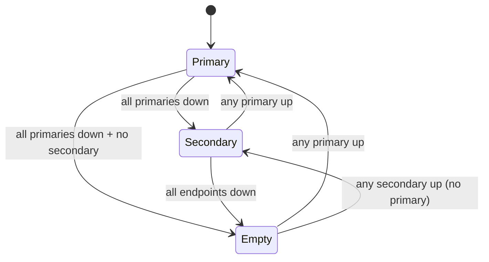
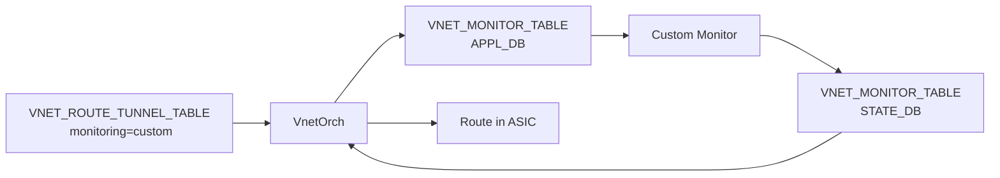

!!! warning "裏取りステータス: HLD-only"
    本ページは公式 HLD（v0.1 / 2024-08）のみを根拠に書かれている。`VnetOrch` の primary/secondary 切替実装、`VNET_MONITOR_TABLE` の APPL_DB / STATE_DB 取り込み、`pinned_state` 等の追加フィールドが現行 master にあるかは未確認。

# Overlay ECMP の Primary/Secondary・カスタム監視・BFD タイマ拡張

## 概要

「Overlay ECMP with BFD monitoring」HLD（`SONiC/doc/vxlan/Overlay ECMP with BFD.md`）の拡張仕様。VxLAN VNET ルートに対する次の 4 点の機能追加を扱う[^1]。

1. **Primary / Secondary エンドポイント** の自動切替
2. **カスタム監視** （BFD 以外の生存確認モジュール）への委譲
3. **per-route BFD Tx/Rx 間隔** と **directly-connected ネクストホップ** のサポート
4. **`pinned_state`** によるコントローラ側からの BFD 状態オーバーライド（SmartSwitch HA 連携）

## 動作仕様

### スキーマ追加

#### CONFIG_DB: `VNET` テーブル

`overlay_dmac` フィールドが追加された。カスタム監視モジュールに渡す MAC アドレスとして使う[^1]。

```text
VNET|<vnet_name>
    vxlan_tunnel     = ...
    vni              = ...
    ...
    overlay_dmac     = MAC ADDR   ; OPTIONAL（カスタム監視に使用）
```

#### APPL_DB: `VNET_ROUTE_TUNNEL_TABLE` 追加フィールド

```text
primary                  = ip-addr list   ; 優先 endpoint。指定時のみ primary/secondary モード
monitoring               = "custom"       ; BFD ではなくカスタムモジュールで生存確認
rx_monitor_timer         = ms             ; BFD 専用、Rx wait
tx_monitor_timer         = ms             ; BFD 専用、Tx interval
check_directly_connected = bool           ; 直接接続 NH なら通常 ECMP に変換
adv_prefix               = ip-prefix      ; 経路プレフィクスとは別の集約広報プレフィクス
pinned_state             = none|up|down   ; BFD 状態のオーバーライド
```

#### APPL_DB: `VNET_MONITOR_TABLE`（新規）

`monitoring=custom` のときに VnetOrch がエンドポイント情報を載せる。

```text
VNET_MONITOR_TABLE:<endpoint>:<ip_prefix>
    packet_type   = "vxlan"   ; 現状 vxlan のみ
    interval      = ms        ; Tx 間隔
    multiplier    = uint      ; 検出倍率（Rx 検出時間 = interval × multiplier）
    overlay_dmac  = MAC       ; VNET から渡す
```

#### STATE_DB: `VNET_MONITOR_TABLE`（新規、応答用）

カスタム監視モジュールが書き込む側。

```text
VNET_MONITOR_TABLE|<endpoint>|<ip_addr>
    state = "up"|"down"
```

### Primary/Secondary 切替

コントローラは `endpoint` リスト全体に加え、`primary` でその部分集合（プライマリ集合）を指定する。VnetOrch は次のルールで NH グループを動的に編成する[^1]。

1. プライマリ集合の中で **生きている** メンバを NH グループに採用する。
2. プライマリ集合に少なくとも 1 つ生存メンバがある間、セカンダリ（`endpoint` リストのうち `primary` に含まれない要素）は **NH グループに参加しない**。
3. プライマリ集合が全滅した場合のみ、セカンダリの生存メンバから NH グループを編成する。
4. プライマリが 1 つでも復旧したら、セカンダリ全体を外してプライマリのみで再編成する。
5. 全滅したら経路自体を撤回する（`adv_prefix` 経路の広報も止まる）。



`primary` 未指定の経路は従来どおりの flat ECMP として扱われる[^1]。

### カスタム監視

`monitoring=custom` のエントリに対しては、VnetOrch は BFD セッションを作らず代わりに `VNET_MONITOR_TABLE`（APPL_DB）にエンドポイント情報を書き出し、別プロセス（カスタム監視モジュール）に生存確認を委譲する。応答は STATE_DB の `VNET_MONITOR_TABLE` を通じて受け取る。



`VNET` テーブルの `overlay_dmac` は VNET_MONITOR_TABLE 経由でカスタム監視モジュールに伝搬される。`packet_type=vxlan` のみが現状サポート対象[^1]。

<!-- evidence:
source: sonic-net/SONiC/doc/vxlan/Overlay ECMP ehancements.md#L176-L183 (sha: 49bab5b5ff0e924f1ea52b3d9db0dfa4191a7c06)
excerpt: |
  In the orignal design of Overlay-ECMP, BFD was used for livness detection fo VTEP. But BFD may not be supported by all types of VTEPs.
  ...
  The Orchagent creates an entry in the VNET_MONITOR_TABLE in APP DB if it recieves the "monitoring" = "custom" attribute.
reasoning: monitoring=custom 分岐の根拠と、APPL_DB / STATE_DB 双方に VNET_MONITOR_TABLE が存在する設計の根拠。
-->

### per-route BFD タイマと directly-connected サポート

SmartSwitch シナリオ向けに、経路ごとの BFD パラメータをチューニングする要件がある。`tx_monitor_timer` / `rx_monitor_timer` は BfdOrch の BFD セッション生成時に渡される値で、ルート更新でこれらが変わると **BFD セッションを一旦削除して作り直す** 仕様[^1]。

`check_directly_connected=true` を指定すると、VnetOrch は ARP テーブルでネクストホップが直接接続されているかを確認し、直接接続なら **VxLAN トンネルではなく通常 ECMP** で経路を実装する。primary 集合全体・secondary 集合全体のどちらでも、その集合内のメンバは「全員直接接続」または「全員非直接接続」のどちらかに揃っている必要がある（混在は構成エラー扱い）[^1]。

### pinned_state（BFD 状態の固定）

`pinned_state` は SmartSwitch HA で planned maintenance 時にトラフィックを退避させたり、誤検知による不要なスイッチオーバを抑止する目的でコントローラが BFD 状態を上書きするためのフィールド。値は `none`（実 BFD 状態を使用）/ `up`（強制アクティブ）/ `down`（強制非アクティブ）の 3 値[^1]。

詳細は [SmartSwitch HA HLD §6.4.1](https://github.com/sonic-net/SONiC/blob/master/doc/smart-switch/high-availability/smart-switch-ha-hld.md#641-pinning-bfd-probe) を参照。

## 設定

### 関連する CONFIG_DB

| Table | Key | 説明 |
|-------|-----|------|
| `VNET` | `<vnet_name>` | `overlay_dmac` 任意フィールドが追加された |

`VNET_ROUTE_TUNNEL_TABLE` / `VNET_MONITOR_TABLE` は APPL_DB 上のテーブル（コントローラが直接書く想定）であり、CONFIG_DB ではない。

### 関連する CLI

HLD には新規 SONiC CLI 追加の記述はない。コントローラから APPL_DB に直接書く運用が前提（既存の `show vnet routes` は引き続き利用可能）。

### 関連する YANG

HLD に YANG モデル追加の記述はない。

### 設定例

primary/secondary を伴う経路（IPv4）：

```bash
sonic-db-cli APPL_DB HSET 'VNET_ROUTE_TUNNEL_TABLE:Vnet_3000:100.100.2.1/32' \
  endpoint '1.1.1.2,2.2.2.2,3.3.3.3,4.4.4.4' \
  endpoint_monitor '1.1.2.2,2.2.3.3,3.3.4.4,4.4.5.5' \
  primary '1.1.1.2,2.2.2.2'
```

カスタム監視に切り替える場合：

```bash
sonic-db-cli APPL_DB HSET 'VNET_ROUTE_TUNNEL_TABLE:Vnet_3000:100.100.2.1/32' \
  endpoint '1.1.1.2' monitoring 'custom'
```

## 制限事項

- 詳細フローや edge case（例: 同時に複数プライマリが落ち、その後一部が高速復旧したケース）は HLD のシナリオ表に依存する。詳細は HLD `doc/vxlan/Overlay ECMP ehancements.md` を参照。
- `VNET_MONITOR_TABLE` のキーには現状 vnet 名が含まれない。HLD には「次バージョンでキーに vnet 名を入れる」TODO が残っている[^1]。
- `tx/rx_monitor_timer` はカスタム監視には適用されない（BFD 専用）。

## 干渉する機能

- **BfdOrch / BFD HW Offload**: per-route Tx/Rx タイマで BFD セッションが再生成されるため、`pinned_state` で固定中でない限り、タイマ更新時に瞬間的なフラップが発生し得る。
- **BGP advertise（ADVERTISE_NETWORK_TABLE）**: `adv_prefix` 指定の経路は、有効ネクストホップ消失時に経路撤回（広報停止）まで連動する。
- **SmartSwitch HA**: `pinned_state` と `check_directly_connected` は HA Manager (hamgrd) からの操作前提のフィールド。

## トラブルシューティング

- 経路がプライマリに戻らない場合: `endpoint_monitor` の生存状態 (`STATE_DB BFD_SESSION_TABLE` または `VNET_MONITOR_TABLE`) を確認し、プライマリ判定の条件（少なくとも 1 つ生存）を満たしているかチェックする。
- カスタム監視で経路が上がらない場合: APPL_DB 側の `VNET_MONITOR_TABLE` にエントリが書かれているか、STATE_DB 側に `state:up` が返ってきているかを redis-cli で個別に確認する。
- directly-connected 設定で経路作成が失敗する場合: primary 集合と secondary 集合内で direct 混在になっていないかを確認する。

## 引用元

[^1]: `sonic-net/SONiC` `doc/vxlan/Overlay ECMP ehancements.md` @ `49bab5b5ff0e924f1ea52b3d9db0dfa4191a7c06`
