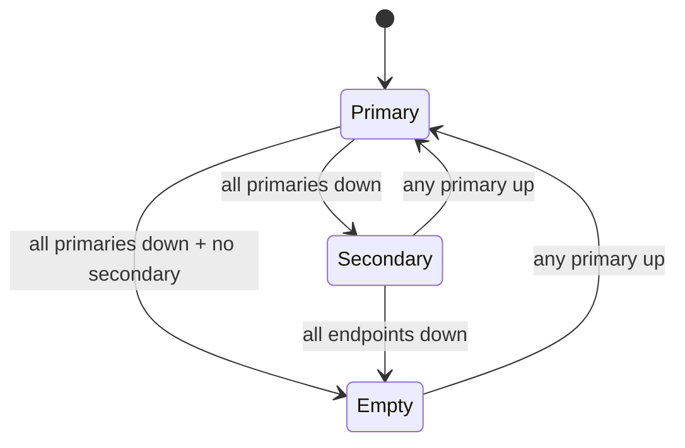
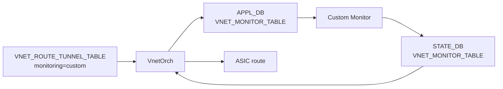

<!-- topics-tip -->
!!! tip "Topics で読み物として読む"
    この HLD は実装詳細を含みます。機能の概念・設定・運用を読み物として読みたい場合は [Topics 03 章: VXLAN / EVPN とオーバーレイ](../topics/03-vxlan-evpn/index.md) を参照。
<!-- /topics-tip -->

!!! success "裏取りステータス: code-verified"
    `sonic-swss/orchagent/vnetorch.cpp:445/477-479` で `overlay_dmac`、`:1029-1067` で `nexthops_primary` / `nexthops_secondary` / `tx/rx_monitor_timer` / `monitor_addr_to_pinned_state`、`:1013-1015` で `PINNED_STATE_UP/DOWN`、`sonic-swss-common/common/schema.h:133/500` で `APP/STATE_VNET_MONITOR_TABLE_NAME` を確認。`overlay_dmac` は `sonic-vnet.yang` 取り込み済み（verified at: 2026-05-09）。

# Overlay ECMP の Primary/Secondary・カスタム監視・BFD タイマ拡張

## なぜこの拡張が必要か

「Overlay [ECMP](../reference/glossary.md#term-ecmp) with [BFD](../reference/glossary.md#term-bfd) monitoring」[HLD](../reference/glossary.md#term-hld)（`SONiC/doc/vxlan/Overlay ECMP with BFD.md`）の **後付け拡張** で、VxLAN [VNET](../reference/glossary.md#term-vnet) ルートに 4 種の機能を追加する[^1]:

1. **Primary / Secondary エンドポイント** の自動切替（プライマリ全滅時のみセカンダリ使用）
2. **カスタム監視** 委譲（BFD 非対応 [VTEP](../reference/glossary.md#term-vtep) 向け、外部プロセスで生存確認）
3. **per-route BFD Tx/Rx 間隔** と **directly-connected** ネクストホップサポート
4. **`pinned_state`**: コントローラからの BFD 状態オーバーライド（[SmartSwitch](../reference/glossary.md#term-smartswitch) HA 連携）

## スキーマ拡張

### CONFIG_DB `VNET`

`overlay_dmac` フィールド追加（カスタム監視に渡す MAC）[^1]:

```text
VNET|<vnet_name>
    vxlan_tunnel = ...
    vni          = ...
    overlay_dmac = MAC ADDR   ; OPTIONAL
```

### APPL_DB `VNET_ROUTE_TUNNEL_TABLE` 追加フィールド

```text
primary                  = ip-addr list   ; 指定時のみ primary/secondary モード
monitoring               = "custom"       ; BFD でなくカスタム監視
rx_monitor_timer         = ms             ; BFD 専用
tx_monitor_timer         = ms             ; BFD 専用
check_directly_connected = bool           ; 直接接続なら通常 ECMP へ
adv_prefix               = ip-prefix      ; 集約広報プレフィクス
pinned_state             = none|up|down   ; BFD 状態 override
```

### APPL_DB / STATE_DB `VNET_MONITOR_TABLE`（新規）

`monitoring=custom` の場合、VnetOrch が [APPL_DB](../reference/glossary.md#term-appl_db) に endpoint 情報（`packet_type=vxlan` / `interval` / `multiplier` / `overlay_dmac`）を書き、カスタム監視モジュールは [STATE_DB](../reference/glossary.md#term-state_db) 側に `state=up/down` を返す。

## Primary/Secondary 切替ルール



1. プライマリ集合の **生存メンバ** で NH グループを編成
2. プライマリに 1 つでも生存があれば **セカンダリは NH に入らない**
3. プライマリ全滅 → セカンダリの生存メンバから編成
4. プライマリ復旧 → 即セカンダリを外す
5. 全滅 → 経路撤回（`adv_prefix` 広報も止まる）

`primary` 未指定なら従来 flat ECMP[^1]。

## カスタム監視の経路



`VNET.overlay_dmac` は VNET_MONITOR_TABLE 経由で監視モジュールに渡る。`packet_type=vxlan` のみサポート[^1]。

## per-route BFD / directly-connected / pinned_state

- `tx/rx_monitor_timer` 変更時は BFD セッションを **一旦削除して再作成**[^1]
- `check_directly_connected=true` の場合、[ARP](../reference/glossary.md#term-arp) で直接接続を確認し、直接接続なら **通常 ECMP** で実装。primary 集合 / secondary 集合は **混在不可**（全員 direct or 全員非 direct）[^1]
- `pinned_state` = `none` / `up` / `down`。SmartSwitch HA で planned maintenance や誤検知抑止に使用。詳細は [SmartSwitch HA HLD §6.4.1](https://github.com/sonic-net/SONiC/blob/master/doc/smart-switch/high-availability/smart-switch-ha-hld.md#641-pinning-bfd-probe)

## 設定例

```bash
# primary/secondary
sonic-db-cli APPL_DB HSET 'VNET_ROUTE_TUNNEL_TABLE:Vnet_3000:100.100.2.1/32' \
  endpoint '1.1.1.2,2.2.2.2,3.3.3.3,4.4.4.4' \
  endpoint_monitor '1.1.2.2,2.2.3.3,3.3.4.4,4.4.5.5' \
  primary '1.1.1.2,2.2.2.2'

# カスタム監視
sonic-db-cli APPL_DB HSET 'VNET_ROUTE_TUNNEL_TABLE:Vnet_3000:100.100.2.1/32' \
  endpoint '1.1.1.2' monitoring 'custom'
```

新規 [SONiC](../reference/glossary.md#term-sonic) CLI は無く、コントローラから APPL_DB 直書きが前提（`show vnet routes` は引き続き利用可能）。

## 制限事項

- `VNET_MONITOR_TABLE` キーには vnet 名が含まれない（HLD に TODO 残存）[^1]
- `tx/rx_monitor_timer` は **BFD 専用**（カスタム監視には未適用）
- directly-connected 混在は構成エラー

## 干渉する機能

- **BfdOrch**: per-route タイマ更新で BFD 再生成、`pinned_state` 非固定時はフラップしうる
- **[BGP](../reference/glossary.md#term-bgp) `ADVERTISE_NETWORK_TABLE`**: `adv_prefix` 経路は NH 消失で広報停止まで連動
- **SmartSwitch HA**: `pinned_state` / `check_directly_connected` は hamgrd 操作前提

## トラブルシューティング

```bash
sonic-db-cli STATE_DB hgetall 'BFD_SESSION_TABLE|default|...'   # BFD 生存
sonic-db-cli STATE_DB keys 'VNET_MONITOR_TABLE*'                # カスタム監視応答
sonic-db-cli APPL_DB hgetall 'VNET_ROUTE_TUNNEL_TABLE:Vnet_3000:100.100.2.1/32'
```

- プライマリに戻らない → `endpoint_monitor` の生存状態を確認
- カスタム監視で経路が上がらない → APPL_DB / STATE_DB 双方を個別確認

## 関連 Topics

- [03-vxlan-evpn](../topics/03-vxlan-evpn/index.md): VxLAN / [EVPN](../reference/glossary.md#term-evpn) / VNET 経路
- [05-dual-tor](../topics/05-dual-tor/index.md): SmartSwitch HA と BFD 連携

## 引用元

[^1]: `sonic-net/SONiC` `doc/vxlan/Overlay ECMP ehancements.md` @ `49bab5b5ff0e924f1ea52b3d9db0dfa4191a7c06`

<!-- topics-back-ref -->
## 関連 Topics

- [Topics: VXLAN / EVPN / VNET オーバーレイ](../topics/03-vxlan-evpn/index.md)

<!-- /topics-back-ref -->

<!-- glossary-links-injected: c5c8b661ae7e -->
