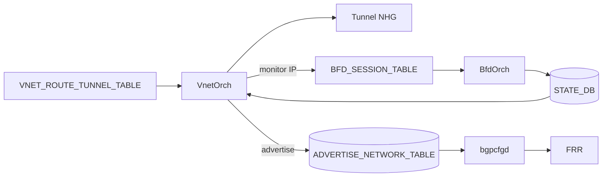

<!-- topics-tip -->
!!! tip "Topics で読み物として読む"
    この HLD は実装詳細を含む。機能の概念・設定・運用を読み物として読みたい場合は [Topics 03 章: VXLAN / EVPN とオーバーレイ](../topics/03-vxlan-evpn/index.md) を参照。
<!-- /topics-tip -->

!!! success "裏取りステータス: code-verified"
    `sonic-swss/orchagent/vnetorch.cpp` の `VNetRouteOrch::addRouteAdvertisement()` (L2633-2646) / `removeRouteAdvertisement()` (L2648-2652) が `state_vnet_rt_adv_table_` (L746 で `STATE_ADVERTISE_NETWORK_TABLE_NAME` に bind) に書き込み[^evidence-vnet]、`sonic-swss-common/common/schema.h` L131 `APP_BGP_PROFILE_TABLE_NAME` / L496 `STATE_ADVERTISE_NETWORK_TABLE_NAME` を定義[^evidence-schema]、`sonic-buildimage/src/sonic-bgpcfgd/bgpcfgd/managers_rm.py` L8 `RouteMapMgr` が `BGP_PROFILE_TABLE` 更新時に route-map と community 設定 (L93 `set community`) を生成[^evidence-rm]（verified at: 2026-05-09）。

<!-- evidence: sonic-swss/orchagent/vnetorch.cpp L746,L2633-2652 (state_vnet_rt_adv_table_, addRouteAdvertisement, removeRouteAdvertisement) -->
<!-- evidence: sonic-swss-common/common/schema.h L131 (APP_BGP_PROFILE_TABLE_NAME), L496 (STATE_ADVERTISE_NETWORK_TABLE_NAME) -->
<!-- evidence: sonic-buildimage/src/sonic-bgpcfgd/bgpcfgd/managers_rm.py L8-L96 (RouteMapMgr, set community) -->

# Overlay ECMP with BFD monitoring

## なぜ必要か

VxLAN VNet 経路 (`VNET_ROUTE_TUNNEL_TABLE`) に **複数 endpoint を [ECMP](../reference/glossary.md#term-ecmp) で並べ、各 endpoint の生存性を [BFD](../reference/glossary.md#term-bfd) で確認** し、Down メンバを NHG から外したい。SDN コントローラから REST / [gNMI](../reference/glossary.md#term-gnmi) で投入された経路を VnetOrch が処理する[^1]。

**監視対象 (`endpoint_monitor`)** と **実トンネル送信先 (`endpoint`)** を分離できるのが特徴で、共通 monitoring IP への multi-hop BFD で生存確認できる。健全な経路は `ADVERTISE_NETWORK_TABLE` 経由で [BGP](../reference/glossary.md#term-bgp) に広報される。

## 全体フロー



VnetOrch の動作[^1]:

1. 同一 endpoint set/NHG があれば再利用、`SAI_NEXT_HOP_GROUP_MEMBER_ATTR_WEIGHT` で重み付け
2. 各 endpoint の monitoring IP へ multi-hop BFD セッション（既存があれば共有）
3. BFD Down メンバは NHG から外す
4. アクティブメンバが 1 つ以上あれば `ADVERTISE_NETWORK_TABLE` に書き出し → [bgpcfgd](../reference/glossary.md#term-bgpcfgd) → BGP 広報

## スキーマ

```text
CONFIG_DB:
  VXLAN_TUNNEL|<name>            src_ip, [dst_ip]
  VNET|<vnet>                    vxlan_tunnel, vni, [scope], [advertise_prefix]

APPL_DB:
  VNET_ROUTE_TUNNEL_TABLE:<vnet>:<prefix>
     endpoint, endpoint_monitor, [mac_address], [vni], [weight], [profile]
  BGP_PROFILE_TABLE:<name>       community_id

STATE_DB:
  ADVERTISE_NETWORK_TABLE|<prefix>   profile=<name>
```

`profile` に対応する `BGP_PROFILE_TABLE` の `community_id` が route-map 経由で community として付与される[^1]。

## スケール（HLD 規定）

| Item | 規定 |
|------|------|
| ECMP groups / members | 512 / 128 |
| Tunnel routes / endpoints | 16k / 4k |
| BFD monitoring sessions | 4k |

必須 [SAI](../reference/glossary.md#term-sai) 属性: 既存 TUNNEL API + BFD HW offload + `SAI_SWITCH_ATTR_VXLAN_DEFAULT_ROUTER_MAC` / `_PORT`[^1]。

## 設定例

```bash
sonic-cfggen -a '{
  "VXLAN_TUNNEL": {"tunnel_v4": {"src_ip": "10.1.0.32"}},
  "VNET": {"Vnet_3000": {"vxlan_tunnel": "tunnel_v4", "vni": "3000",
                          "advertise_prefix": "true"}}
}' --write-to-db

sonic-db-cli APPL_DB HSET 'VNET_ROUTE_TUNNEL_TABLE:Vnet_3000:100.100.2.1/32' \
  endpoint '1.1.1.2' endpoint_monitor '1.1.2.2' profile 'FROM_SDN_SLB_ROUTES'

show vnet routes all
```

## 制限事項

- 1 endpoint に対し monitoring endpoint は 1 つだけ
- `profile_name` は 1 つのみ（複数 profile の同時適用不可）[^1]
- BFD HW offload 前提（SW BFD のみのプラットフォームは挙動が異なる）

## 干渉する機能

- **VnetOrch / TunnelOrch**: 「ECMP 複数 endpoint」「BFD state 連動」を既存実装に追加
- **BfdOrch / BFD HW offload**: 大量 multi-hop BFD（4k）を扱う前提
- **bgpcfgd / [FRR](../reference/glossary.md#term-frr)**: `network` 広告と community 付与
- **後継 [Overlay ECMP Enhancements](overlay-ecmp-enhancements.md)**: primary/secondary / custom monitoring / per-route BFD timer / `pinned_state` を追加

## トラブルシューティング

```bash
sonic-db-cli STATE_DB HGETALL 'ADVERTISE_NETWORK_TABLE|10.0.0.0/8'
sonic-db-cli STATE_DB KEYS 'BFD_SESSION_TABLE|default|default|*'
redis-cli -n 1 KEYS 'ASIC_STATE:SAI_OBJECT_TYPE_NEXT_HOP_GROUP_MEMBER:*' | wc -l
```

## 関連 Topics

- [03-vxlan-evpn/advanced](../topics/03-vxlan-evpn/advanced.md): VxLAN VNet と ECMP
- [04-vrf-ecmp/advanced](../topics/04-vrf-ecmp/advanced.md): ECMP 全般
- [02-bgp/internals](../topics/02-bgp/internals.md): bgpcfgd と ADVERTISE_NETWORK_TABLE

## 引用元

[^1]: `sonic-net/SONiC` `doc/vxlan/Overlay ECMP with BFD.md` @ `49bab5b5ff0e924f1ea52b3d9db0dfa4191a7c06`
[^evidence-vnet]: `sonic-net/sonic-swss` `orchagent/vnetorch.cpp` L746, L2633-2652 (`VNetRouteOrch::addRouteAdvertisement` / `removeRouteAdvertisement` が `state_vnet_rt_adv_table_` 経由で `STATE_ADVERTISE_NETWORK_TABLE_NAME` を更新)
[^evidence-schema]: `sonic-net/sonic-swss-common` `common/schema.h` L131 `APP_BGP_PROFILE_TABLE_NAME`、L496 `STATE_ADVERTISE_NETWORK_TABLE_NAME`
[^evidence-rm]: `sonic-net/sonic-buildimage` `src/sonic-bgpcfgd/bgpcfgd/managers_rm.py` L8 `RouteMapMgr` クラス、L93 で `set community <community_id>` を route-map に追加

<!-- topics-back-ref -->
## 関連 Topics (自動リンク)

- [Topics: VXLAN / EVPN / VNET オーバーレイ](../topics/03-vxlan-evpn/index.md)

<!-- /topics-back-ref -->

<!-- glossary-links-injected: 308b4b9e8a33 -->
