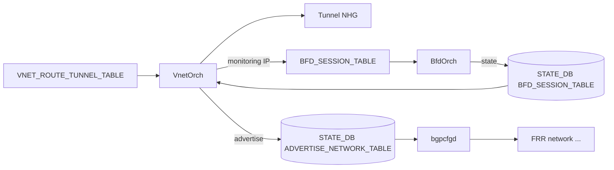

!!! warning "裏取りステータス: HLD-only / 古い HLD（2022-04 改訂、約 4 年経過）"
    HLD は v1.6 / 2022-04。`VnetOrch` の ECMP/NHG 編成、`BFD_SESSION` テーブル経由の BfdOrch 連動、`ADVERTISE_NETWORK_TABLE` / `BGP_PROFILE_TABLE` による BGP 広報連携が現行 master でこの仕様どおりかは未確認。**詳細は HLD `doc/vxlan/Overlay ECMP with BFD.md` を参照（25KB のため要点のみ抜粋）**。

# Overlay ECMP with BFD monitoring（VxLAN VNet ルートと BFD 連動）

## 概要

VxLAN VNet 経路（`VNET_ROUTE_TUNNEL_TABLE`）に対して **複数のトンネルエンドポイントを ECMP で並べ、各エンドポイントの生存性を BFD で監視** し、BFD Down のメンバを NHG から外して回す機能[^1]。SDN コントローラから RestAPI / gNMI で投入された経路を VnetOrch が処理する。

監視対象（`endpoint_monitor`）と実トンネル送信先（`endpoint`）を分離できる点が特徴で、共通の monitoring エンドポイントへの multi-hop BFD で生存確認できる。健全な経路は `ADVERTISE_NETWORK_TABLE` 経由で BGP に広報される。

[Overlay ECMP の Primary/Secondary・カスタム監視・BFD タイマ拡張](#) は本機能の後継拡張。

## 動作仕様

### スキーマ

#### CONFIG_DB

```text
VXLAN_TUNNEL|<tunnel_name>
    src_ip = ipv4/v6
    dst_ip = ipv4/v6   ; OPTIONAL

VNET|<vnet_name>
    vxlan_tunnel     = <tunnel>
    vni              = <vni>
    scope            = "default"   ; OPTIONAL
    advertise_prefix = "true"|"false"  ; OPTIONAL
```

#### APPL_DB

```text
VNET_ROUTE_TUNNEL_TABLE:<vnet>:<prefix>
    endpoint         = comma-list of ip
    endpoint_monitor = comma-list of ip   ; OPTIONAL
    mac_address      = comma-list of mac  ; OPTIONAL
    vni              = comma-list of vni  ; OPTIONAL
    weight           = comma-list of int  ; OPTIONAL
    profile          = profile_name       ; OPTIONAL
```

### NHG 構築フロー



VnetOrch は次の動作をする[^1]：

1. 同一 endpoint set/NHG が既存なら **再利用**。`SAI_NEXT_HOP_GROUP_MEMBER_ATTR_WEIGHT` で重み付け。
2. 各メンバに対応する monitoring IP に対し BFD セッションを作る（既存があれば共有）。BFD はネイティブ HW offload 経路を想定。
3. BFD 状態を STATE_DB / NeighOrch 経由で監視し、Down メンバは NHG から外す。
4. アクティブなメンバが少なくとも 1 つあれば、`STATE_DB ADVERTISE_NETWORK_TABLE` に書き、`bgpcfgd` 経由で BGP 広報。全 Down で広報停止。

### Monitoring Endpoint Mapping

`endpoint` ごとに対応する `endpoint_monitor` を 1 対 1 で持たせる仕様。同じ tunnel endpoint に対して monitoring IP は 1 つだけ。

### BGP 連携（network 広告と community）

`STATE_DB ADVERTISE_NETWORK_TABLE|<prefix>` に `profile=<name>` を書くと、`APPL_DB BGP_PROFILE_TABLE|<name>` の `community_id` を route-map 経由で community として付与する[^1]。

```text
APPL_DB:BGP_PROFILE_TABLE:FROM_SDN_SLB_ROUTES
    community_id = "1234:1235"

STATE_DB|ADVERTISE_NETWORK_TABLE|10.0.0.0/8
    profile = "FROM_SDN_SLB_ROUTES"
```

`bgpcfgd` がこれを subscribe して `network` 構文と route-map に変換する。

### スケール（HLD 規定）

| Item | 期待値 |
|------|--------|
| ECMP groups        | 512 |
| ECMP group members | 128 |
| Tunnel routes      | 16k |
| Tunnel endpoints   | 4k  |
| BFD monitoring     | 4k  |

### 必須 SAI 属性

- 既存 TUNNEL API + BFD HW offload に加えて、`SAI_SWITCH_ATTR_VXLAN_DEFAULT_ROUTER_MAC` / `SAI_SWITCH_ATTR_VXLAN_DEFAULT_PORT`[^1]。

## 設定

### 関連する CONFIG_DB

| Table | 説明 |
|-------|------|
| `VXLAN_TUNNEL` | VxLAN トンネル定義 |
| `VNET` | VNet と advertise_prefix フラグ |

### 関連する CLI

| Command | 用途 |
|---------|------|
| `show vnet routes all` | VNet 経路の表示（拡張） |
| `show vnet routes tunnel` | tunnel 経路 |

VNET / VxLAN tunnel 自体の設定 CLI 追加は HLD 範囲外（コントローラ書き込みを想定）。

### 関連する YANG

HLD に YANG モデルの記述は無い。

### 設定例

```bash
sonic-cfggen -a '{
  "VXLAN_TUNNEL": {"tunnel_v4": {"src_ip": "10.1.0.32"}},
  "VNET": {"Vnet_3000": {"vxlan_tunnel": "tunnel_v4", "vni": "3000",
                          "scope": "default", "advertise_prefix": "true"}}
}' --write-to-db

sonic-db-cli APPL_DB HSET 'VNET_ROUTE_TUNNEL_TABLE:Vnet_3000:100.100.2.1/32' \
  endpoint '1.1.1.2' endpoint_monitor '1.1.2.2' profile 'FROM_SDN_SLB_ROUTES'

sonic-db-cli APPL_DB HSET 'BFD_SESSION:default:default:1.1.2.2' \
  multihop true local_addr '10.1.0.32'
```

## 制限事項

- 1 つの tunnel endpoint に対し monitoring endpoint は 1 つだけ。
- `profile_name` は 1 つのみサポート（複数 profile の同時適用は不可）[^1]。
- BFD HW offload 前提で、SW BFD のみのプラットフォームでは挙動が異なる。
- 詳細フロー / 試験ケースは HLD `doc/vxlan/Overlay ECMP with BFD.md` を参照。

## 干渉する機能

- **VnetOrch / TunnelOrch**: 既存実装に「ECMP 複数 endpoint 対応」と「BFD state 連動」を追加する形。
- **BfdOrch / BFD HW Offload**: 多数の multi-hop BFD を扱う前提。スケール 4k セッション。
- **BGP / FRR**: `network` 広告と community は bgpcfgd 経由。
- **後継 HLD（Overlay ECMP Enhancements）**: primary/secondary、custom monitoring、per-route BFD timer、`pinned_state` を追加した拡張版。

## トラブルシューティング

- 経路が広告されない → `STATE_DB ADVERTISE_NETWORK_TABLE` にエントリがあるか、`profile` の `BGP_PROFILE_TABLE` が定義済みか確認。
- 一部 endpoint だけ NHG から消える → `STATE_DB BFD_SESSION_TABLE|default|default|<monitor_ip>` の `state` を確認。
- スケール超過時の挙動 → `redis-cli` で `_TUNNEL` / `_NHG_MEMBER` の数を確認、ASIC CRM の resource 残量も合わせて見る。

## 引用元

[^1]: `sonic-net/SONiC` `doc/vxlan/Overlay ECMP with BFD.md` @ `49bab5b5ff0e924f1ea52b3d9db0dfa4191a7c06`
