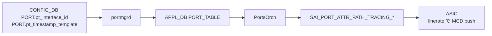

<!-- topics-tip -->
!!! tip "Topics で読み物として読む"
    この HLD は実装詳細を含みます。機能の概念・設定・運用を読み物として読みたい場合は [Topics 17 章: SRv6 / MPLS / Path Tracing](../topics/17-srv6-mpls/index.md) を参照。
<!-- /topics-tip -->

!!! success "裏取りステータス: code-verified"
    実装裏取り済み（下記コード位置）。Path Tracing: sonic-swss/doc/swss-schema.md:30,1026 (pt_interface_id, pt_timestamp_template) / sonic-swss/tests/test_port.py:310-412 (test_PortPathTracing, SAI_PORT_ATTR_PATH_TRACING_INTF, SAI_PORT_ATTR_PATH_TRACING_TIMESTAMP_TYPE, SAI_PORT_PATH_TRACING_TIMESTAMP_TYPE_12_19) で確認。

# Path Tracing Midpoint（IPv6 HbH-PT に MCD を追記）

## 概要

**Path Tracing**（IETF spring-path-tracing）はパケット経路の **interface ID 列 + per-hop delay + 出力 IF の load** をパケット内に書き残し、SRC→SINK で取り出して TimeSeries DB に蓄積する仕組み[^1]。各 transit (Midpoint) が **MCD**（Midpoint Compressed Data）を IPv6 **Hop-by-Hop Path Tracing Option (HbH-PT)** に積む。

役割[^1]:

- **PT Source**: probe 生成
- **PT Midpoint**: 通常の IPv6 forwarding / [SRv6](../reference/glossary.md#term-srv6) endpoint 処理に加え、自分の **MCD** を HbH-PT に書き足す
- **PT Sink**: SRC からの probe を集めて Regional Collector へ
- **RC (Regional Collector)**: probe を Time Series DB に保存し path / 時刻系列を再構築

本 [HLD](../reference/glossary.md#term-hld) は **Midpoint** の [SONiC](../reference/glossary.md#term-sonic) 実装を扱う。Source / Sink の HLD は別[^1]。

## 動作仕様

### MCD（Midpoint Compressed Data）の中身

各 midpoint は[^1]:

- **outgoing interface ID** (16-bit)
- **outgoing timestamp の truncated 形式** (8-bit、選択 template による)
- **outgoing interface load**

を MCD として HbH-PT に push する。1 hop 1 MCD。

### Timestamp template（4 種固定）

`saiport.h` で 4 種定義[^1]:

| Template | 切り出すビット |
|----------|---------------|
| template1 | bits 08–15 |
| template2 | bits 12–19 |
| template3 | bits 16–23 |
| template4 | bits 20–27 |

ネットワーク全体の **時間スケールが揃っていれば** 8-bit でも一意に推定できる、という前提。SRC / Midpoint / Sink で揃える運用が望ましい。

### SAI 拡張

`SAI_OBJECT_TYPE_PORT` に 2 属性追加[^1]:

```c
SAI_PORT_ATTR_PATH_TRACING_INTF_ID            // sai_uint16_t
SAI_PORT_ATTR_PATH_TRACING_TIMESTAMP_TEMPLATE // template1..4 enum
```

両方とも CREATE_AND_SET。port (= egress interface) 単位。

### CONFIG_DB / APPL_DB スキーマ

```text
CONFIG_DB PORT|<port_name>
  pt_interface_id        = <0..65535>
  pt_timestamp_template  = "template1" | "template2" | "template3" | "template4"
```

[APPL_DB](../reference/glossary.md#term-appl_db) の `PORT_TABLE` にも対応 field が伝搬する（[portmgrd](../reference/glossary.md#term-portmgrd) 経由）[^1]。

### CLI（追加）

| Command | 用途 |
|---------|------|
| `config interface pt-interface-id <if> <id>` | PT interface ID |
| `config interface pt-timestamp-template <if> <template1..4>` | timestamp template |
| `show interface path-tracing` | 現在の設定一覧 |

> 具体名は HLD 文章ベースの整理。実際のサブコマンド命名は実装側で確認。

### 全体の流れ



通常の forwarding と同じ経路で programming される（`portsyncd` / `portmgrd` を経由）。Path Tracing 自体は [ASIC](../reference/glossary.md#term-asic) で **linerate 実装** されることが前提[^1]。

<!-- evidence:
source: sonic-net/SONiC/doc/path_tracing/path_tracing_midpoint.md#L80-L94 (sha: 49bab5b5ff0e924f1ea52b3d9db0dfa4191a7c06)
excerpt: |
  Every interface of the PT Midpoint is assigned an interface ID and timestamp template.
  The SAI Port object has been extended with two new attributes for the Interface ID and the timestamp template.
  template1: bits 08-15 / template2: bits 12-19 / template3: bits 16-23 / template4: bits 20-27
reasoning: SAI 属性追加と timestamp template 4 種の根拠。
-->

<!-- evidence-rendered:start -->
??? note "📋 検証エビデンス: sonic-net/SONiC/doc/path_tracing/path_tracing_midpoint.md#L80-L94 (sha: 49bab5b5ff0e924f1ea52b3d9db0dfa4191a7c06)"

    **出典**:

    `sonic-net/SONiC/doc/path_tracing/path_tracing_midpoint.md#L80-L94 (sha: 49bab5b5ff0e924f1ea52b3d9db0dfa4191a7c06)`

    **抜粋**:

    ```text
    Every interface of the PT Midpoint is assigned an interface ID and timestamp template.
    The SAI Port object has been extended with two new attributes for the Interface ID and the timestamp template.
    template1: bits 08-15 / template2: bits 12-19 / template3: bits 16-23 / template4: bits 20-27
    ```

    **判断根拠**: SAI 属性追加と timestamp template 4 種の根拠。

<!-- evidence-rendered:end -->

### YANG

`sonic-port.yang` に 2 leaf を追加[^1]: `pt_interface_id` (uint16), `pt_timestamp_template` (enum)。

## 設定

### 関連する CONFIG_DB

| Table | Key | フィールド |
|-------|-----|------------|
| `PORT` | `<port>` | `pt_interface_id`, `pt_timestamp_template` |

### 関連する CLI

上記 3 つ（実装側で名称確認）。

### 設定例

```bash
# Ethernet0 を PT Midpoint として ID=4242, template2 で構成
sudo config interface pt-interface-id Ethernet0 4242
sudo config interface pt-timestamp-template Ethernet0 template2

show interface path-tracing
```

## 制限事項

- **Source / Sink 機能は別 HLD**。Midpoint だけでは PT は完結しない[^1]
- linerate 動作には ASIC 対応が必須。Cisco Silicon One / Light Speed / Broadcom Jericho / Marvell 等が対応と HLD は列挙[^1]
- timestamp template は 4 種固定。任意の bit セレクションはできない
- HbH-PT の MAX hop 数は IPv6 Hop-by-Hop オプションのサイズに制約される（HLD で深くは詳述されていない）

## 干渉する機能

- **SRv6**: PT Midpoint は SR Endpoint 処理 + MCD 追記もできる
- **timestamp 同期 (PTP / NTP / chrony)**: 時間 base が揃っていないと post-analysis で path 復元できない
- **port load 監視**: outgoing interface load を MCD に書く。同じ counter を別経路でも見ているなら齟齬チェック可
- **HbH header / IPv6 jumbogram**: HbH オプション領域の競合に注意

## トラブルシューティング

```bash
# 設定の確認
redis-cli -n 4 HGETALL "PORT|Ethernet0" | grep -E pt_interface_id\|pt_timestamp_template

# APPL_DB
redis-cli -n 0 HGETALL "PORT_TABLE:Ethernet0" | grep -E pt_

# ASIC 反映
redis-cli -n 1 KEYS "ASIC_STATE:SAI_OBJECT_TYPE_PORT:*" | head
# 各 OID で SAI_PORT_ATTR_PATH_TRACING_INTF_ID 等を見る

# wireshark 等で HbH-PT を確認
# (Path Tracing Wireshark dissector 利用)
```

## 関連 reference

- [Topics: SRv6 / MPLS](../topics/17-srv6-mpls/index.md)
- [CLI: show ip](../reference/cli/show-ip.md)

## 引用元

[^1]: `sonic-net/SONiC` `doc/path_tracing/path_tracing_midpoint.md` @ `49bab5b5ff0e924f1ea52b3d9db0dfa4191a7c06`

<!-- topics-back-ref -->
## 関連 Topics

- [Topics: SRv6 / MPLS / Path Tracing](../topics/17-srv6-mpls/index.md)

<!-- /topics-back-ref -->

<!-- glossary-links-injected: ec18b66e3507 -->
