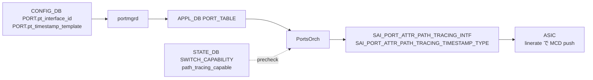

<!-- topics-tip -->
!!! tip "Topics で読み物として読む"
    この HLD は実装詳細を含む。機能の概念・設定・運用を読み物として読みたい場合は [Topics 17 章: SRv6 / MPLS / Path Tracing](../topics/17-srv6-mpls/index.md) を参照。
<!-- /topics-tip -->

!!! success "裏取りステータス: code-verified"
    実装裏取り済み。CLI / SAI / schema / capability は SONiC HLD `doc/path_tracing/path_tracing_midpoint.md`、`sonic-swss/doc/swss-schema.md:30,1026`、`sonic-swss/tests/test_port.py:385-415` で確認。

# Path Tracing Midpoint（IPv6 HbH-PT に MCD を追記）

## 概要

**Path Tracing**（IETF spring-path-tracing）はパケット経路の **interface ID 列 + per-hop delay + 出力 IF の load** をパケット内に書き残し、SRC→SINK で取り出して TimeSeries DB に蓄積する仕組み[^1]。各 transit (Midpoint) が **MCD**（Midpoint Compressed Data）を IPv6 **Hop-by-Hop Path Tracing Option (HbH-PT)** に積む。

役割[^1]:

- **PT Source**: probe 生成
- **PT Midpoint**: 通常の IPv6 forwarding / [SRv6](../reference/glossary.md#term-srv6) endpoint 処理に加え、自分の **MCD** を HbH-PT に書き足す
- **PT Sink**: SRC からの probe を集めて Regional Collector へ
- **RC (Regional Collector)**: probe を Time Series DB に保存し path / 時刻系列を再構築

本 [HLD](../reference/glossary.md#term-hld) は **Midpoint** の [SONiC](../reference/glossary.md#term-sonic) 実装を扱う。Source / Sink の HLD は別[^1]。

## 動作仕様

### MCD（Midpoint Compressed Data）の中身

各 midpoint は[^1]:

- **outgoing interface ID** (12-bit、1-4095)
- **outgoing timestamp の truncated 形式** (8-bit、選択 template による)
- **outgoing interface load**

を MCD として HbH-PT に push する。1 hop 1 MCD。

### Timestamp template（4 種固定）

`saiport.h` の `sai_port_path_tracing_timestamp_type_t` で 4 種定義[^1]:

| Template | [SAI](../reference/glossary.md#term-sai) enum | 切り出すビット |
|----------|----------|---------------|
| template1 | `SAI_PORT_PATH_TRACING_TIMESTAMP_TYPE_8_15` | bits 08–15 |
| template2 | `SAI_PORT_PATH_TRACING_TIMESTAMP_TYPE_12_19` | bits 12–19 |
| template3 | `SAI_PORT_PATH_TRACING_TIMESTAMP_TYPE_16_23` | bits 16–23 |
| template4 | `SAI_PORT_PATH_TRACING_TIMESTAMP_TYPE_20_27` | bits 20–27 |

デフォルトは **template3** (`SAI_PORT_PATH_TRACING_TIMESTAMP_TYPE_16_23`)[^1]。ネットワーク全体の **時間スケールが揃っていれば** 8-bit でも一意に推定できる、という前提。SRC / Midpoint / Sink で揃える運用が望ましい。

### SAI 拡張

`SAI_OBJECT_TYPE_PORT` に 2 属性追加[^1]:

```c
SAI_PORT_ATTR_PATH_TRACING_INTF             // sai_uint16_t (Interface ID)
SAI_PORT_ATTR_PATH_TRACING_TIMESTAMP_TYPE   // sai_port_path_tracing_timestamp_type_t
```

両方とも CREATE_AND_SET。port (= egress interface) 単位。`SAI_PORT_ATTR_PATH_TRACING_TIMESTAMP_TYPE` のデフォルトは `SAI_PORT_PATH_TRACING_TIMESTAMP_TYPE_16_23`[^1]。

加えて SAI [TAM](../reference/glossary.md#term-tam) [INT](../reference/glossary.md#term-int) object に `SAI_TAM_INT_TYPE_PATH_TRACING` が追加されている[^1]。

### CONFIG_DB / APPL_DB スキーマ

```text
CONFIG_DB PORT|<port_name>
  pt_interface_id        = <1..4095>
  pt_timestamp_template  = "template1" | "template2" | "template3" | "template4"
```

[APPL_DB](../reference/glossary.md#term-appl_db) の `PORT_TABLE` にも対応 field が伝搬する（[portmgrd](../reference/glossary.md#term-portmgrd) 経由）[^1][^2]。

### STATE_DB Capability

PortsOrch 初期化時に sairedis `sai_query_attribute_capability()` で ASIC の Path Tracing 対応を問い合わせ、結果を [STATE_DB](../reference/glossary.md#term-state_db) `SWITCH_CAPABILITY` テーブルに格納する[^1]:

```text
STATE_DB SWITCH_CAPABILITY|switch
  path_tracing_capable = "true" | "false"
```

CLI は本属性を見て、未対応 ASIC では `config interface path-tracing add` をエラーにする[^1]。

### CLI（追加）

`config interface` / `show interfaces` にサブコマンド `path-tracing` を追加[^1]。

| Command | 用途 |
|---------|------|
| `config interface path-tracing add <if> --interface-id <id> [--ts-template <tpl>]` | Path Tracing 有効化 + interface ID / timestamp template 設定 |
| `config interface path-tracing del <if>` | Path Tracing 無効化 |
| `show interfaces path-tracing [<if>]` | 現在の PT Midpoint 設定一覧 |

`--ts-template` は省略可能でデフォルト `template3`。`<id>` の範囲は 1-4095[^1]。

### 全体の流れ



通常の forwarding と同じ経路で programming される（`portsyncd` / `portmgrd` を経由）。Path Tracing 自体は [ASIC](../reference/glossary.md#term-asic) で **linerate 実装** されることが前提[^1]。

<!-- evidence:
source: sonic-net/SONiC/doc/path_tracing/path_tracing_midpoint.md#L341-L380 (sha: 49bab5b5ff0e924f1ea52b3d9db0dfa4191a7c06)
excerpt: |
  The SAI Port object has been extended with two new attributes
  SAI_PORT_ATTR_PATH_TRACING_INTF and SAI_PORT_ATTR_PATH_TRACING_TIMESTAMP_TYPE.
  Enum values: SAI_PORT_PATH_TRACING_TIMESTAMP_TYPE_{8_15,12_19,16_23,20_27}.
  Default is SAI_PORT_PATH_TRACING_TIMESTAMP_TYPE_16_23 (template3).
reasoning: SAI 属性名・enum 値・デフォルトの根拠。
-->

<!-- evidence-rendered:start -->
??? note "📋 検証エビデンス: sonic-net/SONiC/doc/path_tracing/path_tracing_midpoint.md#L341-L380 (sha: 49bab5b5ff0e924f1ea52b3d9db0dfa4191a7c06)"

    **出典**:

    `sonic-net/SONiC/doc/path_tracing/path_tracing_midpoint.md#L341-L380 (sha: 49bab5b5ff0e924f1ea52b3d9db0dfa4191a7c06)`

    **抜粋**:

    ```text
    The SAI Port object has been extended with two new attributes
    SAI_PORT_ATTR_PATH_TRACING_INTF and SAI_PORT_ATTR_PATH_TRACING_TIMESTAMP_TYPE.
    Enum values: SAI_PORT_PATH_TRACING_TIMESTAMP_TYPE_{8_15,12_19,16_23,20_27}.
    Default is SAI_PORT_PATH_TRACING_TIMESTAMP_TYPE_16_23 (template3).
    ```

    **判断根拠**: SAI 属性名・enum 値・デフォルトの根拠。

<!-- evidence-rendered:end -->

### YANG

`sonic-port.yang` に 2 leaf を追加[^1]: `pt_interface_id` (uint16), `pt_timestamp_template` (enum `path_tracing_timestamp_template`)。`pt_timestamp_template` は `when "current()/../pt_interface_id"` の when 条件付き（interface ID 未設定時には設定不可）。

## 設定

### 関連する CONFIG_DB

| Table | Key | フィールド |
|-------|-----|------------|
| `PORT` | `<port>` | `pt_interface_id` (1-4095), `pt_timestamp_template` (template1..4) |

### 関連する CLI

- `config interface path-tracing add <if> --interface-id <id> [--ts-template <tpl>]`
- `config interface path-tracing del <if>`
- `show interfaces path-tracing [<if>]`

### 設定例

```bash
# Ethernet8 に interface ID=128 を割り当て (template はデフォルト = template3)
sudo config interface path-tracing add Ethernet8 --interface-id 128

# Ethernet9 に interface ID=129、template2 を明示指定
sudo config interface path-tracing add Ethernet9 --interface-id 129 --ts-template template2

# 設定確認
show interfaces path-tracing

# 無効化
sudo config interface path-tracing del Ethernet9
```

## 制限事項

- **Source / Sink 機能は別 HLD**。Midpoint だけでは PT は完結しない[^1]
- linerate 動作には ASIC 対応が必須。STATE_DB `SWITCH_CAPABILITY.path_tracing_capable=true` が出ていないと CLI 側で拒否される[^1]
- Interface ID は 1-4095 (12-bit 表現)。0 は無効[^1][^2]
- timestamp template は 4 種固定。任意の bit セレクションはできない
- HbH-PT の MAX hop 数は IPv6 Hop-by-Hop オプションのサイズに制約される（HLD で深くは詳述されていない）

## 干渉する機能

- **SRv6**: PT Midpoint は SR Endpoint 処理 + MCD 追記もできる
- **timestamp 同期 (PTP / NTP / chrony)**: 時間 base が揃っていないと post-analysis で path 復元できない
- **port load 監視**: outgoing interface load を MCD に書く。同じ counter を別経路でも見ているなら齟齬チェック可
- **HbH header / IPv6 jumbogram**: HbH オプション領域の競合に注意

## トラブルシューティング

```bash
# Capability の確認 (前提条件)
redis-cli -n 6 HGET "SWITCH_CAPABILITY|switch" path_tracing_capable

# 設定の確認
redis-cli -n 4 HGETALL "PORT|Ethernet0" | grep -E 'pt_interface_id|pt_timestamp_template'

# APPL_DB
redis-cli -n 0 HGETALL "PORT_TABLE:Ethernet0" | grep -E pt_

# ASIC 反映 (SAI_PORT_ATTR_PATH_TRACING_INTF / _TIMESTAMP_TYPE を見る)
redis-cli -n 1 KEYS "ASIC_STATE:SAI_OBJECT_TYPE_PORT:*" | head

# wireshark 等で HbH-PT を確認 (Path Tracing Wireshark dissector 利用)
```

## 関連 reference

- [Topics: SRv6 / MPLS](../topics/17-srv6-mpls/index.md)

## 引用元

[^1]: `sonic-net/SONiC` `doc/path_tracing/path_tracing_midpoint.md` @ `49bab5b5ff0e924f1ea52b3d9db0dfa4191a7c06`（CLI 構文 L143-L167、ID 範囲 L151、SAI 属性 / enum / default L341-L380、SAI TAM INT L383/L429、STATE_DB capability L169-L172/L327-L337、[YANG](../reference/glossary.md#term-yang) L455-L492）
[^2]: `sonic-net/sonic-swss` `doc/swss-schema.md` L30-L31, L1026-L1027（[CONFIG_DB](../reference/glossary.md#term-config_db) / APPL_DB PORT スキーマ）

<!-- topics-back-ref -->
## 関連 Topics

- [Topics: SRv6 / MPLS / Path Tracing](../topics/17-srv6-mpls/index.md)

<!-- /topics-back-ref -->

<!-- glossary-links-injected: c4cf37d6506c -->
