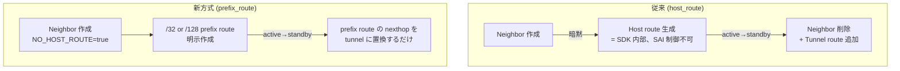

<!-- topics-tip -->
!!! tip "Topics で読み物として読む"
    この HLD は実装詳細を含みます。機能の概念・設定・運用を読み物として読みたい場合は [Topics 05 章: Dual ToR / MUX / アクティブ冗長](../topics/05-dual-tor/index.md) を参照。
<!-- /topics-tip -->

!!! success "裏取りステータス: code-verified"
    `sonic-swss/orchagent/muxorch.h` L205 で MUX_CABLE の `neighbor_mode` フィールドが `REQ_T_STRING` で受け付けられ、`muxorch.cpp` L1172 `MuxPrefixBasedNbrHandler` クラス、L2238-2286 で `neighbor_mode` 値を読み取り `MuxNbrHandlerType::NBR_HANDLER_PREFIX_BASED / HOST_ROUTE` に分岐し、STATE_DB `MUX_CABLE_TABLE` に `neighbor_mode = "prefix-route" / "host-route"` を反映することを確認。`SAI_NEIGHBOR_ENTRY_ATTR_NO_HOST_ROUTE` は `sonic-swss/orchagent/p4orch/l3_multicast_manager.cpp` L154 ほかで使用済み (verified at: 2026-05-09)。

# プレフィックスルート方式の Mux ネイバ（Dual-ToR の状態遷移最適化）

## 概要

Dual-ToR トポロジでは ToR 切替（mux state transition）の度にサーバ向けネイバエントリを **追加・削除** する必要があり、ネイバ数が多い ToR では切替時の処理量と [SAI](../reference/glossary.md#term-sai) コール回数が線形に増えていく[^1]。

本機能は SAI ネイバ作成時に **暗黙のホストルート生成を抑止**（`SAI_NEIGHBOR_ENTRY_ATTR_NO_HOST_ROUTE=true`）し、その代わりに `/32`（IPv4）または `/128`（IPv6）の **明示的なプレフィックスルート** を作成する。Mux 状態遷移時はネイバエントリ自体は触らず、プレフィックスルートの **ネクストホップだけを直接ネイバ↔[IPinIP](../reference/glossary.md#term-ipinip) トンネルで切り替える**。これにより `O(neighbor 数)` の add/remove が 1 ルートの nexthop 更新に集約され、切替が大幅に軽量化される[^1]。

## 動作仕様

### 従来方式 vs プレフィックスルート方式



要点[^1]:

- 旧来の host route は SDK が暗黙生成する非 SAI オブジェクトであり、[SONiC](../reference/glossary.md#term-sonic) からは制御できない。
- 新方式の prefix route は SAI ルートオブジェクトとして可視であり、`set route attribute next_hop` で書き換えられる。
- ネイバエントリ自体は遷移中も **persistent**。SAI の `create_neighbor_entry` / `remove_neighbor_entry` を呼ばないので大幅に軽い。

### Orchagent 側の変更

#### NeighborOrch

ネイバ作成時の追加処理[^1]:

1. 対象ネイバが mux ポート配下か判定。
2. mux ポートかつプレフィックスルート方式なら `SAI_NEIGHBOR_ENTRY_ATTR_NO_HOST_ROUTE=true` で作成。
3. 続けて `<server_ip>/32` または `<server_ip>/128` のプレフィックスルートを **mux 現状態に応じた nexthop** で作成する。

mux ポートに動的指定された場合のために、`MuxOrch` から既存ネイバを mux ネイバへ昇格する API も提供される[^1]。

#### MuxOrch

新たに「プレフィックスルート用 neighbor handler」を追加し、ポート単位の `neighbor_mode` で従来 handler と切り替える。これにより同一スイッチ上で host_route と prefix_route の **共存** を許す[^1]。

[linkmgrd](../reference/glossary.md#term-linkmgrd) の状態通知に応じて[^1]:

| 遷移 | 動作 |
|------|------|
| active → standby | prefix route の nexthop を tunnel nexthop（IPinIP）へ置換 |
| standby → active | prefix route の nexthop を直接ネイバ nexthop へ戻す |
| 全期間 | ネイバエントリは触らない |

State-DB の `MUX_CABLE_TABLE.<port>.neighbor_mode` に現在のモードを公開し、デバッグユーティリティから参照させる。

<!-- evidence:
source: sonic-net/SONiC/doc/dualtor/mux_neighbors_using_prefix_route.md#L62-L106 (sha: 49bab5b5ff0e924f1ea52b3d9db0dfa4191a7c06)
excerpt: |
  The neighbor entry is created with SAI_NEIGHBOR_ENTRY_ATTR_NO_HOST_ROUTE=true,
  which prevents implicit host route creation in SDK/ASIC.
  ... During active to standby transition: The prefix route's nexthop is updated from the direct neighbor nexthop to the tunnel nexthop ...
reasoning: NO_HOST_ROUTE 属性とプレフィックスルート差し替えによる状態遷移最適化の根拠。
-->

<!-- evidence-rendered:start -->
??? note "📋 検証エビデンス: sonic-net/SONiC/doc/dualtor/mux_neighbors_using_prefix_route.md#L62-L106 (sha: 49bab5b5ff0e924f1ea52b3d9db0dfa4191a7c06)"

    **出典**:

    `sonic-net/SONiC/doc/dualtor/mux_neighbors_using_prefix_route.md#L62-L106 (sha: 49bab5b5ff0e924f1ea52b3d9db0dfa4191a7c06)`

    **抜粋**:

    ```text
    The neighbor entry is created with SAI_NEIGHBOR_ENTRY_ATTR_NO_HOST_ROUTE=true,
    which prevents implicit host route creation in SDK/ASIC.
    ... During active to standby transition: The prefix route's nexthop is updated from the direct neighbor nexthop to the tunnel nexthop ...
    ```

    **判断根拠**: NO_HOST_ROUTE 属性とプレフィックスルート差し替えによる状態遷移最適化の根拠。

<!-- evidence-rendered:end -->

### Capability チェックと後方互換

[ASIC](../reference/glossary.md#term-asic) が `SAI_NEIGHBOR_ENTRY_ATTR_NO_HOST_ROUTE` をサポートしない場合、自動的に **host_route 方式へフォールバック** する[^1]。さらに per-port の config knob `neighbor_mode` で強制的に host_route に戻すこともできる。これによりプラットフォーム間の混在配備と新旧比較デバッグを許す。

ネイバモードの **動的変更はサポート対象外**。一度 mux ネイバとして作られたら、その port の mode 変更は config reload を伴う想定[^1]。

### トラフィック転送パス

| 状態 | フロー |
|------|--------|
| Active  | 受信パケット → prefix route lookup → 直接ネイバ nexthop → サーバ |
| Standby | 受信パケット → prefix route lookup → tunnel nexthop → IPinIP → Peer ToR → サーバ |

## 設定

### 関連する CONFIG_DB

| Table | Key | フィールド | 値 | 説明 |
|-------|-----|-----------|-----|------|
| `MUX_CABLE` | `<port>` | `neighbor_mode` | `host_route` / `prefix_route` | 既定は `prefix_route`。capability に応じて自動フォールバック |

### 関連する State-DB

| Table | フィールド | 用途 |
|-------|-----------|------|
| `MUX_CABLE_TABLE.<port>` | `neighbor_mode` | 現在実際に使われているモード（host_route / prefix_route） |

### 関連する CLI

`show muxcable config` の出力末尾に `neighbor_mode` 列が追加される[^1]:

```text
port         state   ipv4             cable_type     prober_type   neighbor_mode
-----------  ------  ---------------  -------------  ------------  -------------
Ethernet0    auto    192.168.0.2/32   active-active  software      host-route
Ethernet8    auto    192.168.0.4/32   active-active  software      prefix-route
```

`dualtor_neighbor_check` ユーティリティは prefix route 方式向けに新フォーマットを出す[^1]:

```text
NEIGHBOR     MAC                PORT       MUX_STATE  NEIGHBOR_IN_ASIC  PREFIX_ROUTE  NEXTHOP_TYPE  HWSTATUS
192.168.0.3  e2:67:e4:05:9a:ec  Ethernet0  standby    yes               yes           TUNNEL        consistent
192.168.0.7  9a:41:63:4f:86:7c  Ethernet16 active     yes               yes           NEIGHBOR      consistent
```

`NEXTHOP_TYPE` が現在 prefix route に紐付いている nexthop 種別（`NEIGHBOR` または `TUNNEL`）を示す。

## 制限事項

- **ASIC capability 必須**: `SAI_NEIGHBOR_ENTRY_ATTR_NO_HOST_ROUTE` を実装しない ASIC では使えず、host_route にフォールバックする[^1]。
- **mode 動的変更不可**: 一度作成された mux ネイバの mode を実行時に切り替えることはサポートされない[^1]。
- **Warm reboot 対応は TBD**: [HLD](../reference/glossary.md#term-hld) は warm reboot サポートを「TBD」と明記しており未確定[^1]。

## 干渉する機能

- **`linkmgrd` / `MuxOrch` の状態機械**: 状態遷移は従来どおり linkmgrd → MuxOrch だが、SAI 操作の中身が neighbor add/remove から route attribute set に置き換わる。
- **IPinIP トンネル**: standby 時の tunnel nexthop は既存 IPinIP 機構を再利用する。tunnel terminator 側に変更はない。
- **暗黙ホストルート挙動の差**: 他機能（例: [ARP](../reference/glossary.md#term-arp)/ND 学習に紐づくホストルート期待）が暗黙ホストルートに依存している場合、mux ポートでは prefix route で代替されるため挙動を確認する必要がある。

## トラブルシューティング

- 切替が遅い / SAI コールが多い: `STATE_DB.MUX_CABLE_TABLE.<port>.neighbor_mode` を確認。`host_route` のままなら capability 失敗かフラグ強制を疑う。
- prefix route の nexthop が更新されない: `MuxOrch` のログ、SAI route attribute の最新値（`saidump` 等）を確認。
- `dualtor_neighbor_check` の出力で `PREFIX_ROUTE=no`: prefix_route モードのはずなのに作られていない → NeighborOrch 側のフォールバック分岐を確認。

### コマンド例

Dual-ToR の prefix-based mux neighbor 設定を確認する。

```bash
show mux status
show mux config
redis-cli -n 4 keys 'MUX_CABLE|*'
```

## 参考リンク

- [CLI: show muxcable](../reference/cli/show-muxcable.md)
- [YANG: sonic-mux-cable](../reference/yang/sonic-mux-cable.md)
- [Topics: Dual-ToR](../topics/05-dual-tor/index.md)
- [Runbook: dualtor mux](../reference/runbooks/dualtor-mux.md)

## 引用元

[^1]: `sonic-net/SONiC` `doc/dualtor/mux_neighbors_using_prefix_route.md` @ `49bab5b5ff0e924f1ea52b3d9db0dfa4191a7c06`

<!-- topics-back-ref -->
## 関連 Topics (自動リンク)

- [Topics: Dual-ToR と Mux 制御](../topics/05-dual-tor/index.md)

<!-- /topics-back-ref -->

## 外部参考リンク (自動リンク)

本ページに関連する参照ドキュメント:

- [`show muxcable config` CLI リファレンス](../reference/cli/show-muxcable.md)
- [`show muxcable` CLI リファレンス](../reference/cli/show-muxcable.md)
- [`show arp` CLI リファレンス](../reference/cli/show-arp.md)
- [`MUX_CABLE` CONFIG_DB スキーマ](../reference/config-db/mux-cable.md)
- [`TUNNEL` CONFIG_DB スキーマ](../reference/config-db/tunnel.md)

<!-- augmented-links: v1 -->

<!-- glossary-links-injected: ec18b66e3507 -->
