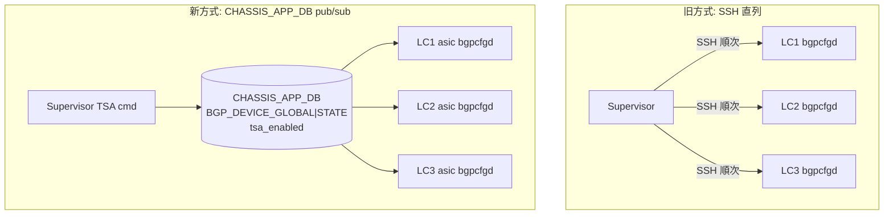
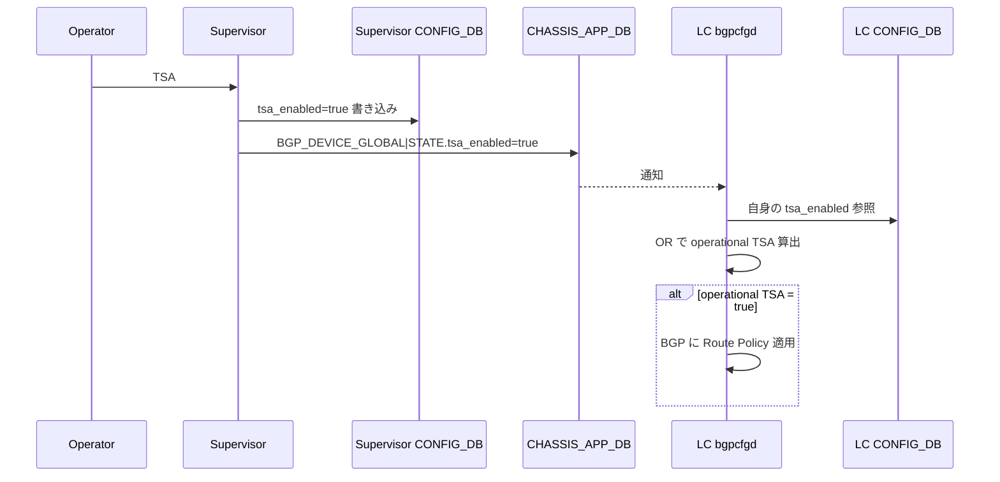

<!-- topics-tip -->
!!! tip "Topics で読み物として読む"
    この HLD は実装詳細を含みます。機能の概念・設定・運用を読み物として読みたい場合は [Topics 05 章: Dual ToR / MUX / アクティブ冗長](../topics/05-dual-tor/index.md) を参照。
<!-- /topics-tip -->

!!! success "裏取りステータス: Code-verified"
    `sonic-buildimage/src/sonic-bgpcfgd/bgpcfgd/managers_chassis_app_db.py` L8 `ChassisAppDbMgr` が L20 で `CONFIG_DB BGP_DEVICE_GLOBAL.tsa_enabled` を subscribe し、L44 で `dev_cfg_mgr.isolate_unisolate_device` を呼ぶ経路を確認。`main.py` L113 で `ChassisAppDbMgr(common_objs, "CHASSIS_APP_DB", "BGP_DEVICE_GLOBAL")` 登録、`managers_device_global.py` L91-104 / L246-247 で `CHASSIS_APP_DB` への `tsa_enabled` 書き込みと `BGP_DEVICE_GLOBAL|STATE` 読み出しを確認。`sonic-buildimage/dockers/docker-fpm-frr/base_image_files/TSA` / `TSB` / `TS` で `CHASSIS_APP_DB HMSET "BGP_DEVICE_GLOBAL|STATE" tsa_enabled` を行うこと、`files/build_templates/startup_tsa_tsb.service` と `files/scripts/startup_tsa_tsb.py` 存在を確認（verified at: 2026-05-09）。

# Reliable TSA（VoQ Chassis 全体での TSA を CHASSIS_APP_DB で同期）

## 概要

TSA（Traffic-Shift Away）は [SONiC](../reference/glossary.md#term-sonic) ルータをトラフィック対象から外すための運用機能で、[BGP](../reference/glossary.md#term-bgp) に対して **「ネイバへ経路を広告しない」Route Policy** を適用する。新規導入時のヘルスチェックや、稼働中ルータのメンテナンス前に使う[^1]。

VoQ Chassis（Supervisor + 複数 Line Card で 1 つの論理ルータを構成）では、従来の TSA 実装が次のように動いていた[^1]:

1. LC 上で `TSA` / `TSB` を打つと LC の `CONFIG_DB` を更新 → `bgpcfgd` が反映
2. Supervisor 上で `TSA` / `TSB` を打つと Supervisor が **各 LC へ SSH** で同コマンドを順次発行

この方式は「LC への SSH 直列発行」という前提のため、(a) 末尾 LC への遅延、(b) ハング LC は永久に TSA がかからない、(c) Supervisor 側コマンドが LC 側の TSA 設定を書き換えてしまうので **LC ごとに異なる TSA 状態を維持できない**、という問題があった[^1]。

本 [HLD](../reference/glossary.md#term-hld) は **`CHASSIS_APP_DB` に Supervisor の TSA 状態を 1 つ持たせ、各 LC asic の `bgpcfgd` がそれを subscribe する** 設計に切り替える。SSH 配布をやめ、Supervisor / LC それぞれで独立に `tsa_enabled` を持ち、運用上の TSA 状態は両者の OR で決まる。

## 動作仕様

### 旧方式と新方式の比較



旧方式は SSH のため遅延・ハング・LC の TSA 状態上書きが発生。新方式は pub/sub なので LC が後から復帰しても整合する。

### TSA 状態の決定ロジック

LC asic ごとの **operational TSA 状態** は次の真理値表で決まる[^1]。

| Supervisor `tsa_enabled` | LC `tsa_enabled` | Operational TSA |
|--------------------------|------------------|----------------|
| TRUE | TRUE | TSA |
| TRUE | FALSE | **TSA**（Supervisor 優先） |
| FALSE | TRUE | TSA |
| FALSE | FALSE | TSB（通常運用） |

要するに「OR 演算」で TSA が掛かる。**Supervisor の TSA は強制的で、LC が個別に TSB に戻すことはできない**。

### 起動・再起動時の挙動

| 状況 | Supervisor `tsa_enabled` | 振る舞い |
|------|--------------------------|--------|
| LC 再起動 | TRUE | LC 起動後すぐ TSA。`startup_tsa_tsb` は走るがタイマ切れ後も Supervisor が TRUE なので TSA 継続 |
| `config reload` | TRUE | TSA を維持 |
| docker 再起動 / クラッシュ | TRUE | 復帰後 TSA を維持 |
| LC 再起動 | FALSE | 通常どおり LC 設定 + `startup_tsa_tsb` のみで決定 |
| Supervisor 再起動 / `config reload` | (ファイルに保存) | Supervisor の `config_db.json` から復元 |

ポイント:

- LC ごとの `startup_tsa_tsb` サービスは廃止しない。LC のローカル [CONFIG_DB](../reference/glossary.md#term-config_db) を従来どおり更新するが、最終的な TSA 状態は OR で決まる
- Supervisor の `tsa_enabled` も `config_db.json` に保存され、Supervisor 再起動を跨いで永続化する[^1]

### Supervisor → LC への伝搬シーケンス



<!-- evidence:
source: sonic-net/SONiC/doc/voq/Reliable_TSA.md#L62-L75 (sha: 49bab5b5ff0e924f1ea52b3d9db0dfa4191a7c06)
excerpt: |
  1. Add a new tsa_enabled attribute to CHASSIS_APP_DB
  ...
  4. Modify bgpcfgd to subscribe to updates to the tsa_enabled attribute of CHASSIS_APP_DB
  5. Modify bgpcfgd to take into account the values of tsa_enabled attributes of both the CHASSIS_APP_DB and the local CONFIG_DB when determining whether BGP should be in TSA or TSB state.
reasoning: 「CHASSIS_APP_DB 追加 + bgpcfgd 双方参照」という本設計の中核根拠。
-->

<!-- evidence-rendered:start -->
??? note "📋 検証エビデンス: sonic-net/SONiC/doc/voq/Reliable_TSA.md#L62-L75 (sha: 49bab5b5ff0e924f1ea52b3d9db0dfa4191a7c06)"

    **出典**:

    `sonic-net/SONiC/doc/voq/Reliable_TSA.md#L62-L75 (sha: 49bab5b5ff0e924f1ea52b3d9db0dfa4191a7c06)`

    **抜粋**:

    ```text
    1. Add a new tsa_enabled attribute to CHASSIS_APP_DB
    ...
    4. Modify bgpcfgd to subscribe to updates to the tsa_enabled attribute of CHASSIS_APP_DB
    5. Modify bgpcfgd to take into account the values of tsa_enabled attributes of both the CHASSIS_APP_DB and the local CONFIG_DB when determining whether BGP should be in TSA or TSB state.
    ```

    **判断根拠**: 「CHASSIS_APP_DB 追加 + bgpcfgd 双方参照」という本設計の中核根拠。

<!-- evidence-rendered:end -->

## 設定

### 関連する CHASSIS_APP_DB

```text
BGP_DEVICE_GLOBAL|STATE
    tsa_enabled : "true" | "false"
```

これは Supervisor の TSA 状態だけを保持する。LC ごとの TSA は LC の CONFIG_DB に従来どおり持つ。

### 関連する CONFIG_DB

LC asic 側の CONFIG_DB（既存）:

```text
BGP_DEVICE_GLOBAL|STATE
    tsa_enabled : "true" | "false"
```

Supervisor の host CONFIG_DB にも同じ key を追加し、`config_db.json` 永続化に組み込まれる[^1]。

### 関連する CLI

| Command | スコープ | 効果 |
|---------|---------|------|
| `TSA` (Supervisor) | Supervisor のみ | Supervisor host CONFIG_DB と CHASSIS_APP_DB の `tsa_enabled` を TRUE 化 |
| `TSB` (Supervisor) | Supervisor のみ | 同 FALSE 化 |
| `TSA` (LC) | 当該 LC の各 asic | LC の CONFIG_DB だけを TRUE 化 |
| `TSB` (LC) | 当該 LC の各 asic | LC の CONFIG_DB だけを FALSE 化 |

新方式では **Supervisor 側コマンドが LC の CONFIG_DB を上書きしない**。これにより LC ごとに異なる TSA 設定を維持しつつ、Supervisor で全体を強制 TSA にできる[^1]。

### 設定例

Supervisor で全体 TSA、LC2 だけ独立に TSB:

- Supervisor: `TSA` を実行 → CHASSIS_APP_DB に `tsa_enabled=true`
- 結果: LC1, LC2, LC3 すべて operational TSA（Supervisor 優先）
- 後で Supervisor で `TSB` → LC2 の CONFIG_DB が FALSE なら LC2 は通常運用に戻る

## 制限事項

- 適用範囲は **VoQ Chassis のみ**。T0/T1 等の非 chassis 構成は影響を受けない[^1]
- Supervisor の TSA は強制的。LC 側で部分的に「Supervisor の TSA だけ無視する」ことはできない
- `startup_tsa_tsb` サービスは廃止されない。LC 復帰直後は LC ローカル設定で起動し、Supervisor の状態に追随する形になる

## 干渉する機能

- **`bgpcfgd`**: CHASSIS_APP_DB の `BGP_DEVICE_GLOBAL|STATE.tsa_enabled` を subscribe するロジックが追加される。LC CONFIG_DB の同名キーと OR を取る
- **`startup_tsa_tsb`**: LC 再起動時のみ動作。Supervisor が TRUE の限り、タイマ切れ後も TSA は維持される
- **CHASSIS_APP_DB**: Supervisor が書き手、LC asic が読み手。Pub/sub の整合性が前提
- **`config reload` / `config save`**: Supervisor 側の `config_db.json` に `tsa_enabled` が含まれるため、永続化フローと干渉する

## トラブルシューティング

- LC が TSA から抜けない場合、まず Supervisor の `redis-cli` で `CHASSIS_APP_DB.BGP_DEVICE_GLOBAL|STATE.tsa_enabled` を確認
- LC ローカルが FALSE なのに TSA のままなら Supervisor 側 TRUE が原因
- Supervisor 再起動で TSA が解除される場合、Supervisor の `config_db.json` に `tsa_enabled` が保存されているか確認

### コマンド例

Traffic Shift Away (TSA) 状態と community を確認する。

```bash
show tsa
docker exec bgp vtysh -c 'show running-config' | grep -i tsa
show ip bgp summary | head
```

## 参考リンク

- [CLI: config bgp](../reference/cli/config-bgp.md)
- [CLI: show bgp](../reference/cli/show-bgp.md)
- [YANG: sonic-bgp-device-global](../reference/yang/sonic-bgp-device-global.md)
- [Topics: BGP](../topics/02-bgp/index.md)

## 引用元

[^1]: `sonic-net/SONiC` `doc/voq/Reliable_TSA.md` @ `49bab5b5ff0e924f1ea52b3d9db0dfa4191a7c06`

<!-- concerns hint:
- bgpcfgd が CHASSIS_APP_DB の BGP_DEVICE_GLOBAL|STATE を subscribe する実装が現行 master に取り込まれているか
- TSA/TSB スクリプト（sonic-utilities? sonic-buildimage?）の Supervisor 側分岐実装
- startup_tsa_tsb サービスの定義
- Supervisor host config_db.json への tsa_enabled 永続化フロー
-->

<!-- topics-back-ref -->
## 関連 Topics

- [Topics: Multi-ASIC / VOQ Chassis](../topics/12-multi-asic-voq/index.md)

<!-- /topics-back-ref -->

## 参考リンク

本ページに関連する参照ドキュメント:

- [`config bgp` CLI リファレンス](../reference/cli/config-bgp.md)
- [`show bgp` CLI リファレンス](../reference/cli/show-bgp.md)
- [`BGP_DEVICE_GLOBAL` CONFIG_DB スキーマ](../reference/config-db/bgp-device-global.md)
- [`VOQ_INBAND_INTERFACE` CONFIG_DB スキーマ](../reference/config-db/voq-inband-interface.md)
- [`BGP_NEIGHBOR` CONFIG_DB スキーマ](../reference/config-db/bgp-neighbor.md)

<!-- augmented-links: v1 -->

<!-- glossary-links-injected: 8ba32e5aa69d -->
