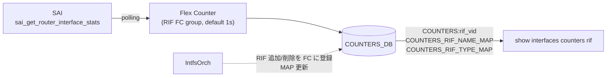

<!-- topics-tip -->
!!! tip "Topics で読み物として読む"
    この HLD は実装詳細を含みます。機能の概念・設定・運用を読み物として読みたい場合は [Topics 04 章: VRF / ECMP / 経路選択](../topics/04-vrf-ecmp/index.md) を参照。
<!-- /topics-tip -->

!!! success "裏取りステータス: Code-verified（CLI 実体名差分あり）"
    `sonic-swss/orchagent/intfsorch.cpp` で `COUNTERS_RIF_NAME_MAP` の生成 (L70)、`RIF_STAT_COUNTER_FLEX_COUNTER_GROUP` 経由の flex counter 登録 (L96, L1573) と `generateInterfaceMap()` (L1576) を確認。`sonic-utilities/clear/main.py` の `rifcounters` (L175) と RIF 統計表示スクリプト `sonic-utilities/scripts/intfstat`（`SAI_ROUTER_INTERFACE_STAT_*` 8 種を扱う）を確認。**HLD 本文での実体スクリプト名は `rifstat` ではなく `intfstat` が現行実装** (verified at: 2026-05-09)。

# ルータインタフェース (RIF) カウンタ

## 概要

SONiC のポート単位カウンタ（`portstat` 系）は L2 のフレーム数・バイト数・エラー数を返すが、L3 で観測される **ルータインタフェース ([RIF](../reference/glossary.md#term-rif))** 単位の入出力統計は別経路で取得する必要がある。RIF とは物理ポート上の Router Port、[VLAN](../reference/glossary.md#term-vlan) インタフェース、ポートチャネル上の L3 サブインタフェースなど、[SAI](../reference/glossary.md#term-sai) が `sai_router_interface` オブジェクトとして扱うものを指す。

本機能は SAI の `SAI_ROUTER_INTERFACE_STAT_*` カウンタを **flex counter で定期取得** し、`COUNTERS_DB` に集約したうえで、`show interfaces counters rif` CLI から RX/TX のパケット・バイト・エラーを表示できるようにするものである[^1]。

## 動作仕様

### データ経路



要点は次の 3 点。

- 取得元は SAI `sai_router_interface_api -> sai_get_router_interface_stats()`。
- 集約器は flex counter の RIF 専用グループで、デフォルトインターバルはポートカウンタと同じ **1 秒** に揃える[^1]。
- `IntfsOrch` が RIF オブジェクト生成・破棄時に flex counter への登録/解除と、`COUNTERS_RIF_NAME_MAP` / `COUNTERS_RIF_TYPE_MAP` の更新を行う。

### COUNTERS_DB スキーマ

各 RIF VID に対応するエントリで、以下 8 個のカウンタが格納される[^1]。

| キー | カウンタ |
|------|---------|
| `COUNTERS:rif_vid` | `SAI_ROUTER_INTERFACE_STAT_IN_PACKETS` |
| | `SAI_ROUTER_INTERFACE_STAT_IN_OCTETS` |
| | `SAI_ROUTER_INTERFACE_STAT_IN_ERROR_PACKETS` |
| | `SAI_ROUTER_INTERFACE_STAT_IN_ERROR_OCTETS` |
| | `SAI_ROUTER_INTERFACE_STAT_OUT_PACKETS` |
| | `SAI_ROUTER_INTERFACE_STAT_OUT_OCTETS` |
| | `SAI_ROUTER_INTERFACE_STAT_OUT_ERROR_PACKETS` |
| | `SAI_ROUTER_INTERFACE_STAT_OUT_ERROR_OCTETS` |

加えて以下のマッピングが追加される。

| マップ | 用途 |
|--------|------|
| `COUNTERS_RIF_NAME_MAP` | RIF OID ↔ RIF 名（例: `Ethernet0`, `Vlan2`, `Portchannel0002`） |
| `COUNTERS_RIF_TYPE_MAP` | RIF OID ↔ 種別（[LAG](../reference/glossary.md#term-lag) / Vlan 等） |

VID ベースの COUNTERS テーブルだけでは人間に読みにくいため、CLI 側はこのマップを介して RIF 名で参照する。

### レート計算

`-p / --period` オプションで指定された秒数 `delta` をもとに、CLI 側で次の式により BPS / PPS を算出する[^1]。

```text
BPS = (new_*_OCTETS  - old_*_OCTETS)  / delta
PPS = (new_*_PACKETS - old_*_PACKETS) / delta
```

BPS は値域に応じて `MB/s` / `KB/s` / `B/s` で表示する。`-p` を指定しない呼び出しでは BPS / PPS 列は `N/A` で出力される。

<!-- evidence:
source: sonic-net/SONiC/doc/rif-counters/RIF_counters.md#L70-L78 (sha: 49bab5b5ff0e924f1ea52b3d9db0dfa4191a7c06)
excerpt: |
  BPS = (new_*_OCTETS - old_*_OCTETS) / delta,
  Where delta is the period specified. The BPS is printed in MB/s, KB/s or B/s depending on the value.
  PPS = (new_*_PACKETS - old_*_PACKETS) / delta
reasoning: BPS / PPS の計算式と表示形式の根拠。
-->

<!-- evidence-rendered:start -->
??? note "📋 検証エビデンス: sonic-net/SONiC/doc/rif-counters/RIF_counters.md#L70-L78 (sha: 49bab5b5ff0e924f1ea52b3d9db0dfa4191a7c06)"

    **出典**:

    `sonic-net/SONiC/doc/rif-counters/RIF_counters.md#L70-L78 (sha: 49bab5b5ff0e924f1ea52b3d9db0dfa4191a7c06)`

    **抜粋**:

    ```text
    BPS = (new_*_OCTETS - old_*_OCTETS) / delta,
    Where delta is the period specified. The BPS is printed in MB/s, KB/s or B/s depending on the value.
    PPS = (new_*_PACKETS - old_*_PACKETS) / delta
    ```

    **判断根拠**: BPS / PPS の計算式と表示形式の根拠。

<!-- evidence-rendered:end -->

### Telemetry 経由の参照

`sonic-telemetry` 経由でも参照できる。スキーマ直叩きでは VID をキーとするため、[HLD](../reference/glossary.md#term-hld) は **virtual path** 経由の参照を推奨している[^1]。

| DB target | Virtual Path | 意味 |
|-----------|--------------|------|
| `COUNTERS_DB` | `RIF_COUNTERS/<interface_name>` | 単一 RIF の全カウンタ |
| `COUNTERS_DB` | `RIF_COUNTERS/*/<counter_name>` | 全 RIF の単一カウンタ |
| `COUNTERS_DB` | `RIF_COUNTERS/<interface>/<counter>` | 単一 RIF の単一カウンタ |

## 設定

### 関連する CONFIG_DB

HLD には専用の [CONFIG_DB](../reference/glossary.md#term-config_db) エントリは記載されていない。flex counter のインターバル変更等は既存の `FLEX_COUNTER_TABLE` 経路で行うと推測されるが本 HLD のスコープ外（実装裏取りが必要）。

### 関連する CLI

| Command | 用途 |
|---------|------|
| `show interfaces counters rif [-p PERIOD] [--verbose] [<interface>]` | RIF カウンタを一覧 / 単体表示 |
| `sonic-clear interface rifcounters [<interface>]` | RIF カウンタをクリア（単体または全体） |

### 表示例

引数なしの場合は全 RIF を表形式で表示[^1]。

```text
      IFACE       RX_OK    RX_BPS    RX_PPS    RX_ERR    TX_OK    TX_BPS    Tx_PPS    TX_ERR
-----------       -------  --------  --------  ------    -------  --------  --------  --------
Ethernet0         2180       N/A       N/A        0      44697      N/A       N/A     0
Portchannel0002   2833       N/A       N/A        0          0      N/A       N/A     0
Vlan2             2833       N/A       N/A        0       4170      N/A       N/A     0
```

インタフェース名を指定するとデバッグ向けの整形出力になる。

```text
Portchannel0002
---------------
  RX:
    0 packets
    0 bytes
    0 error packets
    0 error bytes

  TX:
    0 packets
    0 bytes
    0 error packets
    0 error bytes
```

`COUNTERS_RIF_NAME_MAP` に存在しない名前を渡した場合は警告メッセージを出すと HLD は記載している[^1]。

## 干渉する機能

- **portstat**: 別系統。`SAI_PORT_STAT_*` カウンタを使い、L2 視点のドロップやエラーを返す。RIF カウンタはあくまで L3 視点であり、両者を合算した値ではない。
- **`Port_illegal_packets_drop_design` (Interface MIB)**: [SNMP](../reference/glossary.md#term-snmp) 側では RIF カウンタは独立エントリではなく、対応する物理ポートの Interface MIB に **集約** されて返る。RIF カウンタが MIB と CLI で独立しているのは仕様上正しい。
- **flex counter インターバル**: ポートカウンタと同じ既定 1 秒。負荷増を懸念する場合はインターバルを長くする運用が考えられる。

## トラブルシューティング

- `show interfaces counters rif` がインタフェースを 1 つも表示しない場合、`COUNTERS_RIF_NAME_MAP` の存在を `redis-cli -n 2 keys 'COUNTERS_RIF*'` 等で確認する。`IntfsOrch` がマップを生成しているはず。
- 値がすべてゼロ / 動かない場合、当該プラットフォームの SAI が `SAI_ROUTER_INTERFACE_STAT_*` を実装していない可能性がある。HLD は SAI 必須カウンタを列挙しているが、ベンダー実装が揃っているとは限らない。
- 特定 RIF の VID と名前の対応を確認するには `COUNTERS_RIF_NAME_MAP` を redis から直接読む。

### コマンド例

router interface (L3) のカウンタを確認する。

```bash
show interfaces counters rif
render-counters
redis-cli -n 2 keys 'COUNTERS:oid:0x6*' | head
```

## 制限事項

- counter は SAI の per-RIF counter を polling で取得しており、polling 間隔より短いバースト trafic は反映が遅れる。
- ASIC が per-RIF counter を持たない platform では本機能は no-op となり、`show interfaces counters rif` が常に 0 になる。
- multi-asic chassis では namespace ごとに counter 表示が分かれるため、全 fabric を見たい場合は集約スクリプトが必要。

## 既知の問題

### IP アドレス削除・再追加後に RIF カウンターが機能しない（#729）

ルーターインターフェースの IP アドレスを削除してから再追加した場合、`show interfaces counters rif` の対象カウンターが正常に動作しなくなるケースが報告されている。

原因: IP アドレス削除時に `FLEX_COUNTER_TABLE` と `COUNTERS` テーブルの ObjectId に不整合が生じる。

**影響バージョン**: 201911（master / 202012 では修正済み）

**回避策（201911 限定）:**

```bash
# RIF ポーリング間隔を 1 秒超に設定し、設定後インターバル経過後にクエリする
counterpoll rif interval 3000
```

- 参照: [sonic-net/SONiC#729](https://github.com/sonic-net/SONiC/issues/729)

### VLAN サブインターフェース（dot1q tagged）での ARP 学習問題（#109）

Mellanox プラットフォームで VLAN サブインターフェース（dot1q tagged）を使用した場合、[ARP](../reference/glossary.md#term-arp) が学習されないケースが報告されている。L3 VLAN インターフェースが ASIC に正しく同期されていないことが原因と考えられる。

**デバッグ方法:**

```bash
# VLAN と物理インターフェースの ASIC レベルマッピング確認（Broadcom）
bcmcmd 'l2 show'
# orchagent ログのエラー確認
grep -i error /var/log/swss/sairedis.rec | tail -20
```

- 参照: [sonic-net/SONiC#109](https://github.com/sonic-net/SONiC/issues/109)

## 引用元

[^1]: `sonic-net/SONiC` `doc/rif-counters/RIF_counters.md` @ `49bab5b5ff0e924f1ea52b3d9db0dfa4191a7c06`

<!-- topics-back-ref -->
## 関連 Topics

- [Topics: SRv6 / MPLS / Path Tracing](../topics/17-srv6-mpls/index.md)

<!-- /topics-back-ref -->

<!-- glossary-links-injected: 27ed3fd12050 -->
