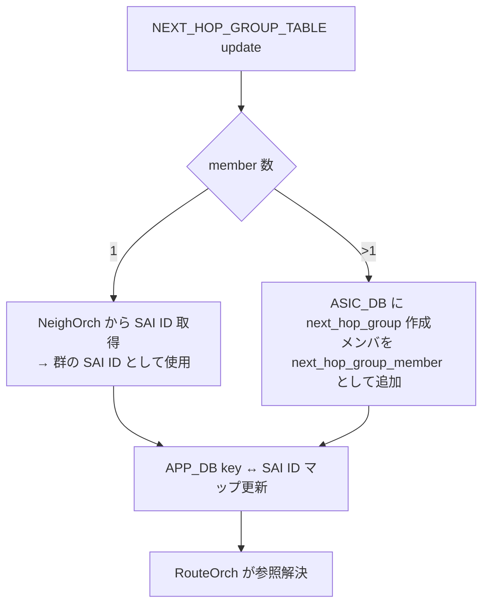

!!! warning "裏取りステータス: HLD-only / 採否不明な提案"
    このページは公式 HLD のみを根拠に書かれている。HLD は 2020-11 の Rev 0.1 (Initial) のままで、現行 master に取り込まれているか未確認。`orchagent` 側の `NhgOrch` 実装存在およびスキーマ取り込みは要裏取り。

# NEXT_HOP_GROUP_TABLE による APP_DB ルートとネクストホップ分離

## 概要

従来の SONiC では、`APP_DB.ROUTE_TABLE` の各エントリにネクストホップ情報（`nexthop` / `ifname`）を **直接埋め込んで** いた。数百万ルートが同じネクストホップ群を共有する大規模シナリオでは、毎ルートごとに同一情報を APP_DB に書き、`orchagent` 側でも毎ルート分パースする必要があり、メモリと処理時間の双方が重い[^1]。

本機能は **APP_DB 側で「ネクストホップ群」を独立したテーブルに切り出し**、ルートはそのキー参照を持つだけにする。新たに `NEXT_HOP_GROUP_TABLE` を導入し、`ROUTE_TABLE` エントリには `nexthop_group` フィールドを追加してそのキーを参照させる。多数のルートが同じ群を共有する場合、APP_DB の総容量と orchagent の処理量が大幅に削減される[^1]。

## 動作仕様

### スキーマ変更（APP_DB）

新規追加される `NEXT_HOP_GROUP_TABLE`[^1]:

```
NEXT_HOP_GROUP_TABLE
  key     = NEXT_HOP_GROUP_TABLE:<arbitrary string>
  nexthop = *prefix       ; カンマ区切りの IP（空ならゲートウェイなし）
  ifname  = *PORT_TABLE.key ; カンマ区切りのインタフェース
```

`ROUTE_TABLE` には次のフィールドが **追加** される（既存フィールドは残す）[^1]:

```
ROUTE_TABLE
  key            = ROUTE_TABLE:<prefix>
  nexthop        = *prefix
  ifname         = *PORT_TABLE.key
  blackhole      = BIT
  nexthop_group  = NEXT_HOP_GROUP_TABLE:key   ; 新規。指定時は nexthop/ifname の代替
```

ネクストホップ群のキーは **アプリケーションが任意に決める** 文字列であり、ランダムでも算術的でも構わない。HLD は命名規則を規定しない[^1]。

!!! note "競合ルール"
    `nexthop_group` と従来の `nexthop`/`ifname` の **両方** を持つ ROUTE_TABLE エントリは無視される（HLD 明記）[^1]。

### orchagent 側の処理

新たな `NhgOrch` 系の orchestration agent が `NEXT_HOP_GROUP_TABLE` を受ける。群のメンバ数で分岐する[^1]:



ルート側は次のように振る舞う[^1]:

- `RouteOrch` が `nexthop_group` フィールドを見て `NhgOrch` に SAI OID を問い合わせる。
- 群がまだ ASIC_DB に存在しなければルートは pending リストに残り、後続サイクルで再試行される。
- ハードウェア限界で群を作成できない場合、**1 メンバを暫定使用** する縮退モードに入り、ルート側にも「暫定形式」と通知される。ルートは群が正規形になるまで pending を保ち続ける[^1]。

### 削除・参照カウント

群は参照しているルートが残っているうちは削除されない。`NhgOrch` は群の **参照カウント** を保持する[^1]。`orchagent` が再起動した場合、未更新のルートは ASIC_DB に書けない過渡状態になるが、ROUTE_TABLE が更新されれば回復する。

### 既存 RouteOrch 内ネクストホップ群との非干渉

`RouteOrch` が暗黙に管理してきた既存のネクストホップ群（メンバ集合をキーとする）と、新 `NhgOrch` が管理する群（任意キー）は **同一メンバでも別物として ASIC_DB に書かれる**。HLD は「全ルートを旧形式か新形式のいずれかに統一する想定」と明記している[^1]。Fine grained ECMP 用の群は影響を受けない。

<!-- evidence:
source: sonic-net/SONiC/doc/ip/next_hop_group_hld.md#L106-L137 (sha: 49bab5b5ff0e924f1ea52b3d9db0dfa4191a7c06)
excerpt: |
  A new orchestration agent will be written to handle the new NEXT_HOP_GROUP_TABLE in APP_DB.
  ... If the group has a single next hop, the next hop group orchagent will simply get the SAI identifier...
  ... If a next hop group cannot be programmed because the data plane limit has been reached, one next hop will be picked to be temporarily used for that group.
reasoning: 単一/複数メンバの分岐、暫定モード、参照カウントの設計根拠。
-->

## 設定

### 関連する CONFIG_DB

このページの機能は **APP_DB** スキーマ拡張であり、ユーザ向け CONFIG_DB は変更されない。`NEXT_HOP_GROUP_TABLE` および `ROUTE_TABLE.nexthop_group` を APP_DB に書き込むのは外部のルーティングアプリケーション（カスタム fpmsyncd 等）。

### 関連する CLI

`show ip route` / `show ipv6 route` は **出力フォーマット不変** が要件として規定されている[^1]。CLI 側は `ROUTE_TABLE.nexthop_group` を解決して従来と同じネクストホップ表示を行う。

新規 CLI コマンドは HLD では追加されない。

### 設定例

ルーティングアプリケーションが APP_DB に直接書き込む形になる:

```
NEXT_HOP_GROUP_TABLE:NHG1
  nexthop = 10.0.0.1,10.0.0.2
  ifname  = Ethernet0,Ethernet4

ROUTE_TABLE:10.100.0.0/24
  nexthop_group = NHG1
```

## 制限事項

- **fpmsyncd 非対応**: 標準 fpmsyncd は本機能を使うように更新されない。利用するには改造版 fpmsyncd を用意するか、APP_DB に直接書き込むアプリケーションが必要[^1]。
- **`nexthop_group` と `nexthop`/`ifname` の併記は無視** される（前述）。
- **既存形式との混在不可（実質）**: 旧 RouteOrch 群と新 NhgOrch 群は ASIC_DB 上で別オブジェクトとして並走するため、両形式の混在は ASIC リソースを二重消費する。
- **Warm upgrade 未対応**: 既存アプリは本機能を使わないため warm upgrade は対象外。将来採用するアプリが現れたら別 enhancement で対応する想定[^1]。

## 干渉する機能

- **Fine grained ECMP**: 既存 fine grained next hop group orchagent の群は本変更で挙動が変わらない[^1]。
- **Warm boot**: ルートと群の対応関係を維持する責務は **アプリケーション側** にある。アプリは群キーを再起動跨ぎで安定させるか、起動時に APP_DB から復元する必要がある[^1]。
- **Fast reboot / BGP graceful restart**: 影響なし（BGP アプリが APP_DB に何を書くかの選択肢が増えるだけ）。

## トラブルシューティング

- ルートが ASIC_DB に書かれない場合、`NEXT_HOP_GROUP_TABLE` に対応するキーが存在するか確認する。群が未到着なら RouteOrch の pending に積まれる。
- ASIC のネクストホップ群リソース枯渇時は群が暫定 1 メンバ形式で書かれる。`asic-db` の `SAI_OBJECT_TYPE_NEXT_HOP_GROUP_MEMBER` 数を確認する。
- `show ip route` の出力が群参照のまま残っていないか（実装側の解決バグの兆候）を確認する。

## 引用元

[^1]: `sonic-net/SONiC` `doc/ip/next_hop_group_hld.md` @ `49bab5b5ff0e924f1ea52b3d9db0dfa4191a7c06`
