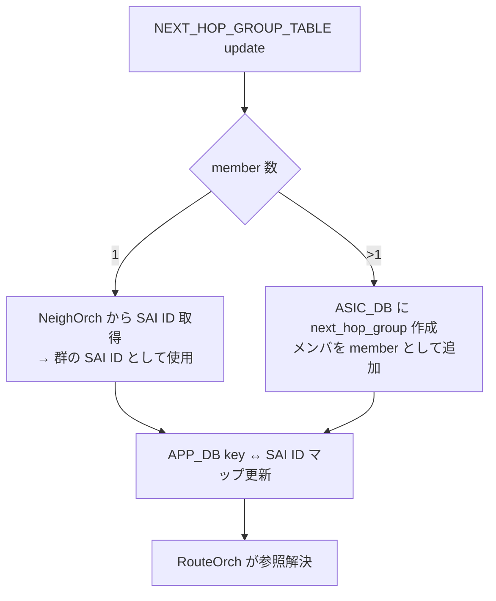

<!-- topics-tip -->
!!! tip "Topics で読み物として読む"
    この HLD は実装詳細を含みます。機能の概念・設定・運用を読み物として読みたい場合は [Topics 04 章: VRF / ECMP / 経路選択](../topics/04-vrf-ecmp/index.md) を参照。
<!-- /topics-tip -->

!!! success "裏取りステータス: code-verified"
    `sonic-swss/orchagent/nhgorch.h:117` で `NhgOrch`、`sonic-swss-common/common/schema.h:56` で `APP_CLASS_BASED_NEXT_HOP_GROUP_TABLE_NAME`、`sonic-swss/orchagent/routeorch.cpp:771` で `ROUTE_TABLE.nexthop_group` パース、`routeorch.cpp:807-815` で `nexthop_group` と `ips/aliases` の排他検証を確認 (verified at: 2026-05-09)。

# NEXT_HOP_GROUP_TABLE による APP_DB ルートとネクストホップ分離

## なぜ必要か

従来の [SONiC](../reference/glossary.md#term-sonic) は `APP_DB.ROUTE_TABLE` 各エントリにネクストホップ情報 (`nexthop` / `ifname`) を **直接埋め込んで** いた。数百万ルートが同じネクストホップ群を共有する大規模シナリオでは、毎ルートで同一情報を APP_DB に書き [orchagent](../reference/glossary.md#term-orchagent) でパースするため、メモリと処理時間が二重に重い[^1]。

本機能は **APP_DB 側でネクストホップ群を独立テーブルに切り出し**、ルートはそのキー参照だけを持つ形に変える。

## どう動くか

### スキーマ変更（APP_DB）

新規 `NEXT_HOP_GROUP_TABLE`[^1]:

```text
NEXT_HOP_GROUP_TABLE
  key     = NEXT_HOP_GROUP_TABLE:<arbitrary string>
  nexthop = *prefix       ; カンマ区切り IP（空ならゲートウェイなし）
  ifname  = *PORT_TABLE.key
```

`ROUTE_TABLE` に `nexthop_group` フィールドを追加（既存フィールドは残す）[^1]:

```text
ROUTE_TABLE
  key            = ROUTE_TABLE:<prefix>
  nexthop_group  = NEXT_HOP_GROUP_TABLE:key   ; 新規。指定時は nexthop/ifname の代替
```

キーはアプリ任意の文字列で [HLD](../reference/glossary.md#term-hld) は命名規則を規定しない。

!!! note "競合ルール"
    `nexthop_group` と従来の `nexthop`/`ifname` を **両方** 持つエントリは無視される[^1]。

### orchagent 側

新 `NhgOrch` が `NEXT_HOP_GROUP_TABLE` を受け、メンバ数で分岐する[^1]:



ルート側 `RouteOrch` は `nexthop_group` フィールドを見て `NhgOrch` に [SAI](../reference/glossary.md#term-sai) OID を問い合わせる。群未到着なら pending リストへ。ハード上限で群作成不能なら **1 メンバ暫定使用** に縮退し、ルートは「暫定形式」通知を受けて pending を維持する[^1]。

### 参照カウント

群は参照ルートが残っている間は削除されない。`NhgOrch` が参照カウントを保持する。`orchagent` 再起動時は [ROUTE_TABLE](../reference/glossary.md#term-route_table) 更新で回復する[^1]。

### 既存 RouteOrch 群との非干渉

`RouteOrch` 暗黙管理の既存群（メンバ集合キー）と新 `NhgOrch` 群（任意キー）は **同一メンバでも別物として [ASIC_DB](../reference/glossary.md#term-asic_db) に書かれる**。HLD は「全ルートを旧か新のいずれかに統一」想定[^1]。Fine grained [ECMP](../reference/glossary.md#term-ecmp) 群は影響を受けない。

<!-- evidence:
source: sonic-net/SONiC/doc/ip/next_hop_group_hld.md#L106-L137 (sha: 49bab5b5ff0e924f1ea52b3d9db0dfa4191a7c06)
excerpt: |
  A new orchestration agent will be written to handle the new NEXT_HOP_GROUP_TABLE in APP_DB.
  ... If the group has a single next hop, the next hop group orchagent will simply get the SAI identifier...
  ... If a next hop group cannot be programmed because the data plane limit has been reached, one next hop will be picked to be temporarily used for that group.
reasoning: 単一/複数メンバ分岐・暫定モード・参照カウントの設計根拠。
-->

<!-- evidence-rendered:start -->
??? note "📋 検証エビデンス: sonic-net/SONiC/doc/ip/next_hop_group_hld.md#L106-L137 (sha: 49bab5b5ff0e924f1ea52b3d9db0dfa4191a7c06)"

    **出典**:

    `sonic-net/SONiC/doc/ip/next_hop_group_hld.md#L106-L137 (sha: 49bab5b5ff0e924f1ea52b3d9db0dfa4191a7c06)`

    **抜粋**:

    ```text
    A new orchestration agent will be written to handle the new NEXT_HOP_GROUP_TABLE in APP_DB.
    ... If the group has a single next hop, the next hop group orchagent will simply get the SAI identifier...
    ... If a next hop group cannot be programmed because the data plane limit has been reached, one next hop will be picked to be temporarily used for that group.
    ```

    **判断根拠**: 単一/複数メンバ分岐・暫定モード・参照カウントの設計根拠。

<!-- evidence-rendered:end -->

## 設定

APP_DB スキーマ拡張のため **[CONFIG_DB](../reference/glossary.md#term-config_db) / CLI 変更なし**。書き込むのは外部ルーティングアプリ（カスタム [fpmsyncd](../reference/glossary.md#term-fpmsyncd) 等）。`show ip route` / `show ipv6 route` は **出力フォーマット不変** が要件で、CLI 側が `nexthop_group` を解決する[^1]。

### 設定例

```text
NEXT_HOP_GROUP_TABLE:NHG1
  nexthop = 10.0.0.1,10.0.0.2
  ifname  = Ethernet0,Ethernet4

ROUTE_TABLE:10.100.0.0/24
  nexthop_group = NHG1
```

## 制限事項

- **fpmsyncd 非対応**: 標準 fpmsyncd は本機能を使わない。改造版か APP_DB 直接書き込みアプリが必要[^1]
- `nexthop_group` と `nexthop`/`ifname` の併記は無視
- **旧形式との混在不可（実質）**: 旧群と新群は ASIC_DB で別オブジェクト並走となりリソース二重消費
- **Warm upgrade 未対応**: 既存アプリは本機能を使わないため対象外。将来採用アプリ時に別 enhancement で対応想定[^1]

## 干渉する機能

- **Fine grained ECMP**: 既存 fine grained 群は挙動不変[^1]
- **Warm boot**: ルート-群対応の維持責務は **アプリ側**。群キーを再起動跨ぎで安定化するか APP_DB から復元すること[^1]
- **Fast reboot / [BGP](../reference/glossary.md#term-bgp) graceful restart**: 影響なし

## トラブルシューティング

- ルートが ASIC_DB に書かれない → `NEXT_HOP_GROUP_TABLE` に対応キーがあるか確認
- ネクストホップ群リソース枯渇 → 暫定 1 メンバ形式になる。`asic-db` の `SAI_OBJECT_TYPE_NEXT_HOP_GROUP_MEMBER` 数確認
- `show ip route` が群参照のまま残る → CLI 解決バグ兆候

### コマンド例

ROUTE_TABLE / NEXT_HOP_GROUP_TABLE の登録状況を確認する。

```bash
redis-cli -n 0 keys 'ROUTE_TABLE*' | head
redis-cli -n 0 keys 'NEXT_HOP_GROUP_TABLE*' | head
show ip route summary
```

## 引用元

[^1]: `sonic-net/SONiC` `doc/ip/next_hop_group_hld.md` @ `49bab5b5ff0e924f1ea52b3d9db0dfa4191a7c06`

<!-- topics-back-ref -->
## 関連 Topics

- [Topics: VRF / ECMP / RIB-FIB パイプライン](../topics/04-vrf-ecmp/index.md)
- [fpmsyncd-nexthop-group-enhancement-high-level-design-document](fpmsyncd-nexthop-group-enhancement-high-level-design-document.md)
- [sonic-weighted-ecmp](sonic-weighted-ecmp.md)

<!-- /topics-back-ref -->

<!-- glossary-links-injected: 8ba32e5aa69d -->
