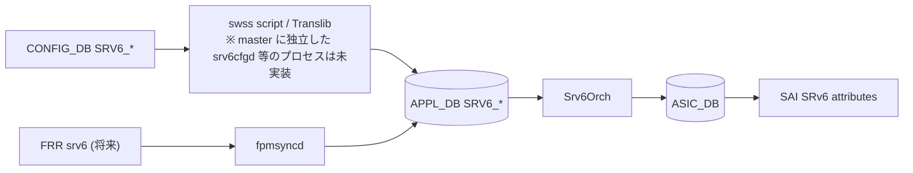

<!-- topics-tip -->
!!! tip "Topics で読み物として読む"
    この HLD は実装詳細を含む。機能の概念・設定・運用を読み物として読みたい場合は [Topics 04 章: VRF / ECMP / 経路選択](../topics/04-vrf-ecmp/index.md) を参照。
<!-- /topics-tip -->

!!! info "裏取りステータス: code-verified"
    `sonic-swss/orchagent/srv6orch.cpp` の `end_behavior_map` (L42-L62) と `doTaskMySidTable` (L2208 付近) を master で確認[^2]。CONFIG_DB 側のテーブル名は `sonic-swss-common/common/schema.h` で `CFG_SRV6_MY_SID_TABLE_NAME = "SRV6_MY_SIDS"` / `CFG_SRV6_MY_LOCATOR_TABLE_NAME = "SRV6_MY_LOCATORS"` (L398-L399)、APPL_DB 側は `APP_SRV6_MY_SID_TABLE_NAME = "SRV6_MY_SID_TABLE"` / `APP_SRV6_SID_LIST_TABLE_NAME = "SRV6_SID_LIST_TABLE"` (L168-L169) として定義済み[^3]。`sonic-yang-models/yang-models/sonic-srv6.yang` でも `SRV6_MY_LOCATORS` / `SRV6_MY_SIDS` の 2 コンテナとして取り込まれている[^4]。なお HLD 本文の `SRV6_POLICY` / `SRV6_STEER` は master の schema.h / sonic-yang-models いずれにも存在しない (Phase 2+ 提案段階)。

# SRv6（Segment Routing over IPv6 / END.DT46 / H.Encaps.Red）

## 概要

IETF RFC 8754 / 8986 で定義される **Segment Routing over IPv6** を [SONiC](../reference/glossary.md#term-sonic) に実装する [HLD](../reference/glossary.md#term-hld)[^1]。[SRv6](../reference/glossary.md#term-srv6) は SDN 向け IPv6 ベースのプログラマブル forwarding で、SID list を SRH に積み込むことで TE / VPN / [EVPN](../reference/glossary.md#term-evpn) 等を実現する。Phase 1 では SONiC を **headend / endpoint** 双方として動作させ、Phase 2 以降で uSID / G-SID / HMAC / sBFD / anycast SID 等に拡張する設計。[FRR](../reference/glossary.md#term-frr) 側 SRv6 が成熟するまでは **静的 SID と policy を [CONFIG_DB](../reference/glossary.md#term-config_db) に直接書く**運用。

## 動作仕様

### Phase 1 のサポート機能

| Behavior | 用途 | RFC |
|----------|------|-----|
| `END` | prefix SID の SRv6 instantiation | 8986 |
| `END.DT46` | endpoint with decap + [VRF](../reference/glossary.md#term-vrf) lookup（IP L3VPN）| 8986 |
| `H.Encaps.Red` | headend with reduced SRH encap | 8986 |
| traffic steering by SID list | TE policy 適用 | - |

Later phase: `H.Encaps`, `END.B6.Encaps[.Red]`（Binding SID）, `END.X`（Adj SID）, uSID/G-SID, HMAC, sBFD, anycast SID, MySID counter[^1]。

### CONFIG_DB（master 実装）

実装上の CONFIG_DB スキーマは `sonic-srv6.yang` で **`SRV6_MY_LOCATORS` + `SRV6_MY_SIDS` の 2 階層**に分かれる[^4]。HLD ドラフトでは単一テーブルで block/node/func/arg を直書きする旧提案だったが、master では locator を別テーブル化して MySID は locator 参照 + ip_prefix で表現する形に統合済み。

```text
SRV6_MY_LOCATORS|<locator_name>:
  prefix     = <IPv6 prefix>      ; locator block+node
  block_len  = <bits>             ; locator block 部のビット長
  node_len   = <bits>             ; locator node 部のビット長
  func_len   = <bits>
  arg_len    = <bits>

SRV6_MY_SIDS|<locator_name>|<ip_prefix>:
  action          = uN | uDT46    ; YANG enum
  decap_vrf       = <VRF>         ; uDT46 用、default 可
  decap_dscp_mode = uniform | pipe
```

action の enum は [YANG](../reference/glossary.md#term-yang) 上 `uN` / `uDT46` の 2 値のみだが、`srv6orch.cpp` の `end_behavior_map` は `end` / `end.x` / `end.t` / `end.dx{6,4}` / `end.dt{6,4,46}` / `end.b6.encaps[.red]` / `end.b6.insert[.red]` / `udx{6,4}` / `udt{6,4,46}` / `un` / `ua` まで認識する[^2]。`SRV6_POLICY` / `SRV6_STEER` は本 HLD ドラフトの提案だが master の schema.h・sonic-yang-models いずれにも未取り込み。

### APPL_DB

```text
SRV6_SID_LIST_TABLE:<segment_name>: { path = [...] }
SRV6_MY_SID_TABLE:<block_len>:<node_len>:<func_len>:<arg_len>:<ipv6>: {
  action   = end | end.dt46 | end.x | end.b6.encaps | ...
  vrf      = <VRF>           ; end.dt* 用
  adj      = <ipv6>          ; end.x 用 (single nexthop only; ECMP 未サポート)
}
```

`srv6orch.cpp` の `doTaskMySidTable` (L2208 付近) は APPL_DB の key を **`block_len:node_len:func_len:arg_len:sid-ip` の 5 タプル**として parse する[^2]。field は `action` / `vrf` / `adj` のみで、policy / source は doTaskMySidTable には存在しない。`adj` は `,` 区切りで複数記述可能だが、L1515-L1518 で [ECMP](../reference/glossary.md#term-ecmp) adjacency は明示的に reject される。

### Orchagent（Srv6Orch）



Phase 1 では **controller / swss スクリプトが Translib 経由で [APPL_DB](../reference/glossary.md#term-appl_db) 直接更新**[^1]。FRR が SRv6 を full サポートしたら [fpmsyncd](../reference/glossary.md#term-fpmsyncd) 経由に切替。

### Counter（v0.5 で追加）

各 MySID 単位の **packet/byte counter** を [SAI](../reference/glossary.md#term-sai) に問い合わせる機能を追加[^1]。CLI で:

- `config srv6 counter <enable|disable>`
- `config srv6 counter polling-interval <sec>`
- `show srv6 counter [my-sid <addr>]`
- `clear srv6 counter`

### Warm boot

planned 系 / swss / [BGP](../reference/glossary.md#term-bgp) warm reboot で対応想定[^1]。MySID と SID list は CONFIG_DB から再復元、`Srv6Orch` が再 program。

<!-- evidence:
source: sonic-net/SONiC/doc/srv6/srv6_hld.md#L78-L99 (sha: 49bab5b5ff0e924f1ea52b3d9db0dfa4191a7c06)
excerpt: |
  Phase #1
   Should be able to perform the role of SRv6 domain headend node, and endpoint node, more specific:
   - Support END, Endpoint function ...
   - Support END.DT46 ... - IP L3VPN use (equivalent of a per-VRF VPN label)
   - Support H.Encaps.Red ...
   - Support traffic steering on SID list
reasoning: Phase 1 のサポート機能の根拠。
-->

<!-- evidence-rendered:start -->
??? note "📋 検証エビデンス: sonic-net/SONiC/doc/srv6/srv6_hld.md#L78-L99 (sha: 49bab5b5ff0e924f1ea52b3d9db0dfa4191a7c06)"

    **出典**:

    `sonic-net/SONiC/doc/srv6/srv6_hld.md#L78-L99 (sha: 49bab5b5ff0e924f1ea52b3d9db0dfa4191a7c06)`

    **抜粋**:

    ```text
    Phase #1
     Should be able to perform the role of SRv6 domain headend node, and endpoint node, more specific:
     - Support END, Endpoint function ...
     - Support END.DT46 ... - IP L3VPN use (equivalent of a per-VRF VPN label)
     - Support H.Encaps.Red ...
     - Support traffic steering on SID list
    ```

    **判断根拠**: Phase 1 のサポート機能の根拠。

<!-- evidence-rendered:end -->

## 制限事項

- v0.5 で MySID counter 追加。それ以前 (Phase 1) は END / END.DT46 / H.Encaps.Red のみ
- FRR SRv6 全機能まで到達するまで CONFIG_DB / Translib 直接運用
- HMAC / sBFD / uSID / G-SID は Phase 2+
- block/node/func/arg_len のデフォルトに従わない address layout は MySID key 構成で明示が必要

## 干渉する機能

- **既存 routing (BGP / VRF / [ROUTE_TABLE](../reference/glossary.md#term-route_table))**: ROUTE_TABLE の拡張で共存
- **[MPLS](../reference/glossary.md#term-mpls) L3VPN**: 等価機能の置き換え候補
- **EVPN over SRv6**: 後段の利用形
- **PIC / wcmp / ARS**: NHG / multipath との関係
- **FRR / fpmsyncd**: 将来の入力経路

## 引用元

[^1]: `sonic-net/SONiC` `doc/srv6/srv6_hld.md` @ `49bab5b5ff0e924f1ea52b3d9db0dfa4191a7c06`
[^2]: `sonic-net/sonic-swss` `orchagent/srv6orch.cpp` (master) — `end_behavior_map` (L42-L62) / `doTaskMySidTable` (L2208 付近) / `createUpdateMysidEntry` (L1431) / ECMP adjacency reject (L1515-L1518)
[^3]: `sonic-net/sonic-swss-common` `common/schema.h` (master) — L168-L169 (APPL_DB) / L398-L399 (CONFIG_DB) / L257, L313 (counter map)
[^4]: `sonic-net/sonic-buildimage` `src/sonic-yang-models/yang-models/sonic-srv6.yang` (master) — `SRV6_MY_LOCATORS` (L24-) / `SRV6_MY_SIDS` (L95-L143) / action enum `uN`/`uDT46` (L113-L119)

<!-- concerns hint:
- Srv6Orch のみ master に実在（独立した srv6cfgd 相当プロセスは未実装、CONFIG_DB→APPL_DB sync は cfgmgr / Translib 経由）
- SRV6_MY_LOCATORS / SRV6_MY_SIDS は sonic-yang-models 取り込み済み、SRV6_POLICY / SRV6_STEER は HLD ドラフトのみで master 未取り込み
- SAI SRv6 attribute (SAI_MY_SID_ENTRY_ENDPOINT_BEHAVIOR_*) は srv6orch.cpp の end_behavior_map 経由で utilize 確認済み
- v0.5 で追加された MySID counter (CFG SRV6_COUNTER_ID_LIST / COUNTERS_SRV6_NAME_MAP) は schema.h L257, L313 に反映済み、CLI 側は要追跡
- FRR SRv6 fpmsyncd 連携の現状（Phase 1 ではコントローラ直接書き込み運用）
-->

<!-- topics-back-ref -->
## 関連 Topics

- [Topics: SRv6 / MPLS / Path Tracing](../topics/17-srv6-mpls/index.md)

<!-- /topics-back-ref -->

<!-- glossary-links-injected: a3729a90b98f -->
