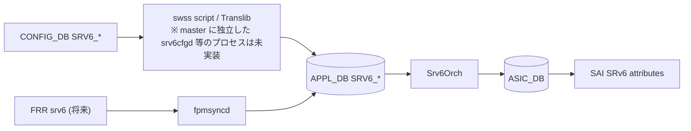

<!-- topics-tip -->
!!! tip "Topics で読み物として読む"
    この HLD は実装詳細を含みます。機能の概念・設定・運用を読み物として読みたい場合は [Topics 04 章: VRF / ECMP / 経路選択](../topics/04-vrf-ecmp/index.md) を参照。
<!-- /topics-tip -->

!!! info "裏取りステータス: code-verified"
    `sonic-swss/orchagent/srv6orch.cpp` / `srv6orch.h` を master で確認。`SRV6_MY_SID_TABLE` / `SRV6_SID_LIST` 等のスキーマ定数は `sonic-swss-common/common/schema.h` に取り込み済み。

# SRv6（Segment Routing over IPv6 / END.DT46 / H.Encaps.Red）

## 概要

IETF RFC 8754 / 8986 で定義される **Segment Routing over IPv6** を [SONiC](../reference/glossary.md#term-sonic) に実装する [HLD](../reference/glossary.md#term-hld)[^1]。[SRv6](../reference/glossary.md#term-srv6) は SDN 向け IPv6 ベースのプログラマブル forwarding で、SID list を SRH に積み込むことで TE / VPN / [EVPN](../reference/glossary.md#term-evpn) 等を実現する。Phase 1 では SONiC を **headend / endpoint** 双方として動作させ、Phase 2 以降で uSID / G-SID / HMAC / sBFD / anycast SID 等に拡張する設計。[FRR](../reference/glossary.md#term-frr) 側 SRv6 が成熟するまでは **静的 SID と policy を [CONFIG_DB](../reference/glossary.md#term-config_db) に直接書く**運用。

## 動作仕様

### Phase 1 のサポート機能

| Behavior | 用途 | RFC |
|----------|------|-----|
| `END` | prefix SID の SRv6 instantiation | 8986 |
| `END.DT46` | endpoint with decap + [VRF](../reference/glossary.md#term-vrf) lookup（IP L3VPN）| 8986 |
| `H.Encaps.Red` | headend with reduced SRH encap | 8986 |
| traffic steering by SID list | TE policy 適用 | - |

Later phase: `H.Encaps`, `END.B6.Encaps[.Red]`（Binding SID）, `END.X`（Adj SID）, uSID/G-SID, HMAC, sBFD, anycast SID, MySID counter[^1]。

### CONFIG_DB

```text
SRV6_SID_LIST|<segment_name>:
  path = [<sid>, <sid>, ...]

SRV6_MY_SID_TABLE|<ipv6_addr>:
  block_len = 40            ; default
  node_len  = 24
  func_len  = 16
  arg_len   = <alen>
  action    = end | end.dt46 | end.x | end.b6.encap | ...
  vrf       = <VRF>         ; END.DT46 用
  adj       = [<addr>, ...] ; END.X 用 (optional)
  policy    = <policy>      ; END.B6.ENCAP 用
  source    = <addr>        ; END.B6.ENCAP 用 src

SRV6_POLICY|<policy_name>:
  segment = [<seg_name>, ...]

SRV6_STEER|<vrf>:<prefix>:
  policy = <policy_name>
  source = <ip>
```

`block/node/func/arg_len` は **MySID address のビット分割**を decode するための長さ指定（規定値 40/24/16）[^1]。

### APPL_DB

```text
SRV6_SID_LIST_TABLE:<segment_name>: { path = [...] }
SRV6_MY_SID_TABLE:<block>:<node>:<func>:<arg>:<ipv6>: {
  action, vrf, adj, segment, source
}
ROUTE_TABLE:<vrf>:<prefix>: {  ... + segment list  }
```

既存 `ROUTE_TABLE` も SID list を保持できるよう拡張[^1]。

### Orchagent（Srv6Orch）



Phase 1 では **controller / swss スクリプトが Translib 経由で [APPL_DB](../reference/glossary.md#term-appl_db) 直接更新**[^1]。FRR が SRv6 を full サポートしたら [fpmsyncd](../reference/glossary.md#term-fpmsyncd) 経由に切替。

### Counter（v0.5 で追加）

各 MySID 単位の **packet/byte counter** を [SAI](../reference/glossary.md#term-sai) に問い合わせる機能を追加[^1]。CLI で:

- `config srv6 counter <enable|disable>`
- `config srv6 counter polling-interval <sec>`
- `show srv6 counter [my-sid <addr>]`
- `clear srv6 counter`

### Warm boot

planned 系 / swss / [BGP](../reference/glossary.md#term-bgp) warm reboot で対応想定[^1]。MySID と SID list は CONFIG_DB から再復元、`Srv6Orch` が再 program。

<!-- evidence:
source: sonic-net/SONiC/doc/srv6/srv6_hld.md#L78-L99 (sha: 49bab5b5ff0e924f1ea52b3d9db0dfa4191a7c06)
excerpt: |
  Phase #1
   Should be able to perform the role of SRv6 domain headend node, and endpoint node, more specific:
   - Support END, Endpoint function ...
   - Support END.DT46 ... - IP L3VPN use (equivalent of a per-VRF VPN label)
   - Support H.Encaps.Red ...
   - Support traffic steering on SID list
reasoning: Phase 1 のサポート機能の根拠。
-->

<!-- evidence-rendered:start -->
??? note "📋 検証エビデンス: sonic-net/SONiC/doc/srv6/srv6_hld.md#L78-L99 (sha: 49bab5b5ff0e924f1ea52b3d9db0dfa4191a7c06)"

    **出典**:

    `sonic-net/SONiC/doc/srv6/srv6_hld.md#L78-L99 (sha: 49bab5b5ff0e924f1ea52b3d9db0dfa4191a7c06)`

    **抜粋**:

    ```text
    Phase #1
     Should be able to perform the role of SRv6 domain headend node, and endpoint node, more specific:
     - Support END, Endpoint function ...
     - Support END.DT46 ... - IP L3VPN use (equivalent of a per-VRF VPN label)
     - Support H.Encaps.Red ...
     - Support traffic steering on SID list
    ```

    **判断根拠**: Phase 1 のサポート機能の根拠。

<!-- evidence-rendered:end -->

## 制限事項

- v0.5 で MySID counter 追加。それ以前 (Phase 1) は END / END.DT46 / H.Encaps.Red のみ
- FRR SRv6 全機能まで到達するまで CONFIG_DB / Translib 直接運用
- HMAC / sBFD / uSID / G-SID は Phase 2+
- block/node/func/arg_len のデフォルトに従わない address layout は MySID key 構成で明示が必要

## 干渉する機能

- **既存 routing (BGP / VRF / [ROUTE_TABLE](../reference/glossary.md#term-route_table))**: ROUTE_TABLE の拡張で共存
- **[MPLS](../reference/glossary.md#term-mpls) L3VPN**: 等価機能の置き換え候補
- **EVPN over SRv6**: 後段の利用形
- **PIC / wcmp / ARS**: NHG / multipath との関係
- **FRR / fpmsyncd**: 将来の入力経路

## 引用元

[^1]: `sonic-net/SONiC` `doc/srv6/srv6_hld.md` @ `49bab5b5ff0e924f1ea52b3d9db0dfa4191a7c06`

<!-- concerns hint:
- Srv6Orch / srv6cfgd 相当の取り込み確認（master に独立した srv6cfgd プロセスは未実装、Srv6Orch のみ実在）
- SRV6_SID_LIST / SRV6_MY_SID_TABLE / SRV6_POLICY / SRV6_STEER の sonic-yang-models 取り込み確認
- SAI SRv6 attribute (SAI_MY_SID_ENTRY 等) の sonic-sairedis 取り込み確認
- ROUTE_TABLE への SID list 拡張の swss-common 反映確認
- v0.5 で追加された MySID counter (counter polling / config srv6 counter CLI) の現行実装確認
- FRR SRv6 fpmsyncd 連携の取り込み状況
-->

<!-- topics-back-ref -->
## 関連 Topics

- [Topics: SRv6 / MPLS / Path Tracing](../topics/17-srv6-mpls/index.md)

<!-- /topics-back-ref -->

<!-- glossary-links-injected: 8ba32e5aa69d -->
