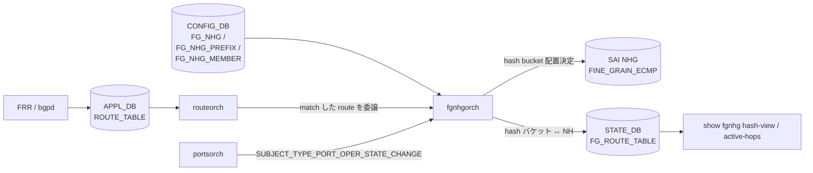

<!-- topics-tip -->
!!! tip "Topics で読み物として読む"
    この HLD は実装詳細を含みます。機能の概念・設定・運用を読み物として読みたい場合は [Topics 04 章: VRF / ECMP / 経路選択](../topics/04-vrf-ecmp/index.md) を参照。
<!-- /topics-tip -->

!!! success "裏取りステータス: code-verified"
    Verifier 2026-05-09: `sonic-swss/orchagent/fgnhgorch.{cpp,h}` の現行実装、`sonic-buildimage/src/sonic-yang-models/yang-models/sonic-fine-grained-ecmp.yang`（`match_mode` に `prefix-based` を含む Rev 1.5 後の追加分も収容）、`sonic-sairedis/vslib/SwitchStateBase.cpp:4165` の `SAI_NEXT_HOP_GROUP_TYPE_FINE_GRAIN_ECMP` capability 列挙を確認し HLD と整合。

# Fine Grained ECMP（FG_NHG / fgnhgorch）

## 読者が知りたいこと

- 通常 [ECMP](../reference/glossary.md#term-ecmp) と何が違うのか、**いつ FG ECMP を選ぶ** べきか
- **3 つの match_mode**（route-based / nexthop-based / prefix-based）の違い
- **[CONFIG_DB](../reference/glossary.md#term-config_db) のキー** と **bucket_size の決め方**
- 内部で **どの orch / [SAI](../reference/glossary.md#term-sai) 属性** が動くか、warm boot で何が残るか
- スケールと既知の落とし穴

## 1. いつ FG ECMP を使うか

通常 ECMP は next-hop が増減するたびに **hash redistribution が全 flow に波及** する。loadbalanced VM / firewall 群のように **next-hop 単位で flow stickiness と bank（共有状態グループ）を保つ必要があるトポロジ** では、これが致命的になる。

FG ECMP は [ASIC](../reference/glossary.md#term-asic) 上に hash bucket（`SAI_NEXT_HOP_GROUP_MEMBER_ATTR_INDEX`）を明示的に作り、**消えた next-hop が占めていたバケットだけを同 bank 内の生存 next-hop で埋め直す** ことで bank 内 consistent hashing を実現する[^1]。

## 2. match_mode 3 種

| match_mode | FG ECMP の発火条件 |
|------------|--------------------|
| `route-based` | route prefix が `FG_NHG_PREFIX` と一致 **かつ** next-hop が `FG_NHG_MEMBER` に含まれる |
| `nexthop-based` | next-hop IP が `FG_NHG_MEMBER` のサブセット |
| `prefix-based` | route prefix が `FG_NHG_PREFIX` に一致（next-hop は route 学習で動的） |

`prefix-based` は Rev 1.5 で追加され、`FG_NHG.max_next_hops` を持つ。`FG_NHG_MEMBER` は使わない[^1]。

## 3. CONFIG_DB と CLI

```text
FG_NHG|<group>:
    bucket_size      = <int>
    match_mode       = route-based | nexthop-based | prefix-based
    max_next_hops    = <int>   # prefix-based のみ

FG_NHG_PREFIX|<v4|v6 prefix>:
    FG_NHG = <group>

FG_NHG_MEMBER|<nexthop-ip>:
    FG_NHG = <group>
    bank   = <int>          # bank 内で再分配
    link   = <ifname>       # OPTIONAL: link down で nh withdraw
```

**`bucket_size` の決め方**: 「想定する次ホップ数の組み合わせの最小公倍数」。例: 2 bank × 各 3 NH → `LCM(1,2,3) * 2 = 12`[^1]。

| Command | 用途 |
|---------|------|
| `config fg-nhg add/del <group> --match-mode --bucket-size --max-next-hops` | グループ作成/削除 |
| `config fg-nhg-prefix add/del <prefix> --fg-nhg <group>` | プレフィックス紐付け |
| `config fg-nhg-member add/del <nh-ip> --fg-nhg <group>` | メンバー追加/削除（route/nexthop モード） |
| `show fgnhg hash-view [<group>]` | bucket → NH のマッピング表示 |
| `show fgnhg active-hops [<group>]` | bank ごとの active NH 表示 |

### 設定例（route-based, 2 bank × 3 NH）

```json
{
  "FG_NHG":  { "2-VM-Sets": { "bucket_size": 12, "match_mode": "route-based" } },
  "FG_NHG_PREFIX": { "10.10.10.10/32": { "FG_NHG": "2-VM-Sets" } },
  "FG_NHG_MEMBER": {
    "1.1.1.1": { "FG_NHG": "2-VM-Sets", "bank": 0, "link": "Ethernet4" },
    "1.1.1.4": { "FG_NHG": "2-VM-Sets", "bank": 1, "link": "Ethernet16" }
  }
}
```

## 4. データフローと bank 動作



要点:

- `routeorch` は通常通り APP_DB route 更新を処理しつつ、FG ECMP 設定にマッチする route を **`fgnhgorch` に redirect**[^1]
- `fgnhgorch` は [portsorch](../reference/glossary.md#term-portsorch) の `SUBJECT_TYPE_PORT_OPER_STATE_CHANGE` を購読し、`FG_NHG_MEMBER.link` 紐付き link down/up で NH を出し入れ[^1]
- ASIC 上の bucket 配置は `STATE_DB.FG_ROUTE_TABLE` にミラー（warm reboot 復元と show CLI 用）[^1]

**bank 内 consistent hashing**:

- **next-hop down**: 同 bank 内の生存 NH に「down した NH のバケットだけ」を均等再配布。bank 内ゼロのときのみ対向 bank に流す（"entire VM set down" シナリオ）[^1]
- **next-hop add**: bank 内に生存 NH があれば新規 NH に均等にバケットを返す。ゼロ → 1 復活時は対向 bank から戻す
- **prefix-based**: [BGP](../reference/glossary.md#term-bgp) 学習で動的に取得した NH のうち先着 `max_next_hops` までを対象[^1]

## 5. SAI とのインタフェース

```text
SAI_NEXT_HOP_GROUP_TYPE_FINE_GRAIN_ECMP
SAI_NEXT_HOP_GROUP_ATTR_CONFIGURED_SIZE
SAI_NEXT_HOP_GROUP_ATTR_REAL_SIZE
SAI_NEXT_HOP_GROUP_MEMBER_ATTR_NEXT_HOP_ID
SAI_NEXT_HOP_GROUP_MEMBER_ATTR_INDEX     # bucket index
```

通常 ECMP NHG 型ではなく **`FINE_GRAIN_ECMP` 型** を使い、member に **`INDEX` を明示** する点が SAI 上の差分[^1]。

## 6. Warm boot

`STATE_DB.FG_ROUTE_TABLE` を fast-reboot dump に含めて保存し、起動後に **同一の bucket → NH マッピング** で ECMP group を再構築する[^1]。これが無いと NH 追加順序の非決定性で bucket index がぶれ、flow が乱れる。

## 7. 制限事項

- スケール: グループ数 8、bucket size は HW 依存（最大 4k）[^1]
- 全 prefix に consistent ECMP を効かせる「動的有効化」は [HLD](../reference/glossary.md#term-hld) スコープ外[^1]
- route/nexthop モードでは `FG_NHG_MEMBER` 未定義の NH は **黙って ASIC に伝播されない**（syslog エラーのみ）[^1]

## 8. 干渉する機能

- **routeorch / NHG**: 通常 ECMP NHG 型と排他。同一 prefix を両方で扱おうとすると FG 側が優先
- **portsorch**: `link` 付き member は port oper state に従って NH を出し入れ
- **warm reboot**: `FG_ROUTE_TABLE` 永続化が前提

## 9. トラブルシューティング

- 期待する NH が ASIC に出ていない → `show fgnhg active-hops` で `FG_NHG_MEMBER` 定義と一致するか確認。route/nexthop モードでは未定義 NH は無視
- bucket がぶれる → `STATE_DB.FG_ROUTE_TABLE` を直接確認。warm reboot 後に空ならダンプ経路の不整合

### コマンド例

Fine-grained ECMP (FG NHG) の bucket 配分を確認する。

```bash
show fgnhg active-hops
show fgnhg hash-view
redis-cli -n 4 keys 'FG_NHG*'
```

## 10. 次に読む

- Topics: [VRF / ECMP 概念](../topics/04-vrf-ecmp/concept.md), [ECMP 詳細](../topics/04-vrf-ecmp/ecmp.md), [VRF / ECMP 内部実装](../topics/04-vrf-ecmp/internals.md), [VRF / ECMP 運用](../topics/04-vrf-ecmp/operations.md)
- 関連 HLD: [SONiC Weighted ECMP](sonic-weighted-ecmp.md), [Local ARS HLD](local-ars-hld.md), [Overlay ECMP Enhancements](overlay-ecmp-enhancements.md), [Multiple Nexthop Route HLD](multiple-nexthop-route-hld.md)

## 制限事項

- FG-ECMP は per-prefix の hash bucket 制御を SAI 経由で行うため、ASIC が `SAI_NEXT_HOP_GROUP_TYPE_FINE_GRAIN_ECMP` を未サポートだと有効化できない。
- bucket 数は platform 依存 (典型的に 16 / 64 / 256) で、`FG_NHG` テーブルで指定したサイズと一致しない場合は flap 時の影響範囲が変わる。
- inactive nexthop の bucket 入れ替え動作は実装/HLD 間で差異が報告されており、`saidump` で実際の bucket 配列を検証することを推奨。

## 引用元

[^1]: `sonic-net/SONiC` `doc/ecmp/fine_grained_next_hop_hld.md` @ `49bab5b5ff0e924f1ea52b3d9db0dfa4191a7c06`

<!-- evidence:
source: sonic-net/SONiC/doc/ecmp/fine_grained_next_hop_hld.md#L344-L352 (sha: 49bab5b5ff0e924f1ea52b3d9db0dfa4191a7c06)
excerpt: |
  A key idea ... is the creation of many hash buckets ... having a next-hop repeated multiple times within it.
  ... in the route/nexthop match modes, by pushing configuration with next-hop bank membership, we can ensure
  that we only refill the affected hash buckets with those next-hops within the same bank.
reasoning: bank 内 consistent hashing と「同 bank 内のみで refill」原則の根拠。
-->

<!-- evidence-rendered:start -->
??? note "📋 検証エビデンス: sonic-net/SONiC/doc/ecmp/fine_grained_next_hop_hld.md#L344-L352 (sha: 49bab5b5ff0e924f1ea52b3d9db0dfa4191a7c06)"

    **出典**:

    `sonic-net/SONiC/doc/ecmp/fine_grained_next_hop_hld.md#L344-L352 (sha: 49bab5b5ff0e924f1ea52b3d9db0dfa4191a7c06)`

    **抜粋**:

    ```text
    A key idea ... is the creation of many hash buckets ... having a next-hop repeated multiple times within it.
    ... in the route/nexthop match modes, by pushing configuration with next-hop bank membership, we can ensure
    that we only refill the affected hash buckets with those next-hops within the same bank.
    ```

    **判断根拠**: bank 内 consistent hashing と「同 bank 内のみで refill」原則の根拠。

<!-- evidence-rendered:end -->

<!-- concerns hint:
- fgnhgorch の現行 master 実装存在確認
- FG_NHG / FG_NHG_PREFIX / FG_NHG_MEMBER の YANG / sonic-buildimage 取り込み確認
- SAI_NEXT_HOP_GROUP_TYPE_FINE_GRAIN_ECMP の community SAI 取り込み確認
- config fg-nhg* CLI の sonic-utilities 取り込み確認
- prefix-based モード（Rev 1.5, 2024 追加）の master 取り込み確認
- fast-reboot dump への FG_ROUTE_TABLE 含有確認
-->

<!-- topics-back-ref -->
## 関連 Topics

- [Topics: VRF / ECMP / RIB-FIB パイプライン](../topics/04-vrf-ecmp/index.md)

<!-- /topics-back-ref -->

<!-- glossary-links-injected: 9937abcefc29 -->
