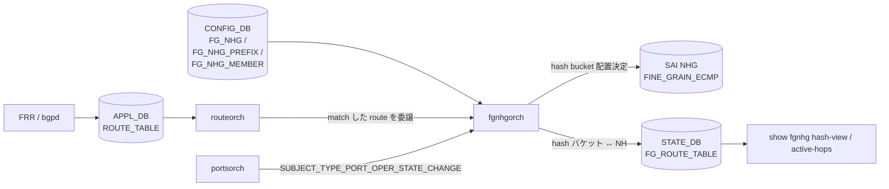

!!! warning "裏取りステータス: HLD-only"
    本ページは `doc/ecmp/fine_grained_next_hop_hld.md`（Rev 1.5, 2024-09 改訂）に基づき再構成した。`fgnhgorch` の現行 master 実装、`FG_NHG*` テーブルの YANG 取り込み、SAI `SAI_NEXT_HOP_GROUP_TYPE_FINE_GRAIN_ECMP` の community SAI 取り込みは未確認である。

# Fine Grained ECMP（FG_NHG / fgnhgorch）

## 概要

Fine Grained ECMP（FG ECMP）は、loadbalanced VM / firewall 群のように **next-hop 単位で flow stickiness と bank（共有状態グループ）を保つ必要があるトポロジ** 向けに、通常の ECMP next-hop group の外側に「ハッシュバケット展開」を被せる仕組みである[^1]。

通常の ECMP は next-hop が増減するたびに hash redistribution が全 flow に波及する。FG ECMP は hash bucket（`SAI_NEXT_HOP_GROUP_MEMBER_ATTR_INDEX`）を ASIC 側に明示的に作成し、消えた next-hop が占めていたバケットだけを同 bank 内の生存 next-hop で埋め直すことで、bank 内 consistent hashing を実現する。

## 動作仕様

### マッチモード

3 つのマッチモードを持つ[^1]。

| match_mode | FG ECMP の発火条件 |
|------------|--------------------|
| `route-based` | route prefix が `FG_NHG_PREFIX` と一致 **かつ** next-hop が `FG_NHG_MEMBER` に含まれる |
| `nexthop-based` | next-hop IP が `FG_NHG_MEMBER` のサブセット |
| `prefix-based` | route prefix が `FG_NHG_PREFIX` に一致（next-hop は route 学習で動的） |

`prefix-based` は Rev 1.5 で追加され、FG_NHG 側に `max_next_hops` を持つ。`FG_NHG_MEMBER` は使わない[^1]。

### コンポーネントとデータフロー



要点:

- `routeorch` は通常通り APP_DB の route 更新を処理するが、FG ECMP 設定にマッチする route について `fgnhgorch` に redirect する[^1]
- `fgnhgorch` は portsorch の `SUBJECT_TYPE_PORT_OPER_STATE_CHANGE` を購読し、`FG_NHG_MEMBER.link` で紐づく link down/up 時に next-hop の出し入れを行う[^1]
- ASIC 上の hash bucket 配置は `STATE_DB.FG_ROUTE_TABLE` にミラーされ、warm reboot 復元と show CLI 用に使う[^1]

### CONFIG_DB スキーマ（要点）

```
FG_NHG|<group>:
    bucket_size      = <int>
    match_mode       = route-based | nexthop-based | prefix-based
    max_next_hops    = <int>   # prefix-based のみ

FG_NHG_PREFIX|<v4|v6 prefix>:
    FG_NHG = <group>

FG_NHG_MEMBER|<nexthop-ip>:
    FG_NHG = <group>
    bank   = <int>          # bank 内で再分配
    link   = <ifname>       # OPTIONAL: link down で nh withdraw
```

`bucket_size` のガイドラインは「想定する次ホップ数の組み合わせの最小公倍数」。例: 2 bank × 各 3 NH なら `LCM(1,2,3) * 2 = 12`[^1]。

### SAI 属性

```
SAI_NEXT_HOP_GROUP_TYPE_FINE_GRAIN_ECMP
SAI_NEXT_HOP_GROUP_ATTR_CONFIGURED_SIZE
SAI_NEXT_HOP_GROUP_ATTR_REAL_SIZE
SAI_NEXT_HOP_GROUP_MEMBER_ATTR_NEXT_HOP_ID
SAI_NEXT_HOP_GROUP_MEMBER_ATTR_INDEX     # bucket index
```

通常 ECMP の NHG 型ではなく **`FINE_GRAIN_ECMP` 型** を使う点と、member に `INDEX` を明示する点が SAI 上の差分[^1]。

### Bank 内 consistent hashing の挙動

- next-hop down 時: 同 bank 内の生存 NH に「down した NH のバケットだけ」を均等再配布。bank 内に生存者ゼロのときのみ、対向 bank に流す（"entire VM set down" シナリオ）[^1]
- next-hop add 時: bank 内に生存 NH があれば、新規 NH に均等にバケットを返す。bank 内ゼロ → 1 へ復活した場合は対向 bank から戻す
- prefix-based では BGP route 経由で動的に学習された NH のうち先着 `max_next_hops` までを対象とする[^1]

<!-- evidence:
source: sonic-net/SONiC/doc/ecmp/fine_grained_next_hop_hld.md#L344-L352 (sha: 49bab5b5ff0e924f1ea52b3d9db0dfa4191a7c06)
excerpt: |
  A key idea ... is the creation of many hash buckets ... having a next-hop repeated multiple times within it.
  ... in the route/nexthop match modes, by pushing configuration with next-hop bank membership, we can ensure
  that we only refill the affected hash buckets with those next-hops within the same bank.
reasoning: bank 内 consistent hashing と「同 bank 内のみで refill」原則の根拠。
-->

### Warm boot

`STATE_DB.FG_ROUTE_TABLE` を fast-reboot 用 dump に含めて保存し、起動後に同一の bucket → NH マッピングで ECMP group を再構築する[^1]。これがないと NH 追加順序の非決定性により bucket index がぶれて flow が乱れる。

## 設定

### 関連する CLI

| Command | 用途 |
|---------|------|
| `config fg-nhg add/del <group> --match-mode --bucket-size --max-next-hops` | グループ作成/削除 |
| `config fg-nhg-prefix add/del <prefix> --fg-nhg <group>` | プレフィックス紐付け |
| `config fg-nhg-member add/del <nh-ip> --fg-nhg <group>` | メンバー追加/削除（route/nexthop モード） |
| `show fgnhg hash-view [<group>]` | bucket → NH のマッピング表示 |
| `show fgnhg active-hops [<group>]` | bank ごとの active NH 表示 |

### 設定例（route-based, 2 bank × 3 NH）

```json
{
  "FG_NHG":  { "2-VM-Sets": { "bucket_size": 12, "match_mode": "route-based" } },
  "FG_NHG_PREFIX": { "10.10.10.10/32": { "FG_NHG": "2-VM-Sets" } },
  "FG_NHG_MEMBER": {
    "1.1.1.1": { "FG_NHG": "2-VM-Sets", "bank": 0, "link": "Ethernet4" },
    "1.1.1.4": { "FG_NHG": "2-VM-Sets", "bank": 1, "link": "Ethernet16" }
  }
}
```

## 制限事項

- スケール: グループ数 8、bucket size は HW 依存（最大 4k）[^1]
- 全プレフィックスに consistent ECMP を効かせる「動的有効化」は HLD スコープ外[^1]
- route/nexthop モードでは `FG_NHG_MEMBER` に存在しない next-hop は **黙って ASIC に伝播されない**（syslog エラーは出る）[^1]

## 干渉する機能

- **routeorch / NHG**: 通常 ECMP NHG 型と排他。同一 prefix を両方で扱おうとすると、FG 側が優先する
- **portsorch**: `link` フィールドありの member は port oper state に従って NH 出し入れされる
- **warm reboot**: `FG_ROUTE_TABLE` の永続化が前提。fast-reboot dump 経路に依存

## トラブルシューティング

- 期待する NH が ASIC に出ていない → `show fgnhg active-hops` で `FG_NHG_MEMBER` 定義と一致するか確認。route/nexthop モードでは未定義 NH は無視される
- bucket がぶれる → `STATE_DB.FG_ROUTE_TABLE` を直接見る。warm reboot 後に空ならダンプ経路の不整合を疑う

## 引用元

[^1]: `sonic-net/SONiC` `doc/ecmp/fine_grained_next_hop_hld.md` @ `49bab5b5ff0e924f1ea52b3d9db0dfa4191a7c06`

<!-- concerns hint:
- fgnhgorch の現行 master 実装存在確認
- FG_NHG / FG_NHG_PREFIX / FG_NHG_MEMBER の YANG / sonic-buildimage 取り込み確認
- SAI_NEXT_HOP_GROUP_TYPE_FINE_GRAIN_ECMP の community SAI 取り込み確認
- config fg-nhg* CLI の sonic-utilities 取り込み確認
- prefix-based モード（Rev 1.5, 2024 追加）の master 取り込み確認
- fast-reboot dump への FG_ROUTE_TABLE 含有確認
-->
