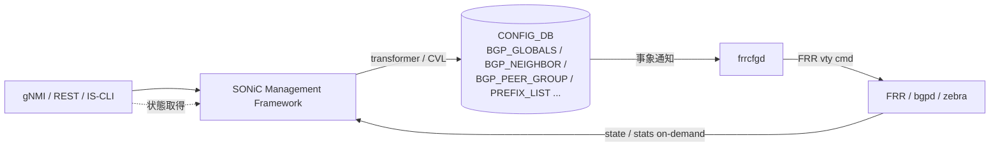

<!-- topics-tip -->
!!! tip "Topics で読み物として読む"
    この HLD は実装詳細を含みます。機能の概念・設定・運用を読み物として読みたい場合は [Topics 02 章: BGP と FRR 制御プレーン](../topics/02-bgp/index.md) を参照。
<!-- /topics-tip -->

!!! success "裏取りステータス: code-verified"
    Verifier 2026-05-09: `sonic-buildimage/src/sonic-frr-mgmt-framework/frrcfgd/frrcfgd.py` 本体、`rules/sonic-frr-mgmt-framework.{mk,dep}` ビルドルールを確認。`sonic-buildimage/dockers/docker-fpm-frr/docker_init.sh:68` で `MGMT_FRAMEWORK_CONFIG=$(echo $FRR_VARS | jq -r '.frr_mgmt_framework_config')` の分岐により bgpcfgd / frrcfgd を切替えている。YANG は `sonic-bgp-{global,neighbor,peergroup,common,...}.yang` 群が community sonic-yang-models に存在。`bgpcfgd` と `frrcfgd` の併用は `frr_mgmt_framework_config` キーで一元的に制御される構成。HLD と整合。

# FRR-BGP Unified Mgmt Framework（frrcfgd / OpenConfig BGP）

## 概要

SONiC Management Framework（REST / gNMI / IS-CLI）から **OpenConfig BGP** モデル経由で FRR-BGP を一気通貫に扱えるようにする設計[^1]。`bgpcfgd`（FRR template ベース）の制約（特定の機能しか出せない）を超え、新設の **`frrcfgd`** daemon が CONFIG_DB の差分イベントから直接 FRR vty コマンドを生成して FRR に流す。

切り替えは `DEVICE_METADATA.localhost.frr_mgmt_framework_config = "true"` で行う[^1]。default は `false`（従来 bgpcfgd）。state / statistics の get は FRR から on-demand 取得するため warm boot 影響なし。

## 動作仕様

### 全体構成



### bgpcfgd と frrcfgd

| 項目 | bgpcfgd（既存） | frrcfgd（本 HLD） |
|------|----------------|------------------|
| 起動条件 | default | `frr_mgmt_framework_config = true` |
| 入力 | CONFIG_DB + Jinja template | CONFIG_DB のみ |
| 出力 | startup config 生成（FRR 起動時にロード）+ 一部動的 | FRR 起動後の **動的** vty コマンド適用 |
| 機能網羅 | template が対応するもの限定 | フル BGP（neighbor / peer-group / prefix-list / route-map / policy / VRF） |
| 場所 | `sonic-buildimage/dockers/docker-fpm-frr/` | `sonic-buildimage/src/sonic-frr-mgmt-framework` |

### Management Framework 側

- OpenConfig BGP YANG → SONiC YANG（ABNF）への annotation
- transformer methods（Go）が syntactic / semantic 検証 + Redis 書き込み
- Marshalling は **YGOT**、CAS（Check-And-Set）transaction で書く（lock / rollback なし）[^1]

### CONFIG_DB スキーマ（拡張部）

HLD は ABNF レベルの schema を網羅的に定義する。代表例:

```
BGP_GLOBALS|<vrf>:
  router_id, local_asn, ebgp_requires_policy, ...
BGP_NEIGHBOR|<vrf>|<peer-ip>:
  asn, local_asn, peer_group, hold_time, keepalive, password, ...
BGP_PEER_GROUP|<vrf>|<group>:
  asn, ebgp_multihop_ttl, ...
PREFIX_LIST|<name>|<seq>:
  ip_prefix, action, ge, le
```

VRF キーが各 BGP テーブルの最上位に来る点（`<vrf>|...`）が、frrcfgd が VRF aware であることの帰結[^1]。

### State / Statistics の取得

`frrcfgd` は state / counters は持たず、Management Framework から要求が来たら **FRR vtysh の `show ... json` を直接叩いて返す**。COUNTERS_DB / STATE_DB に永続化しないため warm boot 復元の必要なし[^1]。

<!-- evidence:
source: sonic-net/SONiC/doc/mgmt/SONiC_Design_Doc_Unified_FRR_Mgmt_Interface.md#L96-L114 (sha: 49bab5b5ff0e924f1ea52b3d9db0dfa4191a7c06)
excerpt: |
  Ability to start frrcfgd ... or bgpcfgd ... based on frr_mgmt_framework_config field with "true"/"false" in DEVICE_METADATA table
  ... As state and statistics information is retrieved from FRR-BGP on demand there is no Warm Boot specific requirements for this feature.
reasoning: bgpcfgd / frrcfgd の切替フィールドと warm boot スコープ外の根拠。
-->

<!-- evidence-rendered:start -->
??? note "📋 検証エビデンス: sonic-net/SONiC/doc/mgmt/SONiC_Design_Doc_Unified_FRR_Mgmt_Interface.md#L96-L114 (sha: 49bab5b5ff0e924f1ea52b3d9db0dfa4191a7c06)"

    **出典**:

    `sonic-net/SONiC/doc/mgmt/SONiC_Design_Doc_Unified_FRR_Mgmt_Interface.md#L96-L114 (sha: 49bab5b5ff0e924f1ea52b3d9db0dfa4191a7c06)`

    **抜粋**:

    ```text
    Ability to start frrcfgd ... or bgpcfgd ... based on frr_mgmt_framework_config field with "true"/"false" in DEVICE_METADATA table
    ... As state and statistics information is retrieved from FRR-BGP on demand there is no Warm Boot specific requirements for this feature.
    ```

    **判断根拠**: bgpcfgd / frrcfgd の切替フィールドと warm boot スコープ外の根拠。

<!-- evidence-rendered:end -->

## 設定

### CONFIG_DB の有効化フラグ

```
DEVICE_METADATA|localhost:
  frr_mgmt_framework_config = "true"
```

### CLI / NBI

- IS-CLI: 業界標準風 BGP CLI を Management Framework が提供
- gNMI / REST: OpenConfig BGP モデル経由
- 既存の `vtysh` 直叩きは「SONiC 側機能と衝突しないものに限り」併用可（HLD 明記）[^1]

## 制限事項

- `bgpcfgd` と `frrcfgd` の **同時起動は不可**[^1]
- 既存の Jinja template ベース運用との互換性: フィールド名や VRF キー位置が異なる
- `vtysh` 直叩きと CONFIG_DB 経由の両方で同じものを設定すると不整合になり得る
- transformer 機能差異（OpenConfig 標準にない SONiC 固有機能はカスタム YANG 拡張）

## 干渉する機能

- **VRF**: BGP テーブルが `<vrf>|...` キーになるため、VRF サポートと密に絡む
- **bgpcfgd**: 排他関係。切替時は container 再起動を伴う
- **gNMI / REST**: Management Framework 全体の動向に追随
- **Open Config 公式モデル更新**: SONiC 側で transformer / annotation を追従する保守コストが発生

## トラブルシューティング

- `frr_mgmt_framework_config=true` にしたのに反映されない → BGP container を再起動。`bgpcfgd` プロセスが残っていないか確認
- gNMI で BGP set したのに FRR に反映されない → `frrcfgd` ログで vty コマンド生成エラーを確認

## 引用元

[^1]: `sonic-net/SONiC` `doc/mgmt/SONiC_Design_Doc_Unified_FRR_Mgmt_Interface.md` @ `49bab5b5ff0e924f1ea52b3d9db0dfa4191a7c06`

<!-- concerns hint:
- frrcfgd daemon (sonic-frr-mgmt-framework) の現行 master 採用 / メンテ状況確認
- BGP_GLOBALS / BGP_NEIGHBOR / BGP_PEER_GROUP の YANG 取り込み状況（特に bgpcfgd 互換 vs frrcfgd 新スキーマ）
- DEVICE_METADATA.frr_mgmt_framework_config の有効ケースが master でテストされているか確認
- OpenConfig BGP transformer の sonic-mgmt-framework 取り込み確認
- 2019-2021 年 HLD のため Management Framework 全体方針との整合性確認（priority=high）
- frrcfgd と bgpcfgd の切替手順 / 同時起動防止の実装確認
-->

## 関連ページ
- [CLI: config bgp](../reference/cli/config-bgp.md)
- [CLI: show bgp](../reference/cli/show-bgp.md)
- [CONFIG_DB: BGP_GLOBALS](../reference/config-db/bgp-globals.md)
- [CONFIG_DB: BGP_NEIGHBOR](../reference/config-db/bgp-neighbor.md)
- [YANG: sonic-bgp-neighbor](../reference/yang/sonic-bgp-neighbor.md)

<!-- topics-back-ref -->
## 関連 Topics

- [Topics: SRv6 / MPLS / Path Tracing](../topics/17-srv6-mpls/index.md)

<!-- /topics-back-ref -->
