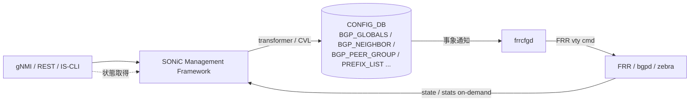

<!-- topics-tip -->
!!! tip "Topics で読み物として読む"
    この HLD は実装詳細を含みます。機能の概念・設定・運用を読み物として読みたい場合は [Topics 02 章: BGP と FRR 制御プレーン](../topics/02-bgp/index.md) を参照。
<!-- /topics-tip -->

!!! success "裏取りステータス: code-verified"
    Verifier 2026-05-09: `sonic-buildimage/src/sonic-frr-mgmt-framework/frrcfgd/frrcfgd.py` 本体、`rules/sonic-frr-mgmt-framework.{mk,dep}` ビルドルールを確認。`sonic-buildimage/dockers/docker-fpm-frr/docker_init.sh:68` で `MGMT_FRAMEWORK_CONFIG=$(echo $FRR_VARS | jq -r '.frr_mgmt_framework_config')` の分岐により bgpcfgd / frrcfgd を切替えている。YANG は `sonic-bgp-{global,neighbor,peergroup,common,...}.yang` 群が community sonic-yang-models に存在。`bgpcfgd` と `frrcfgd` の併用は `frr_mgmt_framework_config` キーで一元的に制御される構成。HLD と整合。

# FRR-BGP Unified Mgmt Framework（frrcfgd / OpenConfig BGP）

## 概要

[SONiC](../reference/glossary.md#term-sonic) Management Framework（REST / [gNMI](../reference/glossary.md#term-gnmi) / IS-CLI）から **OpenConfig [BGP](../reference/glossary.md#term-bgp)** モデル経由で [FRR](../reference/glossary.md#term-frr)-BGP を一気通貫に扱えるようにする設計[^1]。`bgpcfgd`（FRR template ベース）の制約（特定の機能しか出せない）を超え、新設の **`frrcfgd`** daemon が [CONFIG_DB](../reference/glossary.md#term-config_db) の差分イベントから直接 FRR vty コマンドを生成して FRR に流す。

切り替えは `DEVICE_METADATA.localhost.frr_mgmt_framework_config = "true"` で行う[^1]。default は `false`（従来 [bgpcfgd](../reference/glossary.md#term-bgpcfgd)）。state / statistics の get は FRR から on-demand 取得するため warm boot 影響なし。

## 動作仕様

### 全体構成



### bgpcfgd と frrcfgd

| 項目 | bgpcfgd（既存） | frrcfgd（本 [HLD](../reference/glossary.md#term-hld)） |
|------|----------------|------------------|
| 起動条件 | default | `frr_mgmt_framework_config = true` |
| 入力 | CONFIG_DB + Jinja template | CONFIG_DB のみ |
| 出力 | startup config 生成（FRR 起動時にロード）+ 一部動的 | FRR 起動後の **動的** vty コマンド適用 |
| 機能網羅 | template が対応するもの限定 | フル BGP（neighbor / peer-group / prefix-list / route-map / policy / [VRF](../reference/glossary.md#term-vrf)） |
| 場所 | `sonic-buildimage/dockers/docker-fpm-frr/` | `sonic-buildimage/src/sonic-frr-mgmt-framework` |

### Management Framework 側

- OpenConfig BGP [YANG](../reference/glossary.md#term-yang) → SONiC YANG（ABNF）への annotation
- transformer methods（Go）が syntactic / semantic 検証 + [Redis](../reference/glossary.md#term-redis) 書き込み
- Marshalling は **YGOT**、CAS（Check-And-Set）transaction で書く（lock / rollback なし）[^1]

### CONFIG_DB スキーマ（拡張部）

HLD は ABNF レベルの schema を網羅的に定義する。代表例:

```text
BGP_GLOBALS|<vrf>:
  router_id, local_asn, ebgp_requires_policy, ...
BGP_NEIGHBOR|<vrf>|<peer-ip>:
  asn, local_asn, peer_group, hold_time, keepalive, password, ...
BGP_PEER_GROUP|<vrf>|<group>:
  asn, ebgp_multihop_ttl, ...
PREFIX_LIST|<name>|<seq>:
  ip_prefix, action, ge, le
```

VRF キーが各 BGP テーブルの最上位に来る点（`<vrf>|...`）が、frrcfgd が VRF aware であることの帰結[^1]。

### State / Statistics の取得

`frrcfgd` は state / counters は持たず、Management Framework から要求が来たら **FRR [vtysh](../reference/glossary.md#term-vtysh) の `show ... json` を直接叩いて返す**。[COUNTERS_DB](../reference/glossary.md#term-counters_db) / [STATE_DB](../reference/glossary.md#term-state_db) に永続化しないため warm boot 復元の必要なし[^1]。

<!-- evidence:
source: sonic-net/SONiC/doc/mgmt/SONiC_Design_Doc_Unified_FRR_Mgmt_Interface.md#L96-L114 (sha: 49bab5b5ff0e924f1ea52b3d9db0dfa4191a7c06)
excerpt: |
  Ability to start frrcfgd ... or bgpcfgd ... based on frr_mgmt_framework_config field with "true"/"false" in DEVICE_METADATA table
  ... As state and statistics information is retrieved from FRR-BGP on demand there is no Warm Boot specific requirements for this feature.
reasoning: bgpcfgd / frrcfgd の切替フィールドと warm boot スコープ外の根拠。
-->

<!-- evidence-rendered:start -->
??? note "📋 検証エビデンス: sonic-net/SONiC/doc/mgmt/SONiC_Design_Doc_Unified_FRR_Mgmt_Interface.md#L96-L114 (sha: 49bab5b5ff0e924f1ea52b3d9db0dfa4191a7c06)"

    **出典**:

    `sonic-net/SONiC/doc/mgmt/SONiC_Design_Doc_Unified_FRR_Mgmt_Interface.md#L96-L114 (sha: 49bab5b5ff0e924f1ea52b3d9db0dfa4191a7c06)`

    **抜粋**:

    ```text
    Ability to start frrcfgd ... or bgpcfgd ... based on frr_mgmt_framework_config field with "true"/"false" in DEVICE_METADATA table
    ... As state and statistics information is retrieved from FRR-BGP on demand there is no Warm Boot specific requirements for this feature.
    ```

    **判断根拠**: bgpcfgd / frrcfgd の切替フィールドと warm boot スコープ外の根拠。

<!-- evidence-rendered:end -->

## 設定

### CONFIG_DB の有効化フラグ

```text
DEVICE_METADATA|localhost:
  frr_mgmt_framework_config = "true"
```

### CLI / NBI

- IS-CLI: 業界標準風 BGP CLI を Management Framework が提供
- gNMI / REST: OpenConfig BGP モデル経由
- 既存の `vtysh` 直叩きは「SONiC 側機能と衝突しないものに限り」併用可（HLD 明記）[^1]

## 制限事項

- `bgpcfgd` と `frrcfgd` の **同時起動は不可**[^1]
- 既存の Jinja template ベース運用との互換性: フィールド名や VRF キー位置が異なる
- `vtysh` 直叩きと CONFIG_DB 経由の両方で同じものを設定すると不整合になり得る
- transformer 機能差異（OpenConfig 標準にない SONiC 固有機能はカスタム YANG 拡張）

## 既知の問題

### vtysh での FRR 設定が再起動後に消える（#250, #442）

デフォルト設定では、`vtysh` で直接変更した FRR の設定（BGP、OSPF、ISIS 等）は **再起動後にリセット**される。これは BGP コンテナ起動時に `config_db.json` から frr.conf が再生成されるためである。

`vtysh` 内での `write` や `copy running-config startup-config` は動作するが、BGP コンテナが再起動されると `frr.conf` の内容が上書きされる。

**恒久的な解決策 (`split` モード):**

`config_db.json` の `DEVICE_METADATA.localhost` セクションに `"docker_routing_config_mode": "split"` を追加する:

```json
{
    "DEVICE_METADATA": {
        "localhost": {
            "docker_routing_config_mode": "split"
        }
    }
}
```

`split` モードでは、FRR の各デーモン設定ファイル（`bgpd.conf`、`zebra.conf` 等）が独立して管理され、vtysh での変更が永続化される。設定変更後は `sudo config reload` または BGP コンテナ再起動が必要。

- 参照: [sonic-net/SONiC#250](https://github.com/sonic-net/SONiC/issues/250), [sonic-net/SONiC#442](https://github.com/sonic-net/SONiC/issues/442)

### IPv6 ネイバーのアップデートに 7 秒以上かかる問題（sonic-buildimage#2414）

IPv6 ネイバーのアップデートに 7 秒以上かかる問題。IPv6 [NDP](../reference/glossary.md#term-ndp) タイムアウト設定がデフォルトで長い場合がある。`/proc/sys/net/ipv6/neigh/default/delay_first_probe_time` を調整

- 参照: [sonic-net/sonic-buildimage#2414](https://github.com/sonic-net/sonic-buildimage/issues/2414)

### IPv4 と IPv6 両方の BGP セッションが確立できない問題（sonic-buildimage#3043）

IPv4 と IPv6 両方の BGP セッションが確立できない問題。デュアルスタック構成では `no bgp default ipv4-unicast` を適切に設定する必要がある

- 参照: [sonic-net/sonic-buildimage#3043](https://github.com/sonic-net/sonic-buildimage/issues/3043)

### watchfrr が起動していない状態で FRR の一部デーモンがクラッシュしても自動復旧されない（sonic-buildimage#3196）

watchfrr が起動していない状態で FRR の一部デーモンがクラッシュしても自動復旧されない。`supervisorctl status watchfrr` で起動確認すること

- 参照: [sonic-net/sonic-buildimage#3196](https://github.com/sonic-net/sonic-buildimage/issues/3196)

### management VRF を無効化すると zebra がクラッシュする既知の問題（sonic-buildimage#3798）

management VRF を無効化すると [zebra](../reference/glossary.md#term-zebra) がクラッシュする既知の問題。mgmt VRF の有効/無効切り替えは動的には行えず、設定変更後にコンテナ再起動が必要

- 参照: [sonic-net/sonic-buildimage#3798](https://github.com/sonic-net/sonic-buildimage/issues/3798)

### ルーティングエントリの next-hop であるネイバーエントリを削除する際の順序が重要（sonic-buildimage#4400）

ルーティングエントリの next-hop であるネイバーエントリを削除する際の順序が重要。next-hop が有効な状態でルートを削除してからネイバーを削除しないと [orchagent](../reference/glossary.md#term-orchagent) でエラーが発生

- 参照: [sonic-net/sonic-buildimage#4400](https://github.com/sonic-net/sonic-buildimage/issues/4400)

### CONFIG_DB の BGPv6 ネイバー設定が frr.conf に正しく生成されない問題（sonic-buildimage#4572）

CONFIG_DB の BGPv6 ネイバー設定が frr.conf に正しく生成されない問題。[sonic-cfggen](../reference/glossary.md#term-sonic-cfggen) のテンプレートが BGPv6 ネイバーを適切に処理していない場合がある

- 参照: [sonic-net/sonic-buildimage#4572](https://github.com/sonic-net/sonic-buildimage/issues/4572)

### CONFIG_DB の BGP_PEER_RANGE 設定が FRR 設定に変換されない問題（sonic-buildimage#4664）

CONFIG_DB の BGP_PEER_RANGE 設定が FRR 設定に変換されない問題。sonic-cfggen のテンプレートが BGP_PEER_RANGE テーブルを処理していないため、直接 FRR コマンドで設定する必要がある

- 参照: [sonic-net/sonic-buildimage#4664](https://github.com/sonic-net/sonic-buildimage/issues/4664)

### iptables が /32 ループバックアドレスへのアクセスをブロックする問題（sonic-buildimage#4797）

iptables が /32 ループバックアドレスへのアクセスをブロックする問題。management VRF 有効時に iptables ルールが自動的に追加されるが、/32 アドレスに対するルールが不足していることがある

- 参照: [sonic-net/sonic-buildimage#4797](https://github.com/sonic-net/sonic-buildimage/issues/4797)

### ospfclient が SONiC docker コンテナ内で起動できない問題（sonic-buildimage#4961）

ospfclient が SONiC docker コンテナ内で起動できない問題。コンテナ内の FRR ソケットパスが `/var/run/frr` であることを明示的に指定すること

- 参照: [sonic-net/sonic-buildimage#4961](https://github.com/sonic-net/sonic-buildimage/issues/4961)

### カーネルルートが ASIC に伝播されない問題（sonic-buildimage#4969）

カーネルルートが [ASIC](../reference/glossary.md#term-asic) に伝播されない問題。[fpmsyncd](../reference/glossary.md#term-fpmsyncd) が FRR から [APPL_DB](../reference/glossary.md#term-appl_db) への route 書き込みに失敗している場合がある

- 参照: [sonic-net/sonic-buildimage#4969](https://github.com/sonic-net/sonic-buildimage/issues/4969)

### カーネルの ip route と BGP ルートが一致しない問題（sonic-buildimage#5026）

カーネルの ip route と BGP ルートが一致しない問題。redistribute connected/kernel の設定や `ip route` で手動追加したルートが BGP に入らない場合は FRR の route-map 設定を確認すること

- 参照: [sonic-net/sonic-buildimage#5026](https://github.com/sonic-net/sonic-buildimage/issues/5026)

### IPv6 ルートが APPL_DB から ASIC_DB に伝播されない問題（sonic-buildimage#5040）

IPv6 ルートが APPL_DB から [ASIC_DB](../reference/glossary.md#term-asic_db) に伝播されない問題。fpmsyncd の IPv6 対応設定と orchagent の IPv6 ルートハンドラーを確認すること

- 参照: [sonic-net/sonic-buildimage#5040](https://github.com/sonic-net/sonic-buildimage/issues/5040)

### frr.conf が実行中の FRR 設定と一致しない問題（sonic-buildimage#5067）

frr.conf が実行中の FRR 設定と一致しない問題。`vtysh -c "show running-config"` の出力が frr.conf より正確。設定変更後は `write file` で frr.conf を更新すること

- 参照: [sonic-net/sonic-buildimage#5067](https://github.com/sonic-net/sonic-buildimage/issues/5067)

### バルクルート API が "not implemented" エラーを出力する問題（sonic-buildimage#5758）

バルクルート API が "not implemented" エラーを出力する問題。一部の [SAI](../reference/glossary.md#term-sai) 実装ではバルク API をサポートしていないため、orchagent はフォールバックとして個別ルート追加を使用する

- 参照: [sonic-net/sonic-buildimage#5758](https://github.com/sonic-net/sonic-buildimage/issues/5758)

### 異なる VRF 間のポートを経由した ping が不可能な問題（sonic-buildimage#5947）

異なる VRF 間のポートを経由した ping が不可能な問題。VRF のルートリークが設定されていない場合、異なる VRF 間の直接通信はできない

- 参照: [sonic-net/sonic-buildimage#5947](https://github.com/sonic-net/sonic-buildimage/issues/5947)

### デフォルト VRF を有効化すると vrfmgrd がクラッシュする問題（sonic-buildimage#6626）

デフォルト VRF を有効化すると [vrfmgrd](../reference/glossary.md#term-vrfmgrd) がクラッシュする問題。VRF の有効化/無効化は動的には行えず、起動時設定で行う必要がある

- 参照: [sonic-net/sonic-buildimage#6626](https://github.com/sonic-net/sonic-buildimage/issues/6626)

## 干渉する機能

- **VRF**: BGP テーブルが `<vrf>|...` キーになるため、VRF サポートと密に絡む
- **bgpcfgd**: 排他関係。切替時は container 再起動を伴う
- **gNMI / REST**: Management Framework 全体の動向に追随
- **Open Config 公式モデル更新**: SONiC 側で transformer / annotation を追従する保守コストが発生

## トラブルシューティング

- `frr_mgmt_framework_config=true` にしたのに反映されない → BGP container を再起動。`bgpcfgd` プロセスが残っていないか確認
- gNMI で BGP set したのに FRR に反映されない → `frrcfgd` ログで vty コマンド生成エラーを確認

### コマンド例

BGP unified config の rendering 結果と FRR への反映を確認する。

```bash
docker exec bgp cat /etc/frr/bgpd.conf | head -40
docker exec bgp vtysh -c 'show running-config' | head -40
sonic-cfggen -d -v 'BGP_GLOBALS'
```

## 引用元

[^1]: `sonic-net/SONiC` `doc/mgmt/SONiC_Design_Doc_Unified_FRR_Mgmt_Interface.md` @ `49bab5b5ff0e924f1ea52b3d9db0dfa4191a7c06`

<!-- concerns hint:
- frrcfgd daemon (sonic-frr-mgmt-framework) の現行 master 採用 / メンテ状況確認
- BGP_GLOBALS / BGP_NEIGHBOR / BGP_PEER_GROUP の YANG 取り込み状況（特に bgpcfgd 互換 vs frrcfgd 新スキーマ）
- DEVICE_METADATA.frr_mgmt_framework_config の有効ケースが master でテストされているか確認
- OpenConfig BGP transformer の sonic-mgmt-framework 取り込み確認
- 2019-2021 年 HLD のため Management Framework 全体方針との整合性確認（priority=high）
- frrcfgd と bgpcfgd の切替手順 / 同時起動防止の実装確認
-->

## 関連ページ
- [CLI: config bgp](../reference/cli/config-bgp.md)
- [CLI: show bgp](../reference/cli/show-bgp.md)
- [CONFIG_DB: BGP_GLOBALS](../reference/config-db/bgp-globals.md)
- [CONFIG_DB: BGP_NEIGHBOR](../reference/config-db/bgp-neighbor.md)
- [YANG: sonic-bgp-neighbor](../reference/yang/sonic-bgp-neighbor.md)

<!-- topics-back-ref -->
## 関連 Topics

- [Topics: BGP と FRR 制御プレーン](../topics/02-bgp/index.md)

<!-- /topics-back-ref -->

<!-- glossary-links-injected: a331f3352c01 -->
