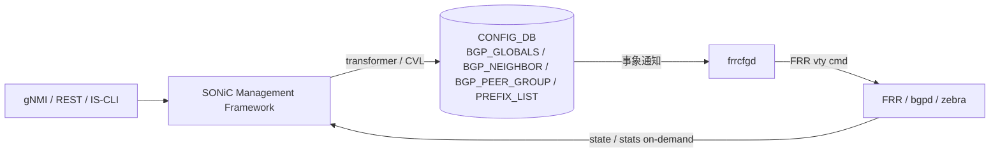

!!! success "裏取りステータス: code-verified"
    `sonic-buildimage/src/sonic-frr-mgmt-framework/frrcfgd/frrcfgd.py` 本体、`rules/sonic-frr-mgmt-framework.{mk,dep}` ビルドルール、`docker-fpm-frr/docker_init.sh:68` で `frr_mgmt_framework_config` 分岐により bgpcfgd / frrcfgd を切替えていることを確認。YANG `sonic-bgp-{global,neighbor,peergroup,common,...}.yang` が sonic-yang-models に存在。HLD と整合 (verified at: 2026-05-09)。

# FRR-BGP Unified Mgmt Framework（`frrcfgd` / OpenConfig BGP）

## なぜ必要か

SONiC Management Framework (REST / gNMI / IS-CLI) から **OpenConfig BGP モデル経由で FRR-BGP を一気通貫に扱う** ための設計[^1]。既存の `bgpcfgd`（FRR Jinja template ベース）は、template が対応する機能しか出せず、neighbor / peer-group / prefix-list / route-map / policy / VRF の完全制御に届かない。

本 HLD は新設 daemon **`frrcfgd`** が CONFIG_DB 差分イベントから **直接 FRR vty コマンド** を生成して FRR に流すように変更し、切替フラグ `DEVICE_METADATA.localhost.frr_mgmt_framework_config` で旧 `bgpcfgd` と排他で動かす（default `false`）[^1]。

## どう動くか

### 全体構成



### bgpcfgd と frrcfgd の対比

| 項目 | bgpcfgd（既存） | frrcfgd（本 HLD） |
|------|----------------|------------------|
| 起動条件 | default | `frr_mgmt_framework_config = true` |
| 入力 | CONFIG_DB + Jinja template | CONFIG_DB のみ |
| 出力 | startup config 生成 + 一部動的 | FRR 起動後の **動的** vty コマンド |
| 機能網羅 | template 対応分のみ | フル BGP (neighbor / peer-group / policy / VRF) |
| 配置 | `dockers/docker-fpm-frr/` | `src/sonic-frr-mgmt-framework` |

### Management Framework 側

- OpenConfig BGP YANG → SONiC YANG (ABNF) への annotation
- transformer methods (Go) が syntactic / semantic 検証 + Redis 書き込み
- Marshalling は **YGOT**、CAS transaction（lock / rollback なし）[^1]

### CONFIG_DB スキーマ（代表例）

```
BGP_GLOBALS|<vrf>:
  router_id, local_asn, ebgp_requires_policy, ...
BGP_NEIGHBOR|<vrf>|<peer-ip>:
  asn, local_asn, peer_group, hold_time, keepalive, password, ...
BGP_PEER_GROUP|<vrf>|<group>:
  asn, ebgp_multihop_ttl, ...
PREFIX_LIST|<name>|<seq>:
  ip_prefix, action, ge, le
```

VRF キーが各 BGP テーブル最上位 (`<vrf>|...`) に来るのが、`frrcfgd` の VRF aware 設計の帰結[^1]。

### State / Statistics

`frrcfgd` は state / counters を持たず、Management Framework の要求時に **FRR vtysh の `show ... json` を直接叩く**。COUNTERS_DB / STATE_DB 永続化なし → warm boot 復元不要[^1]。

<!-- evidence:
source: sonic-net/SONiC/doc/mgmt/SONiC_Design_Doc_Unified_FRR_Mgmt_Interface.md#L96-L114 (sha: 49bab5b5ff0e924f1ea52b3d9db0dfa4191a7c06)
excerpt: |
  Ability to start frrcfgd ... or bgpcfgd ... based on frr_mgmt_framework_config field with "true"/"false" in DEVICE_METADATA table
  ... As state and statistics information is retrieved from FRR-BGP on demand there is no Warm Boot specific requirements for this feature.
reasoning: bgpcfgd / frrcfgd の切替フィールドと warm boot スコープ外の根拠。
-->

## 設定

### 有効化フラグ

```
DEVICE_METADATA|localhost:
  frr_mgmt_framework_config = "true"
```

### CLI / NBI

- **IS-CLI**: 業界標準風 BGP CLI を Management Framework が提供
- **gNMI / REST**: OpenConfig BGP モデル経由
- 既存 `vtysh` 直叩きは「SONiC 側機能と衝突しないもの」に限り併用可[^1]

## 制限事項

- `bgpcfgd` と `frrcfgd` の **同時起動は不可**[^1]
- 既存 Jinja template 運用との互換性: フィールド名 / VRF キー位置が異なる
- `vtysh` 直叩きと CONFIG_DB 経由の重複設定は不整合の元
- OpenConfig 非標準の SONiC 固有機能はカスタム YANG 拡張が必要

## 干渉する機能

- **VRF**: BGP テーブルが `<vrf>|...` キーで VRF サポートと密結合
- **bgpcfgd**: 排他、切替は container 再起動を伴う
- **gNMI / REST**: Management Framework 全体の動向に追従
- **OpenConfig 公式モデル更新**: transformer / annotation を追従する保守コスト

## トラブルシューティング

- `frr_mgmt_framework_config=true` で反映されない → BGP container 再起動、`bgpcfgd` プロセス残存確認
- gNMI で set しても FRR に反映されない → `frrcfgd` ログで vty コマンド生成エラー確認

## 関連トピック

- [Topics: BGP](../topics/02-bgp/index.md) — BGP daemon 管理の全体像
- [Topics: gNMI / OpenConfig](../topics/10-gnmi-openconfig/index.md) — OpenConfig BGP と transformer
- [Topics: VRF / ECMP](../topics/04-vrf-ecmp/index.md) — VRF aware BGP

## 関連ページ

- [CLI: config bgp](../reference/cli/config-bgp.md)
- [CLI: show bgp](../reference/cli/show-bgp.md)
- [CONFIG_DB: BGP_GLOBALS](../reference/config-db/bgp-globals.md)
- [CONFIG_DB: BGP_NEIGHBOR](../reference/config-db/bgp-neighbor.md)
- [YANG: sonic-bgp-neighbor](../reference/yang/sonic-bgp-neighbor.md)

## 引用元

[^1]: `sonic-net/SONiC` `doc/mgmt/SONiC_Design_Doc_Unified_FRR_Mgmt_Interface.md` @ `49bab5b5ff0e924f1ea52b3d9db0dfa4191a7c06`

<!-- concerns hint:
- frrcfgd daemon (sonic-frr-mgmt-framework) の現行 master 採用 / メンテ状況確認
- BGP_GLOBALS / BGP_NEIGHBOR / BGP_PEER_GROUP の YANG 取り込み状況
- DEVICE_METADATA.frr_mgmt_framework_config の有効ケースが master でテストされているか確認
- OpenConfig BGP transformer の sonic-mgmt-framework 取り込み確認
- 2019-2021 年 HLD のため Management Framework 全体方針との整合性確認 (priority=high)
- frrcfgd と bgpcfgd の切替手順 / 同時起動防止の実装確認
-->
