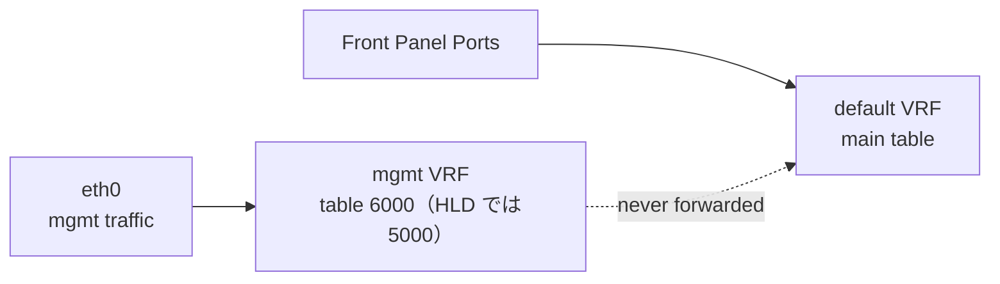

<!-- topics-tip -->
!!! tip "Topics で読み物として読む"
    この HLD は実装詳細を含みます。機能の概念・設定・運用を読み物として読みたい場合は [Topics 04 章: VRF / ECMP / 経路選択](../topics/04-vrf-ecmp/index.md) を参照。
<!-- /topics-tip -->

!!! success "裏取りステータス: Code-verified（部分的に陳腐化、現行実装は iproute2 VRF master device 方式に移行）"
    `MGMT_VRF_CONFIG` テーブルは `sonic-buildimage/src/sonic-yang-models/yang-models/sonic-mgmt_vrf.yang` L17-33 で確認、`sonic-buildimage/files/image_config/interfaces/interfaces.j2` L5-20 で `iface mgmt / vrf-table 6000 / lo-m loopback` を確認、L90/L153 で eth0 への `vrf mgmt` バインドを確認（verified 2026-05-09）。**HLD 記載の `cgexec -g l3mdev:mgmt` 起動ラッパー方式は現行 master では採用されておらず**、ifupdown2 の `vrf` キーワード（Linux VRF master device 方式）に統一されている。Stretch カーネルパッチ（`udp_l3mdev_accept` / NSS/PAM `--use-mgmt-vrf`）の現行カーネル取り込み確認は範囲外（Buster 以降では mainline kernel 機能を使用）。`show mgmt-vrf` CLI は `sonic-utilities/show/main.py` L539 で確認。

# Management VRF 設計（201911 release / l3mdev + cgroups）

## 読者が知りたいこと

- mgmt [VRF](../reference/glossary.md#term-vrf) を有効化すると **eth0 と front panel のトラフィックは具体的にどう分かれる** のか
- **アプリ（ssh / ping / TACACS+ / NTP / [SNMP](../reference/glossary.md#term-snmp) / DHCP）** を mgmt 経由で動かすには何が必要か
- **[CONFIG_DB](../reference/glossary.md#term-config_db) のキー** と **CLI** はどう触ればいいか
- **201911 と現行 master の差分**（[HLD](../reference/glossary.md#term-hld) と実装の乖離）はどこか
- 落とし穴・トラブルシュートの定石

## 1. トラフィック分離の挙動



- mgmt port から入った IP は **mgmt VRF テーブル**（HLD 表記 table 5000、現行実装は 6000）で処理
- front panel から入った IP は **default VRF**（main table）で処理
- 両 VRF 間で transit traffic は **絶対に転送されない**[^1]
- スイッチ発（switch-originated）の通信は default が暗黙のデフォルト。mgmt を使うときは `cgexec -g l3mdev:mgmt <cmd>` で起動

## 2. CONFIG_DB / CLI

最小限の触り方。

```text
MGMT_INTERFACE|eth0|<ip>/<mask>
    gwaddr  = <gateway>
    vrfname = mgmt

MGMT_VRF_CONFIG|vrf_global
    mgmtVrfEnabled = "true" | "false"
```

| Command | 用途 |
|---------|------|
| `config vrf add mgmt` / `config vrf del mgmt` | mgmt VRF 作成/削除 |
| `config interface eth0 ip add <ip>/<mask> <gw>` | mgmt IP 設定 |
| `show mgmt-vrf` / `show mgmt-vrf routes` | 状態と routing table |
| `show management_interface address` | mgmt IP / GW |
| `config tacacs add --use-mgmt-vrf <ip>` | tacacs+ を mgmt VRF 経由で |

```bash
sudo config vrf add mgmt
show mgmt-vrf
sudo config tacacs add --use-mgmt-vrf 10.11.55.40
```

## 3. アプリごとの mgmt VRF 経由方法

| アプリ | mgmt VRF 通信方法 |
|--------|-------------------|
| sshd / TCP 受信 | `tcp_l3mdev_accept=1` で透過対応 |
| UDP 受信 | Linux 4.9 では未サポート → [SONiC](../reference/glossary.md#term-sonic) 用パッチを backport |
| ping / traceroute | `cgexec -g l3mdev:mgmt ping ...` |
| TACACS+ | NSS/PAM コードに `--use-mgmt-vrf` 拡張、`SO_BINDTODEVICE` で `mgmt` 縛り |
| NTP | `init.d/ntp` を改修し `cgexec -g l3mdev:mgmt` で起動 |
| SNMP | netsnmp 5.7.3 へ VRF パッチ適用 |
| DHCP client | exit-hook の `vrf` script で eth0 を VRF に置く |
| DHCP relay | default VRF のみ（front panel）。変更なし |
| DNS | プロセスが mgmt cgroup 内なら自動で mgmt 経由 |

TACACS+ で `config tacacs add --use-mgmt-vrf <ip>` を打つと `TACPLUS_SERVER.<ip>.vrf=mgmt` がセットされ、PAM/NSS が `SO_BINDTODEVICE` で `mgmt` インタフェースに縛った socket を作る[^1]。

## 4. 構成手順（内部動作）

`config vrf add mgmt` の挙動[^1]:

1. CONFIG_DB の `MGMT_VRF_CONFIG.mgmtVrfEnabled = true`
2. `interfaces-config` を再起動 → `interfaces.j2` から `/etc/network/interfaces` を再生成し `networking` を再起動
3. `mgmt` インタフェース（`type vrf table 6000`、HLD では `5000` と記載）と `lo-m`（NTP 内部通信用ダミーループバック）を作成
4. `eth0` を `mgmt` VRF に enslave（`ip link set dev eth0 master mgmt`）
5. `l3mdev:mgmt` cgroup を作成

## 5. 201911 と現行 master の差分

- HLD は **`cgexec -g l3mdev:mgmt` 起動ラッパー方式** を前提にしているが、現行 master は **ifupdown2 の `vrf` キーワード**（Linux VRF master device 方式）に統一されている
- ルーティングテーブル番号は HLD で `5000`、現行実装では `6000`
- Buster 以降は mainline kernel の VRF サポートを使用するため、`udp_l3mdev_accept` 等の SONiC 専用カーネルパッチは段階的に不要化されている
- 201911 由来の `cgexec` 接頭辞は **過去ドキュメント / ベンダー資料を読むときの参考** として残す価値はあるが、master では発火しない

## 既知の問題

### mgmt VRF と default VRF に同じ IP が存在する場合の ICMP reply 誤送出

**症状**: mgmt VRF 有効かつ `eth0` と front panel インタフェース（例: Ethernet1）に **同じ IP アドレス**が設定されている場合、Ethernet1 宛ての ICMP echo request への reply が **eth0（mgmt VRF）経由で送出**される。

**原因**: `interfaces.j2` が生成する ip rule（priority 32765）が mgmt IP と一致するすべての送信元を mgmt VRF テーブルに誘導する:

```
32765:  from 192.168.229.2 lookup mgmt
```

このルールが default VRF 側の Ethernet1 から届いた ICMP reply の送信元 IP にもマッチし、mgmt VRF 経由で egress してしまう。

**回避策（一時的）**:
```bash
sudo ip rule del from <重複IP> lookup mgmt
```

ただしこのルールを削除すると mgmt VRF 発のトラフィックが正しく mgmt へルーティングされない場合がある。根本的には同一 IP を mgmt と data の双方に設定しないことが推奨される。

**参照**: sonic-net/[sonic-buildimage](../reference/glossary.md#term-sonic-buildimage)#26904（Bug, 202511 で再現確認）

## 6. 制限事項

- 201911 リリース固定の HLD。Buster 以降は別 HLD で更新される予定（未公開）
- UDP 受信は SONiC 専用カーネルパッチに依存（古い release）
- スイッチ発のアプリは 201911 では `cgexec` 接頭辞が必要（透過しない）
- `lo-m` ダミーループバックは NTP `ntpq` 用の workaround
- 詳細フローと各アプリ改修箇所は HLD `doc/mgmt/sonic_stretch_management_vrf_design.md` を参照

## 7. 干渉する機能

- **TACACS+ / [RADIUS](../reference/glossary.md#term-radius) / LDAP**: `--use-mgmt-vrf` 系オプションで mgmt 経由認証
- **DHCP**: client は mgmt と data 双方、relay は data 側のみ
- **NTP**: cgexec ラッパーで起動するため `init.d/ntp` をベンダーパッケージから上書き保守
- **namespace ベース VRF**: HLD で比較されたが採用されず、l3mdev に統一

## 8. トラブルシューティング

- `cgexec -g l3mdev:mgmt ssh ...` で名前解決が失敗 → `resolv.conf` の DNS が mgmt から到達可能か確認
- NTP 同期しない → `ps -ef | grep ntpd` で `cgexec` 起動か確認
- TACACS+ が default VRF 経由になる → `show tacacs` で `vrf mgmt` が出ているか確認

### コマンド例

management VRF (mgmt) の状態と route table を確認する。

```bash
show mgmt-vrf
ip -d link show type vrf
ip route show vrf mgmt
```

## 9. 次に読む

- Topics: [VRF / ECMP 概念](../topics/04-vrf-ecmp/concept.md), [VRF / ECMP 構築](../topics/04-vrf-ecmp/setup.md), [VRF / ECMP 運用](../topics/04-vrf-ecmp/operations.md)
- 関連 HLD: [SONiC VRF Support Design Spec](sonic-vrf-support-design-spec-draft.md)

## 制限事項

- 本設計は 201911 リリース時点のもので、master ブランチでは netns ベースの management VRF (`mgmt`) 実装に置き換わっており、CLI / sysctl 周りで挙動が異なる。
- non-default VRF からの DNS / NTP / TACACS+ 利用は各サービスが VRF-aware に再実装される必要があり、サービスにより未対応のものがある。
- snmpd / sshd の bind を mgmt VRF に閉じる場合、systemd ユニット側で `ip vrf exec` ラップを行う必要がある。

## 引用元

[^1]: `sonic-net/SONiC` `doc/mgmt/sonic_stretch_management_vrf_design.md` @ `49bab5b5ff0e924f1ea52b3d9db0dfa4191a7c06`

<!-- glossary-links-injected: c17daefc2a7d -->
