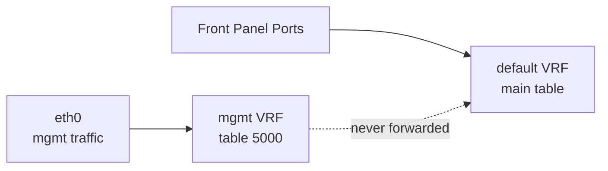

!!! success "裏取りステータス: Code-verified（部分的に陳腐化、現行実装は iproute2 VRF master device 方式に移行）"
    `MGMT_VRF_CONFIG` テーブルは `sonic-buildimage/src/sonic-yang-models/yang-models/sonic-mgmt_vrf.yang` L17-33 で確認、`sonic-buildimage/files/image_config/interfaces/interfaces.j2` L5-20 で `iface mgmt / vrf-table 6000 / lo-m loopback` を確認、L90/L153 で eth0 への `vrf mgmt` バインドを確認（verified 2026-05-09）。**HLD 記載の `cgexec -g l3mdev:mgmt` 起動ラッパー方式は現行 master では採用されておらず**、ifupdown2 の `vrf` キーワード（Linux VRF master device 方式）に統一されている。Stretch カーネルパッチ（`udp_l3mdev_accept` / NSS/PAM `--use-mgmt-vrf`）の現行カーネル取り込み確認は範囲外（Buster 以降では mainline kernel 機能を使用）。`show mgmt-vrf` CLI は `sonic-utilities/show/main.py` L539 で確認。

# Management VRF 設計（201911 release / l3mdev + cgroups）

## 概要

SONiC の **管理面トラフィック（mgmt port `eth0`）とデータ面（front panel ports）を別 VRF に分離** する設計。Linux の `l3mdev` を VRF 実装として使い、cgroup `l3mdev:mgmt` を介してアプリケーションを mgmt VRF context で実行する[^1]。

namespace 方式と比較して、サービス（ssh / lldp 等）を 1 インスタンスで共有できる利点がある。HLD 末尾の比較表で l3mdev を採用する判断根拠が示されている。

## 動作仕様

### トラフィック分離



- mgmt port から入った IP は mgmt VRF テーブル (table 5000) で処理される。
- front panel から入った IP は default VRF (main table) で処理される。
- **transit traffic は両 VRF 間で絶対に転送されない**[^1]。
- スイッチ発の通信は default VRF が暗黙のデフォルト。`cgexec -g l3mdev:mgmt <cmd>` で mgmt VRF コンテキスト実行。

### CONFIG_DB

```text
MGMT_INTERFACE|eth0|<ip>/<mask>
    gwaddr  = <gateway>
    vrfname = mgmt

MGMT_VRF_CONFIG|vrf_global
    mgmtVrfEnabled = "true" | "false"
```

### 構成手順

`config vrf add mgmt` 実行時の挙動[^1]：

1. CONFIG_DB の `MGMT_VRF_CONFIG.mgmtVrfEnabled = true` をセット。
2. `interfaces-config` サービスを再起動 → `interfaces.j2` から mgmt VRF 用 `/etc/network/interfaces` を生成し、`networking` を再起動。
3. `mgmt` インタフェース（`type vrf table 5000`）と `lo-m` ダミーループバック（NTP 内部通信用）を作成。
4. `eth0` を `mgmt` VRF に enslave（`ip link set dev eth0 master mgmt`）。
5. `l3mdev:mgmt` cgroup を作成。

### アプリケーション挙動

| アプリ | mgmt VRF 通信方法 |
|--------|-------------------|
| sshd / TCP 受信 | `tcp_l3mdev_accept=1` で透過対応 |
| UDP 受信 | Linux 4.9 では未サポート → SONiC 用パッチを backport |
| ping / traceroute | `cgexec -g l3mdev:mgmt ping ...` |
| TACACS+ | NSS/PAM コードに `--use-mgmt-vrf` 拡張、`SO_BINDTODEVICE` で `mgmt` 縛り |
| NTP | `init.d/ntp` を改修し `cgexec -g l3mdev:mgmt` で起動 |
| SNMP | netsnmp 5.7.3 へ VRF パッチ適用 |
| DHCP client | exit-hook の `vrf` script で eth0 を VRF に置く |
| DHCP relay | default VRF のみ（front panel）。変更なし |
| DNS | プロセスが mgmt cgroup 内なら自動で mgmt 経由 |

### tacacs+ の `--use-mgmt-vrf`

`config tacacs add --use-mgmt-vrf <ip>` で `TACPLUS_SERVER.<ip>.vrf=mgmt` がセットされ、PAM/NSS が `SO_BINDTODEVICE` で `mgmt` インタフェースに縛った socket を作る[^1]。

## 設定

### 関連する CONFIG_DB

| Table | 説明 |
|-------|------|
| `MGMT_INTERFACE` | mgmt port の IP / GW / VRF |
| `MGMT_VRF_CONFIG` | mgmt VRF の global 有効化 |
| `TACPLUS_SERVER` | `vrf=mgmt` フィールド対応 |

### 関連する CLI

| Command | 用途 |
|---------|------|
| `config vrf add mgmt` / `config vrf del mgmt` | mgmt VRF 作成/削除 |
| `config interface eth0 ip add <ip>/<mask> <gw>` | mgmt IP 設定 |
| `show mgmt-vrf` / `show mgmt-vrf routes` | 状態と routing table |
| `show management_interface address` | mgmt IP / GW |
| `config tacacs add --use-mgmt-vrf <ip>` | tacacs+ サーバを mgmt VRF 経由で |

### 設定例

```bash
sudo config vrf add mgmt
show mgmt-vrf
sudo config tacacs add --use-mgmt-vrf 10.11.55.40
```

## 制限事項

- **201911 リリース固定**。Buster カーネル以降は別 HLD で更新される予定。現行 master では大幅に変わっている可能性あり。
- UDP 受信は SONiC 専用の Linux パッチ（`udp_l3mdev_accept`）に依存。
- スイッチ発のアプリは `cgexec -g l3mdev:mgmt` 接頭辞が必要（`ssh` / `ping` / `wget` / `apt-get` 等）。透過しない。
- `lo-m` ダミーループバックは NTP の `ntpq` 用 workaround。
- 詳細フロー / 各アプリ改修箇所は HLD `doc/mgmt/sonic_stretch_management_vrf_design.md` を参照。

## 干渉する機能

- **TACACS+ / RADIUS / LDAP**: `--use-mgmt-vrf` 系オプションで mgmt 経由認証が可能。
- **DHCP client / relay**: client は mgmt と data 双方、relay は data 側のみ。
- **NTP**: cgexec ラッパーで起動するため、SONiC 側で `init.d/ntp` をベンダーパッケージから上書き保守する必要がある。
- **新しい VRF 機構（namespace ベース）**: HLD で比較されているが採用されず、l3mdev に統一。

## トラブルシューティング

- `cgexec -g l3mdev:mgmt ssh ...` で名前解決が失敗 → DNS は mgmt cgroup から自動的に mgmt 経由になる。`resolv.conf` の DNS が mgmt から到達可能か確認。
- ntp 同期しない → `cgexec` で起動されているか `ps -ef | grep ntpd` を確認。
- tacacs+ が default VRF 経由になってしまう → `show tacacs` で `vrf mgmt` が出ているか確認。

## 引用元

[^1]: `sonic-net/SONiC` `doc/mgmt/sonic_stretch_management_vrf_design.md` @ `49bab5b5ff0e924f1ea52b3d9db0dfa4191a7c06`
