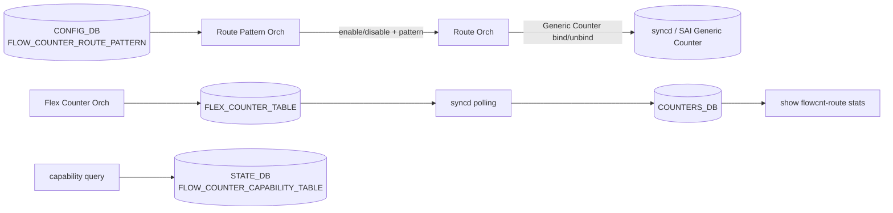

<!-- topics-tip -->
!!! tip "Topics で読み物として読む"
    この HLD は実装詳細を含む。機能の概念・設定・運用を読み物として読みたい場合は [Topics 04 章: VRF / ECMP / 経路選択](../topics/04-vrf-ecmp/index.md) を参照。
<!-- /topics-tip -->

!!! success "裏取りステータス: code-verified"
    `sonic-swss/orchagent/flex_counter/flowcounterrouteorch.cpp` で `FlowCounterRouteOrch` クラス完全実装（`:28` ctor、`:55/:99` `doTask`、`:166` `initRouteFlowCounterCapability`、`addRoutePattern` / `removeRoutePattern` / `bindFlowCounter` 等）。`sonic-utilities/config/flow_counters.py:4-90` で `@click.group('flowcnt-route')`、`show/flow_counters.py:30-53` で show 側を確認（verified at: 2026-05-11）。

# Route Flow Counter（ROUTE_MATCH / Route Pattern Orch）

## なぜこの機能が必要か

prefix パターンに一致する route について、[ASIC](../reference/glossary.md#term-asic) 上の **Generic Counter** を [ECMP](../reference/glossary.md#term-ecmp) NHG / route entry に bind し、hit / byte を CLI で確認できるようにする[^1]。Trap Flow Counter / [FDB](../reference/glossary.md#term-fdb) Flow Counter と同系列の Flex Counter インフラ上に、route 用の **Route Pattern Orch** を新設する設計。

Phase 1 スコープ:

- パターンは IPv4 / IPv6 **各 1 つ、計 2 件まで**
- パターンあたり max **50**（default 30）。**reboot またぎで同じ route が選ばれる保証なし**
- key: 通常 `(vrf, prefix)`、[VNET](../reference/glossary.md#term-vnet) の場合 `(vnet, prefix)`。default [VRF](../reference/glossary.md#term-vrf) は省略可
- `0.0.0.0` / `::` パターンは default route の exact match

## コンポーネント



### Route Orch 拡張

`RouteOrch` に 2 つの cache[^1]:

- **Bound Cache**: パターン一致 + カウンタ bind 済み
- **Unbound Cache**: パターン一致だが容量上限超過で未 bind

route イベントごとに:

1. 新規 route が pattern match → 空きあれば counter create + bind（Bound）、空きなければ Unbound
2. route 削除 → Bound なら counter unbind + destroy、Unbound なら cache 削除のみ
3. pattern 変更 → 旧 pattern のみ match は unbind、新 pattern 対象を bind 直し

容量超過時の選定基準は [HLD](../reference/glossary.md#term-hld) で曖昧、**reboot 後に同じ route が選ばれる保証なし**[^1]。

### CounterType / FlexCounter

```cpp
enum class CounterType { ..., ROUTE_MATCH };
counter_id_field_lookup[ROUTE_MATCH] = FLOW_COUNTER_ID_LIST;
```

新規 group `ROUTE_FLOW_COUNTER`。Flex Counter Orch は user 操作で group enable/disable 通知を Route Orch に伝える[^1]。

### CONFIG_DB

```text
FLOW_COUNTER_ROUTE_PATTERN|<vrf>|<prefix>:
    max_match_count = <int>   # default 30, max 50
# VNET ケースは FLOW_COUNTER_ROUTE_PATTERN|<vnet>|<prefix>
```

`orchagent` 起動時に [SAI](../reference/glossary.md#term-sai) Generic Counter サポートを query し、`STATE_DB.FLOW_COUNTER_CAPABILITY_TABLE` に書く。CLI はこれを見て対応 platform 判定[^1]。

## CLI / 設定例

| Command | 用途 |
|---------|------|
| `config flowcnt-route pattern add/del <prefix> --vrf <vrf>` | パターン登録 |
| `config flowcnt-route enable/disable` | 機能 ON/OFF |
| `show flowcnt-route stats` | 統計表示 |
| `sonic-clear flowcnt-route` | クリア |

CLI 文法は HLD 例示ベース、実装は `sonic-utilities/config/flow_counters.py` で `flowcnt-route` group として取り込み済み。

## 制限事項

- Phase 1: パターン 2 件 / route 50 件。reboot 越しの一貫性保証なし[^1]
- ASIC Generic Counter 必須。未対応 platform は CLI で判別可能
- VNET は VRF とキー形式が異なる

## 干渉する機能

- **Flex Counter framework**: polling interval が他レート計算と共有
- **routeorch**: fine-grained ECMP / NHG では bind 対象（route entry vs NHG）に注意
- **VNET**: VRF キーが `vnet` に置換

## トラブルシューティング

```bash
sonic-db-cli STATE_DB hgetall 'FLOW_COUNTER_CAPABILITY_TABLE|switch'   # capability
sonic-db-cli CONFIG_DB keys 'FLOW_COUNTER_ROUTE_PATTERN*'
sonic-db-cli COUNTERS_DB keys '*ROUTE*'
show flowcnt-route stats
```

- `stats` が空 → capability が `false`、または ASIC Generic Counter 未対応
- Unbound Cache 落ち → `max_match_count` を上げて再 enable

## 関連 Topics

- [09-telemetry-snmp](../topics/09-telemetry-snmp/index.md): Flex Counter / Generic Counter 全般

## 引用元

[^1]: `sonic-net/SONiC` `doc/flow_counters/routes_flow_counters.md` @ `49bab5b5ff0e924f1ea52b3d9db0dfa4191a7c06`

<!-- glossary-links-injected: c006405759d8 -->
