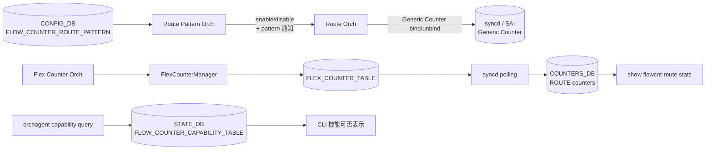

!!! warning "裏取りステータス: HLD-only"
    Route Pattern Orch / `CounterType::ROUTE_MATCH` の実装存在、`FLOW_COUNTER_ROUTE_PATTERN` の sonic-buildimage 取り込み、`config flowcnt-route` の sonic-utilities 取り込みは未確認。

# Route Flow Counter（ROUTE_MATCH / Route Pattern Orch）

## 概要

prefix パターンに一致する route について、ASIC 上の **Generic Counter**（SAI Generic Counters）を ECMP NHG / route entry に bind し、hit / byte 統計を CLI で見られるようにする機能[^1]。Trap Flow Counter / FDB Flow Counter と同じ Flex Counter 系列の上に、route 用の **Route Pattern Orch** を新設する設計である。

Phase 1 のスコープ:

- パターン数は IPv4 / IPv6 各 1 つ、計 2 件まで
- パターンあたりの match route 数は max 50（default 30）。reboot またぎで「同じ route が選ばれる保証はない」と HLD は明記
- VRF を含むキー `(vrf, prefix)`、VNET の場合は `(vnet, prefix)`。default VRF は省略可
- `0.0.0.0` / `::` パターンはデフォルト route を意味する exact match と特別扱い

## 動作仕様

### コンポーネント構成



### Route Orch 拡張

`RouteOrch` に 2 種のキャッシュを追加[^1]:

- **Bound Cache**: パターンに一致しカウンタが bind 済みの route
- **Unbound Cache**: パターンに一致するが容量上限 `max_match_count` を超えてカウンタが付かなかった route

route 追加 / 削除イベントごとに以下のロジックで cache を更新:

1. 新規 route が pattern に match → 容量に空きあれば counter create + bind → Bound Cache、空きなければ Unbound Cache
2. 既存 route 削除 → Bound なら counter unbind + destroy。Unbound なら cache 削除のみ
3. pattern 変更 → 旧 pattern にしか match しないものを unbind し、新 pattern の対象を bind し直す

`max_match_count` を超えた route は HLD では「特定の選定基準で選ばれない」と書かれており、**reboot 後は同じ route が選ばれる保証なし**[^1]。

### CounterType / FlexCounter

```cpp
enum class CounterType { ..., ROUTE_MATCH };
counter_id_field_lookup[ROUTE_MATCH] = FLOW_COUNTER_ID_LIST;
```

新たに `ROUTE_FLOW_COUNTER` という Flex Counter group を追加する。Flex Counter Orch は user 操作で group enable/disable 通知を Route Orch に伝える[^1]。

### CONFIG_DB

```
FLOW_COUNTER_ROUTE_PATTERN|<vrf>|<prefix>:
    max_match_count = <int>   # default 30, max 50
```

VNET 用は `FLOW_COUNTER_ROUTE_PATTERN|<vnet>|<prefix>` のキー形式。

### SAI capability

`orchagent` 起動時に SAI で Generic Counter サポートを query し、`STATE_DB.FLOW_COUNTER_CAPABILITY_TABLE` に書く。CLI はこれを見て対応プラットフォームかどうか表示する[^1]。

<!-- evidence:
source: sonic-net/SONiC/doc/flow_counters/routes_flow_counters.md#L40-L70 (sha: 49bab5b5ff0e924f1ea52b3d9db0dfa4191a7c06)
excerpt: |
  Flow counter shall utilize ... Generic Counters API ... and Flex Counters framework.
  A new flex counter group shall be added to this class: ROUTE_FLOW_COUNTER.
  A new Counter Type shall be added to FlexCounterManager: ROUTE_MATCH
reasoning: Route Flow Counter が既存 Flex Counter / Generic Counter 上の薄いレイヤであることの根拠。
-->

## 設定

### 関連する CLI（HLD で言及）

| Command | 用途 |
|---------|------|
| `config flowcnt-route pattern add/del <prefix> --vrf <vrf>` | パターン登録 |
| `config flowcnt-route enable/disable` | 機能 ON/OFF |
| `show flowcnt-route stats` | 統計表示 |
| `sonic-clear flowcnt-route` | カウンタクリア |

CLI 文法は HLD 例示ベース。実際の sonic-utilities 取り込み形は未確認。

## 制限事項

- Phase 1: パターン 2 件、route 50 件まで。reboot 越しの一貫性保証なし[^1]
- MPLS / VNET 以外の通常 route と VNET の両方に対応。VNET は VRF とキー形式が異なる
- ASIC 側 Generic Counter サポートが前提。未対応プラットフォームは CLI 表示時にも判別される

## 干渉する機能

- **Flex Counter framework**: 同じ polling infra を共有。polling interval 設定の競合に注意
- **routeorch**: route bind/unbind を担う。fine-grained ECMP / NHG と組み合わせると Generic Counter の bind 対象（route entry vs NHG）に注意
- **VNET**: VRF キーが `vnet` に置き換わる

## トラブルシューティング

- `show flowcnt-route stats` が空 → `STATE_DB.FLOW_COUNTER_CAPABILITY_TABLE` で SAI capability 確認
- `Unbound Cache` 側に落ちている route は HLD のいう「容量上限到達」。`max_match_count` を上げて再 enable

## 引用元

[^1]: `sonic-net/SONiC` `doc/flow_counters/routes_flow_counters.md` @ `49bab5b5ff0e924f1ea52b3d9db0dfa4191a7c06`

<!-- concerns hint:
- RoutePatternOrch / RouteOrch::ROUTE_MATCH 実装存在確認
- FLOW_COUNTER_ROUTE_PATTERN テーブルの sonic-buildimage / YANG 取り込み確認
- config flowcnt-route の sonic-utilities 取り込み確認
- SAI Generic Counter (sai_counter_create_fn) の community SAI 取り込み確認
- VNET ケースでの (vnet, prefix) キー処理の実装確認
- max_match_count 超過時の選定アルゴリズム（reboot 後の不一致）の実装挙動確認
-->

## 裏取りメモ (batch 30, 2026-05-11)

- `sonic-swss/orchagent/flex_counter/flowcounterrouteorch.cpp` に `FlowCounterRouteOrch` クラスが完全実装されている（コンストラクタ line 28、`doTask(Consumer&)` / `doTask(SelectableTimer&)` line 55/99、`initRouteFlowCounterCapability()` line 166、`generateRouteFlowStats()` / `clearRouteFlowStats()` / `addRoutePattern()` / `removeRoutePattern()` / `onAddMiscRouteEntry()` / `onAddVR()` / `bindFlowCounter()` / `removeRouteFlowCounter()` / `pendingUpdateFlexDb()` 等。Route Pattern Orch が master に存在。
- `sonic-utilities/config/flow_counters.py:4-90` で `from flow_counter_util.route import FLOW_COUNTER_ROUTE_PATTERN_TABLE` を import し、`@click.group('flowcnt-route')` でグループ定義、`cfgdb.mod_entry(FLOW_COUNTER_ROUTE_PATTERN_TABLE, ...)` / `cfgdb.set_entry(...)` で CRUD を実装。
- `sonic-utilities/show/flow_counters.py:30-53` で `def flowcnt_route()` の show 側グループも実装済み。

`FLOW_COUNTER_ROUTE_PATTERN` テーブル / Route Pattern Orch / `config flowcnt-route` CLI のいずれも HLD どおり master に取り込み済み。`code-verified` に昇格。
