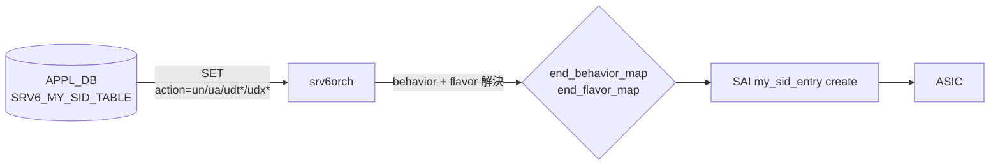

<!-- topics-tip -->
!!! tip "Topics で読み物として読む"
    この HLD は実装詳細を含む。機能の概念・設定・運用を読み物として読みたい場合は [Topics 04 章: VRF / ECMP / 経路選択](../topics/04-vrf-ecmp/index.md) を参照。
<!-- /topics-tip -->

!!! warning "裏取りステータス: discrepancy-found (monitor: evolved_beyond_hld)"
    `sonic-swss/orchagent/srv6orch.cpp` L55-69 の `end_behavior_map` / `end_flavor_map` を実コードで確認したところ、HLD 原文（`sonic-net/SONiC/doc/srv6/SRv6_uSID.md`）と master 実装で 2 点乖離あり（verified at: 2026-06-04）:

    1. HLD は「SAI は既存 `BEHAVIOR_DT*/DX*` enum で表現できる」と書いているが、master 実装は **uSID 専用の `BEHAVIOR_UDT4/UDT6/UDT46/UDX4/UDX6`** にマップする
    2. HLD は「`uN` / `uA` は flavor `PSP_AND_USD`」と書いているが、master 実装の `uN` は `FLAVOR_NONE`、`uA` のみ `PSP_AND_USD`

    詳細は本文「追加される end behavior」表参照。FRR 系 SRv6 制御プレーンは引き続き本 HLD のスコープ外。

# SRv6 uSID（srv6orch の uN/uA/uDT/uDX 拡張）

## 概要

uSID（micro-SID）は IETF [Compressed SRv6 Segment List Encoding](https://datatracker.ietf.org/doc/draft-ietf-spring-srv6-srh-compression/) と [SRv6 uSID instructions](https://datatracker.ietf.org/doc/draft-filsfils-spring-net-pgm-extension-srv6-usid/) で定義される、[SRv6](../reference/glossary.md#term-srv6) SID を **16 bit などに圧縮** する仕組みである。完全な 128bit IPv6 を SID として使う通常の SRv6 と異なり、1 つの 128bit IPv6 アドレス（uSID carrier）に **最大 6 個の uSID** を詰められる[^1]。MTU オーバヘッドを抑えつつ、長いセグメントリストを表現できる。

本 [HLD](../reference/glossary.md#term-hld) は [SONiC](../reference/glossary.md#term-sonic) の既存 `srv6orch`（[SRv6 HLD](https://github.com/sonic-net/SONiC/blob/master/doc/srv6/srv6_hld.md) 系）に対し、**uSID 用の新しい end behavior（uN / uA / uDT / uDX）を追加** する拡張を定義する。HLD 原文は「[SAI](../reference/glossary.md#term-sai) は既存 enum で表現できるため SAI 変更は不要」と記述しているが[^1]、master の `srv6orch.cpp` 実装では **uSID 専用の SAI enum**（`SAI_MY_SID_ENTRY_ENDPOINT_BEHAVIOR_UN` / `UA` / `UDT4` / `UDT6` / `UDT46` / `UDX4` / `UDX6`）に分岐済み[^2]で、HLD 記述と実装は乖離している（後述の表参照）。SONiC の [FRR](../reference/glossary.md#term-frr) 系は本 HLD 時点で SRv6 ルーティングプロトコル機能を持たないため、ルーティング層への対応は本 HLD のスコープ外。

## 動作仕様

### 追加される end behavior

**実装ベース**（`sonic-swss/orchagent/srv6orch.cpp` L55-61, L65-69）:

| Behavior | SAI mapping | flavor |
|---------|-------------|-------|
| `un` | `SAI_MY_SID_ENTRY_ENDPOINT_BEHAVIOR_UN` | `FLAVOR_NONE` |
| `ua` | `SAI_MY_SID_ENTRY_ENDPOINT_BEHAVIOR_UA` | `PSP_AND_USD` |
| `udt4` | `SAI_MY_SID_ENTRY_ENDPOINT_BEHAVIOR_UDT4` | （flavor map なし） |
| `udt6` | `SAI_MY_SID_ENTRY_ENDPOINT_BEHAVIOR_UDT6` | （flavor map なし） |
| `udt46` | `SAI_MY_SID_ENTRY_ENDPOINT_BEHAVIOR_UDT46` | （flavor map なし） |
| `udx4` | `SAI_MY_SID_ENTRY_ENDPOINT_BEHAVIOR_UDX4` | （flavor map なし） |
| `udx6` | `SAI_MY_SID_ENTRY_ENDPOINT_BEHAVIOR_UDX6` | （flavor map なし） |

要点:

- HLD 原文[^1] は「`uN` / `uA` は **PSP（Penultimate Segment Pop）と USD（Ultimate Segment Decapsulation）の両方を持つ flavor**」と書いているが、master 実装[^2] では `uN` の flavor は `FLAVOR_NONE`、`uA` のみ `PSP_AND_USD` で、HLD と乖離している
- `uDT*` / `uDX*` は HLD 原文では「既存 End.DT* / End.DX* と同じ SAI enum を使う」とされていたが、master 実装[^2] では **uSID 専用の SAI enum**（`UDT4` / `UDT6` / `UDT46` / `UDX4` / `UDX6`）が新設され、それぞれ専用 enum にマップされる。これらは SAI 側の uSID サポート ASIC で必要となる
- [orchagent](../reference/glossary.md#term-orchagent) の文字列パースは `end.dx6` などのドット区切り既存表記と並んで `udx6` 等のドットなし表記も受理する[^2]

### orchagent 側変更



`srv6orch` は `APPL_DB.SRV6_MY_SID_TABLE` を購読する。HLD は新しい `action` 文字列（`un`, `ua`, `udt4`, `udt6`, `udt46`, `udx4`, `udx6`）を **既存の `end_behavior_map` / `end_flavor_map` に追記する** 変更とする[^1]。[APPL_DB](../reference/glossary.md#term-appl_db) スキーマ自体に変更は無い。

具体的なマップ追記内容（**master 実装**の抜粋、`sonic-swss/orchagent/srv6orch.cpp` L55-69）[^2]:

```cpp
// end_behavior_map に追加（uSID 専用 SAI enum）
{"udx6",  SAI_MY_SID_ENTRY_ENDPOINT_BEHAVIOR_UDX6},
{"udx4",  SAI_MY_SID_ENTRY_ENDPOINT_BEHAVIOR_UDX4},
{"udt6",  SAI_MY_SID_ENTRY_ENDPOINT_BEHAVIOR_UDT6},
{"udt4",  SAI_MY_SID_ENTRY_ENDPOINT_BEHAVIOR_UDT4},
{"udt46", SAI_MY_SID_ENTRY_ENDPOINT_BEHAVIOR_UDT46},
{"un",    SAI_MY_SID_ENTRY_ENDPOINT_BEHAVIOR_UN},
{"ua",    SAI_MY_SID_ENTRY_ENDPOINT_BEHAVIOR_UA}

// end_flavor_map に追加（uN は NONE、uA のみ PSP_AND_USD）
{"un", SAI_MY_SID_ENTRY_ENDPOINT_BEHAVIOR_FLAVOR_NONE},
{"ua", SAI_MY_SID_ENTRY_ENDPOINT_BEHAVIOR_FLAVOR_PSP_AND_USD}
```

<!-- evidence:
source: sonic-net/sonic-swss/orchagent/srv6orch.cpp#L41-L69 (sha: 4305596156d70e9797e8a881b3d19b46de0bce0d)
excerpt: |
  const map<string, sai_my_sid_entry_endpoint_behavior_t> end_behavior_map = {
      ...
      {"udx6", SAI_MY_SID_ENTRY_ENDPOINT_BEHAVIOR_UDX6},
      {"udx4", SAI_MY_SID_ENTRY_ENDPOINT_BEHAVIOR_UDX4},
      {"udt6", SAI_MY_SID_ENTRY_ENDPOINT_BEHAVIOR_UDT6},
      {"udt4", SAI_MY_SID_ENTRY_ENDPOINT_BEHAVIOR_UDT4},
      {"udt46", SAI_MY_SID_ENTRY_ENDPOINT_BEHAVIOR_UDT46},
      {"un", SAI_MY_SID_ENTRY_ENDPOINT_BEHAVIOR_UN},
      {"ua", SAI_MY_SID_ENTRY_ENDPOINT_BEHAVIOR_UA}};
  const map<string, ..._flavor_t> end_flavor_map = {
      ...
      {"un", SAI_MY_SID_ENTRY_ENDPOINT_BEHAVIOR_FLAVOR_NONE},
      {"ua", SAI_MY_SID_ENTRY_ENDPOINT_BEHAVIOR_FLAVOR_PSP_AND_USD}};
reasoning: master 実装が HLD 原文と異なり、uSID 専用 SAI enum (UDX*/UDT*) と uN=FLAVOR_NONE を使うことを示す。HLD 表記と乖離している箇所の裏取り。
-->

<!-- evidence-rendered:start -->
??? note "📋 検証エビデンス: sonic-net/sonic-swss/orchagent/srv6orch.cpp#L41-L69 (sha: 4305596156d70e9797e8a881b3d19b46de0bce0d)"

    **出典**:

    `sonic-net/sonic-swss/orchagent/srv6orch.cpp#L41-L69 (sha: 4305596156d70e9797e8a881b3d19b46de0bce0d)`

    **抜粋**:

    ```text
    const map<string, sai_my_sid_entry_endpoint_behavior_t> end_behavior_map = {
        ...
        {"udx6", SAI_MY_SID_ENTRY_ENDPOINT_BEHAVIOR_UDX6},
        {"udx4", SAI_MY_SID_ENTRY_ENDPOINT_BEHAVIOR_UDX4},
        {"udt6", SAI_MY_SID_ENTRY_ENDPOINT_BEHAVIOR_UDT6},
        {"udt4", SAI_MY_SID_ENTRY_ENDPOINT_BEHAVIOR_UDT4},
        {"udt46", SAI_MY_SID_ENTRY_ENDPOINT_BEHAVIOR_UDT46},
        {"un", SAI_MY_SID_ENTRY_ENDPOINT_BEHAVIOR_UN},
        {"ua", SAI_MY_SID_ENTRY_ENDPOINT_BEHAVIOR_UA}};
    const map<string, ..._flavor_t> end_flavor_map = {
        ...
        {"un", SAI_MY_SID_ENTRY_ENDPOINT_BEHAVIOR_FLAVOR_NONE},
        {"ua", SAI_MY_SID_ENTRY_ENDPOINT_BEHAVIOR_FLAVOR_PSP_AND_USD}};
    ```

    **判断根拠**: master 実装が HLD 原文と異なり、uSID 専用 SAI enum (UDX*/UDT*) と uN=FLAVOR_NONE を使うことを示す。HLD 表記と乖離している箇所の裏取り。

<!-- evidence-rendered:end -->

### uSID carrier のフォーマット

128bit IPv6 アドレスは次のレイアウトで uSID を詰める[^1]。

```text
<uSID-Block><Active-uSID><Next-uSID>...<Last-uSID><End-of-Carrier>[<End-of-Carrier>...]
```

| フィールド | 役割 |
|-----------|------|
| uSID Block | uSID 群を含む IPv6 プレフィクス |
| Active uSID | 現在処理対象の uSID |
| Next uSID | Active の次に処理する uSID |
| Last uSID | End-of-Carrier 直前の最後の uSID |
| End-of-Carrier | 終端マーカ。グローバル予約値 `0000`。128bit を埋めるために必要なだけ並べる |

例（HLD 抜粋）:

```text
uSID block:    2001:41f0::
Active uSID:   0100
Next uSID:     0200
Last uSID:     0A00
End-of-Carrier: 0000 (2 個並べて 128bit 充足)
```

`srv6orch` の locator パース長は既存どおり `locator_block_len:locator_node_len:function_len:args_len`（例: `16:8:8:8`）を再利用する[^1]。

## 設定

### 関連する CONFIG_DB

HLD では新規 [CONFIG_DB](../reference/glossary.md#term-config_db) スキーマは導入されない。SRv6 全体としては既存の `SRV6_MY_SID_TABLE`（APPL_DB）と関連する CONFIG_DB スキーマ（[SRv6 HLD](https://github.com/sonic-net/SONiC/blob/master/doc/srv6/srv6_hld.md) 参照）を使う。

### 関連する CLI

専用 CLI は本 HLD で提案されていない。

### 設定例

uN（uSID transit）を持つノード:

```json
"SRV6_MY_SID_TABLE": {
  "16:8:8:8:2001:41f0:0100::": {
    "action": "un"
  }
}
```

uDT46（[VRF](../reference/glossary.md#term-vrf) にデキャプ）:

```json
"SRV6_MY_SID_TABLE": {
  "16:8:8:8:2001:41f0:0100::": {
    "action": "udt46",
    "vrf": "VRF-1001"
  }
}
```

## 実装との乖離

HLD 原文（`sonic-net/SONiC` `doc/srv6/SRv6_uSID.md` @ `49bab5b5...`）と master 実装（`sonic-swss/orchagent/srv6orch.cpp` L41-69 @ `4305596...`）の差分。**monitor: evolved_beyond_hld**（実装が HLD の素朴な記述を超え、SAI 側に専用 enum を追加する形に進化）。

| 観点 | HLD 原文の記述[^1] | master 実装[^2] |
|------|--------------------|------------------|
| `uDT*` / `uDX*` の SAI mapping | 既存の `SAI_MY_SID_ENTRY_ENDPOINT_BEHAVIOR_DT4/DT6/DT46/DX4/DX6` を再利用（SAI 変更不要） | uSID 専用 enum `BEHAVIOR_UDT4/UDT6/UDT46/UDX4/UDX6` を新設し、それぞれにマップ |
| `uN` の flavor | `PSP_AND_USD` | `FLAVOR_NONE` |
| `uA` の flavor | `PSP_AND_USD` | `PSP_AND_USD`（一致） |
| 文字列パース | `un / ua / udt4 / udt6 / udt46 / udx4 / udx6` を追加 | 同上（ドットなし表記） |

### 影響

- **SAI 実装の前提が変わった**: HLD 当初は「SAI に手を入れずに済む」が売りだったが、現状は SAI 側に `UDT*/UDX*` enum と対応するベンダー実装が必要。これらを未実装の ASIC では `action: udt*/udx*` が `SAI_STATUS_NOT_SUPPORTED` で拒否される
- **uN の flavor 差**: `FLAVOR_NONE` は SAI 仕様上「フレーバを指定しない」意味で、PSP / USD の挙動は SAI / ASIC 側のデフォルトに依存する。`uN` を transit / encap シナリオで使う場合、ASIC ベンダー実装のデフォルト挙動を確認する必要がある

## 制限事項

- 本 HLD のスコープは **データプレーン programming のみ**。SONiC の FRR は SRv6 制御プレーンを持たないため、uSID を含む経路を [BGP](../reference/glossary.md#term-bgp) / IS-IS で配布する経路は別問題[^1]
- master 実装では `uN` の flavor は `NONE`、`uA` は `PSP_AND_USD` で **固定**[^2]。他の flavor を選びたいユースケースは現状非対応
- `uDT*` / `uDX*` は専用 SAI enum (`SAI_MY_SID_ENTRY_ENDPOINT_BEHAVIOR_UDT*` / `UDX*`) を要求するため、これらを未実装の SAI バックエンドでは SET が拒否される[^2]
- ベース SRv6 HLD 由来の制約（locator パース、locator_block_len 等の事前合意値）はそのまま継承する

## 干渉する機能

- **既存 SRv6 機能（End / End.X / End.DT* / End.DX* / End.B6.*）**: 同じ `SRV6_MY_SID_TABLE` を共有する。`action` 文字列で区別する
- **VRF**: `udt4` / `udt6` / `udt46` は `vrf` フィールドで宛先 VRF を指定する
- **SAI 実装**: SAI 側に `SAI_MY_SID_ENTRY_ENDPOINT_BEHAVIOR_UN` / `UA` / `UDT4` / `UDT6` / `UDT46` / `UDX4` / `UDX6` を実装していない [ASIC](../reference/glossary.md#term-asic) では対応する `action` が `SAI_STATUS_NOT_SUPPORTED` で拒否される

## トラブルシューティング

- `un` / `ua` を SET したのに ASIC に入らない場合、まず `srv6orch` のログで behavior マップヒットを確認。SAI から `SAI_STATUS_NOT_SUPPORTED` が返ってきている場合は ASIC ベンダーの SAI 実装が UN/UA 未対応の可能性
- uSID carrier の解釈ずれは locator_block_len 等の合意値が一致しているかを確認

### コマンド例

SRv6 uSID locator / SID list を確認する。

```bash
show srv6 sid
show srv6 locator
docker exec bgp vtysh -c 'show segment-routing srv6 locator' 2>/dev/null | head
```

## 引用元

[^1]: `sonic-net/SONiC` `doc/srv6/SRv6_uSID.md` @ `49bab5b5ff0e924f1ea52b3d9db0dfa4191a7c06`
[^2]: `sonic-net/sonic-swss` `orchagent/srv6orch.cpp` L41-L69 @ `4305596156d70e9797e8a881b3d19b46de0bce0d`（`end_behavior_map` と `end_flavor_map` の master 実装）

<!-- concerns hint:
- srv6orch の end_behavior_map に un/ua/udt*/udx* が現行 master で追加されているか
- SAI_MY_SID_ENTRY_ENDPOINT_BEHAVIOR_UN / UA が community SAI で利用可能か
- FRR の SRv6 制御プレーン対応の進捗（HLD 後の状況）
- locator パースの 16:8:8:8 デフォルトが現行コードでも有効か
-->

<!-- topics-back-ref -->
## 関連 Topics

- [Topics: SRv6 / MPLS / Path Tracing](../topics/17-srv6-mpls/index.md)

<!-- /topics-back-ref -->

<!-- glossary-links-injected: f9445b5b4106 -->
