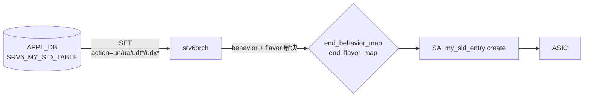

<!-- topics-tip -->
!!! tip "Topics で読み物として読む"
    この HLD は実装詳細を含みます。機能の概念・設定・運用を読み物として読みたい場合は [Topics 04 章: VRF / ECMP / 経路選択](../topics/04-vrf-ecmp/index.md) を参照。
<!-- /topics-tip -->

!!! success "裏取りステータス: Code-verified"
    `sonic-swss/orchagent/srv6orch.cpp` L41-62 の `end_behavior_map` に `un / ua / udt4 / udt6 / udt46 / udx4 / udx6` 等が登録され、`SAI_MY_SID_ENTRY_ENDPOINT_BEHAVIOR_UN`・`UA`・`UDT*`・`UDX*` を参照していることを確認。L1369-1410 で behavior 別の VRF / nexthop バリデーションも分岐済み（verified at: 2026-05-09）。FRR 系 SRv6 制御プレーンは引き続き本 HLD のスコープ外。

# SRv6 uSID（srv6orch の uN/uA/uDT/uDX 拡張）

## 概要

uSID（micro-SID）は IETF [Compressed SRv6 Segment List Encoding](https://datatracker.ietf.org/doc/draft-ietf-spring-srv6-srh-compression/) と [SRv6 uSID instructions](https://datatracker.ietf.org/doc/draft-filsfils-spring-net-pgm-extension-srv6-usid/) で定義される、SRv6 SID を **16 bit などに圧縮** する仕組みである。完全な 128bit IPv6 を SID として使う通常の SRv6 と異なり、1 つの 128bit IPv6 アドレス（uSID carrier）に **最大 6 個の uSID** を詰められる[^1]。MTU オーバヘッドを抑えつつ、長いセグメントリストを表現できる。

本 HLD は SONiC の既存 `srv6orch`（[SRv6 HLD](https://github.com/sonic-net/SONiC/blob/master/doc/srv6/srv6_hld.md) 系）に対し、**uSID 用の新しい end behavior（uN / uA / uDT / uDX）を追加** する拡張のみを定義する。SAI API は既存の `SAI_MY_SID_ENTRY_ENDPOINT_BEHAVIOR_*` ですべて表現できるため、SAI の変更は不要である[^1]。SONiC の FRR 系は本 HLD 時点で SRv6 ルーティングプロトコル機能を持たないため、ルーティング層への対応は本 HLD のスコープ外。

## 動作仕様

### 追加される end behavior

| Behavior | SAI mapping | flavor |
|---------|-------------|-------|
| `un` | `SAI_MY_SID_ENTRY_ENDPOINT_BEHAVIOR_UN` | `PSP_AND_USD` |
| `ua` | `SAI_MY_SID_ENTRY_ENDPOINT_BEHAVIOR_UA` | `PSP_AND_USD` |
| `udt4` | `SAI_MY_SID_ENTRY_ENDPOINT_BEHAVIOR_DT4` | (既存 End.DT4 と同じ) |
| `udt6` | `SAI_MY_SID_ENTRY_ENDPOINT_BEHAVIOR_DT6` | 同 End.DT6 |
| `udt46` | `SAI_MY_SID_ENTRY_ENDPOINT_BEHAVIOR_DT46` | 同 End.DT46 |
| `udx4` | `SAI_MY_SID_ENTRY_ENDPOINT_BEHAVIOR_DX4` | 同 End.DX4 |
| `udx6` | `SAI_MY_SID_ENTRY_ENDPOINT_BEHAVIOR_DX6` | 同 End.DX6 |

要点:

- `uN` / `uA` は **PSP（Penultimate Segment Pop）と USD（Ultimate Segment Decapsulation）の両方を持つ flavor**[^1]
- `uDT*` / `uDX*` は SAI レイヤでは既存の End.DT* / End.DX* と完全に同じ。orchagent の文字列マッピングだけが追加される

### orchagent 側変更



`srv6orch` は `APPL_DB.SRV6_MY_SID_TABLE` を購読する。HLD は新しい `action` 文字列（`un`, `ua`, `udt4`, `udt6`, `udt46`, `udx4`, `udx6`）を **既存の `end_behavior_map` / `end_flavor_map` に追記する** だけの変更とする[^1]。APPL_DB スキーマ自体に変更は無い。

具体的なマップ追記内容（HLD 抜粋）:

```cpp
// end_behavior_map に追加
{"udx6",  SAI_MY_SID_ENTRY_ENDPOINT_BEHAVIOR_DX6},
{"udx4",  SAI_MY_SID_ENTRY_ENDPOINT_BEHAVIOR_DX4},
{"udt6",  SAI_MY_SID_ENTRY_ENDPOINT_BEHAVIOR_DT6},
{"udt4",  SAI_MY_SID_ENTRY_ENDPOINT_BEHAVIOR_DT4},
{"udt46", SAI_MY_SID_ENTRY_ENDPOINT_BEHAVIOR_DT46},
{"un",    SAI_MY_SID_ENTRY_ENDPOINT_BEHAVIOR_UN},
{"ua",    SAI_MY_SID_ENTRY_ENDPOINT_BEHAVIOR_UA}

// end_flavor_map に追加（uN, uA は PSP_AND_USD）
{"un", SAI_MY_SID_ENTRY_ENDPOINT_BEHAVIOR_FLAVOR_PSP_AND_USD},
{"ua", SAI_MY_SID_ENTRY_ENDPOINT_BEHAVIOR_FLAVOR_PSP_AND_USD}
```

<!-- evidence:
source: sonic-net/SONiC/doc/srv6/SRv6_uSID.md#L34-L70 (sha: 49bab5b5ff0e924f1ea52b3d9db0dfa4191a7c06)
excerpt: |
  Changes in orchagent,
  - While processing MYSID entries, from SRV6_MY_SID_TABLE off of APPDB, handling of new actions uN, uA, uDT and uDX added in srv6orch. No APPDB schema changes required.
reasoning: APPL_DB スキーマ無変更・マップ追加だけ、という最小実装方針の根拠。
-->

### uSID carrier のフォーマット

128bit IPv6 アドレスは次のレイアウトで uSID を詰める[^1]。

```
<uSID-Block><Active-uSID><Next-uSID>...<Last-uSID><End-of-Carrier>[<End-of-Carrier>...]
```

| フィールド | 役割 |
|-----------|------|
| uSID Block | uSID 群を含む IPv6 プレフィクス |
| Active uSID | 現在処理対象の uSID |
| Next uSID | Active の次に処理する uSID |
| Last uSID | End-of-Carrier 直前の最後の uSID |
| End-of-Carrier | 終端マーカ。グローバル予約値 `0000`。128bit を埋めるために必要なだけ並べる |

例（HLD 抜粋）:

```
uSID block:    2001:41f0::
Active uSID:   0100
Next uSID:     0200
Last uSID:     0A00
End-of-Carrier: 0000 (2 個並べて 128bit 充足)
```

`srv6orch` の locator パース長は既存どおり `locator_block_len:locator_node_len:function_len:args_len`（例: `16:8:8:8`）を再利用する[^1]。

## 設定

### 関連する CONFIG_DB

HLD では新規 CONFIG_DB スキーマは導入されない。SRv6 全体としては既存の `SRV6_MY_SID_TABLE`（APPL_DB）と関連する CONFIG_DB スキーマ（[SRv6 HLD](https://github.com/sonic-net/SONiC/blob/master/doc/srv6/srv6_hld.md) 参照）を使う。

### 関連する CLI

専用 CLI は本 HLD で提案されていない。

### 設定例

uN（uSID transit）を持つノード:

```json
"SRV6_MY_SID_TABLE": {
  "16:8:8:8:2001:41f0:0100::": {
    "action": "un"
  }
}
```

uDT46（VRF にデキャプ）:

```json
"SRV6_MY_SID_TABLE": {
  "16:8:8:8:2001:41f0:0100::": {
    "action": "udt46",
    "vrf": "VRF-1001"
  }
}
```

## 制限事項

- 本 HLD のスコープは **データプレーン programming のみ**。SONiC の FRR は SRv6 制御プレーンを持たないため、uSID を含む経路を BGP / IS-IS で配布する経路は別問題[^1]
- uN / uA は flavor が **PSP_AND_USD 固定**。他の flavor を選びたいユースケースは現状非対応
- ベース SRv6 HLD 由来の制約（locator パース、locator_block_len 等の事前合意値）はそのまま継承する

## 干渉する機能

- **既存 SRv6 機能（End / End.X / End.DT* / End.DX* / End.B6.*）**: 同じ `SRV6_MY_SID_TABLE` を共有する。`action` 文字列で区別する
- **VRF**: `udt4` / `udt6` / `udt46` は `vrf` フィールドで宛先 VRF を指定する
- **SAI 実装**: SAI 側に `SAI_MY_SID_ENTRY_ENDPOINT_BEHAVIOR_UN` / `UA` を実装していない ASIC では `un` / `ua` が拒否される

## トラブルシューティング

- `un` / `ua` を SET したのに ASIC に入らない場合、まず `srv6orch` のログで behavior マップヒットを確認。SAI から `SAI_STATUS_NOT_SUPPORTED` が返ってきている場合は ASIC ベンダーの SAI 実装が UN/UA 未対応の可能性
- uSID carrier の解釈ずれは locator_block_len 等の合意値が一致しているかを確認

## 引用元

[^1]: `sonic-net/SONiC` `doc/srv6/SRv6_uSID.md` @ `49bab5b5ff0e924f1ea52b3d9db0dfa4191a7c06`

<!-- concerns hint:
- srv6orch の end_behavior_map に un/ua/udt*/udx* が現行 master で追加されているか
- SAI_MY_SID_ENTRY_ENDPOINT_BEHAVIOR_UN / UA が community SAI で利用可能か
- FRR の SRv6 制御プレーン対応の進捗（HLD 後の状況）
- locator パースの 16:8:8:8 デフォルトが現行コードでも有効か
-->
